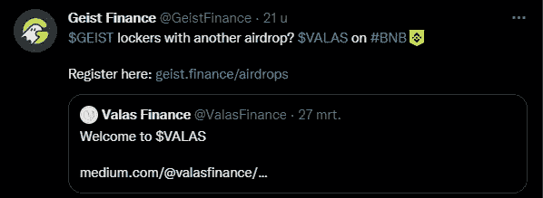
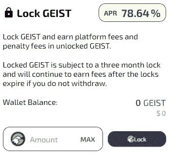
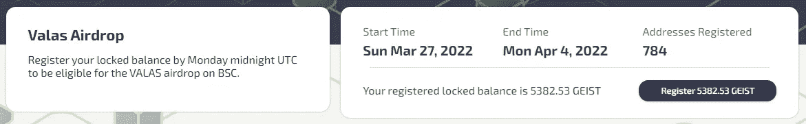

# 又一次空投！如何使用艾斯特获得 Valas 空投？金融！

> 原文：<https://medium.com/coinmonks/another-airdrop-how-to-get-the-valas-airdrop-using-geist-finance-7dd48eb008b5?source=collection_archive---------7----------------------->

Valas Airdrop for Geist.finance holders

## 介绍

valas Finance([https://valasfinance.com/](https://valasfinance.com/))是 Geist.finance 和 AAVE·V2 借贷协议的克隆，旨在将相同的功能引入币安智能链(BSC)！它修改了基于 geist finance tokenomics 的 tokenomics 模型，主要改变了锁定 Valas 令牌的早期授予方式。如果艾斯特代币被锁定 3 个月，并且可以提前授予 50%的罚金，Valas 的目标是使其随着时间的推移线性下降 75–25%。

在这里阅读更多关于 Valas 的内容；[https://medium . com/@ valas finance/introducing-valas-7f 845185 f68 b](/@valasfinance/introducing-valas-7f845185f68b)

## 怎么有资格！

Valas finance 向 Geist.finance 和 Blizz 持有者赠送 1%的代币，持有并锁定艾斯特代币可以获得空投资格！

1.  **持有并锁定您的盖修代币**

如果你没有任何艾斯特代币，你可以在 https://spookyswap.finance/swap[购买代币。当你有了你的艾斯特代币后，有必要锁定你的代币三个月！](https://spookyswap.finance/swap)

**2。注册您锁定的余额**

在 Geist.finance 应用程序的 Airdrop 页面([https://geist.finance/airdrop)](https://geist.finance/airdrops)上，您需要注册您的锁定余额。**您必须在 4 月 4 日星期一之前登记您的余额！**

## 结论

目前还不知道 VALAS 的价格是多少，以及代币将如何分配。艾斯特因其连续的 SOLIDEX 空投令牌而闻名，我们可能会期待他们在 Valas 空投令牌上做同样的事情。

为了让我的故事免费提供给每个人，请给我买杯咖啡吧！[https://ko-fi.com/igormd](https://ko-fi.com/igormd)

> *加入 Coinmonks* [*电报频道*](https://t.me/coincodecap) *和* [*Youtube 频道*](https://www.youtube.com/c/coinmonks/videos) *了解加密交易和投资*

# 另外，阅读

*   [3 商业评论](/coinmonks/3commas-review-an-excellent-crypto-trading-bot-2020-1313a58bec92) | [Pionex 评论](https://coincodecap.com/pionex-review-exchange-with-crypto-trading-bot) | [Coinrule 评论](/coinmonks/coinrule-review-2021-a-beginner-friendly-crypto-trading-bot-daf0504848ba)
*   [莱杰 vs n rave](/coinmonks/ledger-vs-ngrave-zero-7e40f0c1d694)|[莱杰 nano s vs x](/coinmonks/ledger-nano-s-vs-x-battery-hardware-price-storage-59a6663fe3b0) | [币安评论](/coinmonks/binance-review-ee10d3bf3b6e)
*   [Bybit Exchange 审查](/coinmonks/bybit-exchange-review-dbd570019b71) | [Bityard 审查](https://coincodecap.com/bityard-reivew) | [Jet-Bot 审查](https://coincodecap.com/jet-bot-review)
*   [3 commas vs crypto hopper](/coinmonks/3commas-vs-pionex-vs-cryptohopper-best-crypto-bot-6a98d2baa203)|[赚取加密利息](/coinmonks/earn-crypto-interest-b10b810fdda3)
*   最好的比特币[硬件钱包](/coinmonks/hardware-wallets-dfa1211730c6) | [BitBox02 回顾](/coinmonks/bitbox02-review-your-swiss-bitcoin-hardware-wallet-c36c88fff29)