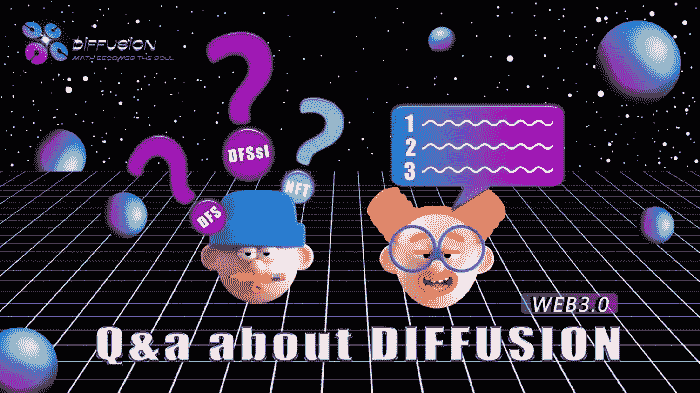

# 6 个问题的答案-6

> 原文：<https://medium.com/coinmonks/answers-to-6-questions-6-eeac3d443561?source=collection_archive---------40----------------------->

问题 1

在星光舞台，实现粉丝基数 100000 增长需要多久？之后还会有什么活动？

答案 1

我们将尽快完成星光舞台的进程，在这个过程中，我们将逐步创造新的舞台，丰富生态系统。如果你想到了什么，你可以给我们发邮件或给我们留言，我们会讨论它的可行性，并决定是否可以执行。

问题 2

为什么从官网购买的 PDFS 变成了 2.1 美元？

答案 2

PDFS 每销售 20 万美元，PDFS 单价将增加 0.1 美元；因此，当 PDFS 的总销售额达到 400，000 美元时，PDFS 的单价将为 2.2 美元。因此，越早参与，您就越能获利。

问题 3

DiffusionDAO 会推出 GameFi 或者融资服务吗？

答案 3

GameFi 是我们下一步将推出的产品，并在多个元宇宙活动中推广。至于融资服务，我们将确定是否可以推出此类服务。

问题 4

我从媒体上看到了漫道核心业务的介绍，我想知道令牌的最低价格不是 1 美元对吗？你认为它能低到什么程度？

答案 4

是的，我们已经在我们的论述中解释过，通过增加流动债券的销售，中央财政协议储备的资金就越多。最低价格将持续增加，最低价格不能保证，将由债券市场销售决定。

问题 5

与其他道组织相比，扩散道最大的优势是什么？

答案 5

扩散道的核心金融逻辑极其科学合理。DiffusionDAO 不仅仅是一个 DAO 组织，它还将鼓励和支持自己的用户创建他们自己的 DAO 组织，因此，充分利用 DiffusionDAO 的中央财务协议生态系统，并创建一个裙带经济 DAO 组织。

问题 6

为什么必须控制通货膨胀？

答案 6

通货膨胀对任何经济都是重要的，合理的通货膨胀将确保生态系统的良性发展，过度通货膨胀或恶性通货膨胀将加速经济的崩溃。因此，将通货膨胀保持在一个可持续的范围内，将有利于生态系统的发展，这也是一个经济的重要考虑因素之一。

> 加入 Coinmonks [电报频道](https://t.me/coincodecap)和 [Youtube 频道](https://www.youtube.com/c/coinmonks/videos)了解加密交易和投资

# 另外，阅读

*   [最佳期货交易信号](https://coincodecap.com/futures-trading-signals) | [期交所评论](https://coincodecap.com/liquid-exchange-review)
*   [最佳加密交易信号电报](/coinmonks/best-crypto-signals-telegram-5785cdbc4b2b) | [MoonXBT 评论](/coinmonks/moonxbt-review-6e4ab26d037)
*   [OKEx 评论](/coinmonks/okex-review-6b369304110f) | [Coinswitch 俱吠罗评论](/coinmonks/coinswitch-kuber-review-1a8dc5c7a739) | [比特币基地收费](/coinmonks/coinbase-fees-831e77d4f2c5)
*   [AscendEX 审查](/coinmonks/ascendex-review-53e829cf75fa) | [OKEx 交易机器人](/coinmonks/okex-trading-bots-234920f61e60) | [OKEx 交易机器人](/coinmonks/okex-trading-bots-234920f61e60)
*   [火币交易机器人](https://coincodecap.com/huobi-trading-bot) | [如何收购 ADA](https://coincodecap.com/buy-ada-cardano) | [Geco。一次审查](https://coincodecap.com/geco-one-review)
*   [币安 vs 比特邮票](https://coincodecap.com/binance-vs-bitstamp) | [比特熊猫 vs 比特币基地 vs Coinsbit](https://coincodecap.com/bitpanda-coinbase-coinsbit)