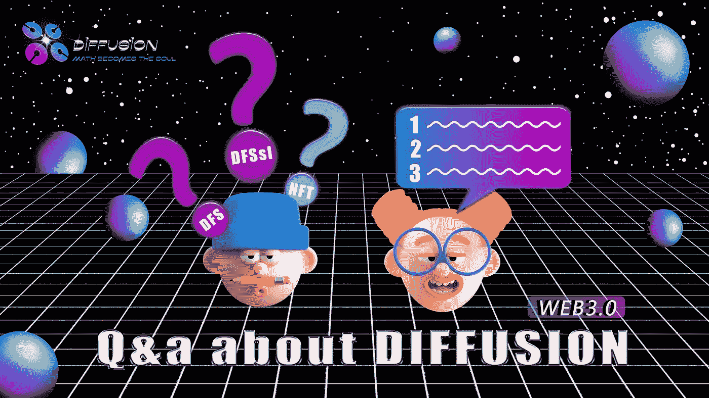

# 6 个问题的答案

> 原文：<https://medium.com/coinmonks/answers-to-6-questions-bdab05c64c44?source=collection_archive---------26----------------------->

问题 1

您能否向我们详细解释一下令牌在您的生态系统中的用途和使用情形？长期持有这些代币我们能得到什么好处？你的项目通过打桩、铸造和农业项目提供了被动收入模式吗？

答案 1

代币 DFS 是这个联合储备体系的核心资产。DiffusionDao 的核心金融协议将为 DFS 提供一个储蓄市场。您可以选择活期存款和定期存款，获得不同的利率，以确保您的代币整体价值增加，以对抗通货膨胀，这也可能产生通货紧缩的好处，获得更高的利润。同时可以用 DFS 买不同属性的 NFT。我们将推出社交 NFT，你可能会很高兴使用这样的 NFT 来代表你的身份。同时可以在圈子无损众筹市场投资各种 IDO-stage 加密资产项目。还可以加入无限共和国游戏社区参与各种话题游戏，获取更多加密资产。简而言之，你会发现 DFS 的许多可能性。

问题 2

你(扩散道)如何防止 Terra Luna 发生价值下跌的事情？

答案 2

这是一个非常好的问题。我们在设计之初就指出，加密货币资产迫切需要一个严格的资产定价模型，否则就会成为高风险资产。在 DSGE 动态随机一般均衡模型下，每个 DFS 都有一个内在的储备来支持和动态调整每个 DFS 的通货膨胀率。智能合约的设计可以告诉你，DFS 永远不会出现和 Luna 一样的情况。这是 DFS 设计的核心。我们相信 DFS 将成为加密资产领域最稳定的资产。

问题 3

我看了媒体上几乎所有关于这个扩散道的文章，我就想问是什么意思(在这个阶段，扩散道会有越来越多的宏观调控因素，会有更复杂但更精准的调控。) ?(在扩散道发展计划 B 部分介质中)以及在 BNB 生态圈出现了很多新“币”的情况下，扩散道与其他币相比有哪些优势(与 DFSSL token 相同？

答案 3

我们相信您一定已经阅读了我们的许多文章，我们谨向您表示最诚挚的感谢。一个社群的内在驱动力很重要。我们在多个维度上进行设计和实施。七月份，你很可能会看到我们的产品。首先，我们不赞成完全的平均主义，所以在社区中的身份定位尤为重要。我们为不同的社区成员提供了无数可供选择和购买的身份。第一阶段的身份 NFT 开放了三种类型，即勋爵、将军和国会议员。不同的身份有不同的收益权，代表身份的 NFT 可以在我们的交易市场流通。从各种领主到领主也是不同的 NFT，会极其耐人寻味。微分身份记录了不同成员的贡献值，展示了他们的个性。你会发现你可以在我们的论坛系统中成为真正的意见领袖，并通过转发有价值的信息获得利益！同时，我们将合同的结构设计成模块化结构，使得核心财务协议可以通过 DAO 组织的提议不断升级，从而促进了财务协议动态开发的可能性。在独特的身份系统和不断发展的协议中，我们相信这将成为一个继续发展的 DAO 组织。当然，DiffusionDao 还发行了生态系统中的其他三个令牌。每个令牌负责一个不同的任务，在那里你可以引用其他文章。事实上，生态如何继续发展并保持其活力是一项系统工程。甚至市场环境和做市商的能力都会影响整个生态。我们几乎在每个环节都这样做。关于设计和实现，您可以参考我们的白皮书了解更多内容。如果您有任何其他问题，可以在社区中留言，我们将一丝不苟地为您一一解答，谢谢！

问题 4

你将如何继续传播 Dao 社区可持续性？因为现在许多数字资产由于不忠实的社区和社区内的市场倾销而下跌..

答案 4

维持代币的价格是一门复杂的科学，其中许多因素会影响代币的价格，我们无法保证完美的定价估计。然而，从设计之初，我们就为每个代币设置了内部储备基金机制，以便在各个阶段都有一定的储备基金来支持它，并且储备基金和 DFS 的价格不会有重大偏差，我们称之为通货膨胀率，系统将给出每个时期的目标通货膨胀率，通过调整利率和资金来驱动 DFS 完成这一目标。这种货币政策也被称为我们承诺下的最优货币政策。

问题 5

你有什么计划来维持象征性的价格？会有一些烧录/回购计划吗？团队如何让价格增长，避免通货膨胀？

答案 5

感谢您的阅读，事实上，我们认为有许多因素影响加密资产，但有三个重要因素影响加密货币的价值，我们提出了加密经济学与三个抽象因素的结合，作为这个生态系统的健康。

1.1.注意力因素

2.2.调用因子

3.3.扩压因子

您可以浏览这篇文章了解更多信息。

当然，影响扩散道的因素不仅仅是这些，如家庭储蓄率、负债率、TVL 等数值都会成为扩散道宏观调控机制的参考指标，进而决定系统的综合指标和资金的使用方式。我们不认为 DFS 只属于 BSC。我们认为 DiffusionDao 更注重协议的科学性和 Dao 的可持续性，所以 Diffusion 的资产和协议在未来也会出现在其他的公链系统中。就像扩散这个词一样，会影响到更多的生态系统。当然，我们认为我们最大的优势是对金融系统的推崇，认真对待每一笔加密资产，尽力给出科学的资产定价模型，谢谢关注！

问题 6

您能告诉我们一些关于您在您的生态系统中使用的“您的令牌”的信息吗，即它是如何工作的，它为用户提供了什么样的效用和好处，事实上它如何促进您的生态系统现在和不久的将来的发展和进步？

答案 6

奇异生态系统货币的缩写是 DFS，是由集中金融协议创建的。它为用户提供了保存、投资和购买差异化数字资产的机会。由于其严格且符合逻辑的定价模式，我们相信其价格会稳步上升。由于 DFS 支撑着一个庞大的生态系统，我们肯定 DFS 的大规模流通会促进我们生态系统的发展，谢谢

> 加入 Coinmonks [电报频道](https://t.me/coincodecap)和 [Youtube 频道](https://www.youtube.com/c/coinmonks/videos)了解加密交易和投资

# 另外，阅读

*   [3 商业评论](/coinmonks/3commas-review-an-excellent-crypto-trading-bot-2020-1313a58bec92) | [Pionex 评论](https://coincodecap.com/pionex-review-exchange-with-crypto-trading-bot) | [Coinrule 评论](/coinmonks/coinrule-review-2021-a-beginner-friendly-crypto-trading-bot-daf0504848ba)
*   [莱杰 vs n rave](/coinmonks/ledger-vs-ngrave-zero-7e40f0c1d694)|[莱杰 nano s vs x](/coinmonks/ledger-nano-s-vs-x-battery-hardware-price-storage-59a6663fe3b0) | [币安评论](/coinmonks/binance-review-ee10d3bf3b6e)
*   [Bybit Exchange 审查](/coinmonks/bybit-exchange-review-dbd570019b71) | [Bityard 审查](https://coincodecap.com/bityard-reivew) | [Jet-Bot 审查](https://coincodecap.com/jet-bot-review)
*   [3 commas vs crypto hopper](/coinmonks/3commas-vs-pionex-vs-cryptohopper-best-crypto-bot-6a98d2baa203)|[赚取加密利息](/coinmonks/earn-crypto-interest-b10b810fdda3)
*   最好的比特币[硬件钱包](/coinmonks/hardware-wallets-dfa1211730c6) | [BitBox02 回顾](/coinmonks/bitbox02-review-your-swiss-bitcoin-hardware-wallet-c36c88fff29)
*   [BlockFi vs 摄氏度](/coinmonks/blockfi-vs-celsius-vs-hodlnaut-8a1cc8c26630) | [Hodlnaut 审核](/coinmonks/hodlnaut-review-best-way-to-hodl-is-to-earn-interest-on-your-bitcoin-6658a8c19edf) | [KuCoin 审核](https://coincodecap.com/kucoin-review)