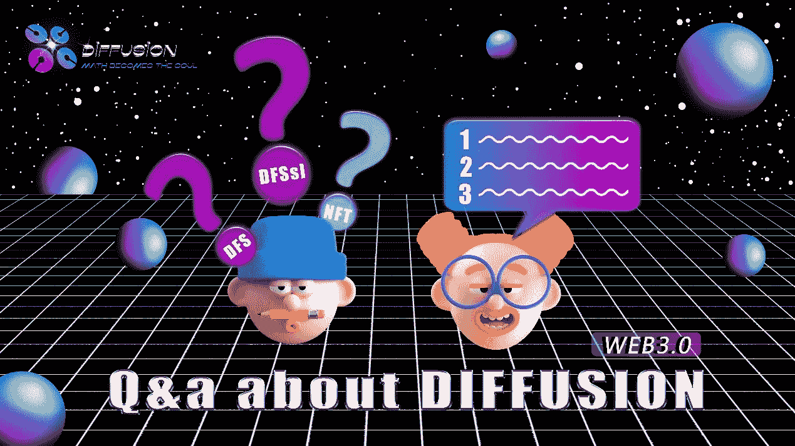

# 8 个问题的答案-8

> 原文：<https://medium.com/coinmonks/answers-to-8-questions-8-f1c654ba0d01?source=collection_archive---------47----------------------->

问题 1

DFSsl 的发行总量是多少，依据是什么？

答案 1

DFSsl 的总发行量是 1 亿，但不是所有的 DFSsl 都会流通。是由扩散道的关注度和粉丝数量决定的。简单来说，粉丝越多，流通的 DFSsl 就越多。

问题 2

未来扩散道会参与更多的竞技场吗？

答案 2

在即将到来的发展中，扩散岛将逐步完善生态内容。我们的计划是打造一个多元化的 Web 3.0 网络空间，这样未来会加入很多元素，用户在扩散道会有更丰富的体验。

问题 3

扩散道的未来在哪里？

答案 3

扩散道一定会成为未来 Web 3.0 最重要的基石之一。在此基础上，扩散道将丰富生态系统的内容，并推出更多的竞技场，让更多的人参与进来，以形成一个多元化的生态系统。

问题 4

目前，已知的替代和/或实际令牌有 DFS、DFSsl、PDFS、CDFS，还会有其他类型吗？它们之间有什么关系？

答案 4

DFS 是扩散岛的原生令牌，是核心令牌，PDFS 是 DFS 的私有令牌；DFSsl 是根据扩散道提出的关注因子发放的奖励令牌；CDFS 是对那些为社区生态系统做出贡献的人的奖励。所有代币都用于 DFS 服务和生态系统开发服务。目前，我们没有计划发行其他类型的代币。

问题 5

扩散道建立在 BSC 链上。未来会和哪些公链合作？会推出自己的公链吗？

答案 5

到目前为止，我们还没有建立自己的公共链的计划。随着生态系统的发展，我们将与更多的生态系统和公链合作，提升 DFS 的影响力。因此，让 DFS 成为整个行业的基石。

问题 6

DFS 的总发行量是多少？是否会面临超发导致的货币价格崩盘？

答案 6

DFS 的发行数量没有限制，但是每一个 DFS 的铸造都是通过出售债券来完成的，这是有口皆碑的，并不是凭空产生的。每个 DFS 都有资产做后盾，以防止 DFS 崩溃。

问题 7

以 DFSsl 目前的价值来看，你有很多空投，为什么还愿意给那么多空投奖励的代币？

答案 7

感谢您的关注。开展空投的目的是让更多人了解扩散道，提高关注度。随着关注度的提高，我们会发布更多的 DFSsl，这符合扩散道的发展规划。

问题 8

我在文章中看到你有一个多元宇宙计划，那会是一个什么样的计划呢？

答案 8

目前，我们正计划陆续推出 6 个元版本，包括各个方面，以丰富扩散道的生态系统。具体发布内容敬请期待。关注我们的社交媒体，如 Twitter 和 Discord，了解更多信息。

> 加入 Coinmonks [电报频道](https://t.me/coincodecap)和 [Youtube 频道](https://www.youtube.com/c/coinmonks/videos)了解加密交易和投资

# 另外，阅读

*   [加密货币储蓄账户](/coinmonks/cryptocurrency-savings-accounts-be3bc0feffbf) | [YoBit 审核](/coinmonks/yobit-review-175464162c62)
*   [Botsfolio vs nap bots vs Mudrex](/coinmonks/botsfolio-vs-napbots-vs-mudrex-c81344970c02)|[gate . io 交流回顾](/coinmonks/gate-io-exchange-review-61bf87b7078f)
*   [CoinFLEX 评论](https://coincodecap.com/coinflex-review) | [AEX 交易所评论](https://coincodecap.com/aex-exchange-review) | [UPbit 评论](https://coincodecap.com/upbit-review)
*   [AscendEx 保证金交易](https://coincodecap.com/ascendex-margin-trading) | [Bitfinex 赌注](https://coincodecap.com/bitfinex-staking) | [bitFlyer 点评](https://coincodecap.com/bitflyer-review)
*   [Bitget 回顾](https://coincodecap.com/bitget-review)|[Gemini vs block fi](https://coincodecap.com/gemini-vs-blockfi)cmd |[OKEx 期货交易](https://coincodecap.com/okex-futures-trading)