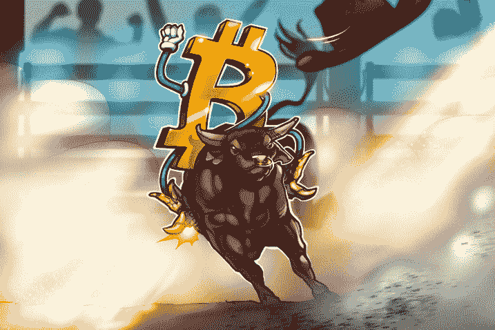
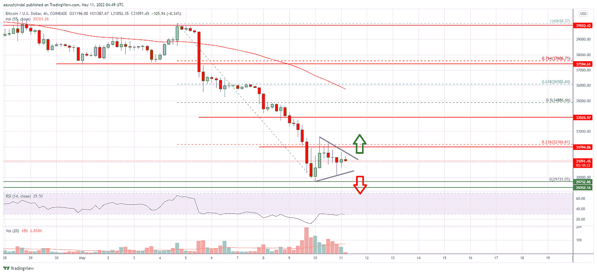

# 现在比特币下跌了，还有看涨的趋势吗？

> 原文：<https://medium.com/coinmonks/any-bullish-trend-now-that-bitcoin-dipped-d8c407ae5cdc?source=collection_archive---------45----------------------->

UST unpeg 不仅给 Luna 带来了灭顶之灾，还导致了今年最大的加密货币下跌。比特币价格一度跌至 27000 美元，是 2021 年“5.19”事件的轮回。虽然比特币价格有所回升，但恐慌情绪仍在加密货币市场普遍存在。很多买家选择观望。

## 一些人认为它是看涨的，而另一些人则持相反的观点。

拥有约 54 万推特粉丝的匿名加密货币分析师 Pentoshi 表示:

> *“市场就像一个钟摆。动量会摆动，然后有一瞬间它会停止。重点是。它经常看起来像这样。即使是暂时的。其中一方最终变得过于咄咄逼人，但没有产生结果。*钟摆向另一边摆动

如果市场设法将阻力转化为支撑，那么将会看到上升趋势。

与此同时，CoinDesk 报道说:

> *由于买家对超卖状况做出反应，比特币周五反弹至 30，000 美元。尽管如此，任何上涨似乎都是有限的，加密货币可能会在 33，000 美元和 35，000 美元面临阻力。*

需要指出的是，比特币基地 BTC/美元周线图上的 RSI 跌至 2020 年 3 月以来的最低点。强大的阻力和下跌势头将限制未来几个月的上涨空间。虽然在日线图、周线图和月图上观察到下跌的迹象，但 27，000 美元至 30，000 美元的支撑位可能会在未来几天阻止下跌。

## **比特币更多的短期动荡和丰富的长期前景**

美元通胀率有所缓解，但长期来看仍不利于购买力的提振。密码市场可能处于高结构性风险和高价值并存的状态，持续宽幅震荡可能成为常态。

从俄罗斯入侵以来数字资产的表现来看，可以看出密码市场早已与全球金融市场完全融合。然而，这种融合的形式是特殊的:主要大国的央行开始承认区块链技术和加密货币；不发达国家正在小心翼翼地让比特币成为法定货币。

每当比特币从低谷中复苏，其总市值和韧性总是会达到新高。因此，无论牛市/熊市，让自己随时了解加密货币相关新闻，选择比特币，谨慎投资，永远是明智之举。

现在有一个免费加密的机会——lucky hash 正在举办五月投资竞赛，其中一名顶级投资者可以获得 6000 英镑的 USDT 一等奖！前 50 名投资者总共 35000 USDT！除了投资，你还可以在社交媒体上分享活动，赚取 5 美元，就像问候你的邻居一样简单。

现在就加入:[https://m.luckyhash.com/activity/savingsrank?UTM _ source = English&UTM _ medium = official](https://m.luckyhash.com/activity/savingsrank?utm_source=english&utm_medium=official)

享受高达 65%的 USDT APY 和 90%的 Filecoin and，同时赢取丰厚的奖品！

— — — — — — — — — — — — — — — — — — — — — — — — — — — —

# 关于 LuckyHash

LuckyHash 是全球领先的一站式加密资产管理平台。它提供免抵押采矿 hashrate 租赁和担保加密货币的利息产生计划。

[网站](https://m.luckyhash.com/?utm_source=english&utm_medium=official) | [推特](https://twitter.com/LuckyHash_) | [脸书](https://www.facebook.com/luckyhashofficial) | [电报](https://t.me/luckyhashgroup)|[LinkedIn](https://www.linkedin.com/company/76618197/)|[YouTube](https://www.youtube.com/channel/UCWSfe0OwBuD4D79sSjUoYBA)

# 机会

1.  [参与我们的免费活动，有机会赢得 300 TRX](http://t.ly/VKMe)
2.  [参与我们的抽奖活动，赢取 500 TRX](http://t.ly/V0D3)

> 加入 Coinmonks [电报频道](https://t.me/coincodecap)和 [Youtube 频道](https://www.youtube.com/c/coinmonks/videos)了解加密交易和投资

# 另外，阅读

*   [3 商业评论](/coinmonks/3commas-review-an-excellent-crypto-trading-bot-2020-1313a58bec92) | [Pionex 评论](https://coincodecap.com/pionex-review-exchange-with-crypto-trading-bot) | [Coinrule 评论](/coinmonks/coinrule-review-2021-a-beginner-friendly-crypto-trading-bot-daf0504848ba)
*   [莱杰 vs n rave](/coinmonks/ledger-vs-ngrave-zero-7e40f0c1d694)|[莱杰 nano s vs x](/coinmonks/ledger-nano-s-vs-x-battery-hardware-price-storage-59a6663fe3b0) | [币安评论](/coinmonks/binance-review-ee10d3bf3b6e)
*   [Bybit 交易所评论](/coinmonks/bybit-exchange-review-dbd570019b71) | [Bityard 评论](https://coincodecap.com/bityard-reivew) | [Jet-Bot 评论](https://coincodecap.com/jet-bot-review)
*   [3 commas vs crypto hopper](/coinmonks/3commas-vs-pionex-vs-cryptohopper-best-crypto-bot-6a98d2baa203)|[赚取加密利息](/coinmonks/earn-crypto-interest-b10b810fdda3)
*   最好的比特币[硬件钱包](/coinmonks/hardware-wallets-dfa1211730c6) | [BitBox02 回顾](/coinmonks/bitbox02-review-your-swiss-bitcoin-hardware-wallet-c36c88fff29)