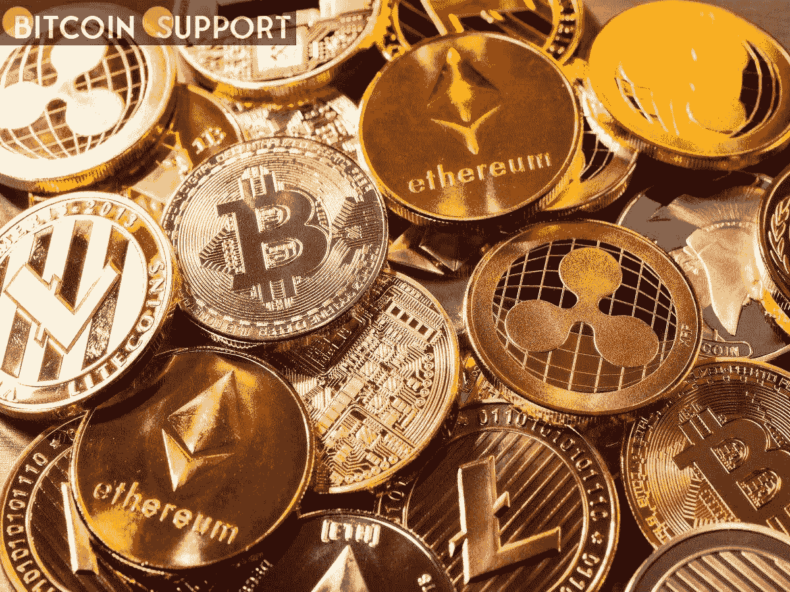
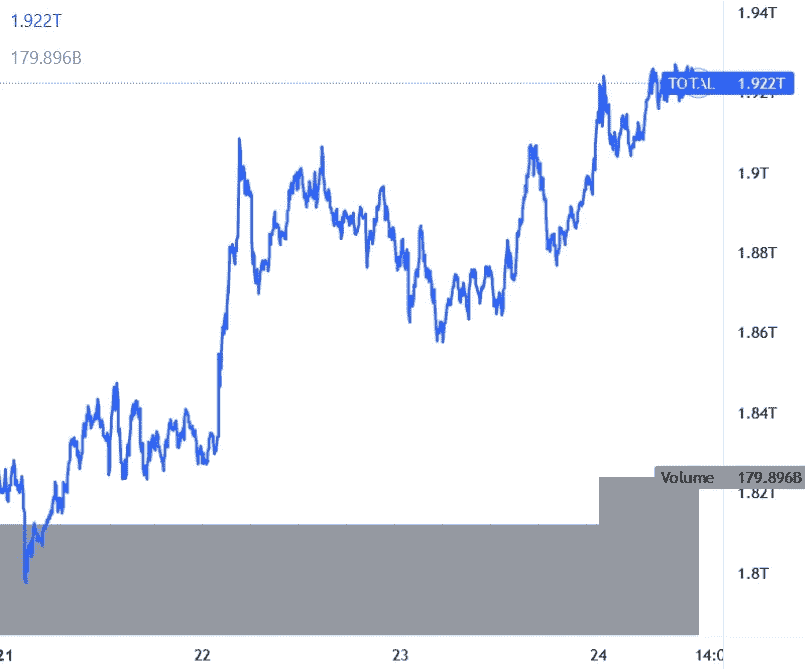

# 随着比特币和以太坊的整合，APE、ADA 和 AXS 处于领先地位

> 原文：<https://medium.com/coinmonks/ape-ada-and-axs-are-leading-as-bitcoin-and-ethereum-consolidate-73a8e194bf4?source=collection_archive---------44----------------------->

**Visit our website:-** [**https://bitcoinsupports.com/**](https://bitcoinsupports.com/)

-比特币的价格现在徘徊在 43000 美元左右。

—以太坊的价格停留在 3050 美元左右，而 XRP 的价格已经跌破 0.85 美元。

——在前 100 个硬币中，猿、阿达、AXS 是今天表现最好的三个。

比特币价格得以升破 42500 美元阻力位。BTC 股价已升至 43，000 美元上方，目前正在巩固略低于该水平的涨幅(世界协调时 11:50)，单日涨幅超过 2%。

同样，大部分大型替代币都呈现出好转的迹象。ETH 已涨至 3000 美元上方，即将突破 3080 美元。XRP 继续在 0.85 美元关口下方盘整。ADA 暴涨 15%，突破 1.12 美元障碍。

**总市值**

**Visit our website:-** [**https://bitcoinsupports.com/**](https://bitcoinsupports.com/)

**比特币的价值**

比特币的价格在收盘于 42500 美元上方后继续上涨。BTC 能够突破 43，000 美元的障碍水平，并且看起来它将很快尝试突破 43，500 美元的阻力位。如果多头成功，价格可能继续稳步上升至 44，200 美元。在 45，000 美元附近，下一个主要障碍被发现。

如果向下修正，市场可能会在 42500 美元附近找到支撑。下一个关键支撑位在 42，200 美元附近，低于此价格可能会跌至 41，550 美元。

**以太坊的成本**

以太坊的价格已经在 3000 美元阻力位上方站稳，目前正在 3050 美元上方盘整。在接下来的几个交易日中，如果明显突破 3080 美元，可能会为更大幅度的上涨定下基调。下行方面，可以在 3000 美元附近找到支撑。下一个关键支撑位在 2，950 美元左右，在此之下，近期价格可能会挣扎。

**阿达、BNB、索尔、多吉、XRP**

卡达诺(ADA)价格上涨 15%，因多头已将其推至 1.12 美元障碍区上方。它现在显示出看涨信号，有可能攀升至 1.142 美元。(阅读更多:ADA 重整旗鼓，因比特币基地为 Cardano Staking 提供 3.75%的 APY)

BNB 可能试图突破 412 美元的上行障碍水平。如果价格收盘超过 412 美元，它可能会走向 420 美元。在 432 美元附近，可以看到下一个主要障碍。索拉纳(SOL)目前交易于 100 美元关口水平，上涨 10%。收盘超过 100 美元可能为更大的上涨铺平道路。在这种情况下，价格可能会涨到 112 美元甚至更多。

DOGE 暴涨逾 13%，击穿美元 0.132 关口。上行方面，下一个主要阻力位可能是 0.142 美元，在此之上价格可能突破 0.150 美元水平。

XRP 价格继续在 0.85 美元阻力位下方盘整。多头必须在 0.85 美元上方积聚力量，以便开始更强劲的上涨。如果他们成功了，价格可能会上升到 1.0 美元。

**其他奥特币今日行情**

SHIB、近、UNI、法力、AXS、沙、猿、VET、FTM、流、一、加拉、ENJ 等奥特币涨幅均在 5%以上。APE 在上涨超过 13%并接近 14 美元后，其周涨幅增加到 61%。另一方面，AXS 上涨了约 24%,突破了 60 美元大关。上周也上涨了 27%。

总结一下，比特币正在试图突破 43500 美元关口水平。如果超过 43，500 美元，BTC 可能会获得积极的势头并飙升至 45，000 美元。
**访问我们的网站:-**[**https://bitcoinsupports.com/**](https://bitcoinsupports.com/)

**免责声明:以上为作者观点，不应视为投资建议。读者应该自己做研究。**

> 加入 Coinmonks [电报频道](https://t.me/coincodecap)和 [Youtube 频道](https://www.youtube.com/c/coinmonks/videos)了解加密交易和投资

# 另外，阅读

*   [最佳网上赌场](https://coincodecap.com/best-online-casinos) | [期货交易机器人](/coinmonks/futures-trading-bots-5a282ccee3f5)
*   [分散交易所](https://coincodecap.com/what-are-decentralized-exchanges) | [比特 FIP](https://coincodecap.com/bitbns-fip) | [宾邦评论](https://coincodecap.com/bingbon-review)
*   [用信用卡购买密码的 10 个最佳地点](https://coincodecap.com/buy-crypto-with-credit-card)
*   [加拿大最佳加密交易机器人](https://coincodecap.com/5-best-crypto-trading-bots-in-canada) | [Bybit vs 币安](https://coincodecap.com/bybit-binance-moonxbt)
*   [阿联酋五大最佳加密交易所](https://coincodecap.com/best-crypto-exchanges-in-uae) | [SimpleSwap 评论](https://coincodecap.com/simpleswap-review)
*   购买 Dogecoin 的 7 种最佳方式