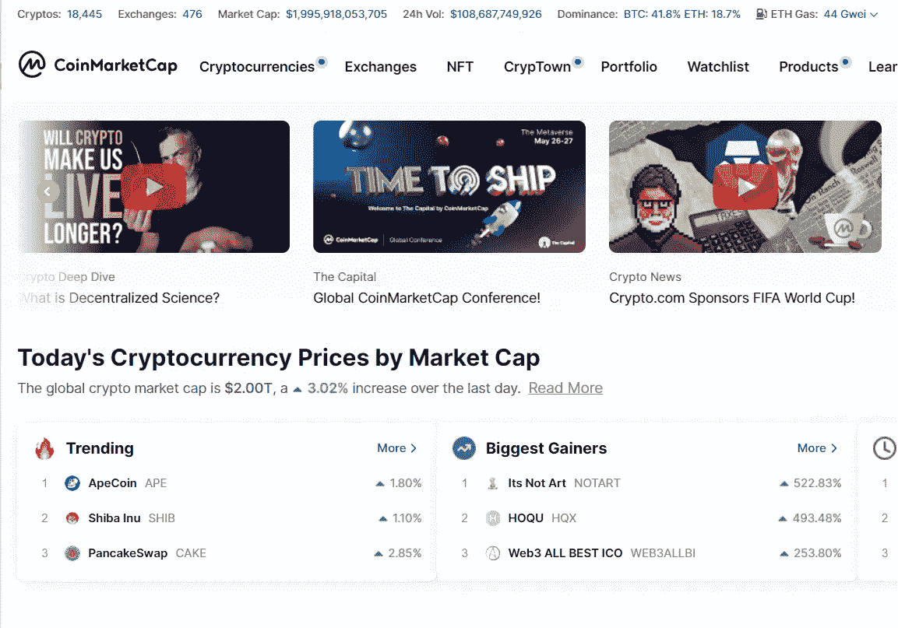
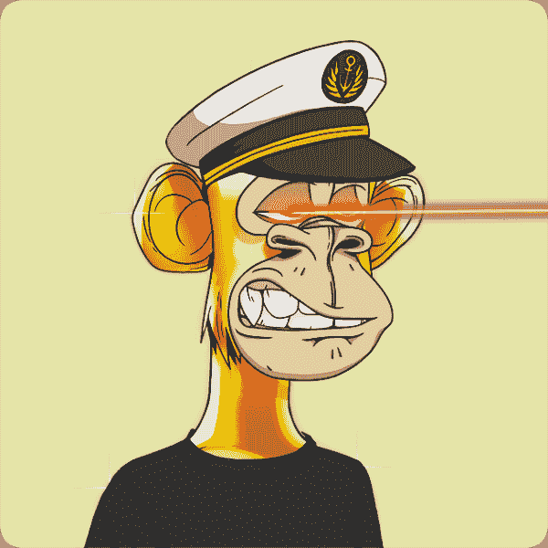
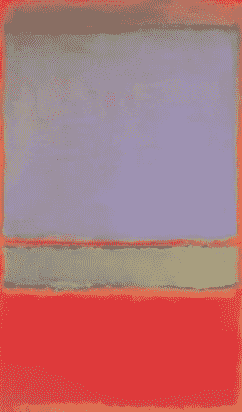
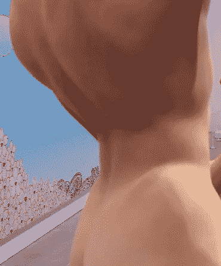
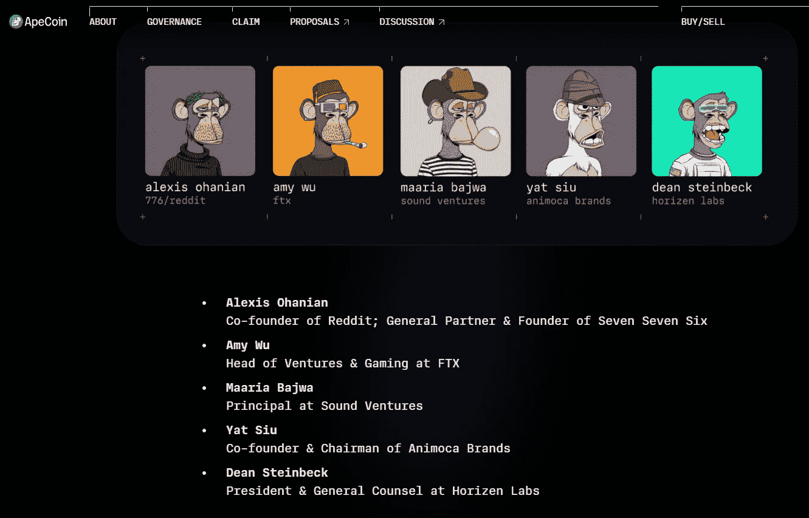

# 猿在

> 原文：<https://medium.com/coinmonks/ape-in-b23ab4ed81a4?source=collection_archive---------25----------------------->

***猴商***

看，美国电视史上最糟糕的事情，包括 31 年来莫里·波维奇的日间节目:

@Eve6 is not the worst thing on TV. In fact, they’re an awesome Twitter follow. #heartinablendersong

那是帕丽斯·希尔顿，一个因出名而出名的人，还有吉米·法伦，一个因和帕丽斯·希尔顿这样的人聊天而出名的人，讨论他们花了几十万美元买的只存在于网上的艺术品。

很有可能，这代表了不可替代的代币(NFT)艺术显然超越了鲨鱼的时刻，因为它在谷歌趋势高峰后的第八天播出:

Although a clip-art rock NFT just sold for seven figures, so maybe we should slow our roll proclaiming their demise.

然而，上周发布了一种加密货币 ApeCoin，旨在成为 Bored Ape 游艇俱乐部周围整个生态系统的核心，至少包括 NFT 的游戏和元宇宙。

很快(并不令人意外)，$APE 跃居 CoinMarketCap 趋势排行榜首位:

And to think, I could have bought $NOTART.

让我们搞清楚一件事:我不明白 BAYC 或它的变异分支——恰当地命名为变异猿游艇俱乐部——的吸引力。我完全不知道为什么有人会花 290 万美元买这个:

I don’t know that I’d pay almost $3 million for an ACTUAL gold ape that shoots laser beams out of its eyes.

。。。但是如果你喜欢幸灾乐祸(或者寻找优秀的二手艺术品)，那么[目前的报价不到 38 万美元，打了 87%的折扣。](https://opensea.io/assets/0xbc4ca0eda7647a8ab7c2061c2e118a18a936f13d/3749)

但这不是老一套的 OK-boomer 式的争论，即“当我可以右键单击并免费获得它时，谁为它付费？”我不懂 BAYC 的诉求，但是*我不懂大部分艺术*的诉求。将贝克简化为“猴子 JPGs”或多或少等同于将《蒙娜丽莎》简化为“巧妙安排的颜料”，或者将毕加索的作品简化为“精神安排的颜料”，或者将杰森·布拉克的作品简化为“随机安排的颜料”

相比之下，这件“艺术品”在 2014 年以 1.4 亿的价格在€拍卖:

*This is either No. 6 (Violet, Green and Red)* by Mark Rothko, or something my two-year old painted that I magneted to our refrigerator.

。。。村上隆的雕塑*我孤独的牛仔*在 2008 年被苏富比拍卖时，预计价格在 300 万到 400 万美元之间，但结果却是 1500 万美元。如果你在工作，不要看它。

Pictured: the only part I feel comfortable showing you. That’s his hand, not his . . . but yes, that’s what he’s doing. (art-culture.world)

好吧，好吧，但是如果你在看我只能描述为[套索](https://www.sothebys.com/en/auctions/ecatalogue/2008/contemporary-art-evening-auction-n08441/lot.9.html)的东西时没有任何疑虑，请点击这句话的最后两个词。(**套索的含量警告。**)

美术作品的价格高得离谱，几十年来一直如此。1987 年，文森特·梵高的两幅画以超过 9000 万美元的价格售出——以未经调整的美元计算。当然，应该指出的是，梵高完全疯了。

因此，在这个世界上，一个缺了两种颜色的人割掉了自己的耳朵，他是历史上最著名的艺术家之一，坎耶·韦斯特的专辑封面人物因一个手淫的青少年超级英雄获得了 1500 万美元，[比尔以 7000 万美元的价格出售一幅花了 13 年创作的 NFT](https://www.christies.com/features/Monumental-collage-by-Beeple-is-first-purely-digital-artwork-NFT-to-come-to-auction-11510-7.aspx)应该不是你听过的最愚蠢的事情。

我不必理解为什么人们会买 Bored Ape 游艇俱乐部的股票，正如我不必理解为什么人们会买[500 美元的名牌 t 恤](https://coolmaterial.com/style/6-ridiculously-expensive-white-t-shirts/)。

我只知道，如果罗迪欧大道上最酷的地方或迈阿密最性感的俱乐部或麦迪逊大道上最时髦的品牌被符号化了，我可能会想买一部分。

Bored Ape 游艇俱乐部在蓬勃发展的元宇宙拥有第一品牌。唯一更有影响力的 NFT 收藏是原始的 CryptoPunks，宇迦实验室——创造了 BAYC——[两周前买下了它们](https://www.coindesk.com/business/2022/03/11/yuga-labs-buys-cryptopunks-and-meebits/)。当然，他们让吉米·法伦和帕丽斯·希尔顿对着极其无聊的观众进行尴尬的采访，从明显的掌声判断。但是他们也有史努比·道格和维兹·卡利法在猿类中可用的节奏。

但这不仅仅是获得名人影响力。他们的分散自治组织(DAO)为其第一届董事会配备了全明星阵容:

You may not know their faces, or even their names, but you know their work.

如果这还不够的话，他们还得到了由硅谷公司 Andressen Horowitz 牵头的一轮[4.5 亿美元的融资，对他们的市值估值超过 40 亿美元。我不知道杰克为什么人们进入 NFTs，但 a16z 知道他们在做什么。此外，现在这已经不仅仅是猴子的专利了:猿是一种商品，是一种品牌，是炫富者的一种生活方式，就像古驰和兰博基尼一样。](https://www.coindesk.com/business/2022/03/22/bored-apes-owner-yuga-labs-raises-450m-led-by-a16z/)

成员资格也有它的好处。在 BAYC 通过空投捕获了一桶 APE。根据出售时间的不同，会员可以赚到数万美元:

More money than a monkey can fling poop at.

虽然 APEverse 还处于早期阶段，而且也不是没有瑕疵，但它已经全面铺开了。他们已经可以在每个主要的加密交易所使用——考虑到 Fantom 还不在比特币基地，这是令人印象深刻的。支持来自意想不到的地方:

Who thinks this is a good idea? The Venn diagram of “web3 savvy” and “people who read TIME” has about as much overlap as “professional jockeys” and “NBA stars.”

因此，虽然我长期看好 APE，但由于荒谬的价格波动，我还没有买入，随着新买家涌入，持有者从 15 美元跌至 10 美元以下，又回到 15 美元。

被空投 APE 的 BAYC 业主有 90 天的时间来认领，所以他们可能在等待新的 ATH 兑现。无论如何，更多的硬币可能会进入公开市场。

然而，ApeCoin 的代币组学将其余代币冻结 12 个月，然后在接下来的四年里逐步解锁。10 亿枚代币中仅有四分之一在流通，猿刀没有计划铸造(或燃烧)更多的代币。

目前，这使得 APE 的市值达到 35 亿美元，足以轻松跻身前 50 名。

但这注定是为了更大的事情。

凭借迷因和社区的力量，Dogecoin 和 Shiba Inu 飙升至前十大加密货币。虽然埃隆·马斯克仍然在发推特，偶尔这个或那个企业声称他们会接受 DOGE 付款，但这是他们真正拥有的全部。APE 拥有这些**和**，这是一个必须拥有的品牌，将吸引高端客户并保持长期客户，如果六位数的空投有任何迹象的话。

作为参考，ApeCoin 目前的市值大致相当于 Hugo Boss 的市值(37 亿美元)。以下是其他一些很容易被《人猿星球》征服的品牌(来自美国消费者新闻与商业频道的市值):

诺德斯特龙:43 亿美元
盖普:53 亿美元
安德玛:75 亿美元
卡普里控股(范思哲/Jimmy Choo/迈克高仕):82 亿美元
拉夫·劳伦:83 亿美元
李维斯&Co:85 亿美元
博柏利:90 亿美元
挂毯(蔻驰/凯特·斯派德):101 亿美元
*柴犬:133 亿美元*
普拉达:147 亿美元
*狗*

但那只是时尚。如果猿进入社交游戏会怎样？他们可以和 play tika(7.6 亿美元)和 Zynga(10.2 亿美元)甚至凯撒(16.9 亿美元)擦擦毛手肘。

一个 APE = DOGE + CPRI + PLTK = 10x 的未来。

如果你现在以这样的价格购买，我不是财务顾问，这看起来是一个非常糟糕的主意。让疯子们把它炸了吧。

那就进去吧。

When Taylor realizes he could have bought it on a pullback.

> 加入 Coinmonks [电报频道](https://t.me/coincodecap)和 [Youtube 频道](https://www.youtube.com/c/coinmonks/videos)了解加密交易和投资

# 另外，阅读

*   [什么是融资融券交易](https://coincodecap.com/margin-trading) | [美元成本平均法](https://coincodecap.com/dca)
*   [拥护卡审核](https://coincodecap.com/uphold-card-review) | [信任钱包 vs MetaMask](https://coincodecap.com/trust-wallet-vs-metamask)
*   [Exness 评测](https://coincodecap.com/exness-review)|[moon xbt Vs bit get Vs Bingbon](https://coincodecap.com/bingbon-vs-bitget-vs-moonxbt)
*   [如何开始通过加密贷款赚取被动收入](https://coincodecap.com/passive-income-crypto-lending)
*   [BigONE 交易所评论](/coinmonks/bigone-exchange-review-64705d85a1d4) | [电网交易机器人](https://coincodecap.com/grid-trading)
*   [氹欞侊贸易评论](https://coincodecap.com/anny-trade-review) | [CoinSpot 评论](https://coincodecap.com/coinspot-review)