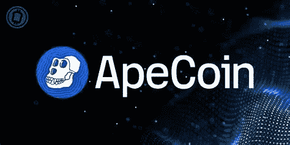

# ApeCoin (APE):它是什么，是一个好的投资吗？

> 原文：<https://medium.com/coinmonks/apecoin-ape-what-is-it-and-is-it-a-good-investment-72b070c74ce7?source=collection_archive---------4----------------------->

Source photo [apecoin — Bing images](https://www.bing.com/images/search?view=detailV2&ccid=aNzC59a6&id=4B4C23F821FBCF7E28203E32DD59A014575C5E60&thid=OIF.CIZzCT7MudMsGuOn5EFINA&mediaurl=https%3a%2f%2fcryptoast.fr%2fwp-content%2fuploads%2f2022%2f03%2fapecoin-bayc-ape.jpg&cdnurl=https%3a%2f%2fth.bing.com%2fth%2fid%2fR.68dcc2e7d6bad54927424a9e34b9b195%3frik%3d%26pid%3dImgRaw%26r%3d0&exph=800&expw=1600&q=apecoin&simid=7089538730332&FORM=IRPRST&ck=088673093ECCB9D32C1AE3A7E4414834&selectedIndex=1&ajaxhist=0&ajaxserp=0)

无聊猿游艇俱乐部系列是最受欢迎的 NFT 系列之一。每一个 NFT 描绘了一个卡通猿，完成了自己的配色方案，面部表情和服装。显然，许多人对这些非功能性食物怎么能获得如此高的价格感到困惑。

在过去的七天里，Bored Ape 游艇俱乐部售出了 335 辆 NFT。它总共卖了…