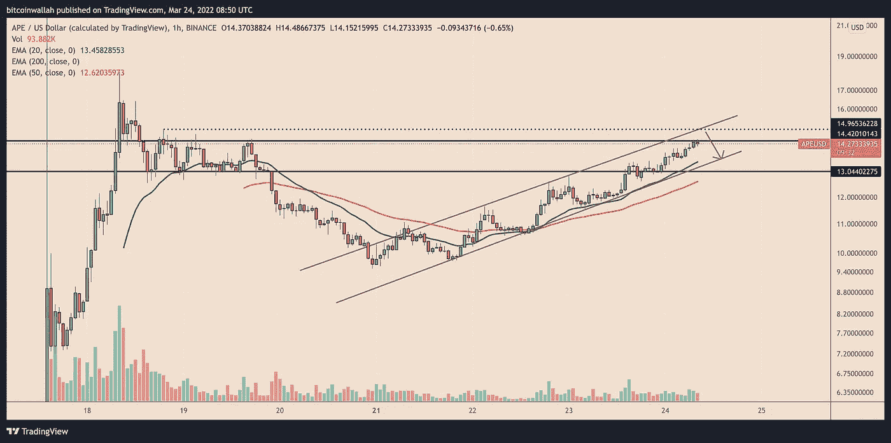

# 总部位于 BAYC 的 ApeCoin 本周上涨了 50%，其创始人筹集了 4.5 亿美元的新资金

> 原文：<https://medium.com/coinmonks/apecoin-based-in-bayc-is-up-50-this-week-as-its-founder-raises-450-million-in-new-funding-ce1955c029d0?source=collection_archive---------61----------------------->

**Visit our website:-** [**https://bitcoinsupports.com/**](https://bitcoinsupports.com/)

APE 收盘于一个重要的临时支撑位之上，增加了其继续上升趋势的机会。ApeCoin (APE)背后的初创公司周四在安德森·霍洛维茨(Andreessen Horowitz)领导的一轮融资中筹集了数亿美元，继续保持上升趋势。

APE 价格盘中上涨 7.5%，至每件约 14.50 美元。代币的上涨是本周初开始的回撤反弹的一部分，当时它的交易价格仅为 9.50 美元。

APE 的利润周周增长 50%，成为自 3 月 21 日以来表现最好的数字资产之一。

**Visit our website:-** [**https://bitcoinsupports.com/**](https://bitcoinsupports.com/)

**显著的风险投资推动**

概括地说，ApeCoin 数字货币是在 3 月 17 日由宇迦实验室支持的“空投”创造的，该实验室是无聊猿游艇俱乐部(BAYC)的创始人，这是一个在名人、运动员和风险投资家中因其“地位象征”而受欢迎的不可兑换代币(NFT)的集合截至周四，宇迦实验室向无聊猿 NFT 的所有者分发了 1.5 亿只猿，总共产生了 10 亿只猿，每个人都收到了 10904 枚代币，价值约 15.8 万美元。最有价值的 BAYC NFTs 的所有者“突变猿”得到了 2042 只猿，这在今天大约值 3 万美元。该公司将 APE 设想为一种治理和公用事业令牌，使 APE 持有者能够控制和监督 ApeCoin DAO，这是一个去中心化的自治组织。因此，拥有一只猿的人有能力对 BAYC 生态系统内部做出的决定进行投票。根据 ApeCoin 官方网站的摘录，“它将作为一个分散的协议层，用于社区主导的倡议，将文化推进到元宇宙。”例如，https://twitter.com/WuBlockchain/status/1506891345340022790

宇迦实验室向安德森·霍洛维茨(Andreessen Horowitz)和 Animoca 等品牌提供了其总供应量的 14%左右，以今天的价格计算，价值约 20 亿美元，以帮助其推出 APE。该公司周二从这些风险投资家那里融资 4.5 亿美元，估值为 40 亿美元。加密货币交易所 FTX 也为这轮投资做出了贡献，据宇迦称，这轮投资将用于扩大宇迦的开发人员，并监督即将成立的合资企业，包括一个名为“Otherside”的元宇宙项目。宇迦也可能利用这笔资金来扩张无聊和变异的 Apes 品牌，其中一些品牌首次亮相于奢侈品和一款包括 APE 代币在内的“玩赢”游戏。

[https://Twitter . com/davidgokhshtein/status/1506651332912029703](https://twitter.com/davidgokhshtein/status/1506651332912029703)

**APE 的未来在哪里？ApeCoin 只有一周的历史，因此没有足够的历史数据来预测未来的价格波动。然而，切换到较低时间段的图表，显示 APE 在平行上升通道中上升，交易者在价格到达较低趋势线时买入，在价格到达较高趋势线时卖出。**

**Visit our website:-** [**https://bitcoinsupports.com/**](https://bitcoinsupports.com/)

因此，APE 目前的反弹可能会继续朝着通道的上趋势线 15 美元附近的更高势头，这与 3 月 18 日至 19 日的另一个阻力位重合。

与此同时，APE 正在奋力夺回 14.25 美元的临时支撑。如果做不到这一点，可能会导致通道的低趋势线提前回落，这也恰好与绿波的 20 小时指数移动平均线(20 小时均线)相吻合。

**访问我们的网站:-**[**https://bitcoinsupports.com/**](https://bitcoinsupports.com/)

**免责声明:以上为作者观点，不应视为投资建议。读者应该自己做研究。**

> 加入 Coinmonks [电报频道](https://t.me/coincodecap)和 [Youtube 频道](https://www.youtube.com/c/coinmonks/videos)了解加密交易和投资

# 另外，阅读

*   M [oonXBT vs Bybit vs 币安](https://coincodecap.com/bybit-binance-moonxbt) | [Arbitrum:第二层解决方案](https://coincodecap.com/arbitrum)
*   [买 PancakeSwap(蛋糕)](https://coincodecap.com/buy-pancakeswap)|[matrix export Review](https://coincodecap.com/matrixport-review)
*   [最佳免费加密信号](https://coincodecap.com/free-crypto-signals) | [YoBit 评论](/coinmonks/yobit-review-175464162c62) | [Bitbns 评论](/coinmonks/bitbns-review-38256a07e161)
*   [OKEx 审核](/coinmonks/okex-review-6b369304110f) | [Kucoin 交易机器人](/coinmonks/kucoin-trading-bot-automate-your-trades-8cf0ca2138e0) | [期货交易机器人](/coinmonks/futures-trading-bots-5a282ccee3f5)
*   [AscendEx Staking](https://coincodecap.com/ascendex-staking)|[Bot Ocean Review](https://coincodecap.com/bot-ocean-review)|[最佳比特币钱包](https://coincodecap.com/bitcoin-wallets-india)