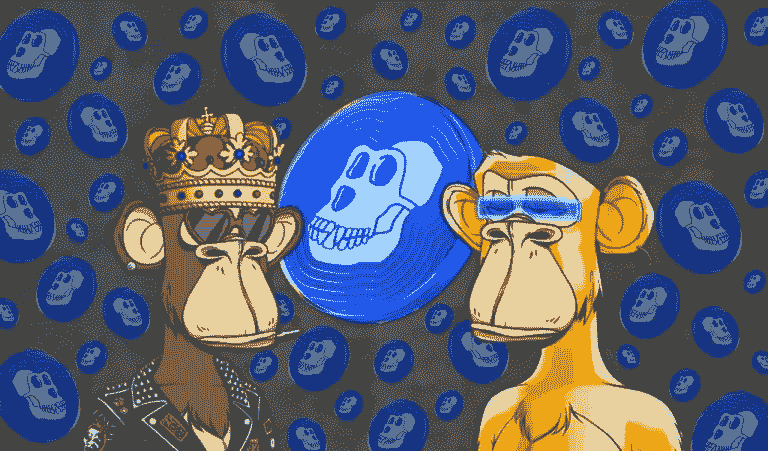

# 硬币价格分析

> 原文：<https://medium.com/coinmonks/apecoin-price-analysis-71804e8a734?source=collection_archive---------10----------------------->

Source photo [apecoin news — Bing images](https://www.bing.com/images/search?view=detailV2&ccid=l8Nta%2f4C&id=1D34014998414524C8A3334104CAB3BF1E9508FE&thid=OIF.Rk485JKqW7%2bTiP0YoGYxVQ&mediaurl=https%3a%2f%2fnews.coincu.com%2fwp-content%2fuploads%2f2022%2f04%2fApeCoin-DAO-Has-Been-Chastised-For-Its-Shoddy-Governance-Structure-1-768x451.png&cdnurl=https%3a%2f%2fth.bing.com%2fth%2fid%2fR.97c36d6bfe024df50ce7fe5167a0f2ec%3frik%3d%26pid%3dImgRaw%26r%3d0&exph=451&expw=768&q=apecoin+news&simid=6954354979551&FORM=IRPRST&ck=464E3CE492AA5BBF9388FD18A0663155&selectedIndex=6&ajaxhist=0&ajaxserp=0)

## 什么是 ApeCoin，我如何使用它？

在无聊猿游艇俱乐部(BAYC) NFT 收集环境中，ApeCoin 将于 2022 年 3 月 17 日启动，届时它将成为主要的治理和公用事业资产。ApeCoin 的持有者可以对 DAO 发起的提案进行投票。

ApeCoin 的核心价值是治理，然而支持该项目的社区总是…