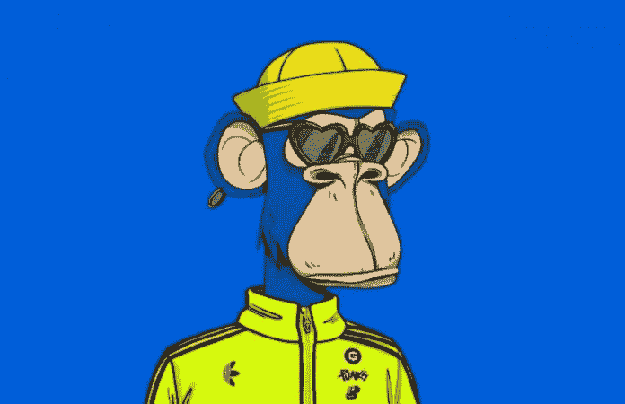

# ApeCoin 在三天内暴涨超过 50%,其中有 BAYC land drop 的传言

> 原文：<https://medium.com/coinmonks/apecoin-skyrockets-over-50-in-three-days-amongst-rumors-of-a-bayc-land-drop-78d61e4ad5f3?source=collection_archive---------74----------------------->

无聊猿游艇俱乐部(BAYC)相关的加密令牌 ApeCoin 在过去 3 天里飙升了 50%以上，有传言称，无聊猿和突变猿 NFT 的所有者可能会在宇迦实验室获得虚拟土地，即将在元宇宙“彼岸”举行。

仅今天一天，ApeCoin 就上涨了 20%以上，达到每枚代币 17 美元多一点。关于拜克和 MAYC NFT 持有者的土地下降的谣言是由另外的谣言辅助的，即 ApeCoin 将是在即将到来的元宇宙中使用的令牌。twitter 上还有传言称，CyptoPunks、Meebits、酷猫、名词、WoW 和 Toadz NFT 持有者也将被列入白名单，以购买新元宇宙的虚拟土地。

# 无聊猿游艇俱乐部的新元宇宙“彼岸”是什么？

目前，元宇宙无聊猿游艇俱乐部(BAYC)的“彼岸”还没有正式宣布，但是宇迦实验室已经发布了预告片，这导致他们可能会很快宣布一个名为“彼岸”或类似的[元宇宙。传言和泄漏报告说“彼岸”将是一个大型多人在线角色扮演游戏或(MMORPG)，游戏的玩家可以使用他们的 NFT 化身作为他们的游戏角色。据报道，ApeCoin 是一种加密货币，可用于虚拟土地和游戏中的其他购买。](https://bumblebeecrypto.com/2022/03/20/bored-ape-yacht-club-creators-yuga-labs-teases-its-own-metaverse-along-with-cryptopunks-cool-cats-nouns-and-other-nft-collections/)

还有其他传闻表明，宇迦实验室可能会通过荷兰拍卖出售虚拟土地，最低出价为 600 便士，按当前价格计算，超过 1 万美元。

即使 3 天内增长超过 50%,对 BAYC 和 ApeCoin 生态系统来说，可能还会有更多积极的消息和公告，这可能会导致价格在未来进一步上涨。

来源:BumbleBeeCrypto.com

# 分享这个:

> 加入 Coinmonks [电报频道](https://t.me/coincodecap)和 [Youtube 频道](https://www.youtube.com/c/coinmonks/videos)了解加密交易和投资

# 另外，阅读

*   [印度的加密交易所](/coinmonks/bitcoin-exchange-in-india-7f1fe79715c9) | [比特币储蓄账户](/coinmonks/bitcoin-savings-account-e65b13f92451)
*   [OKEx vs KuCoin](https://coincodecap.com/okex-kucoin) | [摄氏替代度](https://coincodecap.com/celsius-alternatives) | [如何购买 VeChain](https://coincodecap.com/buy-vechain)
*   [币安期货交易](https://coincodecap.com/binance-futures-trading)|[3 commas vs Mudrex vs eToro](https://coincodecap.com/mudrex-3commas-etoro)
*   [如何购买 Monero](https://coincodecap.com/buy-monero) | [IDEX 评论](https://coincodecap.com/idex-review) | [BitKan 交易机器人](https://coincodecap.com/bitkan-trading-bot)
*   [CoinDCX 评论](/coinmonks/coindcx-review-8444db3621a2) | [加密保证金交易交易所](https://coincodecap.com/crypto-margin-trading-exchanges)