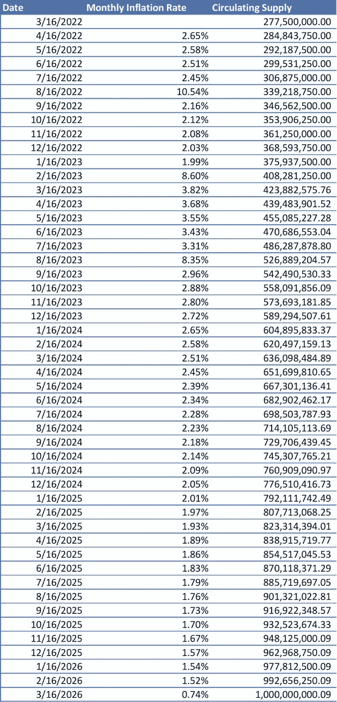

# Apecoin 令牌组学案例研究

> 原文：<https://medium.com/coinmonks/apecoin-tokenomics-case-study-91fc8bc02363?source=collection_archive---------3----------------------->

> “如果你不知道收益来自哪里，你就是收益”

从 2021 年 9 月到 12 月，高收益的打桩协议风靡一时。在奥林巴斯道(Olympus DAO)和时代奇境(Time Wonderland)的庞氏经济学的推动下，市场参与者正争先恐后地投资无数个 69，420%的 APY 项目。一些人知道这些项目是不可持续的；其他人对此一无所知。当这些项目失败，导致投资者大量损失时，这句话“如果你不知道收益来自哪里，你就是收益”就像“不是你的钥匙，不是你的密码”一样在整个 CT 被传唱。

如果我告诉你这涉及到 crypto 的每一个项目。从比特币、以太坊和雪崩，一直到时间仙境、Dogecoin 和 Elon CumRocket。理解供应的驱动因素是分析协议最重要的方面之一。

# **供给驱动**

什么决定了密码的价格？供求关系。在牛市期间，需求是推动价格变化的因素。当需求沿着供给曲线增加时，需求数量增加，推动价格上涨。

当我们处于熊市的时候呢？当需求减少时，沿着供给曲线，需求量减少，推动价格下降。

这些例子意味着供给是固定的。在 crypto 中情况并非如此。在牛市期间，每次都被忽略的一个因素是供应。当数字上升时，没有人关心未来供应的影响。他们只关心下一个 5 倍、10 倍或 100 倍。

但是，有一个和时间一样古老的故事。拿着包。在这个领域，有多少人持有 altcoin 25x，却眼睁睁地看着它在需求消失后暴跌 90%？我知道我有罪。你可能认为你投资了一个一生只有一次的项目。“我只是要 HODL 它，直到下一个牛市。已经跌了 90%。只能再降 10%。”不好意思老板，目前只跌了 90%。

在熊市期间，理解你手中项目的供应动态至关重要。你刚刚投资的 ICO 很可能会在项目的最初几年经历极度膨胀的时期。当供给呈指数增长而需求减少时会发生什么？你会抓到瑞科特的。知道有多少供应被释放到液体循环中，以及它来自哪里，将产生 99%的协议持有者永远不会知道的 alpha。

当需求减少，供给增加时，需求的数量会大大减少，而供给会同时增加。不太好。价格暴跌。在风险投资的外部抛售压力下，这似乎并不好玩。

# **Tokenomic 案例研究:Apecoin**

当分析协议的令牌组学时，有几个因素必须分析:令牌分配、完全稀释的市值、液体供应曲线、授权计划和通货膨胀。

> 加入 Coinmonks [Telegram group](https://t.me/joinchat/Trz8jaxd6xEsBI4p) 并了解加密交易和投资

# **令牌分配**

分析记号组学最常用的方法是通过记号分配。一般来说，这在协议的文档中可以广泛获得。代币分配告诉我们谁在接受硬币，他们得到了多少。令牌分配部分中被审查最多的部分是委派给风投的金额。

以概率的方式思考，最有可能卖出硬币的是项目的风险投资人。卖出概率最低的是资金充足的国库和赌注回报。一些公司致力于发展和建设项目。其他人渴望利润，会立即出售。如果大部分令牌分配给了风投，就会引发一个危险信号。

> 我想链接一条来自挑战资本创始人亚瑟的线索。虽然我说风险投资分配是一个危险信号，但这是一个著名风险投资者投资过程的显著视角。【https://twitter.com/Arthur_0x/status/1533536299864317952 

# **完全稀释的市值**

在查看一项协议的统计数据时，您将获得两个市值:市值和完全稀释市值。市值和完全稀释市值是用于评估项目市值的指标。将它们误认为是相同的，或者选择使用一个而不是另一个，是一个致命的错误。

市场cap 通过将流通中的**硬币的未偿数量**乘以硬币的价格来衡量协议的价值。

完全稀释市值通过获取硬币的**最大供应量**并乘以价格来衡量协议的价值。

在 Apecoin 的情况下，有 10 亿 APE 的最大供应量。然而，大约有 292，000，000 只猿在流通。

随着我们深入研究硬币的液体供应曲线和项目的膨胀，我们将更好地理解 FDV 在评估协议时的重要性。

# **供给计划的特征:发行和归属**

下图是 Apecoin 的供液曲线。液体供给曲线是代币通货膨胀率、分配和归属时间表的可视化。并不是所有的硬币都立即投入流通。项目有发行利率和授权时间表，以扩大供应，同时保护投资者。

# **发行**

发行和通货膨胀是一前一后使用的两个词。协议的发布是将供应分配到液体循环中。Ape 硬币的液体供应量为 292，000，000，而到 2025 年，将有 10，000，000，000 枚 APE 硬币在流通。

Apecoin 的货源是固定的。将不会有更多或更少的猿类供应。但是，另外 7 亿只猿目前被锁定。

Apecoin 使用固定的发射过程。每个供应品类别每个月都会有一个固定的解锁量。这可以通过液体供应曲线上的台阶来观察。

# **行权时间表**

为什么供液曲线会有「台阶」？他们为什么不马上发行所有的硬币？这些“步骤”的原因是授权计划。

授权时间表是预先设定的日期，决定硬币何时可以使用(发行进入流通)。授权计划用于保护协议及其投资者。项目的早期支持者(风险投资公司)能够以低于公众的价格进行投资。如果他们能以 0.01 美元投资，并在项目 ICO 为 1.00 美元时抛出一切，这将是一个免费的资金欺骗代码。风投不仅会获得荒谬的回报，还会伤害项目及其投资者。

使用的最主要的授权计划类型是线性授权计划。线性计划意味着令牌在某个时间段(几天、几个月、几个季度或几年)内以相等的部分发布。

授予时间表的另一部分是悬崖。悬崖是一个时间段，没有令牌将被解锁。一些项目最初有 12 个月的悬崖。其他人在第一个月解锁 10%,然后是四个月的悬崖。

知道这些令牌何时被释放，它们被释放给谁，以及有多少是我们驱动决策所需要的有价值的信息。

# **数据**

我以易于理解的方式组织了 Apecoin 供应计划中的关键数据。这一数据在 coinmarketcap、coingecko 或任何免费数据提供商处都不容易获得。这是在研究协议之前需要了解的重要信息。

# **通货膨胀**

通货膨胀是任何项目的秘密杀手。供应的增加慢慢地，慢慢地，慢慢地，稀释了你所持资产的真实价值。或者在某些情况下，非常快。请记住，Apecoin 使用的是线性归属时间表，每月 16 日发行新代币。

让我们看看这种通货膨胀来自哪里:

Annual Inflation

Monthly Inflation

Where is the monthly inflation coming from?

**结论**

在我开始写这篇博客之前，我打算深入了解 Apecoin 的通胀数据。我也决定不要。我认为展示比讲述更重要。

在整个修改过程中，我决定让这篇文章更好地解释供应的动态，以及在尽职调查过程中它是如何被忽视的。

到处都有阿尔法产生。第一步是知道去哪里找。

本(男子名)

***推特:****@ Ben _ Kaplan 23*

**Tiktok:**@ crypto _ Kaplan

***信标:****[beacons.ai/cryptokaplan](https://www.tiktok.com/link/v2?aid=1988&lang=en&scene=bio_url&target=http%3A%2F%2Fbeacons.ai%2Fcryptokaplan)*