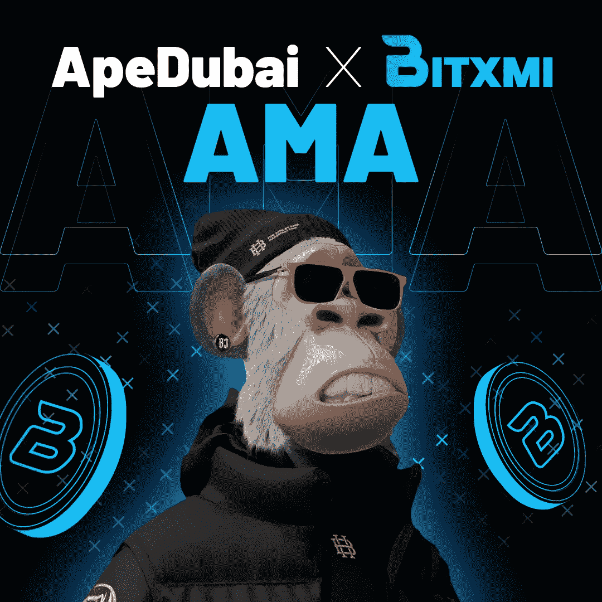

# ApeDubai 与 Bitxmi 合作举办 AMA 会议。

> 原文：<https://medium.com/coinmonks/apedubai-partners-with-bitxmi-to-host-ama-session-fd014d146f8d?source=collection_archive---------66----------------------->

Source: bxminews.io

我们很高兴宣布与 ApeDubai 合作的 AMA！

了解更多关于 Bitxmi exchange 和 BXMI 令牌(BSC Gem)的实用程序的信息。Bitxmi 团队将现场讨论 Bitxmi 生态系统带来的机会。

**🎁奖励池:10 个用户 100 个 BXMI 代币！**

🎁奖励池:10 个用户 100 个 BXMI 代币！

> 加入 Coinmonks [电报频道](https://t.me/coincodecap)和 [Youtube 频道](https://www.youtube.com/c/coinmonks/videos)了解加密交易和投资

# 另外，阅读

*   [如何在 Uniswap 上交换加密？](https://coincodecap.com/swap-crypto-on-uniswap) | [A-Ads 评论](https://coincodecap.com/a-ads-review)
*   [WazirX vs coin dcx vs bit bns](/coinmonks/wazirx-vs-coindcx-vs-bitbns-149f4f19a2f1)|[block fi vs coin loan vs Nexo](/coinmonks/blockfi-vs-coinloan-vs-nexo-cb624635230d)
*   [本地比特币审核](/coinmonks/localbitcoins-review-6cc001c6ed56) | [加密货币储蓄账户](https://coincodecap.com/cryptocurrency-savings-accounts)
*   [什么是保证金交易](https://coincodecap.com/margin-trading) | [美元成本平均法](https://coincodecap.com/dca)
*   [支持卡审核](https://coincodecap.com/uphold-card-review) | [信任钱包 vs 元掩码](https://coincodecap.com/trust-wallet-vs-metamask)
*   [Exness 回顾](https://coincodecap.com/exness-review)|[moon xbt Vs bit get Vs Bingbon](https://coincodecap.com/bingbon-vs-bitget-vs-moonxbt)