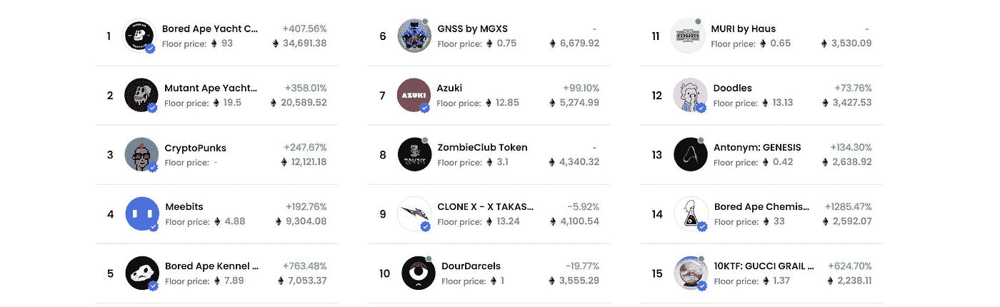
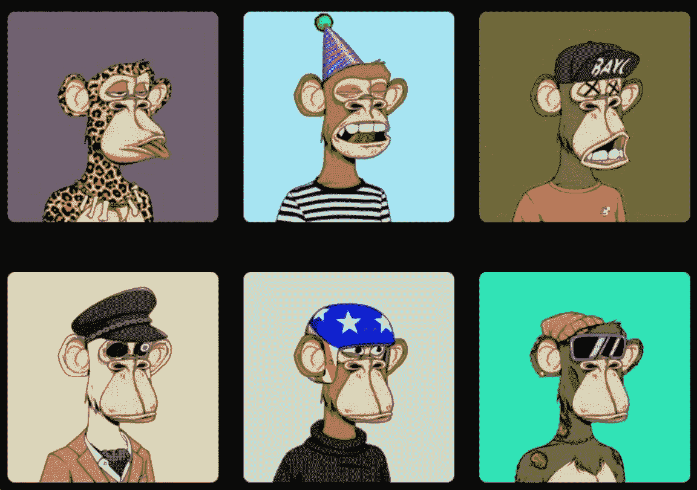
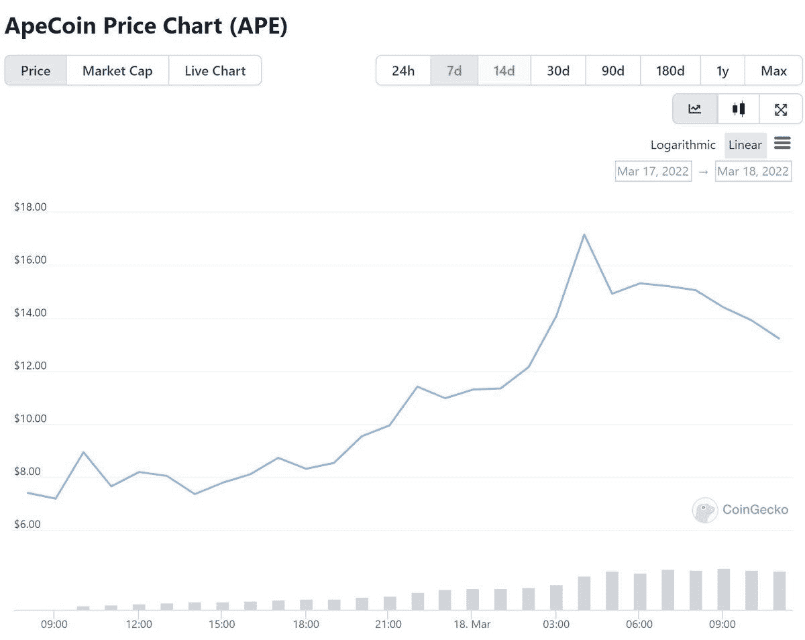

# 现在把猿变成猿币还来得及吗？

> 原文：<https://medium.com/coinmonks/aping-into-ape-coin-cbc0204f379c?source=collection_archive---------14----------------------->

无聊猿游艇俱乐部是一个收集了 10，000 个独特的无聊猿 NFT，一个独特的数字收藏品生活在以太坊区块链。几个月来，BAYC 一直主宰着 NFT 的空间。在市场上保持领先地位。

由于他们的成功，它已经成为许多名人的个人资料照片的选择。这不是胡闹！

## 为什么有人会花这么多钱在这些愚蠢/酷的 Jpegs 图片上？

这毫无意义…

除了有一个很酷的个人资料图片，海湾合作委员会 NFT 也作为一个会员卡！授予会员专属权益:

*   商品
*   版权许可证
*   空投
*   社区
*   独家活动和游戏

最终这是一个排外的社交俱乐部。

把这些 NFT 想象成一种身份的象征，有点像劳力士。它价格高，供应有限，并有独家津贴。

## 现在，什么是$猿硬币？

$APE 是 Bored Ape 游艇俱乐部社区的治理和实用令牌。$APE 持有者可以在 APE 币道上投票决定生态系统基金的管理和使用。

## 但道究竟是什么？？？

分散自治组织

在这里，组织由智能契约上编码的规则来表示。道的成员能够管理决策，有点像公司的股东，但更透明。

自从$APE 推出以来，价格一路飙升，目前涨幅超过 80%！

如果 Jpeg 猴子不能让你兴奋起来，宇迦实验室 BAYC 背后的公司从幼虫实验室收购了 CryptoPunks 和 Meebits 系列。

Animoca Brands 还宣布他们将在即将到来的项目中采用 Ape coin，比如 P2E 游戏 Benji Bananas。

nWayPlay 还宣布他们将把猿币整合到他们的新 P2E 游戏中！

类人猿正在酝酿大事件。

## 我现在能购买代币吗？

不…

尽管有大品牌和强大社区的支持，但仍获得了 130 亿美元的评估。我会等待炒作降温后再进场。

最近有一个球场甲板泄漏，但到目前为止，团队出来说它是“过时的”。

据泄露宇迦实验室，他们计划释放 20 万块的 BAYC 土地在他们的游戏为基础的元宇宙 MetaRPG！

似乎他们的新世界也将导致来自宇迦和更多元宇宙房地产的新货币。

> 加入 Coinmonks [电报频道](https://t.me/coincodecap)和 [Youtube 频道](https://www.youtube.com/c/coinmonks/videos)了解加密交易和投资

# 另外，阅读

*   最佳[区块链分析](https://bitquery.io/blog/best-blockchain-analysis-tools-and-software)工具| [赚比特币](/coinmonks/earn-bitcoin-6e8bd3c592d9)
*   [Cloudbet 赌场评论](https://coincodecap.com/cloudbet-casino-review) | [点火赌场评论](https://coincodecap.com/ignition-casino-review)
*   [加密套利](/coinmonks/crypto-arbitrage-guide-how-to-make-money-as-a-beginner-62bfe5c868f6)指南| [如何做空比特币](/coinmonks/how-to-short-bitcoin-568a2d0b4ae5)
*   [如何在加拿大购买加密货币？](https://coincodecap.com/how-to-buy-cryptocurrency-in-canada)
*   [无聊猿游艇俱乐部(BAYC)回顾](https://coincodecap.com/bored-ape-yacht-club-bayc-review) | [拜比特 vs 比特币基地](https://coincodecap.com/bybit-vs-coinbase)
*   [5 款最佳加密交易终端](https://coincodecap.com/crypto-trading-terminals) | [最佳 DeFi 应用](https://coincodecap.com/best-defi-apps)
*   [比特币基地 vs 瓦济克斯](https://coincodecap.com/coinbase-vs-wazirx) | [比特鲁点评](https://coincodecap.com/bitrue-review) | [波洛涅克斯 vs 比特鲁](https://coincodecap.com/poloniex-vs-bittrex)