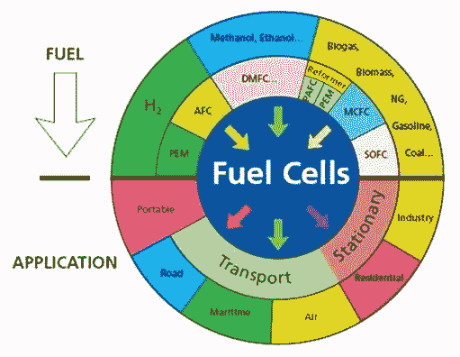

# 燃料电池的应用

> 原文：<https://medium.com/coinmonks/applications-of-fuel-cells-1225670c942c?source=collection_archive---------31----------------------->

燃料电池可用于为多个领域的广泛应用提供电力，主要是交通运输、不同类型的建筑以及可逆系统中电网的长期能量储存。燃料电池正被用于许多应用中，包括运输、备用电源和便携式电源。

与目前在许多发电厂和车辆中使用的传统燃烧技术相比，燃料电池有几个优点。燃料电池可以以比内燃机更高的效率运行，并且可以将燃料中的化学能直接转化为电能，效率能够超过 60%。燃料电池产生的污染也很少，并且可以由可再生的氢气提供动力。与内燃机相比，燃料电池的排放量更低或为零。氢燃料电池只排放水，由于没有二氧化碳排放，因此可以应对严峻的气候挑战。在操作过程中也没有产生烟雾和健康问题的空气污染物。燃料电池在运行时很安静，因为它们很少有运动部件。燃料电池还可以在很宽的温度范围内工作，这使它们适用于各种环境。燃料电池为传统技术提供了一种高效、清洁的替代品，并有可能彻底改变我们为世界供电的方式。

Fuel Cells applications

感谢阅读！我们希望这能让你更好地理解燃料电池及其应用。如果您有任何问题或想了解更多关于燃料电池的信息，请立即联系我们。

最诚挚的问候，

氢币团队

可能的问题:

*   燃料电池和电池有什么不同？

 [## Hydrogencoin -基于 Solana 区块链的 DeFi 基金

### Hydrogencoin.io 是全球首个绿色氢的 DeFi 基金

氢币. io](https://hydrogencoin.io/) 

> 加入 Coinmonks [电报频道](https://t.me/coincodecap)和 [Youtube 频道](https://www.youtube.com/c/coinmonks/videos)了解加密交易和投资

# 另外，阅读

*   [加密保证金交易交易所](/coinmonks/crypto-margin-trading-exchanges-428b1f7ad108) | [赚取比特币](/coinmonks/earn-bitcoin-6e8bd3c592d9) | [Mudrex 投资](https://coincodecap.com/mudrex-invest-review-the-best-way-to-invest-in-crypto)
*   [WazirX vs CoinDCX vs bit bns](/coinmonks/wazirx-vs-coindcx-vs-bitbns-149f4f19a2f1)|[block fi vs coin loan vs Nexo](/coinmonks/blockfi-vs-coinloan-vs-nexo-cb624635230d)
*   [比斯勒评论](https://coincodecap.com/bitsler-review)|[WazirX vs coin switch vs coin dcx](https://coincodecap.com/wazirx-vs-coinswitch-vs-coindcx)
*   [7 大顶级副本交易平台](https://coincodecap.com/copy-trading-platforms) | [BuyCoins 审核](https://coincodecap.com/buycoins-review)
*   [XT.COM 评论](https://coincodecap.com/profittradingapp-for-binance)币安评论 |
*   [SmithBot 评论](https://coincodecap.com/smithbot-review) | [4 款最佳免费开源交易机器人](https://coincodecap.com/free-open-source-trading-bots)