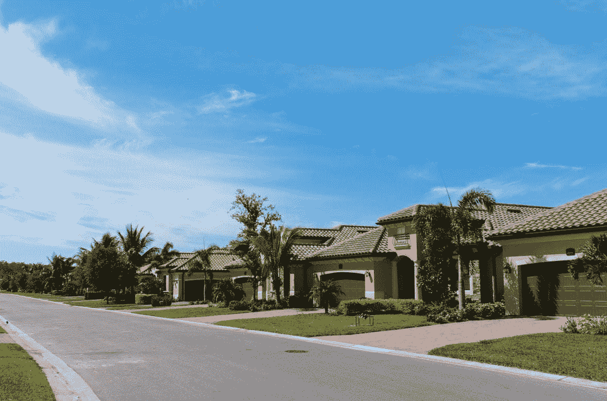

# 欣赏

> 原文：<https://medium.com/coinmonks/appreciation-fa6c08eaa86b?source=collection_archive---------74----------------------->

# 什么是欣赏？

有没有注意到一些房产每年都在增值？那叫欣赏。当房产升值时，像你这样的投资者在出售或出租给租户时会获得更大的利润，这就是投资房地产的好处之一！如果你有住房贷款，升值的房产会创造更多的资产净值，这意味着如果你想建立你的房地产投资组合，就有更多的现金可用。

那么，为什么有些住宅比其他住宅升值更多呢？这一现象背后有几个因素。房地产经纪人根据同一街区或地区的可比房屋来计算房屋的价值。在炙手可热的房地产市场——待售房屋数量少于买家数量——房产价值可能会大幅上升。这是因为对这些房产有更多的需求(被称为卖方市场)，所以如果投资者选择出售房屋或出租给租户，他们可以获得更大的利润空间。

可能还有其他因素在起作用。如果住宅位于火车站或购物中心等新开发项目附近，或者某个地区有好的学校或当地的便利设施，住宅可能会升值。如果房主翻新了房产，房子也可能升值。一些翻新，如厨房和浴室改造，可以增加数千美元的财产要价。

你知道整体经济也会影响房地产价格吗？当利率较低时，可能会有更多的人有兴趣购买房产，从而全面提高房屋价值。当利率高时，可能会发生相反的情况。

升值与贬值相反，贬值是指财产随着时间的推移而贬值。当一所房子靠近高犯罪率地区，或者一处房产有污水或结构问题时，这种情况就可能发生。有时像火灾或恶劣天气这样的自然事件会在一夜之间使房屋贬值。

作为投资者，这一切对你意味着什么？当你出售或出租你的投资时，在一个充满希望的地方购买一套房子或翻新一个旧的房产会带来更大的利润。精明的投资者在购买房地产时会考虑各种升值因素。

# 欣赏案例研究

一位房地产投资者用住房贷款以 150，000 美元的价格购买了一处维修状况不佳的止赎房产。她翻新了房子，增加了新屋顶、新窗户和一间卧室和浴室。因为这些维修，房子升值了，现在价值 25 万美元。这意味着该房产现在拥有权益，允许投资者投资第二套住房，扩大她的房地产投资组合。

# 底线

当房子随着时间的推移而增值时，升值就发生了。这可能是因为房主对房产进行了翻新，或者该地区对类似房产的需求增加了。当房产升值时，投资者可以获得更多的租金收入，或者以更高的价格出售房产。

> 加入 Coinmonks [电报频道](https://t.me/coincodecap)和 [Youtube 频道](https://www.youtube.com/c/coinmonks/videos)了解加密交易和投资

# 另外，阅读

*   [用信用卡购买密码的 10 个最佳地点](https://coincodecap.com/buy-crypto-with-credit-card)
*   [加拿大最佳加密交易机器人](https://coincodecap.com/5-best-crypto-trading-bots-in-canada) | [Bybit vs 币安](https://coincodecap.com/bybit-binance-moonxbt)
*   [阿联酋 5 大最佳加密交易所](https://coincodecap.com/best-crypto-exchanges-in-uae) | [SimpleSwap 评论](https://coincodecap.com/simpleswap-review)
*   购买 Dogecoin 的 7 种最佳方式
*   [最佳期货交易信号](https://coincodecap.com/futures-trading-signals) | [流动性交易所评论](https://coincodecap.com/liquid-exchange-review)
*   [用于 Huobi 的加密交易信号](https://coincodecap.com/huobi-crypto-trading-signals) | [Swapzone 审查](/coinmonks/swapzone-review-crypto-exchange-data-aggregator-e0ad78e55ed7)