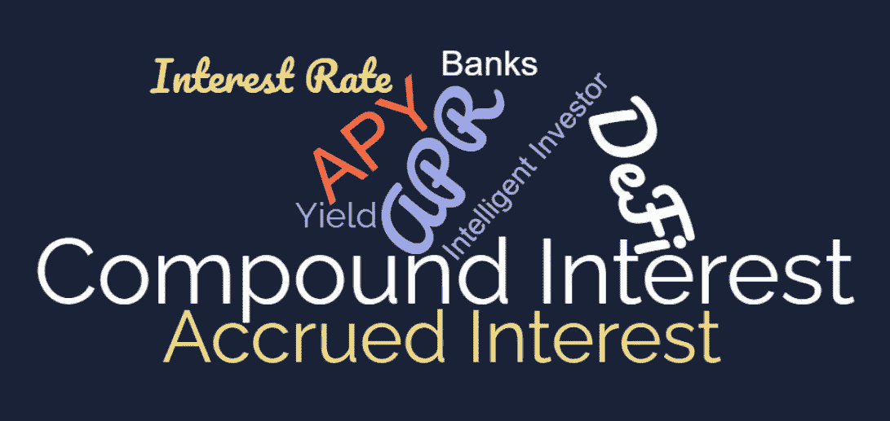

# APY APR &用公式和例子解释复利

> 原文：<https://medium.com/coinmonks/apr-apy-compound-interest-explained-with-formulas-examples-4859bdfa16ce?source=collection_archive---------3----------------------->

## 智能投资的强大指标

年利率、APY 和复利是金融界经常使用的三个术语。银行、信用卡机构以及最近的区块链项目(DeFi 协议、密码交易所/贷方)通常将这些参数作为计算贷款、投资等利息的指标