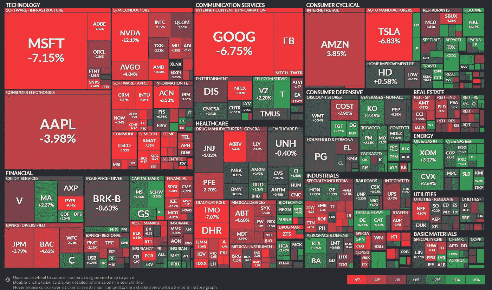
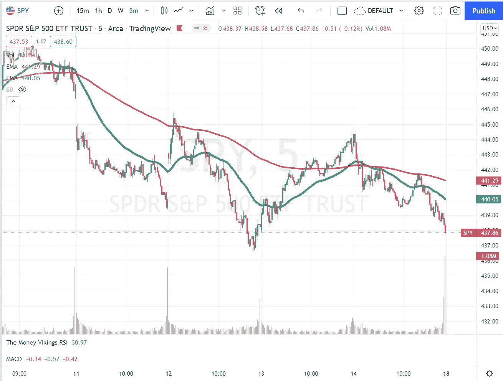
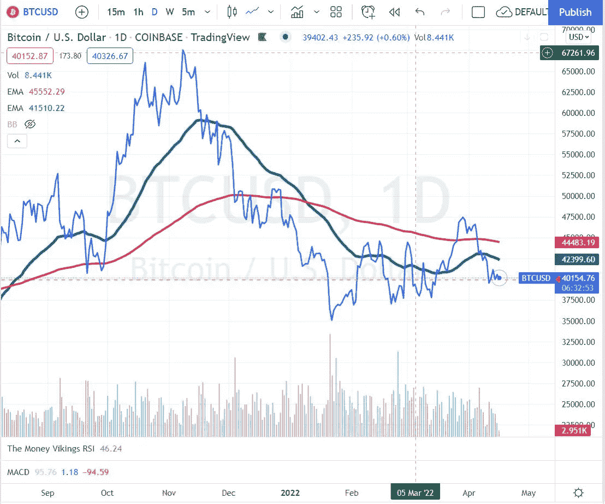
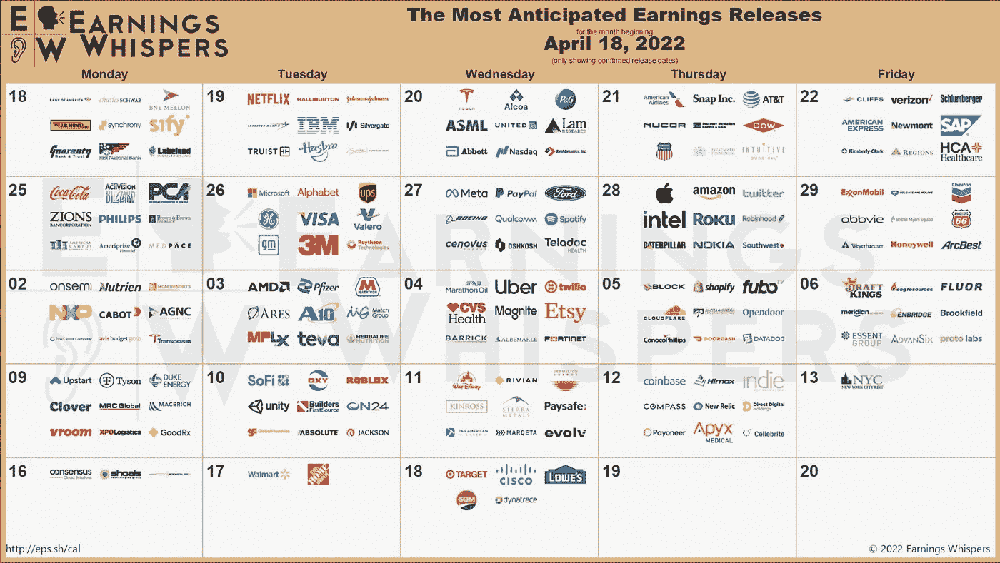
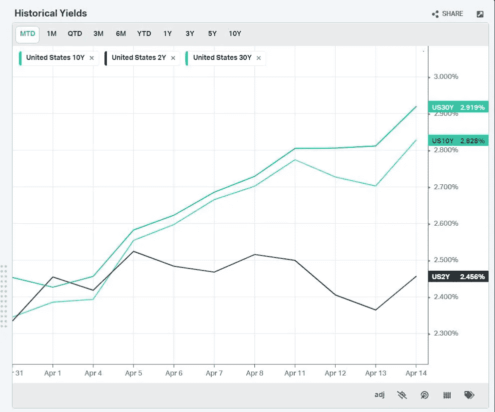
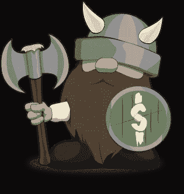

# 2022 年 4 月 17 日—每周市场总结

> 原文：<https://medium.com/coinmonks/april-17-2022-weekly-market-summary-e93911158825?source=collection_archive---------40----------------------->

# 市场在下跌，但如果你知道去哪里找，还是有一些表现优异的地方

过去一周，科技板块跌幅最大，跌幅超过 5%，其次是通信服务和医疗保健。本周的赢家是能源上涨 3.17%，材料上涨 1.27%。GLD 本周上涨超过 2%，与农业相关的其他商品和业务继续表现良好。VEGI ETF 上涨 4%，MOO 上涨 1.63%，DBA 上涨 2.54%。美元(DXY)继续保持强劲，过去几周上涨超过 2%，但进入超买区。DAL 上周公布盈利增长 14%，JETS ETF 上涨逾 6.30%。

# 芬维兹周报

# Splyce 电子竞技俱乐部

The S&P 500 (SPY) ended the week down -2.39%. It is trading below the 200 day EMA (red line) and the 50 day EMA (green line).

# 比特币

BTC ended the week down -6.5%, and could not hold above the 50 EMA (green line). There seems to be a battle between buyers and sellers at the psychological 40K mark.

# 收益

Earnings season is about to get very busy over the next few weeks. If you are considering adding to positions in any of the stocks listed below, it’s important to know that earnings can add lots of volatility and create huge price swings before the numbers are announced. Many of the stocks below are huge components of the S&P 500\. If you are trading options in these, strangles and iron condors will pay you elevated premiums so keep an eye on the Implied Volatility Rank of these before entering trades.

# 等级

The 30 year is close to 3% (2.91%), the 10Y is 2.82%, and the 2Y is 2.45%.

如果你喜欢这份简讯，请考虑成为[金钱维京人高级会员](https://email.mg1.substack.com/c/eJxdkMtuwyAQRb_GLC08YBsWLCpV-Q2Lx8ShscHikcp_X9xsqkojZnGBo3usLrjGdKoj5kKuYynngSrgd96wFEykZkyLd4rTic9CzsQpOoOdDfF5uSfEXftNkaOazVtdfAzXbSY5F0AeyvJxNnetmaBGsAGdccKNE3Bg1krt3lBdncdgUeEL0xkDkk09Sjlyxz46uLU5Eu6-7v3ewvPlnz6subdxv1J2O_SKDduxT8mZIF4BBaAMZmBUjqyHXk9SaDkh2MGMIG3_0HUbYnx1nO7r0OdqctH2ef1JkvrClM4r-oe7ei5t7zX4ci4YtNnQqZIqkvK2-CtkWTFganbdoosaJi44wCi5mMZ34-ZoHIamSTDS2C62V0H9xf0AcbuLiA)以获得更多见解、热门交易和健康提示。第一个月使用 code **medium** 可享受 50%的优惠。

> 加入 Coinmonks [电报频道](https://t.me/coincodecap)和 [Youtube 频道](https://www.youtube.com/c/coinmonks/videos)了解加密交易和投资

# 另外，阅读

*   [Bookmap 评论](https://coincodecap.com/bookmap-review-2021-best-trading-software) | [美国 5 大最佳加密交易所](https://coincodecap.com/crypto-exchange-usa)
*   最佳加密[硬件钱包](/coinmonks/hardware-wallets-dfa1211730c6) | [Bitbns 评论](/coinmonks/bitbns-review-38256a07e161)
*   [新加坡十大最佳加密交易所](https://coincodecap.com/crypto-exchange-in-singapore) | [购买 AXS](https://coincodecap.com/buy-axs-token)
*   [红狗赌场评论](https://coincodecap.com/red-dog-casino-review) | [Swyftx 评论](https://coincodecap.com/swyftx-review) | [CoinGate 评论](https://coincodecap.com/coingate-review)
*   [投资印度的最佳密码](https://coincodecap.com/best-crypto-to-invest-in-india-in-2021)|[WazirX P2P](https://coincodecap.com/wazirx-p2p)|[Hi Dollar Review](https://coincodecap.com/hi-dollar-review)