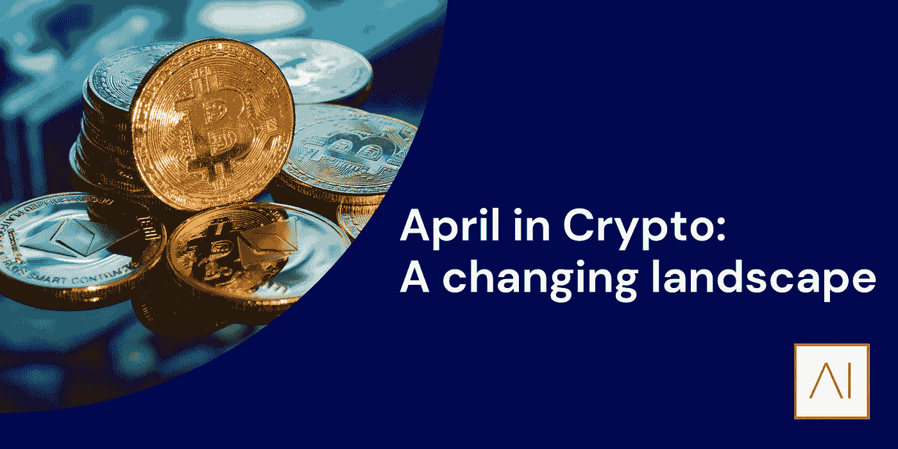

# 加密的四月:变化的风景

> 原文：<https://medium.com/coinmonks/april-in-crypto-a-changing-landscape-4eb070fd17e1?source=collection_archive---------54----------------------->

*由* [到*本德系*](https://www.linkedin.com/in/ACoAACdPcNQB7F5Bw32hpZknG9zIsbLob9fMIzs)

四月初，数字资产生态系统变得更加清晰。听到英国政府对监管加密货币感兴趣的传言后，直到 4 月 4 日，财政大臣 Rishi Sunak 才宣布计划将英国转变为数字资产的“全球中心”。该公告围绕稳定货币(与指定外汇货币价格挂钩的数字资产)的监管措辞激烈，并提出了探索使其成为有效货币形式的意图。严重依赖于有效的监管，财政部参与这一不断增长的行业的意图可能会为经验丰富的投资者提供信心，将他们的钱存入替代资产。如果你想纪念这一事件，皇家铸币局的 NFT 项目也将标志着这一宣布，以庆祝英国对数字资产的开放。在讨论监管时，理解围绕监管的话语也很重要，对于 crypto 中的对话来说，没有比 Twitter 更重要的地方了。著名的[是埃隆·马斯克(Elon Musk)在本月底以 440 亿美元收购的](https://edition.cnn.com/2022/04/25/tech/elon-musk-twitter-sale-agreement/index.html)这位连续创业者强调了将 Twitter 打造成一个真正公开和开放的平台的计划，他曾表示“言论自由是一个正常运转的民主的基石，Twitter 是一个数字化的城镇广场，对人类未来至关重要的问题在这里进行辩论”。在宣布将 Twitter 打造成一个开放平台的计划后，Musk 还打算增加 Twitter 的用户和收入，以利用它在过去 5 年中缺乏的增长。

**筹集&资金**

尽管监管是一个积极的开端，但与过去两年的趋势相比，风险投资领域的投资大幅放缓。许多人指责估值过高和融资成本低廉是推动因素，4 月份全球风险投资融资略有下降。根据领先的金融数据聚合机构 Crunchbase 的数据，2022 年 4 月的[全球风险投资是过去 12 个月中投资于私营公司的最低](https://news.crunchbase.com/news/global-vc-funding-decline-monthly-recap-april-2022/)金额，环比下降 10%。[在阿姆斯壮](https://www.armstrongint.com/)，我们过去 32 年的 DNA 一直在金融服务领域，已经建立了一个安置买方操作员的业务，我们不报道这个领域会有问题。随着我们继续在 crypto 中这样做，不包括本月的一些最大涨幅是不负责任的。4 月份最令人兴奋的一次融资来自领先的交易平台 Blockchain.com，它最近在光速创投的 D 轮融资中[达到了 140 亿美元的估值](https://www.coindesk.com/business/2022/03/31/crypto-exchange-blockchaincom-hits-14b-valuation-in-lightspeed-led-funding-round-report/)。在对他们进行估值后，关于今年晚些时候将进行首次公开募股的传言开始四处流传。作为一家总部位于英国的加密货币初创公司，该公司展示了英国科技领域的活跃程度。还值得一提的是，Blockchain.com 在他们运营的国家中以非常严格的合规性而闻名。有了 Blockchain.com 这样的优秀堡垒，再加上前面提到的监管努力，英国拥有成为数字资产中心的一切必要条件。第一层基础设施提供商 Avalanche 的母公司[艾娃实验室进行了另一次令人垂涎的融资，以 525 亿美元的估值筹集了 3.5 亿美元。自 2020 年 9 月推出雪崩网络以来，它迅速成为最受欢迎的区块链之一，拥有 450 多个项目的生态系统，市值超过 210 亿美元。如果有什么不同的话，这些巨大的估值会让人们觉得融资不会有任何进展，这在一定程度上是正确的。当该企业生态系统的其他部分遭遇一年中最艰难的一个月时，](https://cointelegraph.com/news/ava-labs-raises-350m-at-5-25b-valuation-report)[区块链初创公司似乎对估值重置表现出免疫力](https://pitchbook.com/news/articles/crypto-blockchain-startups-venture-capital-valuations)，自 2020 年初以来持续攀升。接下来的几个月将是一个很好的案例，研究加密初创企业是继续偏离行业标准，还是开始趋同。

**天赋**

与加密领域估值和风险投资的持续趋势保持一致，我们继续看到数字资产领域的全面招聘。安德森·霍洛维茨在很大程度上被认为是加密企业生态系统中最精明的运营商之一，他们宣布成立新的[加密货币研究团队](https://a16z.com/2022/04/21/announcing-a16z-crypto-research/)让许多人兴奋不已。加密研究具有多种含义，红杉(Sequoia)等一些基金非常关注计算机科学、数据和链上分析，因为它们采用了精心定制的研究方法，而老虎环球(Tiger Global)等其他基金则不太关注研究，而是在多轮融资中支持主要融资者。A16Z 的最新研究项目似乎更倾向于红杉模式，聘请了斯坦福大学和哥伦比亚大学的前计算机科学教授 Tim Roughgarden 领导新的加密研究团队。此外，另一位前斯坦福大学计算机科学系的 Dan Boneh 将加入他的团队。凭借 Tim 在博弈论方面的优势和 Dan 对应用密码学的研究，A16Z 从世界领先的机构中聘请了一些最优秀的人才来继续推动他们在生态系统中的发展。最后，为了结束整个故事，[克里斯汀·莫伊(Christine Moy)宣布](/@benashke99/march-in-crypto-a-story-of-two-halves-89bea3fd0d58)[她将加入全球领先的另类资产管理公司 Apollo](https://www.bloomberg.com/news/articles/2022-04-28/apollo-hires-jpmorgan-s-christine-moy-in-digital-assets-push) ，她在 3 月份的时事通讯中被提及，此前她离开了摩根大通的 Onyx 团队。在阿姆斯特朗，我们继续致力于构建英国数字资产行业的未来，我们希望向 Tim、Dan、Christine 以及所有在数字资产领域寻求就业的专业人士表示热烈欢迎，并为您可能正在寻找的任何市场洞察力提供帮助。

要了解更多信息，请查看:[https://www.armstrongint.com/](https://www.armstrongint.com/)

关注我们的 LinkedIn 获取最新消息:[https://www.linkedin.com/company/armstrong-international/](https://www.linkedin.com/company/armstrong-international/)