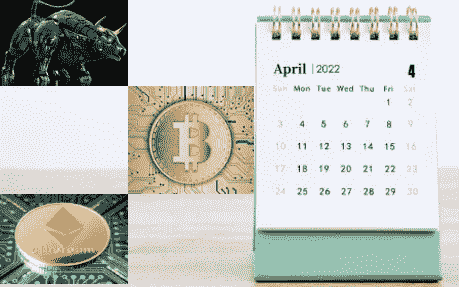
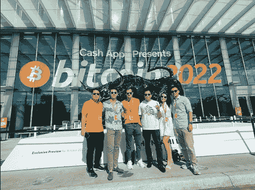

# 四月概览

> 原文：<https://medium.com/coinmonks/april-overview-6861a93698db?source=collection_archive---------11----------------------->

## 您对数字资产世界的每月简报

> *条乘* [条乘*条乘*条乘](https://www.linkedin.com/in/sixte-c-a72b47173/)

## **JKL 资本赞助比特币 2022**

## **监管机构**

*   *比特币现货 ETF 的新希望*

## **金融机构和区块链演员**

*   *潘迪拉新精选基金*
*   *以太坊合并已经被无数次推迟了*

# JKL 资本赞助比特币 2022

在迈阿密举行的比特币 2022 会议被期待已久，与会者的惊人数量证明了它的成功。每天有 25，000 人参加这次活动，主办这次会议的 JKL 团队也在其中。

在迈阿密，没有什么亮点比得上布克莱在比特币 2021 上宣布萨尔瓦多将让比特币成为法定货币。然而，一些发言者透露了值得注意的更新，这里有一些:

*   迈阿密市长弗朗西斯·苏亚雷斯在讲话中强调了推动收养 BTC 的意图，同时暗示他将在下次选举中作为总统候选人出现。
*   凯文·奥利里警告说，推动采矿业实现碳中和可能不那么容易，因为美国证券交易委员会可能不会允许购买碳抵消来实现这一目标。
*   Cash app 是此次活动的主要赞助商，并宣布在其平台上整合闪电网络。
*   Strike 首席执行官杰克·马勒斯(Jack Mallers)宣布与 Shopify 合作，为所有 Shopify 商家提供比特币闪电支付。他们将收到作为美元的比特币。Shopify 是一个在线商务平台，覆盖近 200 个国家。
*   格兰特·麦卡蒂宣布了金融自由的诞生，这是一个支持美国亲加密政治的政治行动委员会(PAC)。它将有效合法地促进亲加密法规，因为 PACs 是大多数政治家获得资金的途径。

采矿是会议的一个主要议题，绝大多数赞助商都是矿业公司。

> **“比特币 2022 迈阿密展展示了行业激动人心的一年的高潮。采矿凭借激动人心的浸入式冷却解决方案、引人注目的容器、采矿舞台和多个采矿休息室成为大会的焦点。”— Onno Ho，JKL Capital 副总裁兼矿业主管**

大约一半的会议展览设施专门用于采矿，该行业的最大行为者也出席了会议。采矿今年获得了很大的吸引力，并在会议上吸引了大量观众。对 Onno 来说，“在会议上与同行交流，并成为该行业专业化和工业化的一部分，令人振奋。”

最后，采矿对环境的影响是关注的焦点。事实上，实现碳中和是矿商最紧迫的问题，也是赢得有利舆论以放松监管的唯一途径。

# 监管者

## 比特币现货 ETF 的新希望

自从比特币获得主流采用并进入监管机构的监控范围以来，BTC 现货 ETF 的批准似乎总是指日可待。然而，迄今为止，没有任何现货 ETF 符合监管要求。WisdomTree、Ark 21 Shares 和 Fidelity 等公司申请遭到拒绝或延期，原因是监管机构对正确的投资者保护和适当的市场监督缺乏信心。成功申请 BTC 现货 ETF 的道路是一连串的希望和幻灭。

首先，2021 年 2 月，提名加里詹斯勒(Gary Gensler)为证交会新任主席，让人们对 BTC 现货 ETF 受到有利审查寄予厚望。市场参与者很快意识到，美国监管机构内部对 BTC 现货 ETF 仍存在强烈的疑虑和担忧。由于 BTC 期货的性质，即使是 2021 年 10 月 BTC 期货交易所交易基金批准后引发比特币价格达到新 ATH 的普遍乐观情绪也是短暂的。事实上，这一批准应该归功于这样一个事实，即 BTC 期货合约已经在受监管的芝加哥市场交易所(CME)进行交易，而不是监管机构对比特币产品态度的转变。这一事件之后，对现货 ETF 的希望很快就消失了。

6 个月后，4 月 20 日，Teucrium futures funds 获得了美国证券交易委员会的批准，可以继续推出其基于期货的 BTC ETF。那么，为什么这一事件值得一提，而其他 6 只基金在它们之前获得了 SEC 的授权呢？因为 Teucrium 没有根据 1940 年的传统投资公司法(所有其他 BTC 期货 ETF 都是根据该法批准的)提出申请，而是根据 1933 年的证券法(“33 法案”)和 1934 年的证券交易法(“34 法案”)提出申请。这种技术差异是主要的，因为所有基于比特币现货的 ETF 申请都是根据“33 法案”和“34 法案”提交的。这是否会是 BTC 现货 ETF 获批的又一个虚假步骤，只有时间才能证明。

当所有的目光都聚焦在美国监管者身上时，另外 8 个国家已经批准了现货 BTC ETF。最近，Cosmos Asset Management 在 4 月底上市了澳大利亚首只比特币现货 ETF。最终，大多数专家认为，BTC 现货 ETF 在美国获批只是“何时”的问题，而不是“是否”的问题。

**进一步阅读**

> 欧盟议会不顾行业批评通过了破坏隐私的密码规则([阅读更多](https://www.coindesk.com/policy/2022/03/31/eu-parliament-votes-on-privacy-busting-crypto-rules-industry-rails-against-proposals/)
> 
> 伊丽莎白·沃伦呼吁我们创造一个 CBDC ( [阅读更多](https://www.coindesk.com/policy/2022/04/01/elizabeth-warren-calls-for-us-to-create-a-cbdc/))
> 
> 政府制定计划使英国成为全球加密资产技术中心([阅读更多信息](https://www.gov.uk/government/news/government-sets-out-plan-to-make-uk-a-global-cryptoasset-technology-hub?utm_medium=email&_hsmi=209460956&utm_content=209460956&utm_source=hs_email))
> 
> 斯洛文尼亚公布对加密交易统一征税的计划([阅读更多](https://www.coindesk.com/policy/2022/04/07/slovenias-new-crypto-tax-is-simplest-around-government-says/?utm_source=hs_email&utm_medium=email)
> 
> 耶伦部长发现有限的证据表明俄罗斯逃避了加密制裁([阅读更多](https://decrypt.co/97117/yellen-havent-seen-significant-evasion-sanctions-using-crypto)
> 
> 印度税法导致印度最大的加密交易所 WazirX 的交易量暴跌 72%。该税征收所有交易利润的 30%,这些利润不能用另一笔交易的损失来抵消。([阅读更多](https://www.coindesk.com/business/2022/04/11/crypto-trading-volumes-in-india-collapse-10-days-after-new-taxes-crebaco/))
> 
> 美国政府警告朝鲜的加密攻击，此前该国遭到 6 . 25 亿美元的黑客攻击
> 
> 美国财政部外国资产控制办公室(OFAC)首次对一家加密公司实施了与乌俄战争相关的制裁

# 金融机构和区块链行动者

## 潘迪拉的新精选基金

该基金建立在投资三个成长期公司的前景之上。这种投资机会过去通常是通过风险基金 III 等传统基金提供的。潘迪拉正利用其目前的大交易流来扩大其 AUM。未来一年，该基金将增加 7 至 9 个其他增长阶段的项目。潘迪拉的目标是筹集 2 亿美元，主要用于资助已经产生回报的结算公司。新的基金战略与潘迪拉专注于早期风险投资的历史战略形成了鲜明对比。不过，潘迪拉精选基金可能会将一部分资金投入到由潘迪拉牵头的早期项目中。该基金的规模较小，这将使其资产管理公司倾向于更有针对性的投资，这可能会提高基金的分配效率。

这三项已确认的交易包括两家未具名的公司(出于保密原因)和 Amber，这是一个面向个人和机构的数字资产平台。两家未具名公司中的第一家是“印度最大、最安全的加密货币交易所之一”。它可能是 WazirX，因为它有自己的令牌和强大的 KYC 进程。第二家公司是“区块链第一大 NFT 域名提供商”。因此，它可能是不可阻挡的域名，因为它是最大和最受欢迎的 NFT 域名市场。两家公司的身份纯粹是基于网上调查的猜测。

## 以太坊合并已经被无数次推迟了

最近计划于 2022 年 6 月进行的合并已经至少推迟到秋季。两年多前，合并也被称为宁静号，最初应该在 2020 年 1 月发射。从那以后，它一直被推迟。从 PoW 切换到 PoS 意味着巨大的工作量，这可以解释重复的延迟。为了更好地理解这一过程的复杂性，让我们用扎克·苏厄德(Zack Seward)的播客“The Hash”中的一个类比:从一种共识机制转换到另一种共识机制就像在飞行中更换飞机引擎一样。

如果成功，合并将减少以太坊 99%的能源消耗，但是，它不会扩大网络规模。与 PoW 相比，PoS 区块链具有更灵活的特性，因此更易于实施升级以提高交易吞吐量。可扩展性没有提高也意味着汽油费没有降低。以太坊是大多数加密生态系统 dApps 的家园，这些 dApps 极大地依赖于交易成本来提高效率。由于合并不会直接影响可伸缩性，基于以太坊的项目将需要额外的升级。最重要的是，第二层将保持他们在以太网上的基本角色。

以太坊开发商可能会继续推迟合并，但值得注意的是，4 月初已经实现了一个重要的里程碑。事实上，以太坊的第一个 mainnet shadow fork 上线是为了“检查我们的假设是否适用于现有的测试网和/或 mainnet”，据以太坊基金会开发者 Parithosh Jayanthi 说。就像所有市场参与者都在等待基于现货的比特币交易所交易基金获得批准一样，以太坊合并是加密领域最期待的事件之一。不管成功与否，它都有扰乱市场的力量。

**进一步阅读**

> Twitter 接受了埃隆·马斯克每股 54.20 美元的收购要约([阅读更多](https://www.coindesk.com/business/2022/04/25/twitter-accepts-elon-musks-5420-a-share-buyout-offer/)
> 
> 宇宙资产管理公司(Cosmos Asset Management)将于下周上市澳洲首只比特币 ETF([阅读更多](https://www.theblockcrypto.com/linked/142632/asset-managers-set-to-launch-crypto-etfs-in-australia-next-week))
> 
> 新加坡最大的银行星展银行由于不友好的监管环境而放弃提供零售加密交换([阅读更多信息](https://cryptopotato.com/u-turn-singapores-largest-bank-wont-extend-crypto-services-to-retail-clients/))
> 
> DeFi Lender Inverse Finance 被剥削 1560 万美元([阅读更多](https://www.coindesk.com/tech/2022/04/02/defi-lender-inverse-finance-exploited-for-156-million/))
> 
> 币安估值 45 亿美元，跻身新投资者([阅读更多](https://decrypt.co/97012/binance-seed-round-4-5-billion))
> 
> 作为其加密采用工作的一部分，万事达卡已经申请了 15 个元宇宙和加密地标([阅读更多](https://www.theblockcrypto.com/post/141469/mastercard-files-for-more-than-a-dozen-metaverse-and-crypto-trademarks?utm_source=cryptopanic&utm_medium=rss))
> 
> 首只加密基金潘迪拉打包了一只 13 亿美元的区块链基金
> 
> UST 稳定币市值超过 BUSD，成为继泰斯的 USDT 和 Circle 的 USDC 之后的第三大稳定币
> 
> 摩根士丹利表示，加密可能会作为货币被更广泛地使用
> 
> 马拉松数字公司将蒙大拿州 BTC 煤矿移至追求碳中和([阅读更多](https://cointelegraph.com/news/marathon-digital-moves-montana-btc-mine-to-pursue-carbon-neutrality))
> 
> 闪电网络看到越来越多的采用([阅读更多](https://cointelegraph.com/news/cashapp-and-chivo-help-drive-lightning-payment-volume-up-400))
> 
> Strike 推出 Shopify 集成，为商家带来比特币照明支付([阅读更多](https://www.businesswire.com/news/home/20220407005830/en/Strike-Launches-Shopify-Integration-Bringing-Bitcoin-Lighting-Payments-to-Merchants?utm_source=hs_email&utm_medium=email))
> 
> Block Inc .和 Blockstream Corp .宣布合作在德克萨斯州使用特斯拉的太阳能电池开采比特币
> 
> Robinhood 通过收购英国加密公司 Ziglu ( [阅读更多](https://cointelegraph.com/news/robinhood-acquires-british-crypto-firm-ziglu-to-push-expansion-plans))获得其英国扩张计划
> 
> 币安。美国离开区块链协会创建自己的游说行动([阅读更多](https://www.coindesk.com/business/2022/04/20/binanceus-quits-blockchain-association-forms-in-house-lobbying-shop/))
> 
> Crypto.com 加快了游说行动
> 
> 上个季度，美国密码贸易协会的游说活动多年来首次下滑
> 
> 2021 年，美国、拉丁美洲和亚太地区的密码拥有量几乎翻了一番
> 
> 根据谷歌趋势数据，零售业对加密货币失去了兴趣

**免责声明**

本材料的内容未经任何监管机构审查。建议您对本材料的内容保持谨慎。虽然本材料中包含的信息是从据信可靠的来源汇编的，但 JKL 不代表或保证本材料中包含的信息的准确性、完整性或可靠性。如果您对本材料的任何内容有任何疑问，您应该获得独立的专业意见。JKL 或其任何关联公司，或其任何或其各自的董事、高级职员、员工和代表都不会对因使用或依赖本材料中包含的任何信息而导致的任何直接、间接或后果性损失承担任何责任或义务。本材料不构成认购或购买任何金融产品的要约或邀请。其目的不是提供任何信贷或其他评估的基础，也不应被视为购买任何金融产品的建议。

> 加入 Coinmonks [电报频道](https://t.me/coincodecap)和 [Youtube 频道](https://www.youtube.com/c/coinmonks/videos)了解加密交易和投资

# 另外，阅读

*   [加拿大最佳加密交易机器人](https://coincodecap.com/5-best-crypto-trading-bots-in-canada) | [Bybit vs 币安](https://coincodecap.com/bybit-binance-moonxbt)
*   [阿联酋 5 大最佳加密交易所](https://coincodecap.com/best-crypto-exchanges-in-uae) | [SimpleSwap 评论](https://coincodecap.com/simpleswap-review)
*   购买 Dogecoin 的 7 种最佳方式
*   [最佳期货交易信号](https://coincodecap.com/futures-trading-signals) | [流动性交易所评论](https://coincodecap.com/liquid-exchange-review)
*   [用于 Huobi 的加密交易信号](https://coincodecap.com/huobi-crypto-trading-signals) | [Swapzone 审查](/coinmonks/swapzone-review-crypto-exchange-data-aggregator-e0ad78e55ed7)