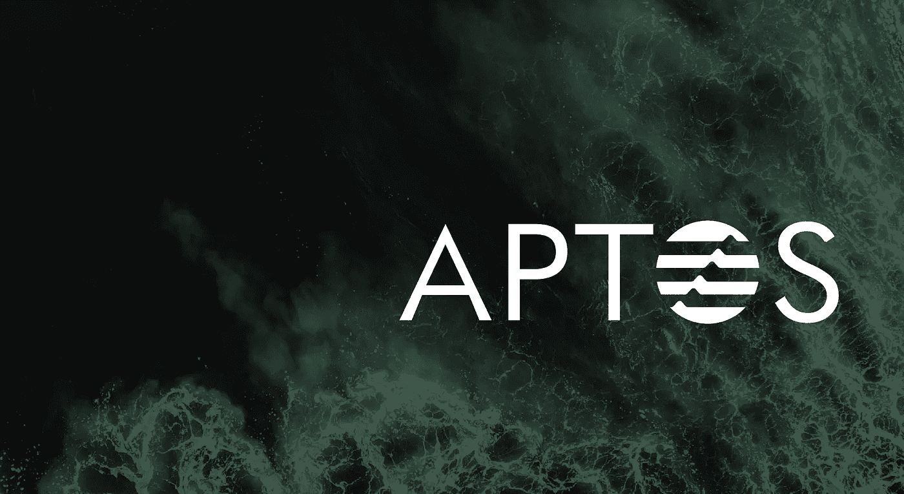

# Aptos 是一个值得关注的例外区块链

> 原文：<https://medium.com/coinmonks/aptos-is-an-exceptional-blockchain-that-is-worth-paying-attention-to-159254dc5339?source=collection_archive---------8----------------------->

# 最近，我们了解了新的区块链——Aptos。

在移动中，这些家伙报告了他们的明确计划。路线图示例(来自 discord 的信息):

> **2022 年 Q2** —推出一个带奖项的测试网络——一个更大、更像 mainnet 的测试平台，供战略合作伙伴和 web3 开发人员创建应用程序——与节点运营商社区合作，吸引和积累分散网络联合运营的经验——推出 bug bounty(发现 bug 的奖励),以改善开发人员的体验、节点的工作和解决基础设施问题。—为所有帮助确保网络安全的参与者提供奖励。
> **2022 年第三季度** —主网络发布
> **2022 年第四季度–2023 年 Q1** —在 Aptos 网络上部署下一个主要版本，具有以下重要特性

我想重点强调的要点是:
该团队从顶级基金( **a16z、Multicoin、3 arrows capital** )获得了 2 亿美元资金。筹集资金的主要目的是在 Move 编程语言中建立一个安全的开源 L1 区块链，在此基础上将吸引许多项目。总的来说，正在准备一个大的生态系统。

**同样在 3 月 28 日，it** [**公布了关于币安与 Aptos 紧密合作的**](https://www.binance.com/en/blog/ecosystem/binance-labs-makes-strategic-investment-in-aptos-labs-for-the-industry-adoption-acceleration-421499824684903620) **。**

币安实验室对 Aptos 进行了投资(金额未具体说明)，还宣布了联合产品的开发。更多信息将在未来几个月内发布。

值得注意的是，该项目不是从零开始的，它是一个前 Diem 区块链，一个 Meta(脸书)方项目，已在过去 3 年的建设中。然而，由于一些客观原因，决定分离并构建一个单独的产品。

Aptos 在加密和全球社区中有着巨大的联系，这从基金列表中可以看出——实际上没有低于二级的基金，大多数都是一级以上，只是加密行业的风险投资之神。

该团队由 25 名以上的专家组成，他们在各自的领域都有很高的专业水平。正如我之前所说，这是一个 Meta side 项目，即拥有最高经验的人，最重要的是——人脉。他们将能够毫无问题地推出一个强有力的促销计划。

最好的加密影响者已经在免费为他们做公关了。不敢想象宣布大使的时候会是怎样的一场屠杀(没有宣布，但我认为是不可避免的)。

截止日期呢:时间很紧。但是这个项目不是新的，技术是取自 Diem。现在有一个没有回报的 devnet。在 devnet 中，已经有币安、比特币基地、快速流等团队参与。

我认为，如果你是一个很酷的开发人员，那么他们不太可能忽视你的贡献，如果贡献很大的话。

Q2 2022 的激励性测试网也已经公布，在那里可以看到是否有严重的漏洞。然而，我认为，鉴于人员的水平，这种情况不会在这里发生。他们承诺一年内在 mainnet 上发布一个顶级区块链，这将给数百万用户一个开放的核心，每个人都可以在上面提交项目。

也就是说，Aptos 是一个新的生态系统，就像 Polkadot/Cosmos 一样。

大部分资金(tokenomics 尚未宣布)将用于生态系统的开发——也就是说，用于支持目前可以在 devnet 中找到的项目。你不一定要成为一个受欢迎的团队才能进入 Aptos。你已经可以开始编码了。

**Aptos 的主要优先事项是最终用户的安全性和完整性。**也就是说，该项目具有可用性——这样一来，一个人来了，就已经开始使用一些东西了(这不能说是同一个 Polkadot，那里很多副链都不是成品)。

**我们正面临一个独立的项目，希望为最终用户带来绝对的安全性和可扩展性。**目前，这是一个开发者的沙盒，但目标是如此雄心勃勃和直接，以至于我想相信它们。我真的希望小伙子们成功，我们将能够给他一个冷静和专业的公关，以吸引那些用户！

# 我的联系人:

*   [*电报*](https://t.me/molotcrypto)
*   [*GitHub*](https://github.com/Unlimitedmolot)
*   [*推特*](https://twitter.com/Unlimitedmolot)

# 如何在 Aptos 上追踪？

[*推特*](https://twitter.com/aptoslabs)

[*电报*](https://t.me/AptosLabs)

[*不和*](https://discord.gg/arBYeXhz8Q)

[*网站*](https://aptoslabs.com/)

[中等](https://medium.com/aptoslabs)

> *加入 Coinmonks* [*电报频道*](https://t.me/coincodecap) *和* [*Youtube 频道*](https://www.youtube.com/c/coinmonks/videos) *了解加密交易和投资*
> 
> 另外，阅读

*   [Bookmap 评论](https://coincodecap.com/bookmap-review-2021-best-trading-software) | [美国 5 大最佳加密交易所](https://coincodecap.com/crypto-exchange-usa)
*   最佳加密[硬件钱包](/coinmonks/hardware-wallets-dfa1211730c6) | [Bitbns 评论](/coinmonks/bitbns-review-38256a07e161)
*   [新加坡十大最佳加密交易所](https://coincodecap.com/crypto-exchange-in-singapore) | [购买 AXS](https://coincodecap.com/buy-axs-token)
*   [红狗赌场评论](https://coincodecap.com/red-dog-casino-review) | [Swyftx 评论](https://coincodecap.com/swyftx-review) | [CoinGate 评论](https://coincodecap.com/coingate-review)
*   [投资印度的最佳密码](https://coincodecap.com/best-crypto-to-invest-in-india-in-2021)|[WazirX P2P](https://coincodecap.com/wazirx-p2p)|[Hi Dollar Review](https://coincodecap.com/hi-dollar-review)