# Aquanow 数字潜水:多元化是 DeFi 的超级力量——第 13 卷

> 原文：<https://medium.com/coinmonks/aquanow-digital-dives-diversification-is-defis-superpower-vol-13-1818501b47ec?source=collection_archive---------12----------------------->

对于媒体公司来说，这是一个牛市。虽然最近的收益报告让股票观察家感到利润不足，但仍有大量新闻成为头条新闻。除了社会政治和名人故事之外，对经济衰退的恐惧让人们的眼睛紧紧盯着屏幕，因此广播收视率呈上升趋势。[正如我们最近讨论的那样](https://www.aquanow.io/resource-posts/aquanow-digital-dives-could-a-recession-be-good-for-web3-eyes-vol-11)经济放缓与消费者心理有关，这种心理是最糟糕的:

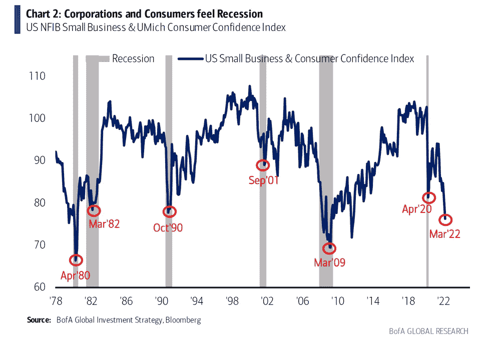

你也不能责怪人们情绪低落。加油站的价格正在挤压预算，食品价格正在上涨，因为杂货店很难保持货架上的存货，乌克兰战争引发了对生存的担忧。似乎就在几个月前，当我们从全球疫情出现并亲自重新参与时，一切都是乐高电影。 ***发生了什么事？事后看来，我们可以推断，已经紧张的供应链无法满足被压抑的需求。更糟糕的是，由于雇主在招聘栏上贴满了职位空缺，现金充裕的劳动力部分重估了工作与生活的平衡。经济体有一种调节这种过度行为的方式，不幸的是，这个工具就是衰退。***

然而，正如 2021 年的繁荣时期是暂时的一样，随着悲观情绪达到顶点和经济复苏萌芽的出现，衰退也会逆转。虽然周期往往会在情绪极端时转向，但我们大多数人通常不会在极化状态下行走。心理学家说，乐观反映了一种信念，即事件或经历的结果通常是积极的，或者痛苦的原因只是暂时的。由于厌恶损失，人类的状况被消极所诱惑(有充分的理由),我们的进步被一种倾向于半满玻璃杯的心态所驱动。[让摩根·豪斯来说吧](https://www.collaborativefund.com/blog/save-like-a-pessimist-invest-like-an-optimist/):

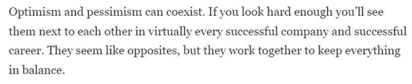

在上面的注释中，合作基金的常驻语言大师继续解释说，坏事一直在发生，并且随着一系列不太可能但灾难性的事件的发生，我们应该准备好经常经历困难。经济低迷很糟糕，对不利因素的打击相对更大。然而，它们是商业周期的必要组成部分。 ***因为市场不会在每种情况下都崩溃为零，经济收益会随着时间的推移而复利，并累积到社会经济阶梯的各个层面*** :

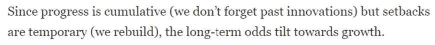

**现代投资组合理论(MPT)是基于类似的原则。通过组合具有不同风险和回报特征的资产，可以组合各种篮子来形成有效边界——在给定风险水平下实现回报最大化的这些分组的理论集合。与现实世界的任何模型一样，MPT 的基本假设过于简化，但总的结论是，如果我们用投资组合的波动性来代表其风险，那么多样化可以帮助投资者增加回报，而不会暴露于更大的风险。 ***这个论点的基础是，资产之间的相关性越低，将产生越多的多样化收益，并产生更有吸引力的组合。*****

**霍华德·马科维茨(Howard Markowitz)的《投资组合选择》(Portfolio Selection)论文改变了金融，并在该领域掀起了一场量化革命。今天，许多受这一理论启发的人被世界上最大的公开交易对冲基金——曼氏集团聘为定量分析师。他们的每周信件值得一读，其中一期最近讨论了技术发展、金融工具创新和风险管理的进步如何开启了一种创造位于有效边界之外的投资组合的方法。两位作者以 60/40 投资组合为基础构建了他们的案例，近年来，由于利率为再投资提供了更低的收益率，该投资组合受到了仔细审查。**

**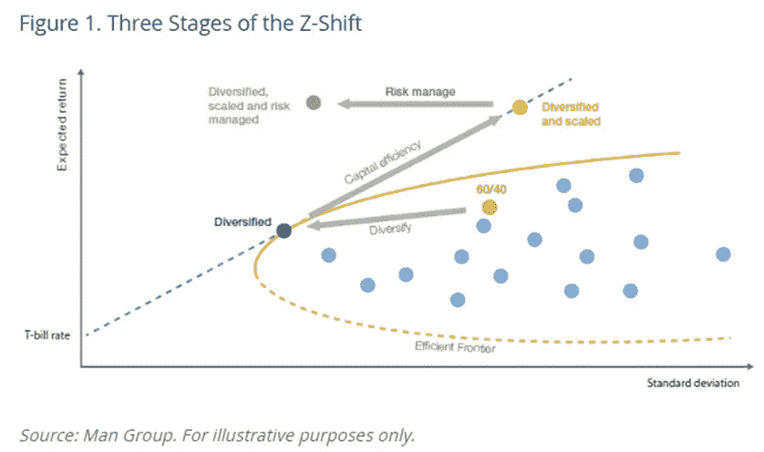**

**Z 型转变的第一步是通过纳入传统股票和债券之外的资产，使传统投资组合进一步多样化。然后，使用提供杠杆作用的现金高效工具，经理可以增加风险敞口，并使用量化方法管理这些新风险，如:**

*****波动目标*** :寻求一个恒定的风险水平，而不是名义上的敞口**

*****势头叠加***:*不要打熊市】**让好时光骑行*”)**

*****债券/股票相关性触发*** :当债券价格下跌时，不要冒险，因为这可能会排除股票疲软**

## *****哥们儿，你笑死我了。我以为这是数字资产笔记……*****

**抱歉，这是一些必要的基础工作，但是让我们继续…在上面的第一步中，我们将把 crypto 包括在我们的资产中。[有很多回溯研究检验了投资组合在配置比特币或以太坊](https://www.google.com/search?q=benefits+of+including+bitcoin+in+portfolio+study)时的表现，但代币的爆炸式增长和有限的时间序列确实影响了结论。此外，BTC 最近的交易更像是科技股，这在一定程度上削弱了其分散投资的作用:**

**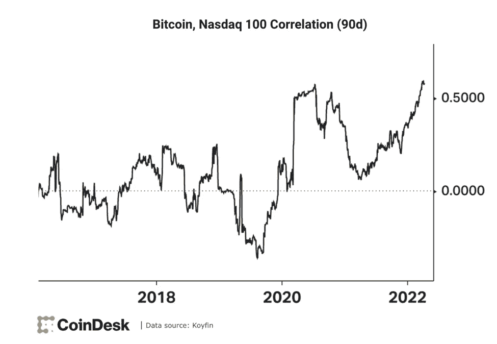**

**[*来源*](https://www.coindesk.com/markets/2022/04/11/market-wrap-bitcoin-sell-off-deepens-as-correlation-with-stocks-rise/)**

**至关重要的是，资产之间的 ***相关性不是恒定的*** ，因此在构建模型投资组合时，预测这种关系非常重要。我不确定是否有人已经解决了这个问题，所以我们不会在尝试上花费太多精力。[太平洋投资管理公司在本文中展示了他们的方法。出于我们的目的并使用自由数据，我们将考虑三种不同的关联机制:](https://www.pimco.fi/handlers/displaydocument.ashx?fn=PIMCO_Quantitative_Research_Stock_Bond_Correlation_Oct2013.pdf&id=zdVcShqiEMNUg7uf5lz9gz%2FfdtpZAxKCLsuDGmVqEEL9K6VxjAwuETyKmVNZSF6m%2BcwmMMY724kVAjVehk1ya6fz3ELNCiDJbrNwMbtWtozAkjCDLNE6JnGRN4SvPkXrkfMXXWZ%2FG9JbK0YT7CTnR%2FcjuIae6UxSAOryZ9paMv43z9Pw8Gj%2BLuiecPrLww1GSf9Bg8QJS6U2TKYW3hVWzNnBiL8bJqdyQdpq1Iq9DaHVgZrBy9mDO9%2BdvQPj92C%2Bl0MhLO5N5cPnVMJS%2Bb0wu6v9BG3xxstLvA97HCuTXcABp7JfFBOYW7d9P3Z%2BWJ%2BNmEKPHJ6a8ri4nTG1ukQhicswFHs683rZDuzVByjO%2FMaHb%2BQ6ykbSDrbQcvmuGIpnjaqg87DnYvSwLpsNdprDf5f5Edg0JrkQlSZsRHjJwbBWhIvzCWkMtiXkt0ee%2FepNTtfdQM7EmxDAHmG3N1%2BWQYVshgKM4Sf5j06DZwI7jx6%2BsxgL5TjvduX2Bxnp4L2z3j05y02WsTgN9GTBoElbZA%3D%3D#:~:text=Investment%20implications,its%20sensitivity%20to%20macroeconomic%20factors.)**

**正+增加**

**正+递减**

**负+递减**

**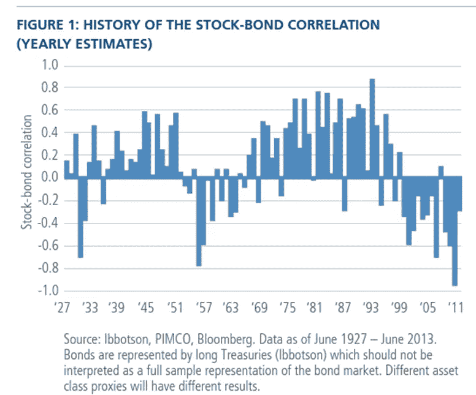**

**这里是方法论:**

**对于股票和债券数据，我使用了[投资组合可视化工具](https://www.portfoliovisualizer.com/historical-asset-class-returns)。由于一些限制(*哦，我多么怀念我的彭博终端*)，传统的资产代理是来自 ***美国大盘股*** 和 ***10 年期美国国债*** 的回报。投资组合的权重为 60/40。**

**鉴于它们的历史较短，且缺乏指数，我不得不偷工减料来定义贷款回报，但这种方法仍然有效。V2 的贷款市场从 2020 年初开始运作，并且在总价值锁定(TVL)方面保持领先，所以我用他们的 ***USDC*** 利率作为集中稳定的货币融资成本的代理。**

**将 75%和 25%的权重分配给各自的产量。由于与算法 peg 相关的风险较高，对后者的重视程度较低**

**随着一般加密市场的繁荣，Aave 上的利率已经下降，因此我使用 Dune 提取了自 2022 年初以来的历史链上利率，以获得平均值(3.3%)和年化标准差(7.4%)**

**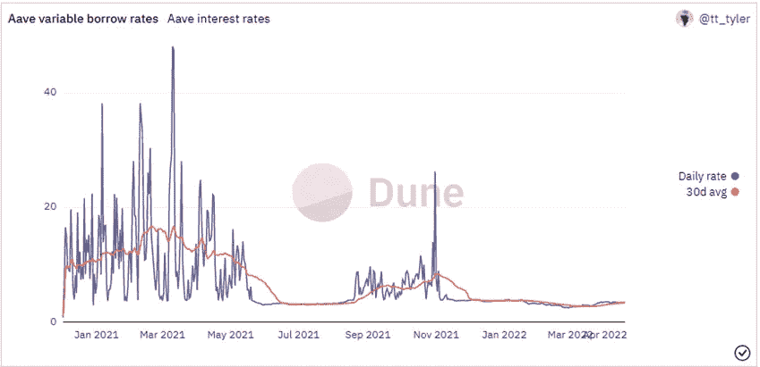**

**Anchor 一直提供超过 20%的利率，但[最近宣布](https://www.coindesk.com/markets/2022/03/25/anchor-protocol-will-readjust-interest-rates-each-month-anc-falls-by-5/)打算将利率调整为每月 1.5%。保持这一分析的温和基调，我假设平均值为 10%，标准差为 5.2%**

**[UST 息](https://www.techdreams.org/crypto-currency/anchor-finance-historical-interest-rates/10309-20210814):**

**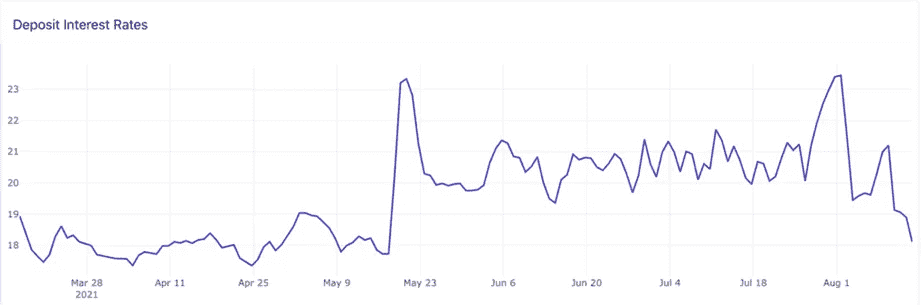**

**为了增加回报的可变性，我使用 Excel 的随机数生成器来计算概率，假设上述参数为正态分布(即使利率的离差远非正态)。绝对值用于施加非负利率的约束。**

*****上述波动性假设在学术法庭*** 、 ***站不住脚，但它们确实考虑到了一些可变性，如果有什么不同的话，那就是过于保守，因为它涉及到回报*** 。更大的波动性将导致收益率更高的时期，(正如我们在数字资产牛市中看到的那样)，因此该分析旨在代表一个更成熟的贷款环境**

**我评估了三种不同的“*投资组合*”:具有 DeFi 收益率的标准 60/40、60/40，以及后者的杠杆化版本，其中传统的资产配置增加到符合 60/40 的标准差**

**在现有信息的限制范围内，对上述每种股票/债券相关制度进行了回顾性分析。**

*****还跟我？为技术细节道歉，但更诚实的做法是把它拿出来让任何人批评。在这一点上，如果你对这种方法有什么意见，请告诉我——除非是与数据相关的——我的手被束缚在那里了。*****

**下面你会看到过去 15 年投资于三个篮子的假设回报，其特征是股票和固定收益之间的负相关性，直到最近它变得更高:**

**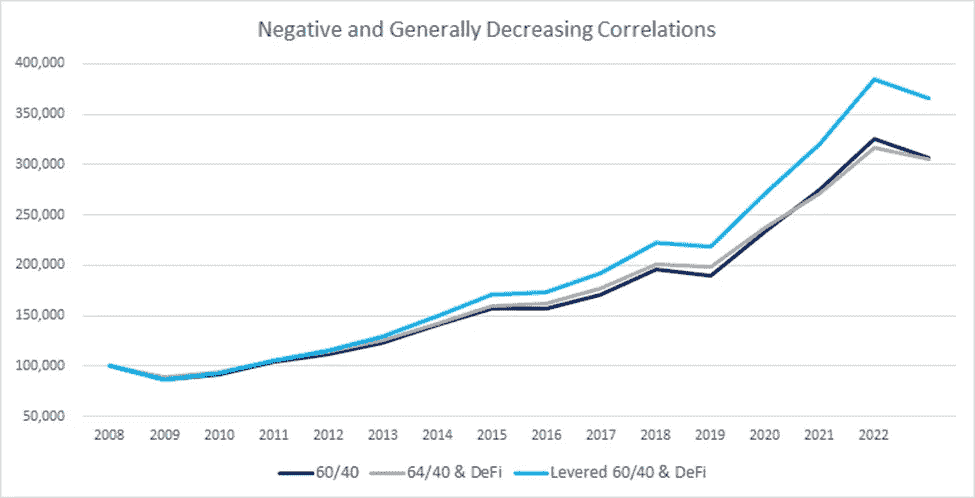**

*****有 DeFi 的 60/40 投资组合的标准差低于单独的标准投资组合*** ，所以为了显示风险瞄准的效果，我提高了传统的资产配置，直到两者匹配。现在，这假设你可以完美匹配，没有交易成本，没有税收等等，但主要的一点是，通过数字资产的多样化，我们可以获得超额回报。**

**以下是另外两种情况的结果:**

**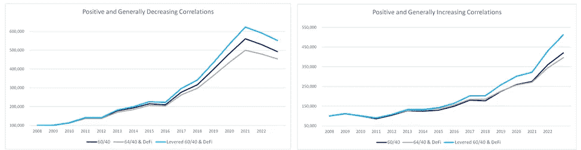**

**有更多的因素在起作用，我们无法在这里讨论，这并不意味着什么学术。我确实认为挖掘一些细节很重要，但最酷的是，即使没有对动量策略或相关性触发因素的影响进行建模，我们也可以看到将数字资产收益率纳入传统投资组合的多样化好处。你看到的趋势被夸大了，因为我没有进行再平衡交易，所以开始时为 60/40 的交易最终可能会达到 80/20。如前所述， ***有很重的简化假设*** 比如没有交易成本或者税收。然而，我确信在这个领域会有更严格的工作完成，并期待看到结果。就像 Meltem Demirors 喜欢说、*我们有技术*——我只是没有机会接触到它。**

**说了这么多，几乎可以肯定的是，方向的改进将是准确的。毕竟，波动率匹配可以增强投资组合，即使不相关的资产每年都在下跌。纯粹为了说明，这里有一个上面使用的 60/40 投资组合与每年下跌 0.25%的资产配对的示例:**

**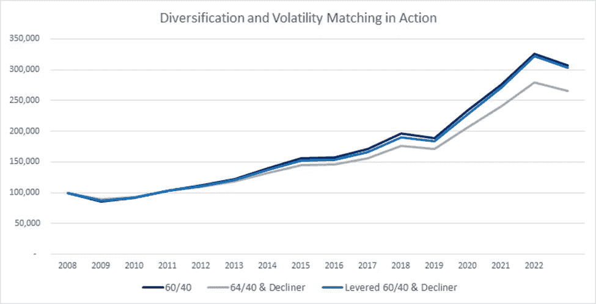**

**一个我们尚未测试的股票/固定收益相关性场景正在实时上演。市场正从股票和债券呈现持续负相关的状态，转向这种关系发生逆转的状态。债券基金正经历有史以来最糟糕的季度之一，并出现资金外流。到目前为止，股票基金仍然看到新的资金流入，但花旗集团的马特·金等分析师认为，这种情况很快就会逆转(这是曼集团的关联触发因素)。整个情景可能会给 60/40 的投资者带来重大挑战，但在他们的持股中增加一些 DeFi 收益率将提供一个稳定的多元化出路。**

**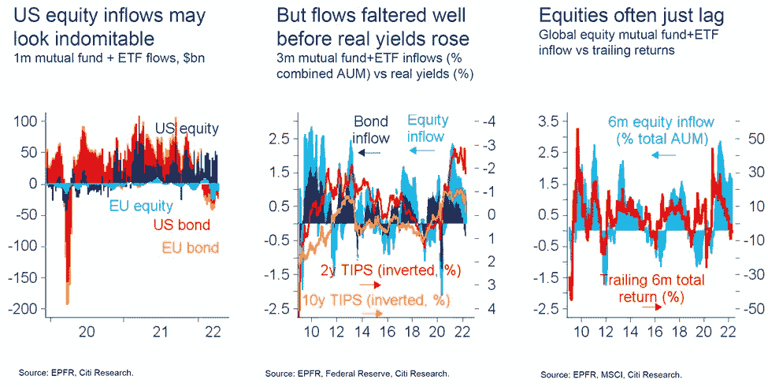**

*****市场是动态的，所以今天成立的关系不一定明天就成立。*** 目前，分散金融中的贷款供应和需求受到传统市场中不常见的细微差别的影响，这提供了一些特殊的风险和多样化。如果你关注 Crypto Twitter 或其他相关媒体，你会经常看到关于“*机构如何到来*”的模因，以及上面概述的好处是原因的一部分。**

****

**[*来源*](https://imgflip.com/i/6ddz2d)**

**相信经济放缓是暂时的需要乐观的观点，悲观主义者不太可能投资新技术。然而， ***正如我们的风险厌恶有助于我们避免危险，并能导致复杂风险管理工具的发展，它是更具建设性的平衡力量，推动人类前进，推动经济低迷后的重建。*** 数字资产是这个复合引擎的一部分。**

**在 Aquanow，我们帮助机构释放这些市场的潜力，因此，如果您或您认识的任何人正在考虑这项功能，那么[请联系](https://cvpp204.na1.hubspotlinks.com/Ctc/I6+113/cVpP204/VVN7_Z4jrXGwVKQMtg4YHKG8W6WXg814HT_W1N9k7M9h3lSbtV1-WJV7CgTpmN36QPfRj5KsmN6CHSDdWKQ9TW7QcmcK8clyhpW7M7Q6K6hxsslW6K4v1b2KmgvdW1NPJt88k6HgRW7STLwD5VWCcQW710jmg31GB17W1HbfZN534mjhW5MYNT88DnXZ6W8_T_S94X-fpJVhbQrX98t3gzW450w7Q8bzkQcW53xRlF8rtqZMN7Q-XYd4-RJhW983BVM2nmX-4VW2PDP7Vl3V0W69ZB7060gf7qVvzYpz4wpYgPVCGzrf4-_qfv3jNN1)。我们很高兴利用我们的专业知识来帮助您超越。**

**你想为网络 3 运动做贡献吗？我们正在寻找好奇和积极的人加入我们的团队。欢迎直接联系我们，或者[点击此处](https://cvpp204.na1.hubspotlinks.com/Ctc/I6+113/cVpP204/VVN7_Z4jrXGwVKQMtg4YHKG8W6WXg814HT_W1N9k7M9V3lSc3V1-WJV7CgZZ7W6Ffrbc82BhhGVdQmYB4bz5fFW1zpG5Z4ZkngGF4rMs_YPrN_W1-xDHG896bYjW5KQD-46yYbQqN2b-t3Z5G1Y1W5JW7X64jtfDXW45clzt26TkntW40BjYq3lsG4NW3XBPjG6-5KrgVlpS-_7M4_3xV2lrnC8kZGZDW1f3chK5j0tJbVM_DRR6k3r6HW1TQgxm5xKSbyW57CGbg4Lmm0yW5HVM3R14Ps0CW7q5ZH39g-8XZMFjsSp6dWTKW2FkdQr859gXPW1wQ8YY14q7yBW11s2G35x-NZfW95z2Vx1qXQFp36zw1)查看当前的职位空缺。**

> ***加入 Coinmonks* [*电报频道*](https://t.me/coincodecap) *和* [*Youtube 频道*](https://www.youtube.com/c/coinmonks/videos) *了解加密交易和投资***

# **另外，阅读**

*   **[3 商业评论](/coinmonks/3commas-review-an-excellent-crypto-trading-bot-2020-1313a58bec92) | [Pionex 评论](https://coincodecap.com/pionex-review-exchange-with-crypto-trading-bot) | [Coinrule 评论](/coinmonks/coinrule-review-2021-a-beginner-friendly-crypto-trading-bot-daf0504848ba)**
*   **[莱杰 vs n rave](/coinmonks/ledger-vs-ngrave-zero-7e40f0c1d694)|[莱杰 nano s vs x](/coinmonks/ledger-nano-s-vs-x-battery-hardware-price-storage-59a6663fe3b0) | [币安评论](/coinmonks/binance-review-ee10d3bf3b6e)**
*   **[Bybit Exchange 审查](/coinmonks/bybit-exchange-review-dbd570019b71) | [Bityard 审查](https://coincodecap.com/bityard-reivew) | [Jet-Bot 审查](https://coincodecap.com/jet-bot-review)**
*   **[3 commas vs crypto hopper](/coinmonks/3commas-vs-pionex-vs-cryptohopper-best-crypto-bot-6a98d2baa203)|[赚取加密利息](/coinmonks/earn-crypto-interest-b10b810fdda3)**
*   **最好的比特币[硬件钱包](/coinmonks/hardware-wallets-dfa1211730c6) | [BitBox02 回顾](/coinmonks/bitbox02-review-your-swiss-bitcoin-hardware-wallet-c36c88fff29)**