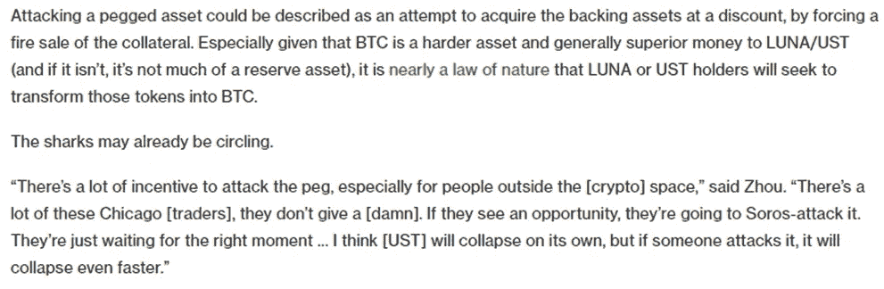
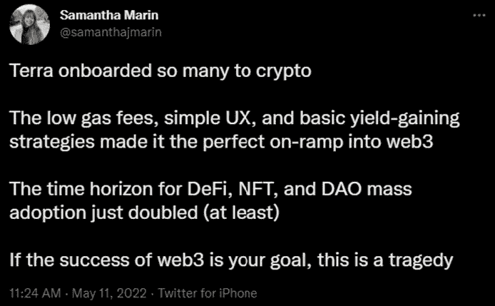
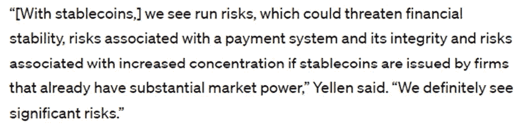
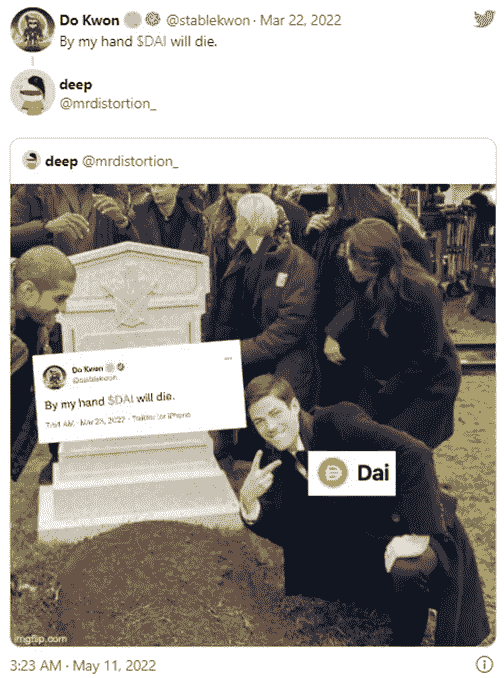
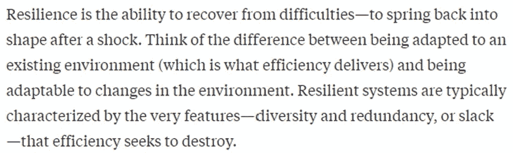
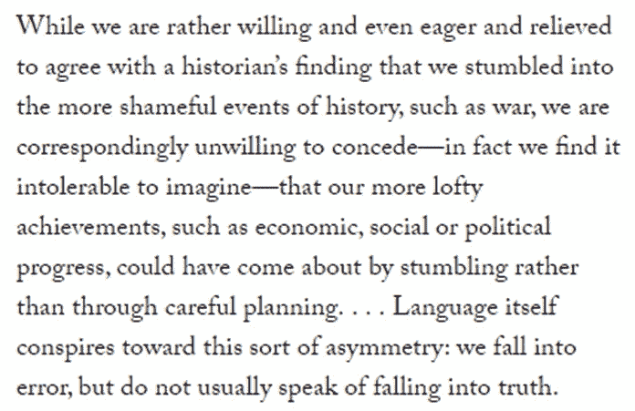
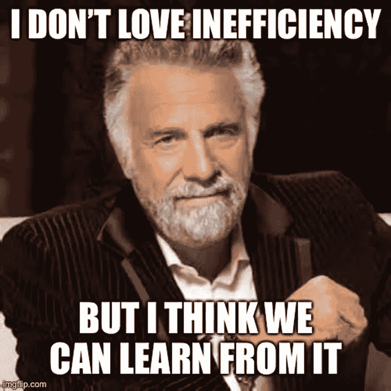

# Aquanow Digital Dives:你的午餐吃了多少？🍽️——第 16 卷

> 原文：<https://medium.com/coinmonks/aquanow-digital-dives-how-much-was-your-lunch-%EF%B8%8F-vol-16-dbea1c094ad4?source=collection_archive---------42----------------------->

对于风险资产来说，这是糟糕的一周。股市下跌，信贷息差扩大，CBOE 隐含波动率指数(VIX)每天都在上升。在经济活动减弱的同时，收紧货币政策以对抗高通胀的前景是热情消退的一个很好的开始。然而，本周还发生了一件系统性事件，对数字资产市场造成了相当大的损害。Terra 的 UST 算法稳定币的崩溃被比作 2008 年雷曼兄弟的倒闭，这不是一个完美的类比，但该项目的失败将在生态系统中留下深刻的印记。

与催化大金融危机(GFC)的崩溃类似，UST 崩溃是金融创新与傲慢和风险管理不足相结合、推动全系统去杠杆化的一个例子。一些显著的区别是，雷曼兄弟是一家有着 150 多年历史的机构，其运营受到政府监管，其监管机构介入提供流动性和其他支持，以控制其破产的蔓延。Terraform Labs 于 2018 年注册成立，其运营不受央行控制或刺激。它的模型依赖于套利者、算法和独立投资者。同样值得注意的是，加密市场不像银行系统那样混乱不堪，因此尽管这可能很难想象，但交易对手对 UST 崩溃的担忧没有 08/09 年时那么严重。

用迈克尔·巴特尼克(Michael Batnick)和本·卡尔森(Ben Carlson)、*的话说，不是吹牛*，但数字潜水的读者不会急于了解本周发生的事情，因为相关主题在我们的最后两篇笔记中讨论过。在[第 14 卷](/coinmonks/aquanow-digital-dives-stable-is-as-stable-does-vol-14-824fb17a7d3)中，我们研究了稳定硬币的前景，并认为算法稳定硬币的快速增长给更广泛的生态系统带来了系统性风险，因为存在银行挤兑的可能性。[第 15 卷](https://blogchain.app/p/life-on-mars-will-require-new-tools-too/fK1s235pyL)介绍了 ***Aquanow DeFi 融资指数(ADFI)*** ，这是一个由真实世界的贷款利率组成的基准，资产支持的稳定债券，在完善的贷款协议中。 ***特别选择了 ADFI 的基础资产/池，因为它们代表了分散金融中风险/回报的基线水平*** 。在其他地方冒险肯定会带来超额回报，但也会让投资者面临额外的风险。上周，我们看了一个例子，它分解了一个假设回报的来源，包括与涉及更多投机性资产(如 UST)的资产池相关的额外收益。不要误解我，讨论不是关于我声称知道某些事件即将展开。我会一直说，这些笔记不是关于预测，而是试图理解。话虽如此，CoinDesk 的大卫·莫里斯在 4 月 22 日发表《注定失败》一文时，还是抓住了这一点。

有许多类似的警告，受欢迎的媒体机构 [Bankless 甚至主持了一场关于 Tera/Luna 生态系统利弊的辩论](https://www.youtube.com/watch?v=6eOU5OaKd8s)。 ***风险被广泛知晓和沟通。*** 次级抵押贷款债券的投资者声称，信息不对称和误导性的信用评级给他们提供了虚假的信心，并导致他们在整个事件发生时遭受重大损失。然而， ***那些在 UST 崩盘中遭受损失的人，如果进行哪怕是粗略的研究，就会明白其中的巨大风险。Anchor 协议在 Terra stablecoin 上提供了 20%的收益率，而 ADFI 的收益率约为 2.8%。就像保罗·马龙臭名昭著的午餐一样，1700 个基点的利差不是免费的。***

[*来源*](https://www.bragmedallion.com/blog/authors-there-is-no-such-thing-as-a-free-lunch/)

任何声称能在 3.5 年内让你的钱翻倍的投资都值得仔细审查，但这并不一定意味着应该完全避免。我在 Luna 上做了一笔小投资，从百分比来看，它是我表现最好的交易之一，但今天它实际上一文不值。关键是，虽然亏损令人痛苦(尤其糟糕，因为我去年在类似的[钢铁/泰坦崩溃](https://www.bloomberg.com/news/newsletters/2021-06-17/money-stuff-titanium-got-crushed)中拿了一个 L)，但我知道这种风险存在，事实上，我推测音乐将继续播放足够长的时间，以便可以收获更多的上升空间。 ***一个重要的风险管理工具是头寸规模*** 。以 20%的复利借出 UST 是有吸引力的，但是回报必须与理解令牌容易失去其固定价值相权衡。在这种情况下，它的反向货币(在这种情况下，Luna)会产生级联效应，导致死亡螺旋。一些投资者可以承担全部损失的潜在风险，但没有人应该像使用储蓄账户一样使用锚。事后诸葛亮也没用——风险是事先知道的。

## 从这次失败中可以收集到一些积极和消极的东西。

我最担心的是，数字资产行业已经开始更积极地与立法者接触，这似乎是这些东西有巨大潜力的想法背后的动力。UST 最近刚刚进入稳定硬币的前三名，市值接近 200 亿美元。就其本身而言，Luna 的资本总额高达 410 亿美元，进入一周时约为 200 亿美元(今天可能价值几百万美元)。一些政客无视这里确实不存在秘密交易的事实，他们会指出数十亿美元的储蓄损失，同时要求严厉的监管甚至彻底的禁止。对我来说，监管者在某种程度上促成了这一结果。 我知道通过监管需要时间，但如果有更明确的披露规则，并且没有一些机构可能会来没收他们的资产的风险，像 USDC 甚至 USDT 这样的资产可能会进一步激增或被重复。你可能会说，UST 的部分承诺是其更大程度的权力下放，但 Do Kwon(联合创始人)似乎肯定是那里的主导人物，所以我不确定情况是否如此。 ***不管怎样，更糟糕的是媒体根本就没有帮助主流采纳论文*** 。

[*来源*](https://twitter.com/samanthajmarin/status/1524455438351314947?s=11&t=jfujyw1R_xrzka7_xw0sjA)

另一方面，[珍妮特·耶伦本周早些时候表示](https://blockworks.co/secretary-yellen-stablecoins-pose-significant-risk-to-financial-stability/)财政部将很快准备好一份关于稳定债券的报告，并在年底前起草立法。她已经证明了自己是一个实用主义者，所以有理由相信她会建议增加监督，而不是不守规矩的监督。我的理解是，许多现任机构仍在观望，因为他们希望更清楚地了解美国(和其他国家)将如何监管数字资产。它们也不完美，但在遵守严格的 KYC 和信托规则的同时，拥有教育客户经验的企业的出现，应该有助于降低再次发生类似事件的可能性。除了繁重的立法，这里的行动可以帮助抵消 Terra 失败的坏形象。

然而，受到系统性风险影响的不仅仅是加密资产。[国际货币基金组织解释说](https://www.imf.org/-/media/Files/Publications/WP/2018/wp18206.ashx)在 1970-2017 年之间， ***发生了 151 次银行危机，75 次主权债务灾难和 236 次货币崩溃*** 。在第一种情况下，这是每年需要重大政策干预的金融压力超过三次的平均比率。通常，对于像货币体系这样重要的事情，我们不会允许如此高的负面结果发生率。进一步来说， ***银行体系存在了几个世纪，怎么还会有这么多的灾难？***

在本期播客中，我第一次接触到了 [Bernard Lietnaer](https://en.wikipedia.org/wiki/Bernard_Lietaer) 的工作，在这篇播客中，可能是有史以来第一个 DeFi 协议的创始人(Bancor 的 Mark Richardson)在为什么我们认为当前的经济体系——这恰好是我们偶然发现的第一个体系之一——是最佳解决方案的背景下提到了他。我们能改进它吗？Lietnaer 先生是一个有趣的经济学家，因为他的经验更多的是实践而不是理论。他有许多有趣的想法，关于当地或专门的货币如何与他们的中央银行同行一起提供有效的激励机制，并使经济更加强劲。他的一个核心原则是，在任何生态系统中，单一栽培虽然有效，但注定会失败。给定环境的超优化可能表面上看起来很好，但它使群体容易受到变化的影响。

这种想法也有一个稳定的角度。戴是最古老的与美元挂钩的分散货币。它不是在银行账户中持有美元，也不是通过“铸造-燃烧”机制在算法上维持其钉住汇率，而是主要持有数字资产作为抵押品，并以贷款的形式发行稳定的代币([也有算法的成分](https://www.youtube.com/watch?v=wW1IEZeWY4k&t=1090s))。大约一年前，MakerDAO(经营这家企业)也开始接受其金库中的真实资产。由于戴被过度抵押，其模式有时被批评为资本效率低下，但这是一件坏事吗？在最近的溃败中，戴一直保持稳定，自从他公开表示要破坏这个项目以来，这增加了这位泰拉余孽的痛苦。似乎 Maker 的人笑到了最后:

[*来源*](https://twitter.com/mrdistortion_/status/1524334361289629696)

对效率的追求导致了非凡的创新，所以这是人类追求的逻辑动机。然而，就像分权一样，如果走得太远，就会导致系统不稳定。一些被高度优化的东西容易受到变化的环境的影响。这是 Bernard Lietnaer 对货币体系的关键观点，而[这篇来自《哈佛商业评论》的文章](https://hbr.org/2019/01/the-high-price-of-efficiency)在商业背景下强调了这一观点。当经济形势好的时候，资产负债表上的现金是低效的，但是在经济衰退的时候，这可能是一件好事。我们也在实时观察这出戏。由于亚洲工厂被 COVID 锁定而导致的供应链紧张是 ***的一个明显例子当系统为了效率而构建时，它们牺牲了弹性*** :

阿尔伯特·赫希曼是一位经济学家，他可能会取代杜斯·艾奎斯成为世界上最有趣的人。 赫希曼出生于柏林，三十五六岁时*他在巴黎、伦敦和意大利完成了一个强大的学术团体，在西班牙与法西斯战斗，在二战中加入法国军队(后来帮助抵抗运动)，在战争中期移居美国，在伯克利获得奖学金，在北非战略服务办公室工作过一段时间，结婚并有了两个孩子，在美联储董事会任职并参与马歇尔计划。你可能认为所有这些都需要关注效率。然而，艾伯特的工作是围绕着这样一个想法，即 ***障碍和失败是进步*** 的重要驱动力——他称这个想法为[藏手原理](https://en.wikipedia.org/wiki/Hiding_hand_principle):*

**

*[*来源*](https://www.newyorker.com/magazine/2013/06/24/the-gift-of-doubt)*

*月神/UST 的失败仍在上演，其影响将在未来许多年内被感受到。事实上，它看起来像是监管的催化剂，这是希望涉足该领域的机构期待已久的，但它本身也带来了风险。web3 的游说工作变得更加困难。 ***然而，回顾过去，财富蒸发、信任丧失、声誉扫地，本周数字资产领域出现了一些非常酷的发展。*** [S & P Global 为 Compound Treasury 提供了该生态系统的第一个信用评级](https://thedefiant.io/compound-rating-sp/)(虽然只有 B-，但仍是朝着更广泛采用迈出的一大步) [Maker 与 ConsolFreight 和 MasterCard](https://forum.makerdao.com/t/consolfreight-update-may-2022-consolfreight-helps-mastercard-to-test-defi/15081) 签署了一项协议，为从布里斯班到香港的澳大利亚牛肉运输提供融资 [FTX 美国公司宣布了一项试点计划](https://decrypt.co/99943/ftx-us-opens-chicago-hq-will-sponsor-supplemental-income-pilot)，为芝加哥不太富裕的社区居民提供补充收入、银行服务和 Visa 借记卡。今天系统性崩溃留下的创伤将会告诉幸存者群体，帮助他们建立更有弹性的东西。*

**

> *加入 Coinmonks [电报频道](https://t.me/coincodecap)和 [Youtube 频道](https://www.youtube.com/c/coinmonks/videos)了解加密交易和投资*

# *另外，阅读*

*   *[OKEx vs KuCoin](https://coincodecap.com/okex-kucoin) | [摄氏替代品](https://coincodecap.com/celsius-alternatives) | [如何购买 VeChain](https://coincodecap.com/buy-vechain)*
*   *[币安期货交易](https://coincodecap.com/binance-futures-trading)|[3 commas vs Mudrex vs eToro](https://coincodecap.com/mudrex-3commas-etoro)*
*   *[如何购买 Monero](https://coincodecap.com/buy-monero) | [IDEX 评论](https://coincodecap.com/idex-review) | [BitKan 交易机器人](https://coincodecap.com/bitkan-trading-bot)*
*   *[CoinDCX 评论](/coinmonks/coindcx-review-8444db3621a2) | [加密保证金交易交易所](https://coincodecap.com/crypto-margin-trading-exchanges)*
*   *[红狗赌场评论](https://coincodecap.com/red-dog-casino-review) | [Swyftx 评论](https://coincodecap.com/swyftx-review) | [CoinGate 评论](https://coincodecap.com/coingate-review)*