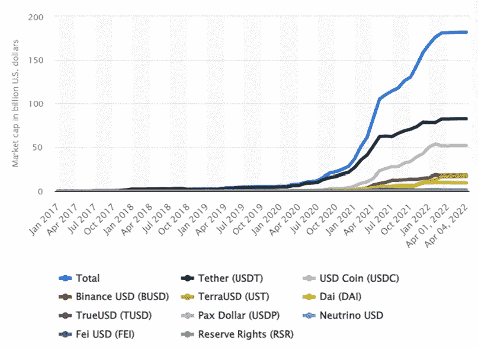
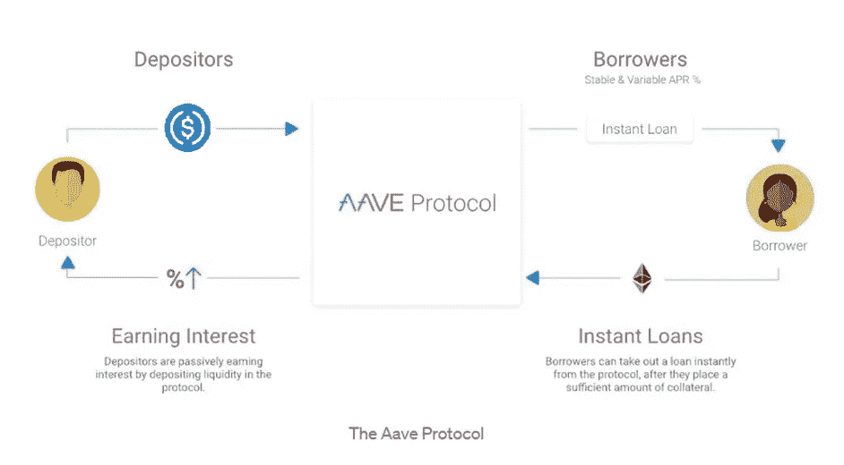
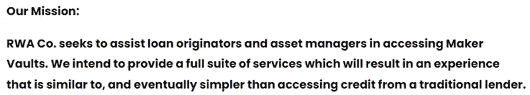
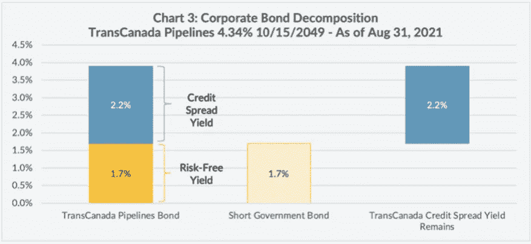
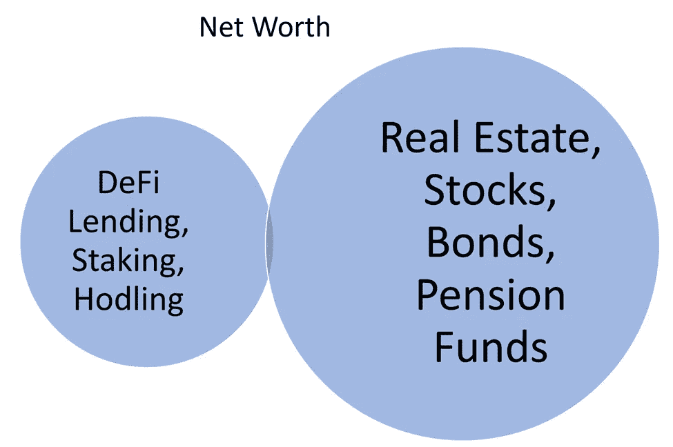
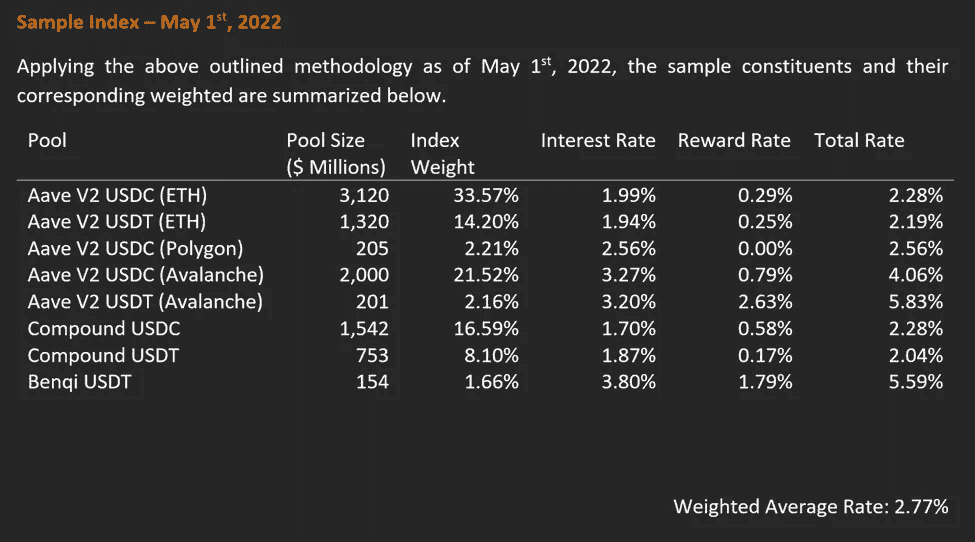
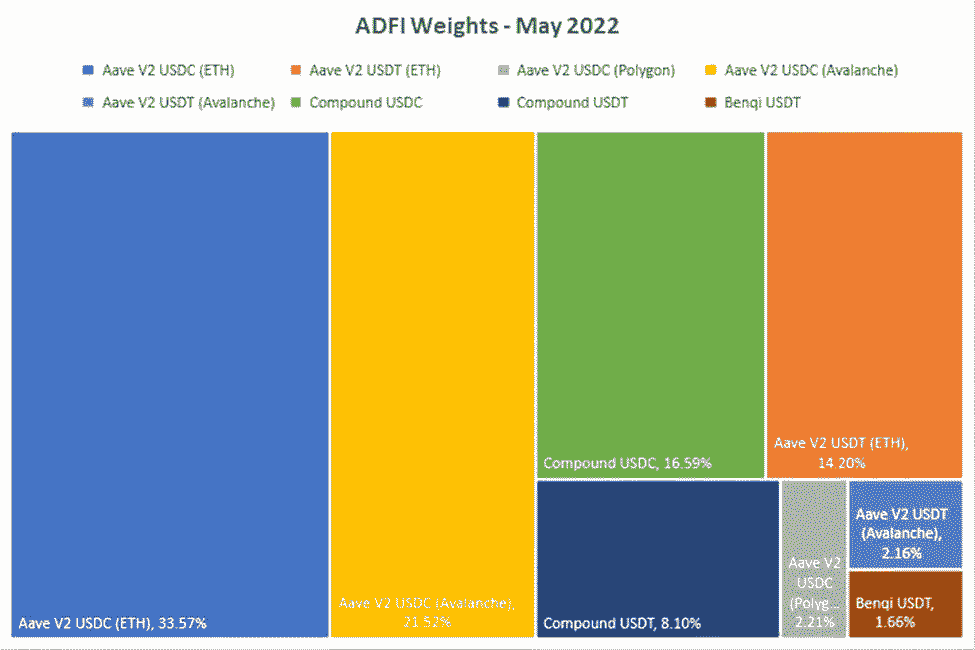
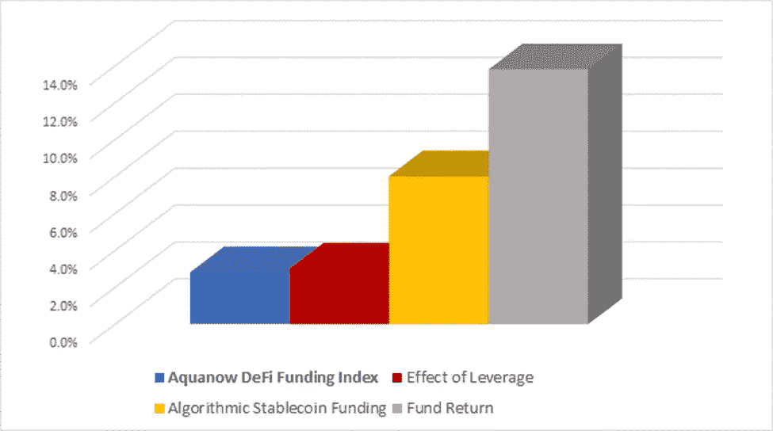

# Aquanow 数字潜水:火星上的生活也需要新的工具，🛠️，第 15 卷

> 原文：<https://medium.com/coinmonks/aquanow-digital-dives-life-on-mars-will-require-new-tools-too-%EF%B8%8F-8df7d89d26be?source=collection_archive---------68----------------------->

不管是不是长在树上，被倒进下水道，还是铲除一切邪恶，钱都是我们生活中不可或缺的一部分。更正式地说，货币是用来作为交换媒介、价值储存手段和记账单位的。几千年前，我们的祖先用贝壳或鲸鱼的牙齿来达到这些目的，只要有钱，就有信用。苏美尔被认为是第一个城市文明，大约 89%的人口生活在城市。5000 多年前，贷款被用于农业目的。甚至当强大的天主教会禁止高利贷时，[像美第奇家族](https://bigthink.com/culture-religion/how-the-medici-family-created-and-lost-their-banking-empire)这样大胆的银行家使用创造性的外汇余额会计来扩大信贷。

[*来源*](https://www.visualcapitalist.com/history-consumer-credit-one-infographic/)

上周，我们讨论了稳定的信贷在某种程度上是分散融资的基础。通过提供区块链的易于转移、不变性和去中心化，这些坚固的资产可以像支撑全球经济的央行发行的法令一样保值。自早期 DeFi 应用开发以来，这些特性的结合导致了增长和创新的爆发:

[*来源*](https://www.statista.com/statistics/1255835/stablecoin-market-capitalization/#:~:text=The%20market%20cap%20of%20stablecoins,around%2030%20billion%20U.S.%20dollars.)

根据人类早期的经验，数字货币的兴起与货币市场的发展不谋而合，以匹配借款人和贷款人。像 [Aave](https://aave.com/) 和 [Compound](https://compound.finance/) 这样的协议已经以一种消除贷款申请的任意影响的方式对信贷进行了编码。如果你有足够的抵押品，那么你就可以从资产池中提取余额。随着过度借贷导致资金失衡，利率将会上升或下降，以刺激资本流动。

***为什么会有人办理 DeFi 贷款？***

比方说，一个交易者已经积累了大量的资产，想买一栋房子，但是最近的市场疲软让他们犹豫。如今，10 万美元的首付款就要花费他们 27 ETH，而几个月前，首付款仅为 17 ETH 左右，相差 60%。就像一家帮助客户管理不匹配的现金流需求的银行一样，这名交易员可以将 33 ETH 作为抵押品，并从 Aave 的 USDC 资金池中提取 10 万 USDC 作为预付款。然后，他/她可以使用受监管的渠道增加资金，并满足预付款。贷款人将收到代表其索赔的 aTokens 余额，该余额将按现行利率持续增加。借款人将负责维持贷款/ETH 82.5%的贷款价值比，随着时间的推移，前者应计利息。只要抵押品价值低于最低阈值，贷款人就有权以 5%的折扣购买该证券。不过，数字资产市场发展迅速，那么某种闪电崩盘又如何呢？不同的协议以独特的方式管理这一点，但在 Aave 上，治理令牌的持有人可以将他们的硬币投入稳定机制，以赚取回报(目前为 6.5% p.a ),同时冒着损失的风险，在资金短缺的情况下补偿贷款人。

2009 年初，随着雷曼兄弟(Lehman Brothers)的倒闭和其他几起闭门银行纾困，全球经济陷入崩溃。在这次演讲中，欧巴马总统要求国会共同努力，制定大规模刺激计划，他宣称:“(T2)你看，信贷流动是我们经济的命脉”虽然对今天的数字市场做出同样的断言有些夸张，但这里有储户和债务人。他们互动的场所越来越多的是在线和 IRL。 [Aave 的 ARC](https://www.fireblocks.com/blog/permissioned-defi-goes-live-with-aave-arc-fireblocks/) 计划是一个许可的流动性池，为机构提供进入分散市场的机会，同时遵守严格的风险管理和 KYC/反洗钱要求。复合国库为机构提供现金管理解决方案，比传统账户提供更高的收益。美元余额被转换为 USDC，并作为借款人的流动资金以复利形式持有。另一个例子来自于 [6s Capital](https://6s.capital/about/) 和 [RWA Co](https://www.rwa.company/about) 。他与特斯拉达成了一笔价值 780 万美元的房地产融资交易，使 MakerDAO 储备库多元化。

[*来源*](https://www.rwa.company/blog/introducing-the-real-world-asset-company)

DeFi summer 成立不到两年，随后的创新热潮一直受到机构雄心的推动。需要说明的是，与传统的银行系统相比，主要分散式金融协议锁定的总价值[2030 亿美元](https://defillama.com/)相形见绌，但正如我们在 web2、 ***软件中看到的那样，在网络效应*** 的推动下，软件可以迅速扩展。随着大型实体继续在这些前沿市场进行试验，将需要新的工具。这包括技术基础设施(Aquanow 的面包和黄油)和分析工具，以帮助为资本分配决策提供信息。虽然新生的数字市场天生就沉浸在代码和工程中，但许多金融家已经被一种想法所吸引，即将无节制的创新应用到他们长期以来遵循的经济模式中。当遇到新的市场时，依靠在其他地方证明方便的工具是很自然的。

在传统的金融市场中，基准提供了一种对资产类别的风险和回报的标准衡量，并与类似的证券进行比较。 ***无风险收益率(RFR)是投资管理的基础标准*** ，其中[CFA 协会备注](https://www.cfainstitute.org/-/media/documents/protected/refresher-reading/2021/pdf/return-concepts.pdf)*通常指保证(或接近保证)支付的投资回报率。*“从业者通常选择发达国家政府债券的到期收益率，在该国，发行人以本国货币借款，其期限与定价的固定收益证券或贴现的现金流期限相匹配。 ***对于境内机构而言，这代表其资本的机会成本，并作为与其他资产进行比较的基础层*** 。让我们考虑一个简单的例子:

[*来源*](https://www.lysanderfunds.com/alternative-fixed-income-a-strategic-complement-to-fixed-income-or-equity-allocations/)

在上图中，我们可以解释 TransCanada Pipeline 债券(后来更名为 TC Energy)额外 2.2%的回报，作为对单纯持有类似期限主权债务所不承担的风险的补偿。这种"*信用利差*"可以用违约的可能性来解释(政府以本国货币借款可以"*印钱*"来清偿债务)，较低的流动性(国债市场是世界上流动性最强的市场之一)和其他发行人特定的考虑因素(例如影响需求的 ESG 相关因素)。虽然有一些标准化，但主观性在这种传播评估中确实起着重要的作用。技能上的差异至少可以为回归提供暂时的优势。

在 DeFi 中有可能进行这样的分析吗？

简短的回答是，“T0”不是真正的“T1”，但是最近有一些关于这个话题的有趣的笔记。[穆迪的量化分析师 Lily Francus 分三期深入研究了加密市场中无风险利率的概念](https://nopeitslily.substack.com/p/risk-frees-and-currencies-part-1?s=r)(第四期即将推出)。我个人很喜欢她的作品，但是技术性比较强，所以不适合所有观众。虽然 Lily 关于基差交易和赌注收益率的观点非常有趣，但它们很难在更传统的背景下概念化，并且具有重大的实施挑战。[如果莉莉的四本书不够看的话，这份 Finoa 报告](https://www.finoa.io/staking-thought-leadership.pdf)提供了另一个很好的概述。作者有一种更容易阅读的风格，并做出了重要的区分: ***在传统市场中，利率与贷款*** 相关，而使用赌注收益率和基准利率更侧重于隔离违约风险(除了在交易所层面)。

比特币基地发表了一篇博客文章，对 RFR 的未来进行了展望。他们的方法以复合协议中稳定的货币贷款利率为例。这更符合债务工具的概念，但如果没有可信的中央支持，违约的可能性依然存在。 因此，我们不能断言这些利率是无风险的。话虽如此，超额抵押、稳健的经营历史和其他象征性的支持措施大大降低了违约或违约损失的可能性。 ***我认为另一个重要的特点是对稳定的强调*** 。比特币基地量化分析师关注 USDT 和 USDC 的可靠挂钩，因为这两个国家合起来占稳定债券总市场的 70%以上。尽管一些“隐姓埋名者”将他们的储蓄以 BTC 或瑞士联邦理工学院的形式命名，但大多数人仍倾向于以一种法定货币来合计他们的净资产。这两个系统正以越来越快的速度重叠，但是每个方案的特质都需要不同的方法。

在 Aquanow，我们开发工具来帮助传统金融公司与数字资产进行交互，并且我们正在推出一些相关的基准。其中第一个是 ***Aquanow DeFi 筹资指数(ADFI)和比率(ADFR)。*** 我们的方法也使用借贷市场，但我们构建了一个指数，它使用了多个协议的加权平均利率。通过这样做，我们相信这更准确地反映了当今分散市场中资本(或融资)的机会成本。该指数根据选定的权重衡量投入数字池的资本业绩，可作为衡量积极投资经理业绩的基准。[您可以在我们的网站](https://www.aquanow.io/resource-posts/aquanow-is-pleased-to-announce-the-launch-of-its-defi-funding-rate-index)上阅读白皮书，但这里是 TL/DR:

***该指数和利率是流动性池价值加权组合，旨在衡量主要分散贷款协议的绩效和状态。***

***我们框架的本质在于*** ***风险和收益有着千丝万缕的联系*** 。随着时间的推移，如果一项投资持续优于其基准，那么可能存在该标准未涵盖的风险敞口。超大的上涨空间固然很好，但投资者最好了解这些收益的来源。 作为密码市场的参与者，我经常听说有人能够以最小的风险产生两位数的*稳定收益*然而，我们可以看到，最大、最具流动性的资金池今天的回报率只有 3%左右，因此，为了实现更高的回报率，经理将承担更大的风险。有可能他们使用的是算法稳定的贷款，其贷款池提供更高的利率，但其基础资产有更大的机会脱钩。或者，该基金可以利用杠杆。这里有一个*纯粹假设性的例子*说明 ADFI 如何被用作属性分析的一部分，其中一个基金在给定时期的总回报可以像前面的债券例子一样被分解。ADFI 是回报的基石之一，通过一些技巧或其他基准，可以提取其他风险或收益来源。

从上图中可以看出，有了正确的工具， ***投资者更适合获得正确的信息*** 。虽然从对话或资产配置的角度评估 DeFi 与传统市场的回报和利率可能很有趣，但这些是苹果与橙子的比较，因此专门构建的分析是必要的。 ***因为资本流动和利率是由分散金融特有的力量驱动的，所以我们也需要新的衡量标准和方法来评估绩效和风险。***

正如我们的货币是从贝壳和贵金属演变而来，信贷市场也从威尼斯的长椅转变成了成文的协议。随着去中心化的金融体系与现有体系相融合，我们应该期待持续的变革和创新。明智的做法是利用从过去的经验中获得的知识，但最终工作流中的任务变化太大，需要新的工具。Aquanow DeFi 融资指数(ADFI)将是在彭博终端发布的首个此类指数。官方声明将很快发布——敬请关注更多细节。

在 Aquanow，我们帮助机构释放数字资产的潜力，因此，如果您或您认识的任何人正在考虑这项功能，那么[请联系](https://www.aquanow.io/)。我们很高兴利用我们的专业知识来帮助您超越。

你想为网络 3 运动做贡献吗？我们正在寻找好奇和积极的人加入我们的团队。请直接联系我们，或者[点击这里查看当前的职位空缺](https://www.aquanow.io/careers-culture)。

> 加入 Coinmonks [电报频道](https://t.me/coincodecap)和 [Youtube 频道](https://www.youtube.com/c/coinmonks/videos)了解加密交易和投资

# 另外，阅读

*   [折叠 App 审核](https://coincodecap.com/fold-app-review) | [Kucoin 交易机器人](/coinmonks/kucoin-trading-bot-automate-your-trades-8cf0ca2138e0) | [Probit 审核](https://coincodecap.com/probit-review)
*   [如何匿名购买比特币](https://coincodecap.com/buy-bitcoin-anonymously) | [比特币现金钱包](https://coincodecap.com/bitcoin-cash-wallets)
*   [币安 vs FTX](https://coincodecap.com/binance-vs-ftx) | [最佳(SOL)索拉纳钱包](https://coincodecap.com/solana-wallets)
*   [比诺莫评论](https://coincodecap.com/binomo-review) | [斯多葛派 vs 3Commas vs TradeSanta](https://coincodecap.com/stoic-vs-3commas-vs-tradesanta)
*   [Capital.com 评论](https://coincodecap.com/capital-com-review) | [香港的加密借贷平台](https://coincodecap.com/crypto-lending-hong-kong)