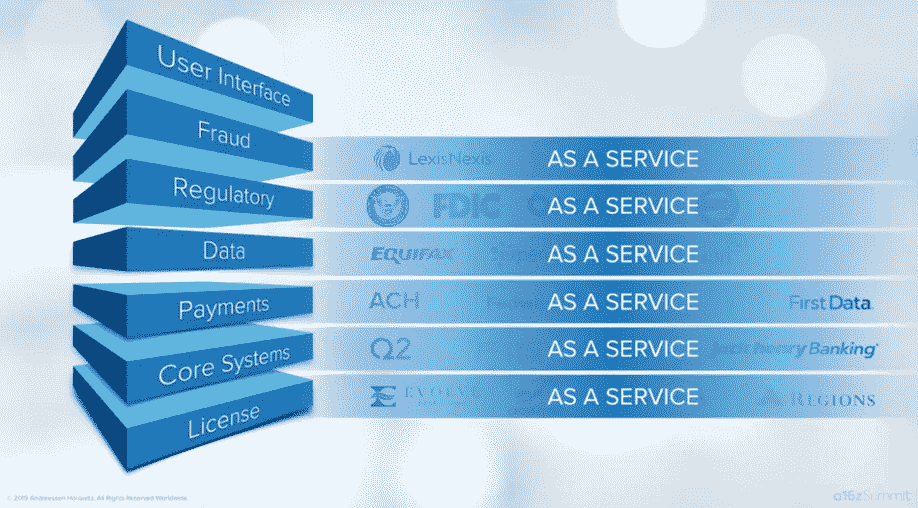
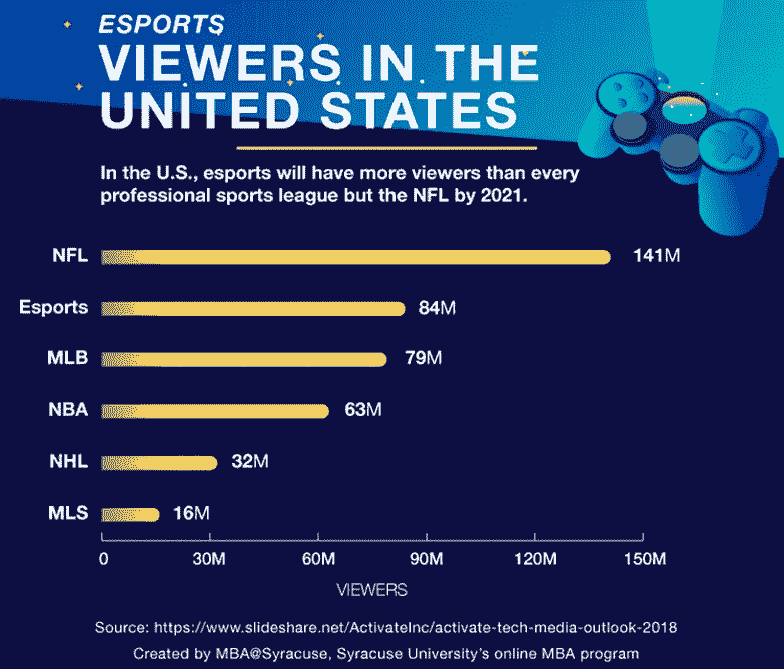
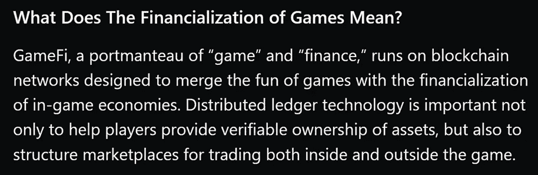
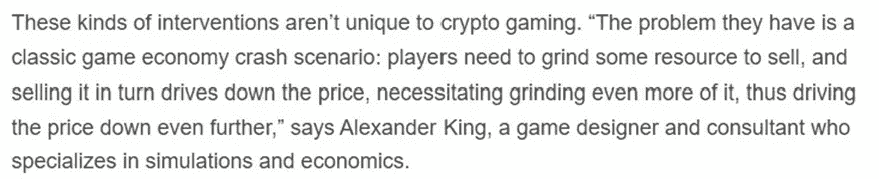
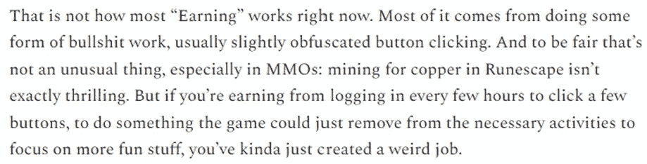
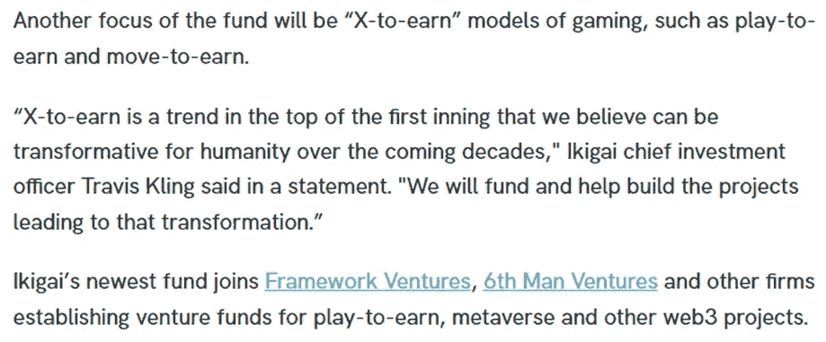
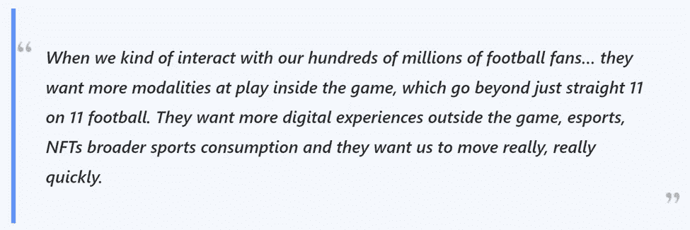

# Aquanow 数字潜水:停止用我的…钱包玩游戏💸—第 19 卷

> 原文：<https://medium.com/coinmonks/aquanow-digital-dives-quit-playing-games-with-my-wallet-vol-19-3d43ef80f50b?source=collection_archive---------31----------------------->

早在 2013 年， [Chris Dixon 写了一篇博文](https://cdixon.org/2013/03/02/what-the-smartest-people-do-on-the-weekend-is-what-everyone-else-will-do-during-the-week-in-ten-years)，这篇博文和 Andreessen Horowitz partners 的许多其他文章一样，被广泛引用。他宣称:

如果你回想一下， ***很多突破性的技术都是从爱好*** 开始的。比尔·盖茨和保罗·艾伦在课外时间学习编程，虽然大部分都是传说乔布斯和沃兹尼亚克在车库里制造了麦金塔电脑，但谷歌确实是从一个车库里诞生的。其他爱好也能赚钱。例如，[写博客现在是一种职业](https://substack.com/going-paid)，[YouTube 赚了几百万](https://www.shopify.ca/blog/198134793-how-to-make-money-on-youtube)等等。

我不确定他们在水里放了什么([或者威士忌](https://spiritsjournal.klwines.com/klwinescom-spirits-blog/2015/1/26/d2d-interview-marc-andreessen.html))，但是[这个 a16z 的作品](https://a16z.com/2020/01/21/every-company-will-be-a-fintech-company/)也被证明越来越有先见之明。安吉拉·斯特兰奇阐述了她关于为什么 ***每家公司都将很快成为金融科技公司的观点:***

上面的演示解释了金融服务堆栈的不同层如何被 *SaaS 化，*这将实现一种有趣的垂直整合，因为非银行机构希望提供资金管理解决方案。对于大多数 30 岁以上的人来说，在银行体系之外获得金融产品似乎很奇怪，但对于从记事起就能接触到互联网的一代人来说，这种界限一直很模糊。

很难否认 Z 世代对社会的早期影响，也没有理由看到它很快减弱， 。在前几代人的转变中，媒体渠道仍然掌握在老一代人手中，这意味着流行的说法是年轻人的信仰/行为是[奇怪和不好的东西](https://www.bbc.com/worklife/article/20171003-proof-that-people-have-always-complained-about-young-adults)。这种模式可以追溯到几千年前，甚至亚里士多德也说过，公元前 4 世纪的年轻人“思想高尚，因为他们还没有被生活压服，也没有经历过环境的力量。然而，大多数 20 多岁的年轻人在社交媒体上关注时事，他们也是主要的播报者。此外，越来越多地使用数字平台做广告的营销人员需要接受那些在线时间最长的人的价值观。 ***这似乎正在改变说服的力量，社会变革是丰富的*** 。

***不分年龄，数字技术正在蚕食日常生活*** 。随着计算能力和网络速度的提高，视频游戏行业在人口统计学上出现了巨大的繁荣。iPhone 是在最老的一代人大约 10 岁时推出的，千禧一代的平均年龄是 20 多岁，所以大多数人在成长过程中口袋里都有一台联网的电脑，这为他们习惯于在屏幕上娱乐提供了一个出口。 ***最近，我们已经看到这些趋势通过游戏化渗透到新的用例中，游戏化利用我们的社交和竞争天性，围绕原本可能平淡无奇的任务创造有趣的激励。事实上，游戏已经变得如此重要，以至于精英玩家已经成为名人。***

如果我们把上面的主题拼凑在一起，那么我们就可以开始理解另一个新兴趋势——***GameFi***。要真正深入这个话题，我推荐共价的 80 页电子书，它使用数据优先的方法来探索这个空间的细微差别和潜力。更粗略地说，梅萨里的研究人员很好地总结了这个主题:

这些新的娱乐形式位于金融基础设施和娱乐社区之间，听起来很酷。问题是，在实践中，这些形式的“付钱给你的娱乐”仍然受制于当前充斥着网络 3 的摩擦。 ***体验往往是不连续的，图形界面不是很好，投机/贪婪腐蚀了开发者试图迭代实用模型*** 的善意意图。不幸的是，创造经济是复杂的。

当《疫情》热播时，全世界都看到了 GameFi 的潜力和陷阱。2018 年，一家名为 [Sky Mavis](https://skymavis.com/) 的越南公司推出了一款名为 [Axie Infinity](https://axieinfinity.com/) 的当时默默无闻的游戏，这款游戏经常被描述为 Pokémon Go 和 NFTs 的混合体。为了获得访问权，玩家需要在以太坊区块链购买轴。这些化身将与他人战斗，并参与各种冒险，以光滑爱情药水(SLP)的形式赢得胜利，这是一种象征，其效用来自于在 Axie 环境中作为交换媒介或创造新的数字生物进行战斗。Axie 有另一个相关的硬币，AXS，代表游戏的治理，可以概念化为股权。 ***对这个故事来说重要的是，这一切都可以在移动设备上完成，代币可以换成其他容易转换成现金的数字资产。***

从 2010 年到 2019 年，菲律宾经济是亚洲增长最快的经济体之一，但由于他们的市场严重倾斜于旅游业和相关服务，疫情的封锁尤为严重。一些孩子在 COVID 危机中一直在玩 Axie，所以当 ETH 在 3 月抛售后飙升时，他们注意到他们持有的 Axie 也变得更有价值了。突然，一个曾经被父母嗤之以鼻的爱好，在其他家庭成员不能上班的时候，也能把饭端上桌了。消息传出后，随着 AXS、SLP 和 Axie NFT 的价格都跳得更高，动量列车冲出了车站。

***超常的增长暴露了这种模式的弱点*** 。首先，新进入者很快就被定价挤出了市场。这是通过公会模式解决的，该模式允许所有者出租他们的 NFT，并从玩家的收入中收取一定比例的费用。接下来，随着玩家数量的增加，新轴的铸造速度加快。虽然让那些没有资本的人买入游戏是公平的，但这也意味着轴(和 SLP)的供应呈指数增长，最终的抛售引发了所有相关资产的价格暴跌。一般来说，供应非常紧张的时期之后是库存过剩，这也适用于 Sky Mavis 的游戏化市场。

[*来源*](https://www.theverge.com/2022/4/8/23015468/axie-infinity-blockchain-nft-play-to-earn-game-economics-hack)

***先玩后赚模式已经让位给先玩后赚*** 。在这里，参与者仍然能够兑现他们在游戏中积累的一些价值，无论是通过竞争中的技能还是通过设计一些其他人付费使用的新功能。但是这种方法意味着重新关注与程序交互的意图——它意味着有趣。

[*来源*](https://crypto.nateliason.com/p/fix-crypto-gaming?s=r)

你可能会倾向于采取许多数字资产批评者的相同立场，并得出结论，因为这些早期的缺点，整个 GameFi 概念注定要失败。我倾向于更加乐观(并且明显偏向于该领域的成功)，因此我的印象是，充满激情的开发人员生态系统、开源代码和持续投资的结合有可能推动创新并发现确实有效的模式。[上个月，我们看到该领域出现了一些重大融资](https://cryptoslate.com/2022-gamefi-project-financing-analysis/),尽管市场动荡，但风险投资同比增长 99%。这增加了游戏将在 web3 如何接触大众方面发挥关键作用这一观点的可信度。

## ***有人要搞清楚这一点。***

在本期播客中，Ikigai 资产管理公司的 Travis Kling 解释了为什么他觉得投资这一领域具有社会责任感。他们刚刚筹集了 3000 万美元的基金“*，旨在投资与元宇宙、区块链博彩、不可替代代币(NFT)、分散自治组织(Dao)和其他 web3 计划*相关的初创公司或项目迄今为止，Ikigai 对数字资产市场的方法一直基于基础研究与定量分析相结合。因为他们需要大量的流动性来执行他们的策略，投资组合迄今为止一直专注于像 BTC 和瑞士联邦银行这样的大硬币的长/空头头寸，所以这是一个显著的范围扩大。Travis 承认早期完成三连胜的尝试失败了，但他也看到了 GameFi 的入职能力和在不太幸运的社区做很多好事的潜力。

[*来源*](https://www.theblockcrypto.com/linked/147411/crypto-management-firm-ikigai-raises-30-million-for-web3-focused-venture-fund)

运营商、投资者和玩家已经看到了这里的积极潜力，他们也意识到了问题所在。Nat Eliason 是众多探索如何创造可持续经济的分析师之一，他的子团队是我见过的报道该领域的最佳团队之一。在最近的文章中，他深入探讨了游戏运营商如何使用分散的交易所流动性池来帮助平衡供需关系，与不同代币模型相关的优点/风险，以及为什么开发者应该推迟推出代币。 ***重点是，许多热情和聪明的人喜欢 GameFi 的想法，他们敏锐地意识到平衡创造游戏内的令牌效用、保持玩家参与的诱因和人们因为好玩而玩的体验是多么重要*** 。

解决经济模型可能由一个草根项目来完成，但由于流畅和逼真的图形，一大群游戏玩家被吸引到这个空间。最大的工作室有一个优势，因为他们雇佣了经验丰富的专业团队，他们知道如何构建一个好的界面，让人们付费使用。高管们正在倾听社区的声音，他们将不得不比初创企业走得更慢，但正如 EA Sports 的首席执行官所说:

[*来源*](https://news.bitcoin.com/electronic-arts-ceo-thinks-nfts-and-play-to-earn-are-part-of-the-future-of-the-gaming-industry/)

正如从玩到赚已经产生了 play- *和* -earn 一样，许多团队开始尝试其他形式的游戏化。 [STEPN](https://stepn.com/) 是一款受欢迎的鞋子 NFT，它使用一款带有 GPS 和钱包的相关应用，在参与者走路或跑步时用代币奖励他们( ***move-to-earn*** )。[他们在解决激励模式中的问题时遇到了一些困难](https://currency.com/stepn-gmt-crypto-news-and-updates)(更不用说索拉纳停工期了)，但在 2021 年底推出后，该项目每月吸引了超过 230 万活跃用户。作为面向客户的企业，传统电影公司从玩家那里获得暗示是正确的，但这里也存在更广泛的收入增长机会。STEPN 最近报告称，他们网络上的交易费带来了 1 亿美元的月收入和 300 万至 500 万美元的日净利润。当然，以目前的形式，上述数字是不可持续的，但想象一下一家保险公司(公共或私营)管理这样一个系统。他们将获得保持其投保人/公民健康的额外好处，这可以提高盈利能力，补贴保费，或降低系统成本。

[*来源*](https://hackernoon.com/move-to-earn-the-latest-crypto-sensation-that-rewards-users-for-engaging-in-physical-activities)

像 Duolingo 和 Wordle 这样的应用程序使用基本的游戏化作为玩家锻炼大脑和在业余时间学习的动力，取得了令人印象深刻的成功。最近， ***学会挣钱*** 出现了，它也有深远的含义。在许多社区，年轻人必须在养家糊口和上学之间做出选择，因此教育被搁置一旁。但是像 [1729](https://1729.com/) 和 [Rabbithole](https://rabbithole.gg/) 这样的团队正在努力创造通过智能手机奖励勤奋好学的用户的方法。随着发达国家努力应对具有 web3 经验的定量工作者的短缺，像这样的解决方案有可能推动创新和解决全球收入差距。

[*来源*](https://twitter.com/chriscantino/status/1488932635531300867)

似乎强调试错法和游戏化的教学法越来越受欢迎。随着经济继续依赖新的创新，成功将青睐能够动态解决问题的创造性类型是有道理的。走向市场战略正在发生变化。在不久的将来，成功的人力资源部门也必须调整他们的搜索吗？乔尔·约翰和西达尔特是这样认为的:*雇主将在未来使用这些数据集作为大学文凭的参照。如果你要招聘一名社区经理，什么会更有价值？一个学位或一千个小时的协调游戏社区。我想我知道该配什么了。*

人们常说，web3 是过度货币刺激的产物。忽视央行行动对支撑经济的资本流动的影响是我的疏忽，但这里也有其他因素在起作用。信息时代似乎在选择更有创造性的思维方式，比起死记硬背，更喜欢流动的学习方式。视频游戏有一群忠实的追随者，他们被与朋友分享的快乐时光所吸引。随着技术进一步渗透到我们的生活中，数字和物理之间的壁垒正在被侵蚀——尤其是对年轻一代。业余爱好者对严肃的技术了如指掌。一些人热衷于将财务激励与在线竞争和稀缺性结合起来。他们的一些尝试已经引起了不小的轰动，所以大行业正在注意到这一点，不久这些项目中的一个就会大获成功。 准备好，玩家 1。

> 加入 Coinmonks [电报频道](https://t.me/coincodecap)和 [Youtube 频道](https://www.youtube.com/c/coinmonks/videos)了解加密交易和投资

# 另外，阅读

*   [3 商业评论](/coinmonks/3commas-review-an-excellent-crypto-trading-bot-2020-1313a58bec92) | [Pionex 评论](https://coincodecap.com/pionex-review-exchange-with-crypto-trading-bot) | [Coinrule 评论](/coinmonks/coinrule-review-2021-a-beginner-friendly-crypto-trading-bot-daf0504848ba)
*   [莱杰 vs Ngrave](/coinmonks/ledger-vs-ngrave-zero-7e40f0c1d694) | [莱杰 nano s vs x](/coinmonks/ledger-nano-s-vs-x-battery-hardware-price-storage-59a6663fe3b0) | [币安评论](/coinmonks/binance-review-ee10d3bf3b6e)
*   [Bybit 交易所评论](/coinmonks/bybit-exchange-review-dbd570019b71) | [Bityard 评论](https://coincodecap.com/bityard-reivew) | [Jet-Bot 评论](https://coincodecap.com/jet-bot-review)
*   [3 commas vs crypto hopper](/coinmonks/3commas-vs-pionex-vs-cryptohopper-best-crypto-bot-6a98d2baa203)|[赚取加密利息](/coinmonks/earn-crypto-interest-b10b810fdda3)
*   最好的比特币[硬件钱包](/coinmonks/hardware-wallets-dfa1211730c6) | [BitBox02 回顾](/coinmonks/bitbox02-review-your-swiss-bitcoin-hardware-wallet-c36c88fff29)
*   [block fi vs Celsius](/coinmonks/blockfi-vs-celsius-vs-hodlnaut-8a1cc8c26630)|[Hodlnaut 审核](/coinmonks/hodlnaut-review-best-way-to-hodl-is-to-earn-interest-on-your-bitcoin-6658a8c19edf) | [KuCoin 审核](https://coincodecap.com/kucoin-review)
*   [Bitsgap 审查](/coinmonks/bitsgap-review-a-crypto-trading-bot-that-makes-easy-money-a5d88a336df2) | [Quadency 审查](/coinmonks/quadency-review-a-crypto-trading-automation-platform-3068eaa374e1) | [Bitbns 审查](/coinmonks/bitbns-review-38256a07e161)