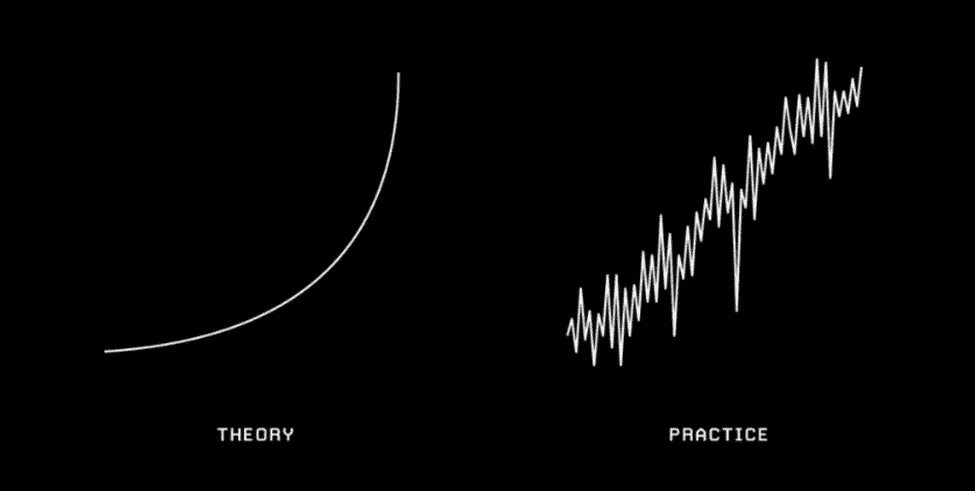
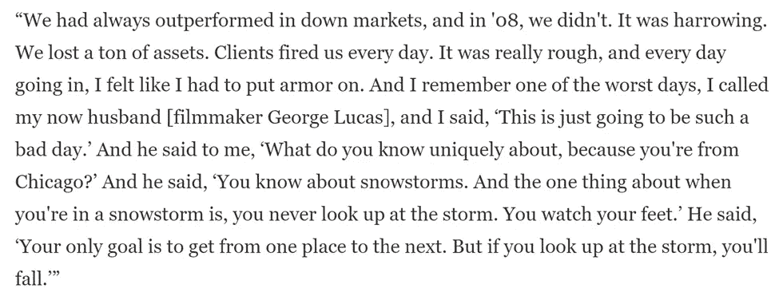
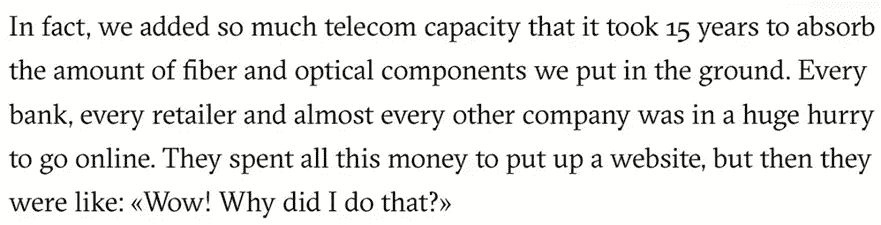
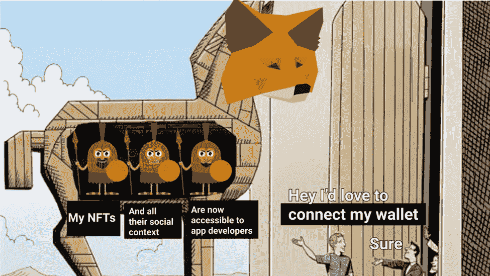
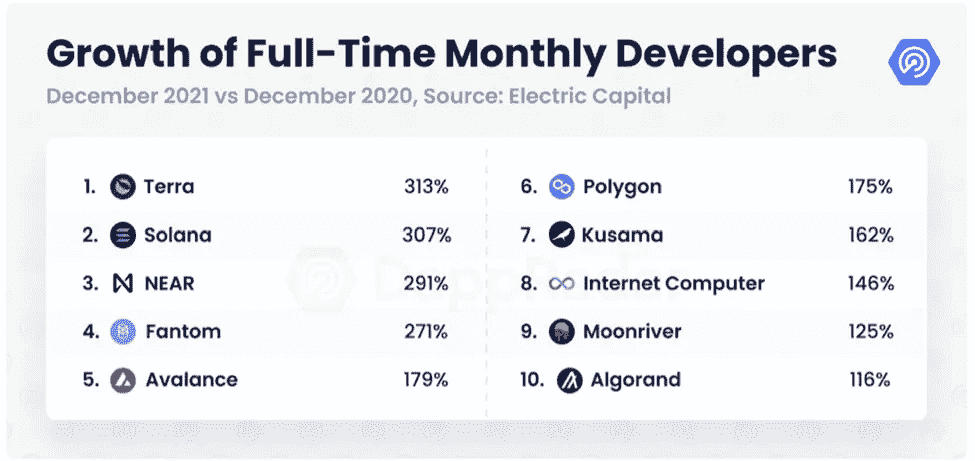
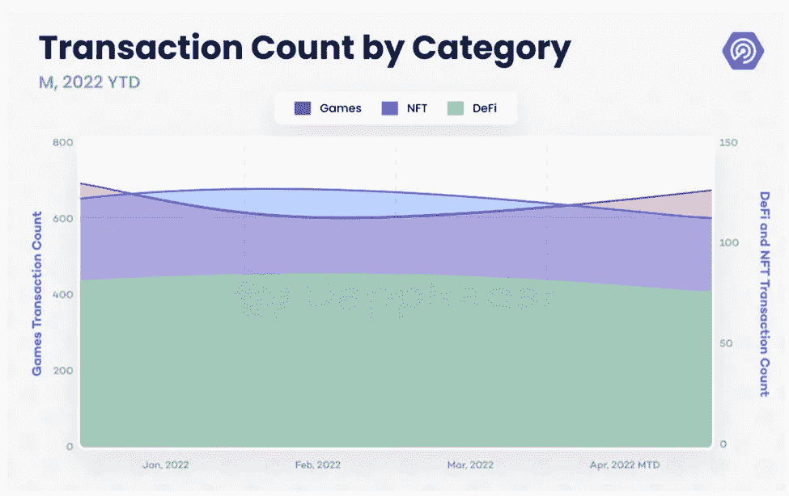
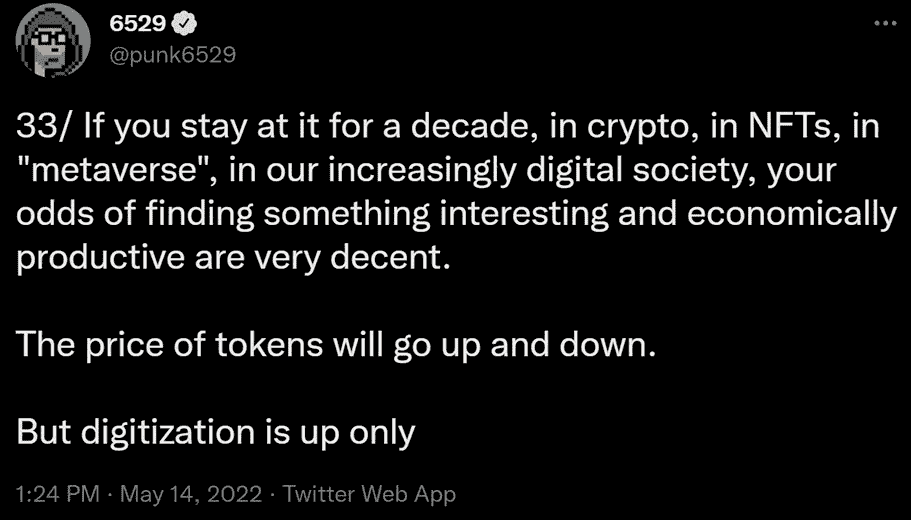

# Aquanow Digital Dives:歌曲结束了，但旋律还在。🎶—第 17 卷

> 原文：<https://medium.com/coinmonks/aquanow-digital-dives-the-song-is-ended-but-the-melody-lingers-on-vol-17-2e03f50e2688?source=collection_archive---------38----------------------->

几个月前，我读到了 Ariel Investments (一家拥有 180 亿美元 AUM 资产的资产管理公司)对 Mellody Hobson 的一次鼓舞人心的采访。17 岁时，她在 1991 年获得普林斯顿大学的学士学位后，以实习生的身份加入了该公司。到 2020 年，她已经晋升为总裁，2019 年，公司创始人向霍布森出售了 14%的股份(她的持股比例达到 39.5%)，并与她分享了他的首席执行官职位。除了一些慈善职责外，霍布森女士还是星巴克的非执行主席，并在摩根大通董事会任职。从 1000 英尺的高度来看，这条职业道路将是市场梦寐以求的经典曲棍球棒形状。然而，放大不同时期，观察者会注意到必须克服的相当多的逆境。

[*来源*](https://twitter.com/jackbutcher)

梅洛迪出生在芝加哥一个单身母亲经营的家庭，是六个非洲裔美国孩子中最小的一个，她经常谈到她年轻时的奋斗:“他非常非常努力地工作，但我们经常处于被驱逐或被关灯、电话被切断、汽车被收回的艰难境地。有时候我不知道我们要住在哪里。然而，这些评论很快就变成了这样一次经历如何给她提供了一种经济上的不安全感，这种不安全感成为她在学校努力学习和做出非传统职业选择的动力。霍布森没有去华尔街的大公司工作，而是选择加入家乡一家相对较小的商店。好处是她可以和主要决策者一起工作，她觉得他最好能培养她的才能。

在金融大危机期间，Ariel 正在剥离资产，因为之前在动荡的市场中重视经理的风险控制的客户定期打电话来赎回资产:

这符合逻辑。在暴风雨中，猜测天气何时会变化没有太大意义——度过难关才是重点。同样，当涉及到影响市场的动荡的宏观力量时，尝试并理解正在发生的事情通常比预测接下来会发生什么更好。这并不是说我们不应该关注新出现的趋势，但是研究通量的来源比估计它们的影响何时会被感觉到更好。最近，我的收件箱被各种预言家的电子邮件淹没，他们试图解读我们是否处于熊市，如果是，会持续多久。诚然，拥有这种远见卓识会非常有利可图，但理解市场时机往往是一种徒劳的努力，它会更好地为我们服务，专注于建立弹性，以便我们的投资组合或项目能够在低迷时期生存下来，并在更好的时期蓬勃发展。在 Reshma Saujani 的播客中，Hobson 女士对年轻女性说了这些激励的话，我认为数字资产领域也可以向她们学习:

> *如果你今天把我的一切都拿走，我保证我还知道如何生存。那是一份礼物。因为很多人做不到。所以那些在外面挣扎的人，正在想‘这是无法忍受的’。你在自己身上创造了如此多的韧性，有一天会让你成为一名战士…这条路不一定会变得更容易。我希望我能这么说，但是你变得更强了。你为这些时刻开发了精神记忆，而这种精神记忆会帮你度过*。

在 90 年代末网络泡沫破裂后，许多人认为美国的带宽建设过度了。纵观全局，这是一个合理的结论。[正如 Gavin Baker 在本次采访中所讨论的](https://themarket.ch/interview/there-is-no-playbook-ld.6422)，安装光纤和光学元件的过剩供应持续了 15 年。借助后见之明，我们现在可以意识到事情没那么简单。YouTube、网飞等。建立了基于廉价网络能源的帝国，催生了以前被称为疯狂的全新商业模式。我不知道 web3 今天的设置是否类似于 21 世纪初，但它似乎没有太大的变化。随着 NFT 的突然出现，许多消费公司也加入进来，出现了明显的繁荣迹象。

有些人可能会想，为什么他们会涉足不可替代的代币或区块链，因此我不会对出现一些人员流动感到惊讶。另一方面，正如 Chris Dixon 在他的文章《通才》中指出的那样:“*我们可能正在进入一个创业黄金期。*“他认为 blockspace 可能会在未来几年成为最有价值的商品之一。正如没有人(或至少很少人)预见到互联网在泡沫破裂后会如何发展一样，下一个增长期可能会受到新的和创新的商业模式的影响。事实上，因为这些天事情发展得如此之快，我们可能已经通过“[令牌化的”经济](https://www.notboring.co/p/tokengated-commerce?s=r)瞥见了这一点。

希望另一个人垮台是不好的做法。话虽如此，在低迷的市场中值得乐观的是，当项目在周期中失败时，幸存的团队可以得到被淘汰的人才的支持。现在宣布 Terra 生态系统死亡可能还为时过早，但认为它们的增长前景已被大幅削减似乎是合理的。这对其他人来说是个好消息，因为许多开发人员已经在那里开发了:

[*来源*](https://dappradar.com/blog/behavior-report-macroeconomic-events-accelerate-crypto-adoption-and-regulations)

再说一次，我并没有轻视这种情况，但这是一种自然现象，人才的这种再循环通过传播知识和技能来帮助生态系统。最佳实践可以广泛传播，然后迭代以满足新的用例。

吉姆·克拉姆已经被认为是一个反指标，所以你不会想让他兜售你的包。但是，他有一句话和我的乐观倾向产生了共鸣。你经常可以听到克莱姆先生惊呼:“*总有一个牛市在某个地方！*“虽然可能很难找到交易量创历史新高的代币群，[Dapp Radar 的这份报告](https://dappradar.com/blog/behavior-report-macroeconomic-events-accelerate-crypto-adoption-and-regulations)表明，尽管 DeFi 和 NFT 的交易量正在下降，但 GameFi 领域正在升温。看起来在熊市中打发时间的一个方法就是和你的朋友一起玩，或许在这个过程中还能赚一点。

我们将不得不看看这是如何进行的，因为许多区块链游戏项目目前主要依靠经济激励来吸引用户，因为目前缺乏界面。许多游戏与产量耕作的过程没有太大区别，玩家完成一系列的鼠标点击，然后几个小时后回来领取奖励，并重新做一遍。然而，有一些来自[老牌游戏工作室](https://decrypt.co/87752/ubisoft-first-major-gaming-company-launch-in-game-nfts)或曾经在那里工作过的[人才团队](https://aurory.io/)的项目正在进行中，这些项目除了建立一个链上经济系统之外，还试图解决图形/游戏性问题。

***当前的下降趋势有没有可能从更具周期性的东西演变成 web3 潜力的结构性转变？正如中央银行层面的政策错误可能导致或延长经济衰退一样，立法者在监管加密方面的失误可能会在未来几年内极大地抑制该运动的潜力。虽然像 UST 危机这样的事件为媒体提供了充分的机会来强调当前数字资产的衰落，但仍有热情的团体继续与官员接触，强调这些新兴技术的有益属性。这些倡导者也有几个工具来帮助传递信息(没有区块链项目要求救助，也没有纳税人资助高管奖金)，最近有一些非 UST 的头条新闻可以帮助他们的事业。例如，[无银行 YouTube 频道](https://twitter.com/BanklessHQ/status/1523317593947353089)无缘无故被临时封杀，以及后 COVID 时代卖方最喜欢的上市机制特殊目的收购公司最近表现不佳。前者是一个例子，说明今天的平台公司可以单方面控制信息流动，在他们认为合适的时候压制声音。后者表明，投资初创企业是一项具有内在风险的业务，可能导致资本的全部损失——即使是在受监管的市场中。***

[*来源*](https://twitter.com/asymco/status/1523600580236742656?s=20&t=CeBS1a2kB1fveQjCAxR7Ww)

综上所述，我认为 web3 社区可以从 Mellody Hobson 这样的例子中学习。当情况变得困难时，重要的是专注于发展技能和培养心态，这可以让你度过下一个更平静的阶段。她将童年的苦难转化为点燃坚定职业道德的燃料。这种决心帮助她冲破了社会偏见，在商业和慈善事业的最高层取得了成功。数字资产市场已经摆脱了乐观情绪，悲观情绪开始出现。这为团队提供了一个展示弹性和变得更强的机会。正如他经常做的那样，[朋克 6529 说得好](https://twitter.com/punk6529/status/1525572665788055552):

[*来源*](https://twitter.com/punk6529/status/1525572665788055552)

> 加入 Coinmonks [电报频道](https://t.me/coincodecap)和 [Youtube 频道](https://www.youtube.com/c/coinmonks/videos)了解加密交易和投资

# 另外，阅读

*   [最佳加密交易信号电报](/coinmonks/best-crypto-signals-telegram-5785cdbc4b2b) | [MoonXBT 评论](/coinmonks/moonxbt-review-6e4ab26d037)
*   [如何在 Bitbns 上购买柴犬(SHIB)币？](https://coincodecap.com/buy-shiba-bitbns) | [购买弗洛基](https://coincodecap.com/buy-floki-inu-token)
*   [CoinFLEX 评论](https://coincodecap.com/coinflex-review) | [AEX 交易所评论](https://coincodecap.com/aex-exchange-review) | [UPbit 评论](https://coincodecap.com/upbit-review)
*   [十大最佳加密货币博客](https://coincodecap.com/best-cryptocurrency-blogs) | [YouHodler 评论](https://coincodecap.com/youhodler-review)
*   [AscendEx 保证金交易](https://coincodecap.com/ascendex-margin-trading) | [Bitfinex 赌注](https://coincodecap.com/bitfinex-staking)
*   [最好的卡达诺钱包](https://coincodecap.com/best-cardano-wallets) | [Bingbon 副本交易](https://coincodecap.com/bingbon-copy-trading)
*   [印度最佳 P2P 加密交易所](https://coincodecap.com/p2p-crypto-exchanges-in-india) | [柴犬钱包](https://coincodecap.com/baby-shiba-inu-wallets)