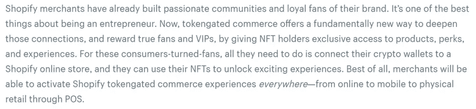

# Aquanow 数字潜水:趋势是你的朋友——第 22 卷

> 原文：<https://medium.com/coinmonks/aquanow-digital-dives-the-trend-is-your-friend-vol-22-72bbf20a7ff4?source=collection_archive---------34----------------------->

最近几周，我有幸参加了 Consensus 和 Collision——分别是 web3 和 start-up technologies 的两个重要会议。对于资产所有者和交易者来说，这是一个熊市，但建筑商和少数风投却不乏热情。我们需要人们加入到第二个群体中来，这一切才是可持续的。 尽管如此，看起来这些庞大人群中的一些团队将会“*做好*”，他们的工作将有助于推动我们继续前进。这是有先例的，因为通常在经济疲软期之后会有重大的创新，许多世界上最成功的企业都是在经济衰退期间创立的。 ***谁知道？也许这次会有所不同。***

[*来源*](https://imgflip.com/i/1s93hu)

许多以数字资产资深人士为主角的台上对话都围绕如何坚持度过这些低迷的日子提出了问题，普遍的答案是 ***排除负面干扰，继续建设*** 。周二，在 Collision，Tezos 的 Kathleen Breitman 说，她将遵循与上次衰退类似的策略，包括诚实地看待哪些项目正在进行，并加倍下注。在经济繁荣时期没有表现出希望的努力将会被放弃。在同一个会议上，Multicoin Capital 的 Kyle Samani 表示，他在 web3 游戏、消费者和社交等领域正全速前进。

这些想法引起了我的共鸣，因为我认为尝试创造吸引我们社会方面的商业模式或走向市场的战略，可能会产生比“数字上升”更可持续的生态系统 不要误解我，经济模型将在互联网的下一次迭代中发挥作用，但 ***我们正在见证当金融应用程序成为系统的核心时所发生的后果*** 。看起来我们最好使用 DeFi 作为 web3 的一个使能特性，而不是让它像北极星一样指引我们。几周前，我们看了一下 GameFi 的一些发展，所以本周让我们先来深入了解一些通过区块链技术解锁的很酷的社交应用。

对我来说，Dao 是这方面更有趣的创新之一，它们似乎正在加快速度。有趣的是，我所参与的组织的 Discord 服务器几乎没有花任何时间谈论 NFTs 的底价或坦克令牌。 ***他们忙于继续推进他们的项目。*** 一群群互不相识、通常生活在世界各地的人[创造出令人印象深刻的艺术、研究和商业](https://www.bankless.community/guilds)。还有的[买地](https://www.citydao.io/)，奋进[收购职业篮球队](https://www.krausehouse.club/)，或者是[再造科研](https://www.vitadao.com/)。通过共同的价值观和具有回报或欣赏潜力的象征来激励群体的能力才刚刚开始。几年后，这个领域似乎会发生巨大的变化。 ***当然，经济是一个特色，但道是社会的核心*** 。

昨天，[古驰宣布了另一项 web3 投资](https://www.coindesk.com/business/2022/06/23/gucci-invests-25k-in-nft-marketplace-superrare-to-start-digital-art-vault/)，他们获得了价值 2.5 万美元的稀有纪念品，加入 SuperRareDAO，并推出他们自己的展览“古驰的下一个 100 年”，展出 29 位艺术家的作品。虽然一些时装公司已经接受了 NFTs，但这是第一次成为 DAO 成员。看看这个组织是否在治理和其他“道”的努力中发挥积极的作用将是很有趣的。 这一意大利著名品牌的倡议负责人尼古拉斯·乌迪诺评论说，他对这一合作关系感到兴奋，因为它提供了一个奖励创作者的平台，这种平台“*建立在社区意识的基础上，能够增强互动……*”

> 交易新手？尝试[加密交易机器人](/coinmonks/crypto-trading-bot-c2ffce8acb2a)或[复制交易](/coinmonks/top-10-crypto-copy-trading-platforms-for-beginners-d0c37c7d698c)

正如亚历克斯·丹科喜欢说的那样，人类首先想要归属，然后我们想要脱颖而出。他和帕克·麦考米克[一起预示了 Shopify](https://www.notboring.co/p/tokengated-commerce) 本周的声明，所以看到这个电子商务巨头描述他们如何相信 NFT 可以用来丰富客户体验也就不足为奇了。

值得注意的是，最受欢迎的分散式交易所( [Uniswap](https://decrypt.co/103467/uniswap-labs-buying-ethereum-nft-aggregator-genie) )和领先的在线拍卖公司([易贝](https://www.prnewswire.com/news-releases/ebay-acquires-leading-nft-marketplace-knownorigin-301573028.html))也在过去几天宣布收购 NFT 市场。这一时机并非巧合，因为 NFT 纽约峰会本周举行。

从[网飞](https://blockworks.co/web3-watch-netflixs-nft-scavenger-hunt-and-elvis-metaverse-strategy)到[周末](https://decrypt.co/101904/binance-and-the-weeknd-launch-a-crypto-powered-world-tour)许多面向消费者的实体中的思想领袖正在使用这些新技术来丰富他们与粉丝的关系。诚然，[不是每个人都喜欢这个方向](https://nftroyalz.com/stranger-things-netflix-nfts-face-fan-backlash/)，但注意到这些实验不断涌现可能表明它们会一直存在下去。不仅如此，今年到目前为止，顶级项目的表现都超过了以太坊:

[*来源*](https://pro.nansen.ai/nft-indexes/bluechip?platform=All)

## 值得注意的是，传统行业、web2 和 web3 中的群体正在拥抱数字文化。这是否纯粹基于逐利，将是值得关注的。

人们也有很多方法试图通过使用可替换的社交标志来“融入”并“脱颖而出”。例如， [Seed Club](/seedclub/introducing-seed-club-a-social-token-incubator-490c0474421b) 是一个加速器，通过建立代表他们共同目标和价值观的数字资产，促进创作者、品牌和社区共同创造价值。 ***在更长的时间范围内，具有固定供应量和不断增长的需求(由参与推进有价值的事业的愿望驱动)的代币可以为人们提供经济和社会激励，以通过获得或赚取这些硬币来参与其中。就像 Shopify 在 NFTs 上看到的那样，社交令牌可以为创作者提供新的方式来吸引他们的观众，并使他们的作品货币化。*** Messari 出版了一本“*社交令牌圣经*”对这个领域进行了很好的概述，但它在企业付费墙的后面，所以如果你想讨论，请给我打电话。他们将这些资产分为三个垂直领域:

除了 Alex Danco 建议人们想要拥有/发行 NFT 的原因之外， ***社交代币(可替代或不可替代)的筹款方面允许创建者或社区克服创建团体的“冷启动”问题*** 。网络可以以多种方式激励互动，并出售带有未来利益(收入、津贴等)的代币。)就是其中之一。然而，我认为 NFTs 有一个明显的优势，即艺术/视觉部分比钱包余额更容易发出信号。

有时，我们关心的原因有一个有限的时间范围，在这些情况下，社会标志也可以帮助我们。2021 年 10 月，[有人对 PoolTogether dAPP](https://nftevening.com/the-case-against-the-pooltogether-inc-co-founder-and-pooly-nfts/) 的母公司提起诉讼，这就像是一种无损失彩票，它使用 DeFi 协议来赚取奖励，激励人们通过购买每周彩票池中的彩票来存放代币，从而有机会赢得头奖。在一周结束时，获胜者将获得报酬，所有彩票将滚动到下一次抽奖，除非用户将其撤回。上面的链接有更多的案件细节，但在我们讨论的背景下，有趣的是，诉讼中提到的团体发起了一场 NFT 运动，以帮助 source funds 打这场法律战 。本周，Pooly mint 在筹集到超过目标三分之一的资金(按今天的 ETH 价值计算超过 100 万美元)后关闭。除了利他主义(和一些美德信号)，没有明显的好处，但过去有支持者因帮助 web3 事业而获得奖励的先例。

[*来源*](https://dune.com/kdivic/pooly-nft-dashboard)

我是一个金融迷，当我听说人们已经建立了链上货币市场时，我真的对数字资产产生了兴趣。在 ETH(和 LTC——不要评判)之后，Aave 是我拥有的第一批代币之一。我身边的朋友可以证明我对该协议的短暂痴迷(以及持续的喜爱)。因此，虽然我通常会关注 web3 的社交项目，但我最感兴趣的是 Stani Kulechov (Aave 的创始人)将要建立什么，因为他在大约一年前暗示了这样的努力。1 月，[项目以镜头](https://twitter.com/aaveaave/status/1490783195767447561?lang=en)和[亮相，5 月部分向用户](https://twitter.com/LensProtocol/status/1526918065409216512)开放。

该协议就像是大多数社交媒体平台下面的连接图，由动态的 NFTs 提供支持。 个人可以通过获得个人资料 NFT 与项目相关联，团体可以拥有一个 multisig 钱包进行合作。*继*之后，另一个账户生成一个属于钱包持有者的唯一令牌，并且可以交易。这实现了独特的用例，如向忠诚的追随者或莱佛士提供特殊的好处。内容创作者可以购买和交易他们的出版物。分享他人作品并通过吸引观众/追随者而引起轰动的人将有权从通过这种催化行动收集材料的任何人那里获得“*镜像费*”。用例永远在发展，因为该协议是开源的，所以任何人都可以在它的基础上开发应用程序。[想象](https://twitter.com/LensProtocol/status/1490782796461350913):"*【s】社交应用、分析平台、验证系统、DAO 工具……无论你能想到什么，你都可以构建。*

使用多边形链有助于镜头保持接近其以太坊的根源，同时保持较低的汽油费，但目前形式的 ***体验缓慢，有点不直观，而且孤独*** 。当然，对于这样一个新生事物来说，这一切都是可以预料的，但是如果希望它能够普及，我们需要看到一些重大的改进。 ***那里也有竞争*** 。Dework 把自己定位成 DAOs 的 LinkedIn。其他团体如 [Peer](https://coinstack.substack.com/p/peer-the-web3-social-network?s=r) 和 [DeSo](https://docs.deso.org/about-deso-chain/readme) 正在用特定的社会用例构建区块链。 ***执行风险高*** 。一些项目如 [Voice on EOS 未能获得足够的关注，尽管有大量的资金支持](https://protos.com/block-one-social-media-voice-offline-unfinished-nft-platform/)。

镜头似乎有一些早期牵引。下面的数字在整体计划中很小，但是考虑到 ***镜头已经被*** 选通，允许开发者有机会增量扩展，所以用户的第一次体验并没有什么问题(尽管说实话，这并不遥远)。此外， ***这种增长与数字资产有史以来最糟糕的市场状况相吻合*** :

[*来源*](https://dune.com/niftytable/Lens)

我们有证据表明，至少有一小部分人不会被层层叠叠的价格图表所困扰，相反，他们希望参与一项潜在革命性社会实验的早期阶段。根据我的经验，我可以说#通用频道上关于该项目的大部分讨论都是来自那些想要开始玩这项新技术的人。

这封信开始变得有点长了，所以我要在这里结束它。然而，数字资产采用的社会动机将是未来一段时间的焦点主题。关于协议之间的协调可能如何绑定更广泛的 web3 社交织锦的线程的有趣讨论，那么[看看这个对话](https://www.youtube.com/watch?v=IhT2JSsmf1Y&t=2736s)，其中有 [Disco.xyz](https://www.disco.xyz/) (数字身份)、来自 [POAP](https://poap.xyz/) (出席协议证明)的 Isabel Gonzalez 和[Lens](https://lens.xyz/)Christina Beltramini。我们将在另一个时间继续讨论，看看钱包创新、数字资产支付轨道和物理工作证明如何帮助塑造一个更美好的世界。

[*来源*](https://imgflip.com/i/6kp8hq)

> 加入 Coinmonks [电报频道](https://t.me/coincodecap)和 [Youtube 频道](https://www.youtube.com/c/coinmonks/videos)了解加密交易和投资

# 另外，阅读

*   [block fi vs Celsius](/coinmonks/blockfi-vs-celsius-vs-hodlnaut-8a1cc8c26630)|[Hodlnaut 审核](/coinmonks/hodlnaut-review-best-way-to-hodl-is-to-earn-interest-on-your-bitcoin-6658a8c19edf) | [KuCoin 审核](https://coincodecap.com/kucoin-review)
*   [Bitsgap 评审](/coinmonks/bitsgap-review-a-crypto-trading-bot-that-makes-easy-money-a5d88a336df2) | [Quadency 评审](/coinmonks/quadency-review-a-crypto-trading-automation-platform-3068eaa374e1) | [Bitbns 评审](/coinmonks/bitbns-review-38256a07e161)
*   [加密复制交易平台](/coinmonks/top-10-crypto-copy-trading-platforms-for-beginners-d0c37c7d698c) | [Coinmama 审核](/coinmonks/coinmama-review-ace5641bde6e)
*   [印度的加密交易所](/coinmonks/bitcoin-exchange-in-india-7f1fe79715c9) | [比特币储蓄账户](/coinmonks/bitcoin-savings-account-e65b13f92451)
*   [OKEx vs KuCoin](https://coincodecap.com/okex-kucoin) | [摄氏替代品](https://coincodecap.com/celsius-alternatives) | [如何购买 VeChain](https://coincodecap.com/buy-vechain)
*   [币安期货交易](https://coincodecap.com/binance-futures-trading)|[3 comas vs Mudrex vs eToro](https://coincodecap.com/mudrex-3commas-etoro)