# aqua now Digital Dives:++++++-_？—第 18 卷

> 原文：<https://medium.com/coinmonks/aquanow-digital-dives-vol-18-7667888efbb2?source=collection_archive---------57----------------------->

模式识别是我们学习和决策的一个重要因素。在人类数千年的进化中，揭示我们环境中的关系的能力一直是自然选择的决定性因素，因为它允许更有效的狩猎活动，并有助于告知哪些植物应该避免食用。在社会层面上，当我们采取其他行动时，基于我们收到的反馈，我们习惯于表现得有礼貌和有礼貌。然而，这种脑残也有可疑的一面。[模式化(或 apophenia)](https://en.wikipedia.org/wiki/Apophenia) 是一种想象随机事件之间联系的倾向，导致非理性行为。

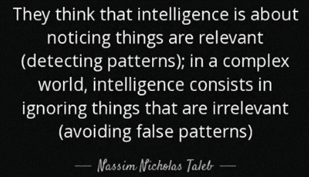

回到我们穴居的时代，对灌木丛中的一些噪音反应迟钝的代价可能是进行一些不必要的锻炼(躲避风)或成为捕食者的午餐。在当今更加复杂的世界中，相信虚假的相关性或控制幻觉会导致阴谋论和破坏性思维。[这里有一个来自 PsychCentral](https://psychcentral.com/lib/patterns-the-need-for-order#4) 的后者的例子:

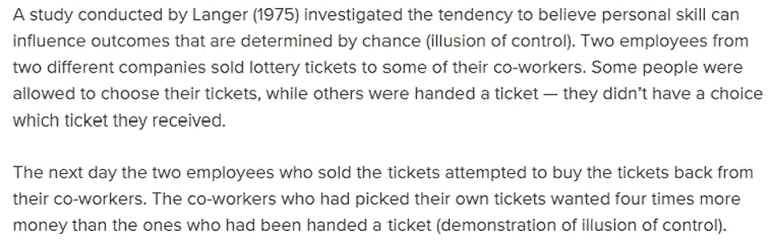

在投资环境中，这些偏见可能会特别令人痛苦。相信错误的因果关系可能会导致对风险/回报前景的糟糕评估，将运气误认为技能可能会导致投资组合经理忽视改变主题的信息；继续持有一项资产。Cem Karsan 成为我在 Twitter 上最喜欢关注的投资者之一，因为他将期权活动和相关的交易商对冲影响融入了他的市场分析。我认为，越来越依赖被动策略会导致资金流在更长时间内主导基本面。[在最近的一篇帖子](https://threadreaderapp.com/thread/1528581335492722688.html)中，他讨论了面对新信息拒绝更新观点的后果:

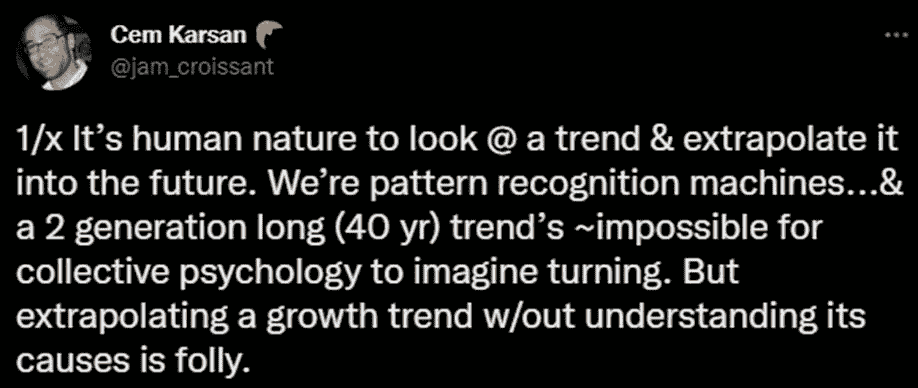

杰姆继续告诫读者，社会焦虑、显著的贫富差距、撤销货币刺激和去全球化的综合作用，可能会带来一个新的制度，未来的增长趋势将不得不下调。因此，创新的步伐将会放缓，帕洛阿尔托(风险投资的代表)正处于被扼杀的过程中。“投资者应该小心销售人员宣称的“蛇油”*,并在这段动荡时期保持高水平的流动性。*

*如上所述，不愿意调整你的观点会对投资组合产生负面影响，所以这些是需要注意的重要警告。然而，如果就此推断卡尔森先生说创新、增长和风险投资将会完全停止，那就太天真了。 趋势的变化可以(并且已经)导致重大的重估，但它仍然意味着边际上有所改善。*

## ****虽然趋势线的斜率会随着观察的时间框架而波动，但长期趋势很少会突然停止。****

*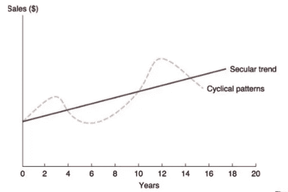*

*疫情提供了许多优秀的例子，说明一般聪明的人在更新他们的观点时过于强调时事。詹姆斯·阿尔图切是对冲基金经理、作家、播客和企业家。2020 年 8 月，他写了一篇文章宣称:*[*NYC 永远死了。原因如下。*](https://www.linkedin.com/pulse/nyc-dead-forever-heres-why-james-altucher/) *"* 他的结论是基于对最近一些趋势的评估，如零售向在线渠道过渡以及老龄化人口向更安静的家园转移——这两种趋势都因遏制 COVID 的封锁措施而加剧。但这些肯定是暂时的，不是吗？**

**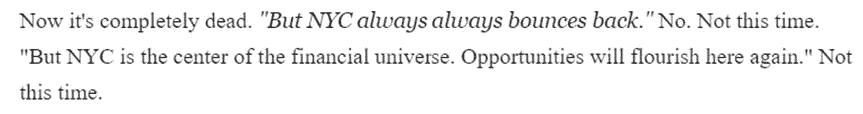**

**现在，Altucher *是否以媒体存在为生，所以他的动机可能受到头条新闻的影响，但他的声誉也基于看穿噪音的能力，所以这似乎是他诚实的评估，[我们现在知道这是不正确的](https://millersamuel.com/charts/manhattan-median-monthly-rent-net-effective-versus-face/)。***

**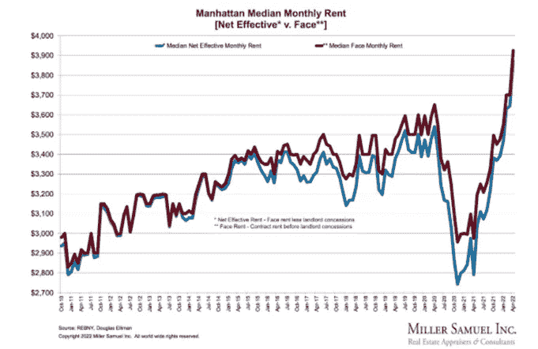**

**由于担心旅行禁令会恶化资产负债表，航空股暴跌，甚至奥马哈的甲骨文公司也卖掉了他的股票，因为他认为商业前景已经受损。在此之前，持有航空公司股权的理由是基于航空旅行的持续增长和运营执行的改善，但疫情带来的冲击被认为打破了这一基础。再一次，事后来看，我们可以说这并没有像预期的那样发生:**

**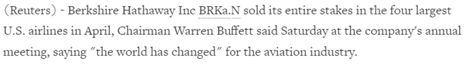****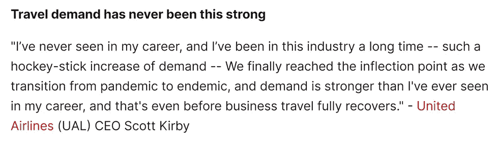**

**[*来源*](https://thetranscript.substack.com/p/04-25-2022-marching-towards-neutral-free?)**

**重要的是要注意到，我并没有否认这些预测有任何偏差。如果我每次对了都有 0.01 美元，那么我可能会买 75 LUNA T1。然而，随着我们继续在动荡的经济和市场环境中前行，我认为重要的是要记住让一个庞大的机构停下来是多么困难。正如 Cem Karsan 指出的，理解特定趋势背后的力量是至关重要的，这也是我认为上述估计出错的地方。人们想住在纽约是因为它的本质。这座大都市有着丰富的历史，充满了创造力、企业家精神和勇气。虽然有些人可能厌倦了这座大城市，但仍有许多人在门口等着有机会分享它的遗产。此外，在被困在家里近两年后，人们比以往任何时候都更想体验不同的文化、气味和口味。当然，政策反应对于经济活动如此迅速地恢复是巨大的。**

**1979 年，美国 10 年期国债收益率平均为 9.43%，通货膨胀率为 11.35%，*商业周刊 8 月版的*封面故事宣称 ***股票已死*** :**

**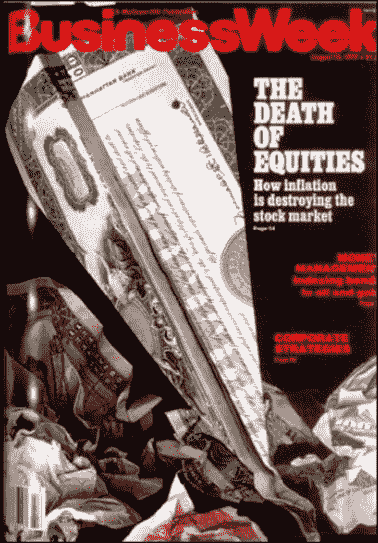**

**[*来源*](https://twitter.com/bw/status/1161246070598504448)**

**如果你在那一年购买了 100 美元的标准普尔 500，并将此后的所有股息进行再投资(这是可能的，因为第一只指数基金于 1976 年推出)，那么你今天的投资将价值 12，834 美元。这篇文章得出了令人沮丧的(而且非常不正确的)评估，即由于人口变化、通货膨胀和来自替代资产的竞争，股票可能是糟糕的回报来源。然而，作者没有意识到股票是整体经济增长和创新的代表。事实上，这些衡量进步的方法有周期性的成分。然而，它们都是复合的，这意味着在更长的时间范围内，开始和结束位置之间的差异可能非常大 。**

**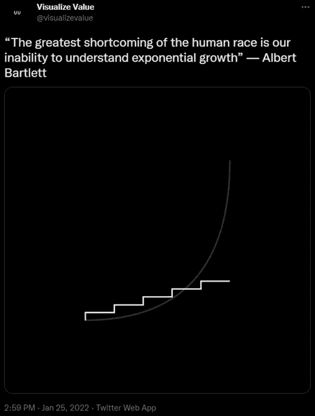**

**[*来源*](https://twitter.com/visualizevalue/status/1486111520996134918)**

**大约 6 个月前，数字资产市场的气氛非常乐观。新的第 1 层被成功地发射，NFT 被搁置，有足够的资本来支持 tvl，同时在最新的 DeFi 协议中产生雇佣军。今天的基调是“*只降*”，媒体聚焦于该行业的短板。有些人甚至大胆到写下了 web3 的讣告:**

**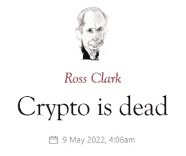**

**上述预言是落入了宣称疫情末日预言者的同一个陷阱，还是他们在实践谨慎的贝叶斯更新？ 不幸的是，我们必须等待时间的推移才能确定，但让我们试着深入了解这一点。借用 Jam Croissant 剧本，我们可以通过试图理解推动数字资产采用的潜在力量来预测结果。**

**虽然我认为 web3 的最大潜力是通过与现有系统的集成，而不是试图取代它，但迄今为止推动采用的强大力量是对当前权力层级的不满。例如，[比特币的创世区块](https://decrypt.co/56934/the-bitcoin-genesis-block-how-it-all-started)包含一个复活节彩蛋，其中引用了英国《金融时报》的一篇文章:“*《泰晤士报》03/1/2009 财政大臣处于第二轮银行纾困的边缘。*“此外，[像 Cobie](https://www.youtube.com/watch?v=JRKkpLp6yLA) 这样的重要秘密文化领袖表示，目睹家庭成员因严重的金融危机而承受的苦难，而在行政或监管层面却没有问责，这是参与其中的催化剂。区块链空间并非没有缺点，但相对于企业贪婪的悠久历史，年轻一代可能仍然更信任 web3 的去中心化和透明的愿景。 ***总的来说，意在影响未来增长率的社会焦虑可能支持数字资产的说法。*****

**今天，计算机比以往任何时候都更紧密地与我们的生活交织在一起。你认为上升的利率和消费价格指数可能会改变这种现象吗？我不确定它们会对屏幕时间有什么负面影响。随着科技领域的估值下降，一个合理的假设是，创始人可能不愿意筹集资金(如果可能的话)。然而，有许多拥有大量现金余额的大型运营商将寻找未来增长的来源，尽管这不一定是在数字资产领域，但一些最大的参与者正在重新评估他们在这方面的战略。这是 Instagram 的负责人，连线杂志的 Adam Mosseri:**

**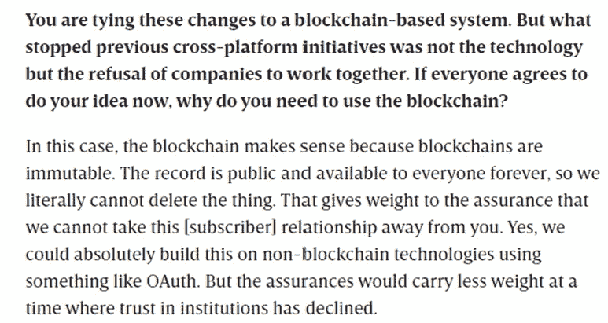**

*****web 3 最引人注目的属性之一是它对开源项目的关注*** 。[支撑这些企业的代码块可以作为乐高积木，供其他人以新颖的方式组装](https://www.notboring.co/p/idea-legos?s=r)。这种实验可以在没有大量资金投入的情况下带来重要的创新。美联储可以拿走潘趣酒碗，降低家庭财富水平，让经济陷入衰退，但许多项目仍然资金充足，业余爱好者会找到时间建造。其效果将是当前基础上的创造力的复合，因此即使增长率放缓，未来项目的能力也将比现在更强。**

**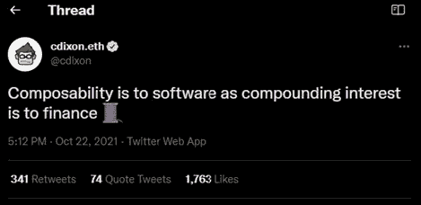**

**在经济放缓期间，广告预算被削减，但这并不意味着商业广告停止播出或横幅广告消失。[我们已经看到一些面向消费者的企业探索 NFT，为他们的客户创造更深层次的意义](https://thedefiant.io/fashion-nft-roundup/)。 ***来自这些组织高层的指示将决定他们将在多大程度上继续对 web 3/元宇宙的投资，但完全放弃这些计划似乎不太可能。*** 随着这些新进入者为这一新兴领域开发和完善上市战略，他们的成功和失败将为随后的实验者奠定基础，从而再次产生复合效应。**

****

**总的来说，我同意卡桑的观点。我们正在目睹一种有意义的背离全球化体制、持续的低通胀和不断下降的借贷利率。“*闲钱*的消除确实会对资本配置、增长率和资产估值产生深远的影响。是的，这带来了一堆负面情绪，但较低的增长率并不等同于一座城市、一个行业或一场技术运动的死亡。科技股、加密和其他长期资产不太可能像曼哈顿租金或航空旅行那样强劲反弹。不，当前和即将到来的艰难时期不会像之前的牛市那样令人兴奋。但是许多人将继续建造，这个周期将提供另一个例子，说明长期趋势的陡度变化并不意味着其斜率已经翻转。**

**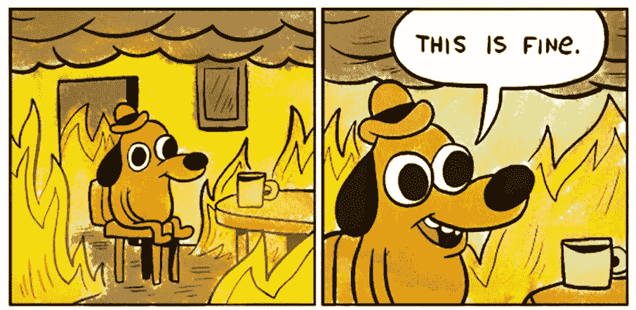**

**[*来源*](https://imgur.com/gallery/c4jt321)**

**在接下来的几周，我们将深入研究 web3 的几个领域，我认为即使在熊市中，这些领域也能取得可观的增长。区块链游戏和社交应用目前的发展令人兴奋。**

> **加入 Coinmonks [电报频道](https://t.me/coincodecap)和 [Youtube 频道](https://www.youtube.com/c/coinmonks/videos)了解加密交易和投资**

# **另外，阅读**

*   **[Bookmap 点评](https://coincodecap.com/bookmap-review-2021-best-trading-software) | [美国 5 大最佳加密交易所](https://coincodecap.com/crypto-exchange-usa)**
*   **最佳加密[硬件钱包](/coinmonks/hardware-wallets-dfa1211730c6) | [Bitbns 评论](/coinmonks/bitbns-review-38256a07e161)**
*   **[新加坡十大最佳加密交易所](https://coincodecap.com/crypto-exchange-in-singapore) | [购买 AXS](https://coincodecap.com/buy-axs-token)**
*   **[红狗赌场评论](https://coincodecap.com/red-dog-casino-review) | [Swyftx 评论](https://coincodecap.com/swyftx-review) | [CoinGate 评论](https://coincodecap.com/coingate-review)**
*   **[投资印度的最佳密码](https://coincodecap.com/best-crypto-to-invest-in-india-in-2021)|[WazirX P2P](https://coincodecap.com/wazirx-p2p)|[Hi Dollar Review](https://coincodecap.com/hi-dollar-review)**
*   **[加拿大最佳加密交易机器人](https://coincodecap.com/5-best-crypto-trading-bots-in-canada) | [库币评论](https://coincodecap.com/kucoin-review)**