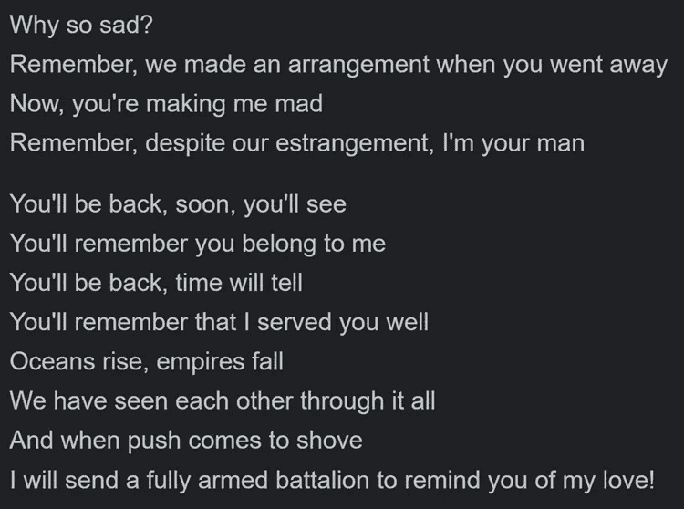
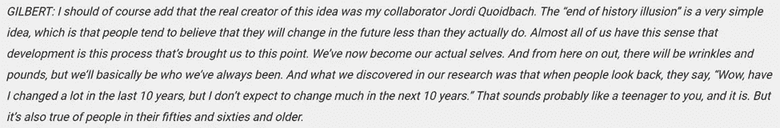
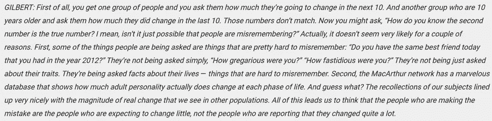
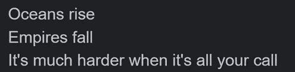
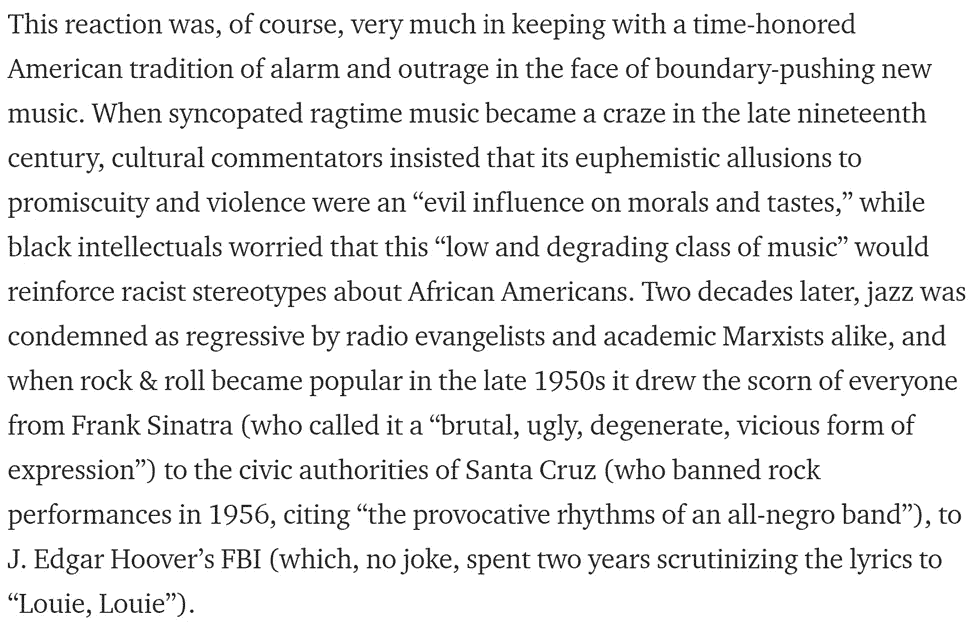
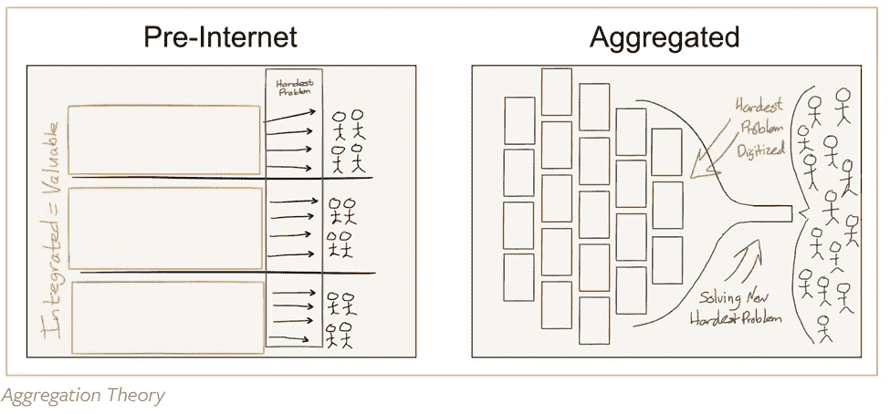
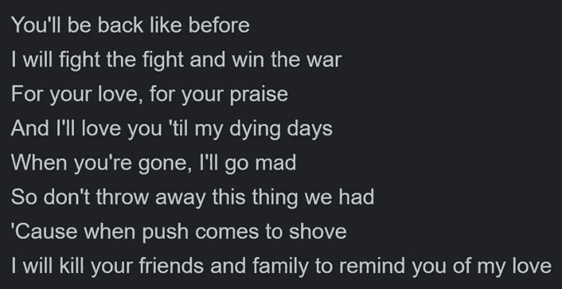
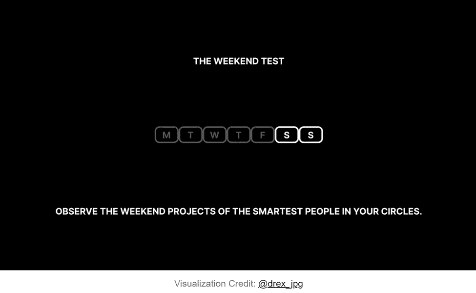

# Aquanow 数字潜水:Web3 不会错过它的…镜头🎯第 20 卷

> 原文：<https://medium.com/coinmonks/aquanow-digital-dives-web3-is-not-going-to-miss-its-shot-1973fbe7b17f?source=collection_archive---------53----------------------->

我有幸参加了上周在温哥华举行的百老汇秀。就个人而言，我喜欢音乐和历史背景。在舞台上看到不同的种族和体型也很酷。这部剧取得了巨大的成功，演员大多是非白种人，音乐来源于嘻哈音乐和 R&B 音乐，这一点尤其值得思考；尤其是在舞台上事件发生的时代背景下。

虽然西方在 18 世纪后期朝着平等的方向大步前进，但种族鸿沟仍然很大。可悲的是，200 多年后，我们仍在处理这些问题。不可否认，我们已经取得了进步，但这并不意味着现状不应该受到挑战。他相信这个想法注定要失败，叛逃者会及时爬回来寻求他的帮助，也许一点严厉的爱会让这一切变得清晰。

[*来源*](https://www.google.com/search?q=hamilton+king+george+you%27ll+be+back&rlz=1C1RXQR_enCA988CA988&oq=hamilton+king+george+you%27ll+be+back&aqs=chrome..69i57j46i512j0i512l2j0i22i30l3j0i390.6142j0j7&sourceid=chrome&ie=UTF-8)

你不能把这种盲目归咎于乔治国王。事实上，人类往往会低估未来事情会发生多大的变化。正如史蒂芬·列维特和丹尼尔·吉尔伯特在本期播客中所讨论的，“末日谬误”是一种已经被证明存在于我们生活中的现象。

随着第一个间歇期的到来，我可能是唯一一个开始思考这一系列事件目前如何在数字资产市场中产生反响的与会者。几年前，大多数金融界的傀儡领袖都对比特币不屑一顾，称其为骗局。就像一个成年人明白他们在十年前已经发生了很大的变化，但预计十年后会有同样的朋友和品味，那些认为现状的人是有偏见的。许多反对者仍然存在，但潮流显然正在转向，现任美国财政部长在与立法者合作建立稳定货币的监管框架时，脑子里想着加密货币。

[*来源*](https://www.google.com/search?q=hamilton+king+george+what+comes+next+lyrics&rlz=1C1RXQR_enCA988CA988&sxsrf=ALiCzsayR1NMOVosrhsK8EXzV8gCRR5H7A%3A1654546056124&ei=iF6eYsCZB_nA0PEP6Z-nwAw&oq=hamilton+king+george+what+comes+next+l&gs_lcp=Cgdnd3Mtd2l6EAEYADIGCAAQHhAWOgcIABBHELADOgUIIRCgAUoECEEYAEoECEYYAFDOBVjrE2D0HGgBcAF4AIABbYgBqwGSAQMxLjGYAQCgAQHIAQjAAQE&sclient=gws-wiz)

作为乔治·华盛顿的财政部长，汉密尔顿的努力集中在金融事务上是可以理解的，并且[他被认为在 1791 年建立了美国美联储的基础](https://www.federalreservehistory.org/essays/first-bank-of-the-us)。然而，也有重要的社会主题贯穿表演的情节。贫富差距、妇女权利和采取行动是一些显著的例子。汉密尔顿遗产的元素今天仍然存在，但社会已经发生了显著的变化。我想知道，随着 web3 继续扩大其覆盖范围，我们是否会看到类似的事情发生。似乎社区的最初倾向是金融化，DeFi 的创新一直很猖獗。然而，许多早期采用者越来越厌倦不断关注象征性价格，痴迷于在哪里找到最高收益率和“ponzinomics”中的实验。需要明确的是，这些问题仍然渗透在整个生态系统中，但似乎有一股变革之风正在席卷而来。

如果模式重复，那么嘻哈音乐可能会给我们提供一个关于监管、立法和大规模采用如何在 web3 中发生的指示。当说唱音乐在 20 世纪 80 年代末首次出现时，这种新的音乐类型在它所接触的社区之外普遍不受欢迎，并且被广泛认为不重要。然后，随着它开始与反建制的“ *gangsta* ”文化相融合并获得流行，人们广泛呼吁(并试图)彻底禁止这些内容。

[*来源*](/cuepoint/the-great-rap-censorship-scare-of-1990-115edc69a62f)

快进几十年，这种有争议的音乐类型不仅是主流，而且是格莱美、托尼和普利策奖得主百老汇的基础。重要的是，过去有(现在仍然有)一些可怕的说唱领域，在言论自由之外无法辩护。应该鼓励积极对话，讨论这种表达方式如何违反社会价值观和教育，以及为什么某些心态和言论不受欢迎。

Web3 试图建立一个互联网，以一种无信任和去中心化的方式补偿创造者和贡献者所提供的价值。不幸的是，工作验证共识机制消耗大量电力，并且(直到 ETH 合并)支撑着两个最流行的区块链。crypto 里有很多骗子，贪婪无处不在，DAO 治理有点乱。名单还在继续…通灵丹尼尔·吉尔伯特，我们知道人类的思维倾向于推断现状，并相信这一切都不会改变，但回顾历史，我们知道它几乎肯定会改变。

在美国从英国独立前的几个世纪里，世界大部分地区都在某种形式的封建制度下运作。在欧洲，教会是社会的基石，王权统治是因为它的“T0”神权只有贵族阶级被允许拥有土地，这样的家庭拥有君主赋予他们的权力。随着神职人员之外的人学会阅读，除了《圣经》之外的其他文本开始流通，印刷机催化了一场知识革命。随着新思想开始涌入，对社会等级制度的敌意开始恶化。自然，当权者试图压制这样的倡议，但是少数充满激情的人继续传播他们的哲学。在海洋的另一边，远离当权派的挑剔眼光，一个不那么集权的社会的概念能够获得动力，其余的，正如他们所说的，成为历史。

几十年前，互联网的出现，就像印刷机一样，开启了人类交流的新范式。最初的聊天室、AOL messenger 和电子邮件已经发展成为一个充满活力的多样化生态系统，其中信息(通常)自由流动，数据被大规模存储，算法被训练来开发智能软件/机器。随着成本的急剧下降，即使是不太幸运的人也可以获得连接设备来参与对话，尽管频率较低。屏幕永远不会离你太远，世界各地的人们定期查阅这个知识库来寻找方向、了解信息、娱乐等等。因为每个人都有自己的声音，可能也是由于模拟世界中身份的分离，在这个数字世界中创造力爆发了。

如果一个房间里的每个人都同时发言，任何人都很难被听到，所以出现了平台来组织对话和内容。 ***与过去的贵族不同，这些聚合机器的操作者通过别出心裁赢得了自己的位置。然而，他们的许多行为类似于昔日的地主。*** 如果一个参与对话的人说了或展示了一些当局不喜欢的东西，那么他们就有被剥夺发言权的风险。那些为世界提供源源不断的娱乐和教育的创意者和天才也可能会被禁声。更重要的是，他们只赚平台经营者认为可以接受的钱，这可能根本不算什么。

[来源](https://stratechery.com/2015/aggregation-theory/)

在现代早期，国王和王后都有告密者网络，他们会因为透露了关于他们臣民的活动和态度的信息而得到报酬。不容忍异议。因为人们不认为任何事情可以改变，而且最害怕不顺从的后果，贵族继续从市民的努力中充实自己。

在当今的数字世界中，公民不断受到监控。他们的行为发出的信息被用来保持平台用户的参与，并出售给广告商，就像内容提供商的创意作品一样，进入科技巨头的口袋。随着算法消耗数据，它的预测变得更加准确，这使得聚合器很难离开，因为替代方案无法提供相同的定制感觉。结果是，数十亿人将继续聚集在这些数字空间，数亿创作者将去那里被看到/听到——很少或没有补偿。即使是少数成为明星的人也必须遵守规则。否则，他们就有被算法降低推广频率或从平台上彻底删除的风险。

[*来源*](https://therake.com/stories/code/greed-is-good/)

想要新生活的欧洲人很幸运，无畏的探险者继续渴望冒险和新的视野。他们发现的陆地允许新的信仰和价值观被更自由地讨论。大西洋两岸新颖的思维方式可以被记录在书中，被消费，被辩论，被重复。 区块链技术类似于美洲，它提供了一个新的前沿，那些看到当前系统缺陷的人可以在其上建立。 ***就像开国元勋们起草宪法重组社会一样，*** ***Web3 的开发者们正试图通过编写不同的规则和激励措施来改善当今互联网的围墙花园。代码库保存了他们的成果，这些成果也可以被分析、争论和组合成其他新颖的解决方案。***

[*来源*](https://texaslifestylemag.com/wp-content/uploads/2019/05/ZMF_Jon-Patrick-Walker-as-King-George-HAMILTON-National-Tour-c-Joan-Marcus-2018-e1559232342416.jpg)

将今天的政治家、金融高管和科技巨头与过去的牧师、君主和贵族进行比较，可以发现一些重要的相似之处，但也有显著的差异。最重要的是，没有人会像汉密尔顿的乔治国王一样杀害自己的朋友和家人。此外，似乎已经从过去吸取了许多教训。 ***虽然在位者(自然地)尽最大努力维护他们精心设计的护城河，但许多人看到了融入创造稀缺和嵌入数字产权的技术的前景。然而，真正开放他们的平台和去中心化的前景仍然令人不快。增加 NFT 功能或代币交易是朝着正确方向迈出的一大步，但 web3 的核心是去中心化。***

[*来源*](https://www.google.com/search?q=hamilton+king+george+you%27ll+be+back&rlz=1C1RXQR_enCA988CA988&oq=hamilton+king+george+you%27ll+be+back&aqs=chrome..69i57j46i512j0i512l2j0i22i30l3j0i390.6142j0j7&sourceid=chrome&ie=UTF-8)

虽然亚历山大·汉密尔顿赞成美国摆脱英国君主制，但他仍然相信强大的中央权威。他的双重性是剧中反复出现的主题。虽然他寻求建立一个民主国家，汉密尔顿并不反对闭门握手来推进他的事业。他、托马斯·杰斐逊和詹姆斯·麦迪逊之间著名的餐桌交易就是明证，当时他设计了一项交易，即联邦政府购买各州的未偿债务，以换取定期税收。其效果将是创造一个国家影响力的中心来源，并“*将持有国家政府大部分债务的一小撮富商捆绑在一起；随着它的繁荣，他们也会繁荣起来。为了让他的计划获得批准，汉密尔顿做出的让步之一是将美国国会大厦设在华盛顿特区。所有这些都在[*【发生的房间】*](https://www.youtube.com/watch?v=WySzEXKUSZw)这首歌讲述了在闭门会议期间塑造了美国的革命者，也见证了第一家国家银行的特许成立。集权是完成任务的好方法，但是如果走得太远，就会助长不平等和不信任。*

互联网为尝试新事物提供了一个极好的实验室，这就是今天在 web3 中正在进行的事情。DeFi，GameFi 等。具有现实世界的含义，但它们相对较小的规模允许在旧的假设或规则不一定成立的环境中进行实验。去中心化社交(DeSoc)最近获得了更多的关注，这是我们下周要深入探讨的。这种现象正在迅速蔓延，并可能对未来几十年的社会组织方式产生深远影响。也许这场运动的传播者是疯狂的，但如果你遵循萨希尔·布鲁姆关于如何预测未来的建议，你可能就会明白为什么了。他是一名企业家和 web3 倡导者，经营着一个名为[The Room Where It happen](https://theroomwhereithappens.co/)的集体，这是一个(或许具有讽刺意味的)鼓励观点多样性和协作的开放社会。[萨希尔的“周末测试”](https://sahilbloom.substack.com/p/how-to-predict-the-future-unplug?s=r)遵循的框架是，如果三个朋友提到他们有一个新想法，他认为这听起来很荒谬，那么他会给一个相关的项目投入一点钱。一旦他涉足这个领域，他就会更加关注这个新兴领域的发展。通常，他会加倍下注。 ***你的同事一直在讨论哪些听起来很疯狂的投资？***

> 加入 Coinmonks [电报频道](https://t.me/coincodecap)和 [Youtube 频道](https://www.youtube.com/c/coinmonks/videos)了解加密交易和投资

# 另外，阅读

*   [美国最佳加密交易机器人](https://coincodecap.com/crypto-trading-bots-in-the-us) | [不断回顾](https://coincodecap.com/changelly-review)
*   [在印度利用加密套利赚取被动收入](https://coincodecap.com/crypto-arbitrage-in-india)
*   [Godex.io 审核](/coinmonks/godex-io-review-7366086519fb) | [邀请审核](/coinmonks/invity-review-70f3030c0502) | [BitForex 审核](https://coincodecap.com/bitforex-review)
*   [5 款最佳免费加密货币制图工具](https://coincodecap.com/crypto-charting-tools)
*   [最佳比特币保证金交易](/coinmonks/bitcoin-margin-trading-exchange-bcbfcbf7b8e3) | [萝莉点评](/coinmonks/lolli-review-e6ddc7895ad8) | [比特币保证金交易](https://coincodecap.com/bityard-margin-trading)
*   创造并出售你的第一个 NFT | [密码交易机器人](https://coincodecap.com/best-crypto-trading-bots)