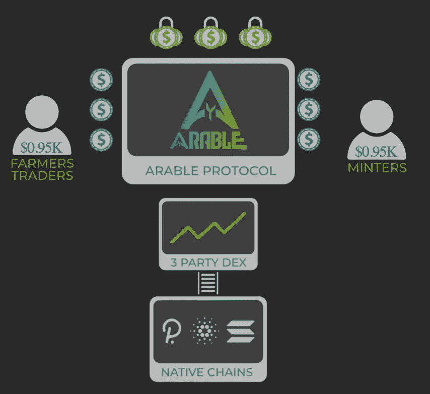

# 耕地——单钱包跨链加密货币产量农业

> 原文：<https://medium.com/coinmonks/arable-single-wallet-cross-chain-cryptocurrency-yield-farming-a47d7f489a7a?source=collection_archive---------4----------------------->

[https://app.arable.finance](https://app.arable.finance/#/)

我总是在寻找新的有趣的项目。随着世界、政府和大型机构对加密货币、赌注、节点和收益农业的“觉醒”，我们开始看到越来越多的区块链平台进入这一 DeFi 空间似乎是合理的。