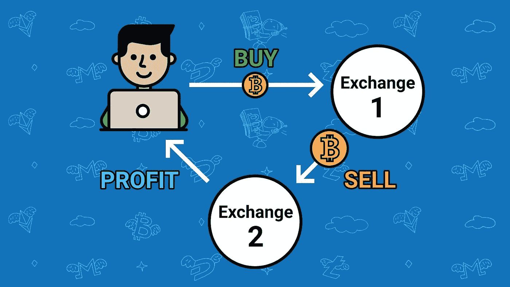
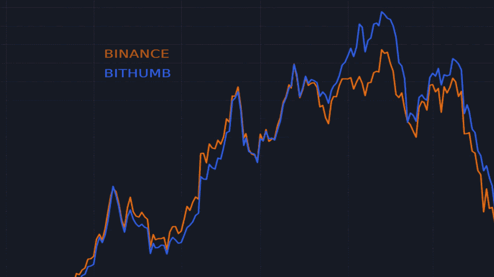

# 什么是 crypto 中的套利交易？定义、操作和风险

> 原文：<https://medium.com/coinmonks/arbitrage-trading-e7e359dbcdca?source=collection_archive---------10----------------------->

Arbitrage Trading in Crypto

套利是一种交易方法，通过利用不同加密货币交易平台之间的**差价**来获利。

**目录**

1.  加密交易中的套利概念
2.  比特币套利机会的例子
3.  密码交易中套利机会的风险
4.  关于密码交易中套利的结论

# 加密交易中的套利概念

套利机会存在于各种市场中，无论是传统的金融市场、股票市场、加密货币交易所，还是亚马逊这样的在线市场、体育博彩网站等。

套利是一种交易方法，允许通过利用相同服务的两个提供商之间的**价格差异**来获利。在加密货币的世界中，这包括在一个交易所进行购买，并在另一个平台上以更高的价格出售该资产，从而利用两者之间的**报价差异**。

> 一个问题浮现在脑海:为什么同样的资产、产品或服务会有**的价格差异**？

交易所和金融市场受制于**供求法则**。平台上的需求越高，价格就越高，反之亦然。这独立于平台的意愿影响资产的价格，因为每个交易平台都是自主的。

因此，在全球加密货币市场中，每个平台都有自己的“子市场”，其中供应、需求和市场深度都有特定的值。

一个“套利软件”(或**套利机器人**)可以用来检测相同产品或服务的供应商之间的价格差异。然后，机器人将利用这种差异，在较便宜的市场上购买资产，在价格较高的市场上出售。

# 比特币套利机会的例子

这种情况实际上发生在 2021 年 4 月**，韩国平台上的需求突然强劲增长，导致比特币价格比欧洲市场高出 17%。**

比特币在币安平台上的售价为 57，000 美元，在韩国交易所 Bithumb 的售价为 66，500 美元。这是一个巨大的差价，有利于套利机会。

交易者可以利用这个差价，在币安以 57，000 美元买入 BTC，在 Bithumb 以 65，000 美元卖出，从而获利。

# 密码交易中套利机会的风险

乍一看，套利似乎是一种简单的赚钱方式，但这种做法存在风险，需要采取一定的预防措施。

事实上，尽管套利的核心原理非常简单，并且基于两个平台之间的简单差价，但为了确保你的投资安全，一些外部因素也应该被考虑在内**。**

以下是套利涉及的风险列表:

*   在计算套利的潜在收益时，请注意不同区块链和加密货币交易平台的**交易和存款费用**，以便始终从您的交易中获利。
*   检查 CEX(集中交易所)上的存款和取款是否活跃；当一个强大的套利机会出现时，一些提款可能暂时不可用。
*   在套利交易中买卖资产时，将**滑点**考虑在内。
*   反应迅速:大多数套利是由机器人或交易员在**毫秒**的时间框架内进行的。

# 关于密码交易中套利的结论

套利是一种基于一种简单现象的交易方法，这种现象出现在所有可以交换产品或服务的市场中。

尽管本质上很简单，但在一个产生利润的系统中，它的实践要复杂得多，风险也大得多。许多外部因素都要考虑在内，这个领域的竞争**非常激烈，即使在加密货币领域也是如此。**

套利现象也允许市场在不同的平台上自动调节和平衡。通过在一个资产价格较低的平台上购买，对该资产的需求将增加，并推动其价格上涨，反之亦然。