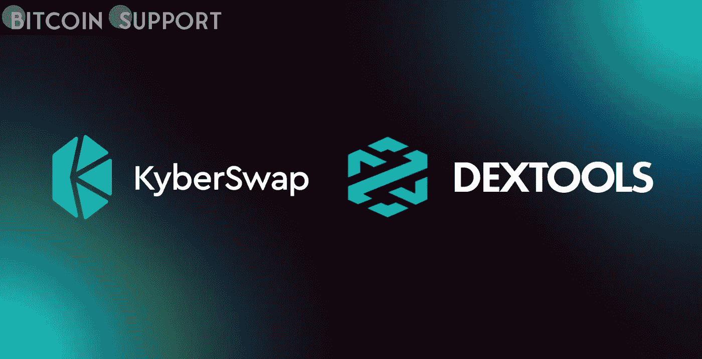

# 二层网络 Arbitrum 已经推出了 KyberSwap DEX

> 原文：<https://medium.com/coinmonks/arbitrum-a-layer-two-network-has-launched-kyberswap-dex-ce6e1d516f52?source=collection_archive---------55----------------------->

**Visit our website:-** [**https://bitcoinsupports.com/**](https://bitcoinsupports.com/)

为了让消费者避免以太坊网络拥堵和高油价，分散的交易所已经搬迁到 Arbitrum。去中心化交换(DEX)聚合器 KyberSwap 在以太坊的第二层扩展解决方案 Arbitrum 网络上首次亮相。

通过这一步，Kyberswap 加入了以太坊(ETH)、多边形(MATIC)、Fantom (FTM)、BSC (BNB)、Avalanche (AVAX)、CRONOS 作为第八个网络或扩展选项(Cronos)。

在撰写本文时，KyberSwap 加入了 SwaprEth、Balancer Labs、Curve Finance 和 SushiSwap，成为 Arbitrum 上可用的 DEXes。根据 KyberSwap 团队的说法，以太坊网络拥塞和链上交易的成本是可以“通过第二层扩展和其他措施”解决的问题根据以太坊网络追踪公司 Etherscan 的数据，以太坊(ETH)上的平均交易成本现在相当低，为 28 gwei(1.48 美元)，但在拥堵时期，费用可能会飙升至 100 美元以上。根据 L2 数据聚合公司 L2 费率，Arbitrum 的天然气费从 0.50 美元到 0.69 美元不等。去中心化应用(d apps)的数据收集者 DappRadar 将 KyberSwap 排在 DEXes 的第 76 位。自 3 月 5 日以来，总用户数攀升了 350%，达到 19870 人，日交易量增长了 31%，达到近 61 万美元。除了每日用户和交易量之外，新的整合可能有助于 Arbitrum 上的 Total Value Locked (TVL)结束连续五天的下跌。根据第二层(L2)生态系统跟踪器 L2Beat 的数据，目前 Arbitrum 上的 TVL 为 30 亿美元。Arbitrum 是目前最受欢迎的 L2 网络，dYdX 位居第二，在 TVL 获得 9.65 亿美元。

上周，Arbitrum 是 L2 唯一一家新地址用户数量出现净增长的公司，超过了 BNB、Ronin 和其他知名的 L2 解决方案。在 2 月的最后一周，Arbitrum 上共有 46，200 个唯一地址，比前一周增加了 12.7%。KyberSwap 的 TVL 最近的波动反映了 DeFi 领域的整体活动。根据 DappRadar 的说法，自 11 月 10 日达到 1807 亿美元的峰值至本文撰写时的 1053 亿美元，TVL 整个 DeFi 生态系统一直处于缓慢下滑状态。

**访问我们的网站:-**[**https://bitcoinsupports.com/**](https://bitcoinsupports.com/)

**免责声明:以上为作者观点，不应视为投资建议。读者应该自己做研究。**