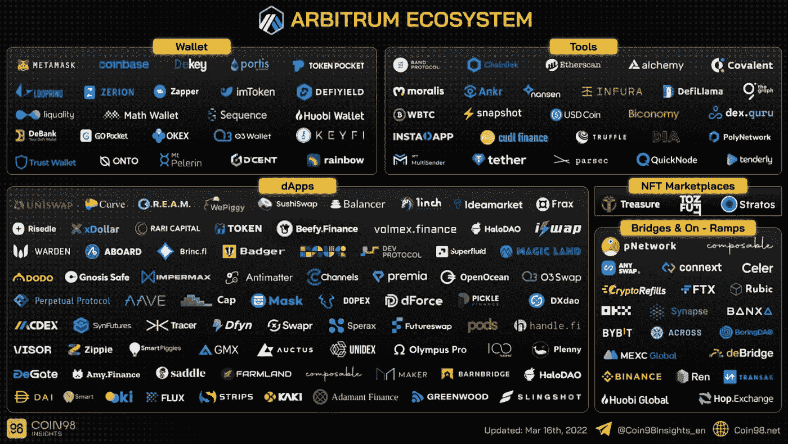
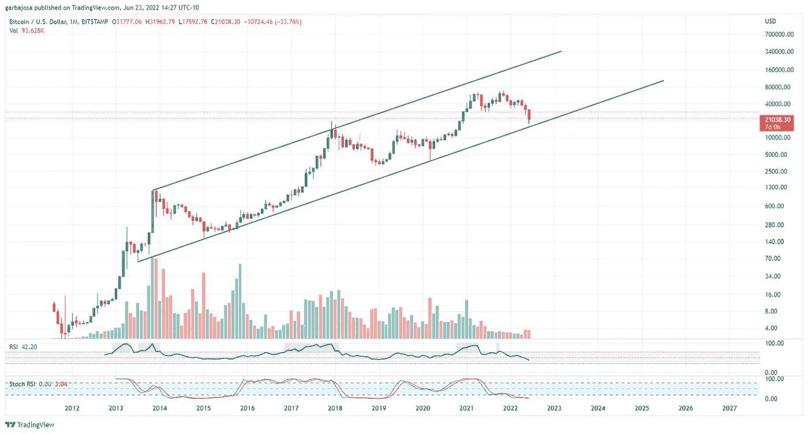
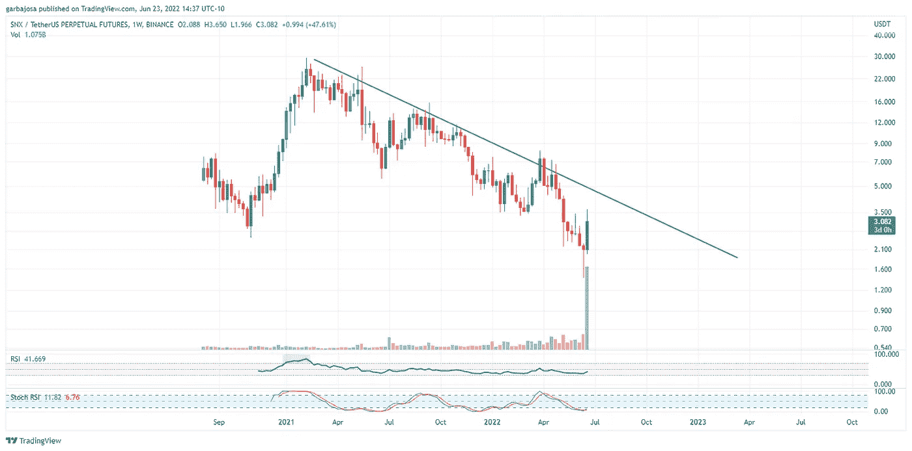
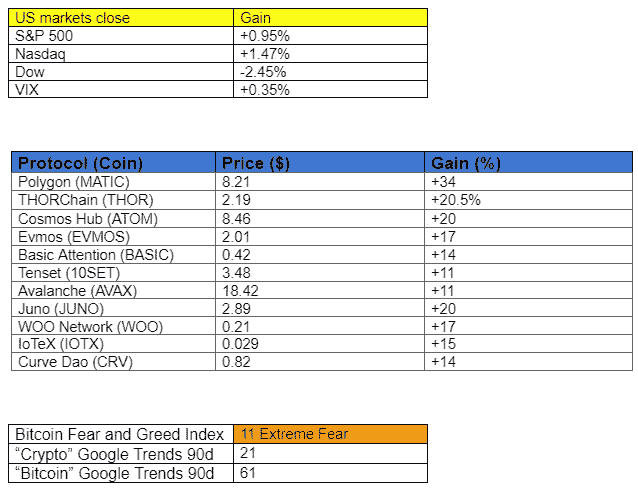
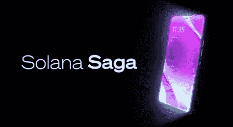

# Arbitrum 奥德赛指南:如何有资格获得 NFT 奖励和空投。(并学习如何使用加密)

> 原文：<https://medium.com/coinmonks/arbitrum-odyssey-guide-how-to-qualify-for-nft-rewards-and-airdrops-and-learn-how-to-use-crypto-d42bba0da679?source=collection_archive---------4----------------------->

## 加密每日更新 6.24.22

问题#024

**概述**

*   谐趣 Arbitrum 奥德赛指南
*   比特币的长期上涨趋势。
*   第一台 Web3 移动设备？
*   THORChain 标志着一个重要的里程碑。

# 阿尔比特鲁姆奥德赛

Arbitrum 是一种快速发展的第二层(L2)协议，它已经迅速成为大量 dApps 和用户的选择。它吸引了以太坊主网的 Uniswap (UNI)、Aave (AAVE)和 Balancer (BNT)等主要 Dapps。此外，币安、库科恩、FTX 和比比特都有直接连接到网络的网桥，以便于访问。据我所知，Arbitrum 甚至有一个蓬勃发展的不可替代的代币(NFT)市场。目前，Arbitrum 缺少一个令牌，但这可能会改变，我们想让你为可能发生的事情做好准备。

**如何获得 Arbitrum 潜在空投的资格，并获得一些 NFT 作为回报。**

Arbitrum 已经组织了一个名为 [Arbitrum Odyssey](/offchainlabs/the-arbitrum-odyssey-87d6e11171d5) 的项目来帮助机载用户使用网络，奖励他们 NFT 和**可能使他们有资格**参加未来的空投。Arbitrum 通过该计划奖励用户学习。用户将学习桥接、进行交换、购买 NFT 等等。空投加 NFTs？！考虑到熊市，这是加密行业最好的机会之一！

该计划包括测试各种协议的八周时间(每周一次)。每成功一周，用户将获得一个 NFT。到计划结束时，每个用户可以拥有多达 16 个 NFT，如果他们收集到至少 13 个，就有资格获得额外的 NFT。

> *交易新手？试试* [*密码交易机器人*](/coinmonks/crypto-trading-bot-c2ffce8acb2a) *或* [*复制交易*](/coinmonks/top-10-crypto-copy-trading-platforms-for-beginners-d0c37c7d698c)

# Arbitrum 奥德赛指南:

**第 1 周—过渡**(大约 15-30 分钟)

所有行为都由用户承担风险。使用 [*验证协议链接*](https://www.coingecko.com/en/coins/hop-protocol) *。不保证 Arbitrum Odyssey 将使用户有资格进行空投。官方仲裁奥德赛* [*指南*](https://twitter.com/arbitrum/status/1539292126105706496?s=20&t=hzb9mw8vkNHxeuwi-BIgQg) 。

要到达仲裁处:

首先，你需要一些以太坊。

1.  **购买/转让 ETH 或 AETH。**首先，在任何主要交易所购买乙醚(ETH)或使用 Arbitrum fiat [入口](https://twitter.com/arbitrum/status/1539292130270650370?s=20&t=hzb9mw8vkNHxeuwi-BIgQg)。然后将 ETH 转移到您的浏览器钱包中。我更喜欢用 [Meta Mask](https://metamask.io/) ，但是有很多选择。
2.  **桥**。如果您已经拥有 ETH，请在美国东部时间 6 月 27 日下午 12:59 之前利用[桥/菲亚特入口](https://twitter.com/arbitrum/status/1539292130270650370?s=20&t=hzb9mw8vkNHxeuwi-BIgQg)将 ETH 转移到 Arbitrum 网络。要知道，以太网一旦桥接，到以太坊网络的回程需要一周时间。但是一旦你体验了 Arbitrum 上更快的速度和名义上的汽油费，你可能再也不想回来了。
3.  **认领 NFT。**就是这样！第一周结束了。

> *在本周末，你可以在这里认领你的 NFT* [*。*](https://galaxy.eco/arbitrum/) *要接收额外的 NFT，请使用一周内桥接至 Arbitrum 的以太网流量最多的桥接协议。到目前为止，它的* [*跳协议*](https://app.hop.exchange/) *根据*[*footprint . net metrics*](https://www.footprint.network/@1chioku/Arbitrum-Odyssey)*。*

请继续关注下周五的第二周指南！

# 市场更新🌍

*“有疑问的时候，总要缩小。”*

**BTC/100 万美元**

这是人类的一种倾向，沉迷于当下而忽略长远。投资的时候，往往对我们不利。图表分析师声称，图表周期越长，越可靠。所以，从长期来看，我们可以看到 BTC 在月图上只朝着一个方向发展。向上。稳步上升的趋势，伴随着看似微小的下跌。本月，BTC 正处于历史上最重大抛售之一的风口浪尖，并逼近始于 2013 年的趋势线。此外，2022 年 6 月是自 2011 年以来比特币历史上第二糟糕的月份，截至今日下跌了-33.70%。问题是，你会买历史性的下跌吗？

*高分辨率* [*图表*](https://www.tradingview.com/x/sLKpDhMt/)

**SNX/1W 美元**

Synthetix Network (SNX)是一家主要的衍生品流动性协议公司，其锁定的总价值为 3.38 亿美元(TVL)，在大量交易的支持下，该公司正处于创纪录的最佳周收益之一，涨幅为+48.72%。该团队一直在稳步建设，随着最近的重大升级，SNX 可能正在为下跌趋势的突破做准备。留意这一个。

*高清*[图表 ](https://www.tradingview.com/x/aC14L2VS/)

***通过订阅*** [***子栈***](https://tradergabi.substack.com/subscribe?) ***成为第一个收到这份免费每日简讯的人。***

***如果你喜欢这份报告，并且认为它值 20 分(0.01 美分)，请点击下面的按钮来支持我的写作。(最多 50 次！)谢谢！***

# 新闻观察📰

**索拉纳手机！？索拉纳实验室凭借一款名为“Saga”的设备进军安卓手机市场，该设备将于 2023 年初发布。该设备将运行 [Solana Mobile Stack](https://twitter.com/solana/status/1540017986622341121?s=20&t=bROb2BQ6vs0NUEXWw4nIJQ) (SMS)，包括加密钱包功能、Solana Pay 集成和各种 Web3 功能。**

**新闻花絮:**

*   猎鹰网络[宣布](https://twitter.com/falconxnetwork/status/1539567808400474112?s=20&t=cMszJ0ZwWlTKd-jJzI3gMg)1.5 亿美元 D 轮
*   Bybit [与安大略证券委员会签订](https://cointelegraph.com/news/bybit-enters-into-settlement-agreement-with-ontario-securities-commission)和解协议。

**在协议级⛓**

THORChain Mainnet 发布。经过四年的建设，分散流动性提供商 THORChain (THOR)已经[实现了](/thorchain/thorchain-mainnet-achieved-19a7145ea51a) Mainnet。Mainnet 标志着全功能分散协议的里程碑。此外，升级将允许推出合成资产，以创造“DeFi 中最有效的流动性”。

**协议级花絮:**

*   以太坊主网[影叉](https://twitter.com/nethermindeth/status/1539689091805384704) #7 成功。
*   Avalabs [宣布](https://twitter.com/avalancheavax/status/1539609495147581440?s=20&t=-iEpRJZpCmUIeRUAaQjR-A)Core 的发布，这是一款免费的非托管浏览器扩展。
*   zkSync V2 [升级](https://twitter.com/zksync/status/1539651823736201217)。
*   Aleph Zero 智能合约正在[直播。](https://twitter.com/Aleph__Zero/status/1539588046148059136?s=20&t=LB6pZPki6TmpkkVYzF5jFA)
*   提议[更名](https://twitter.com/asksamurais/status/1539899218105704448?s=20&t=nMWdq9z174jOaRuhePipoQ)寿司(寿司)。
*   链环(链节)锁紧[报告](https://twitter.com/TheTIEIO/status/1539694302393241604?s=20&t=dKI8pfZG271OQ1Z88fEe9A)。
*   和谐一(一)跨链桥[打](https://www.theblock.co/linked/153973/harmonys-cross-chain-bridge-hit-by-eth-theft-worth-nearly-100-million)一个亿攻击。

**作者的拍摄**

在比特币稳步攀升的同时，altcoins 已经冲出了本周的底部。SNX 大学、UNI 大学和 MATIC 大学在过去的七天里公布了近 50%的数据。尽管隐秘的冬天仍在盛开，但这一次与上一次有着巨大的不同。几年前不存在的协议已经出现，并以严肃的用例为基础。

话虽如此，本周似乎预示着交易者愿意在最糟糕的时候购买替代硬币。冬天过去缺失的特征。所以当冰河时代结束时，要做好准备，因为他们要去参加比赛了。

# ***Gabi***

*关注我的* [*推特*](https://twitter.com/web3_gabri) *获取每日更新！*

***或通过订阅***[***Substack***](https://tradergabi.substack.com/subscribe?)***成为第一个收到这份免费每日简讯的人。***

如果你喜欢这份报告，并且认为它值 20 分(0.01 美分)，请点击下面的按钮来支持我的写作。(最多 50 次！)谢谢！

*免责声明*

> 加入 Coinmonks [电报频道](https://t.me/coincodecap)和 [Youtube 频道](https://www.youtube.com/c/coinmonks/videos)获取每日[加密新闻](http://coincodecap.com/)

# 另外，阅读

*   [币安 vs FTX](https://coincodecap.com/binance-vs-ftx) | [最佳(SOL)索拉纳钱包](https://coincodecap.com/solana-wallets)
*   [比诺莫评论](https://coincodecap.com/binomo-review) | [斯多葛派 vs 3Commas vs TradeSanta](https://coincodecap.com/stoic-vs-3commas-vs-tradesanta)
*   [Capital.com 评论](https://coincodecap.com/capital-com-review) | [香港的加密借贷平台](https://coincodecap.com/crypto-lending-hong-kong)
*   [如何在 Uniswap 上交换加密？](https://coincodecap.com/swap-crypto-on-uniswap) | [A-Ads 评论](https://coincodecap.com/a-ads-review)
*   [WazirX vs CoinDCX vs bit bns](/coinmonks/wazirx-vs-coindcx-vs-bitbns-149f4f19a2f1)|[block fi vs coin loan vs Nexo](/coinmonks/blockfi-vs-coinloan-vs-nexo-cb624635230d)
*   [本地比特币评论](/coinmonks/localbitcoins-review-6cc001c6ed56) | [加密货币储蓄账户](https://coincodecap.com/cryptocurrency-savings-accounts)