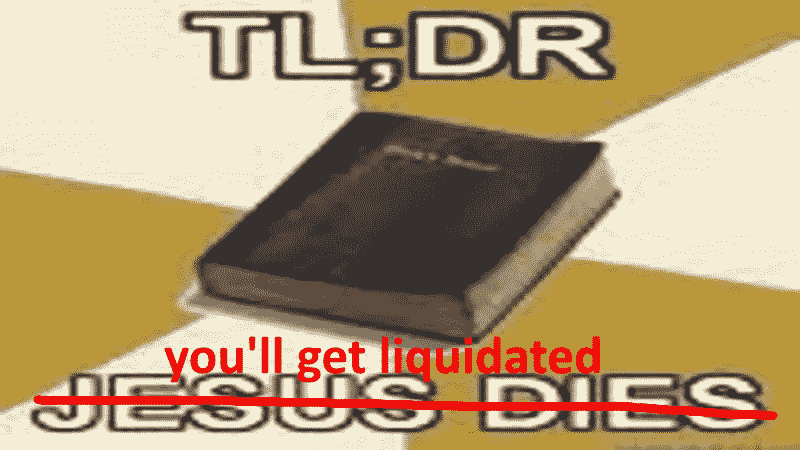
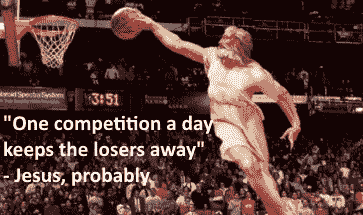
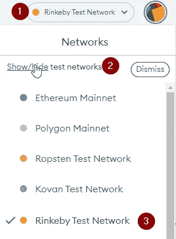
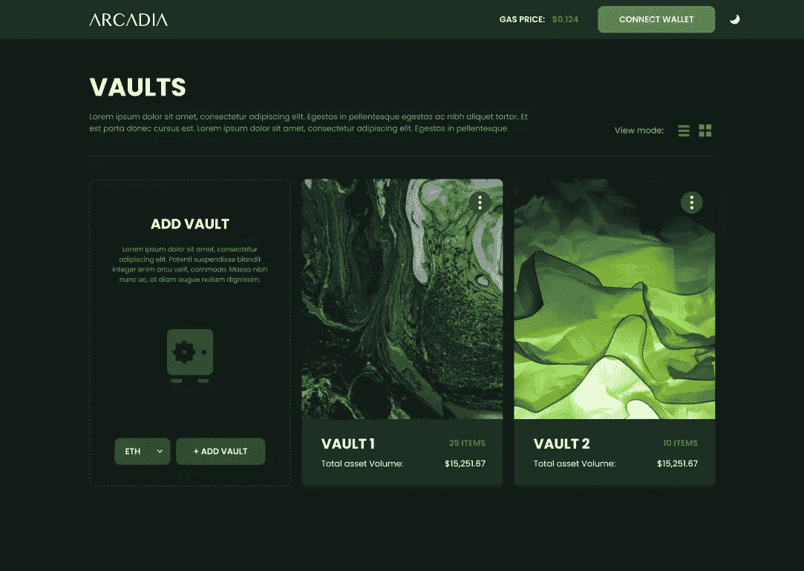
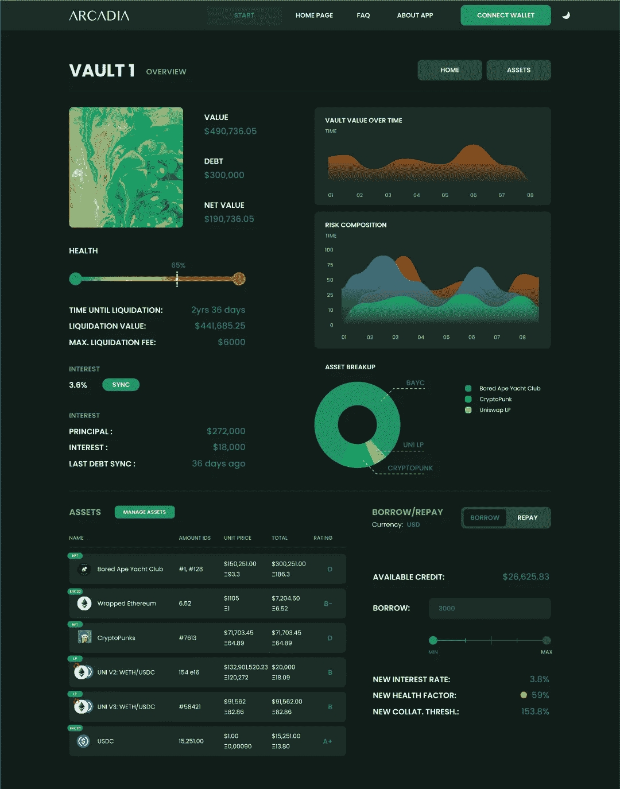
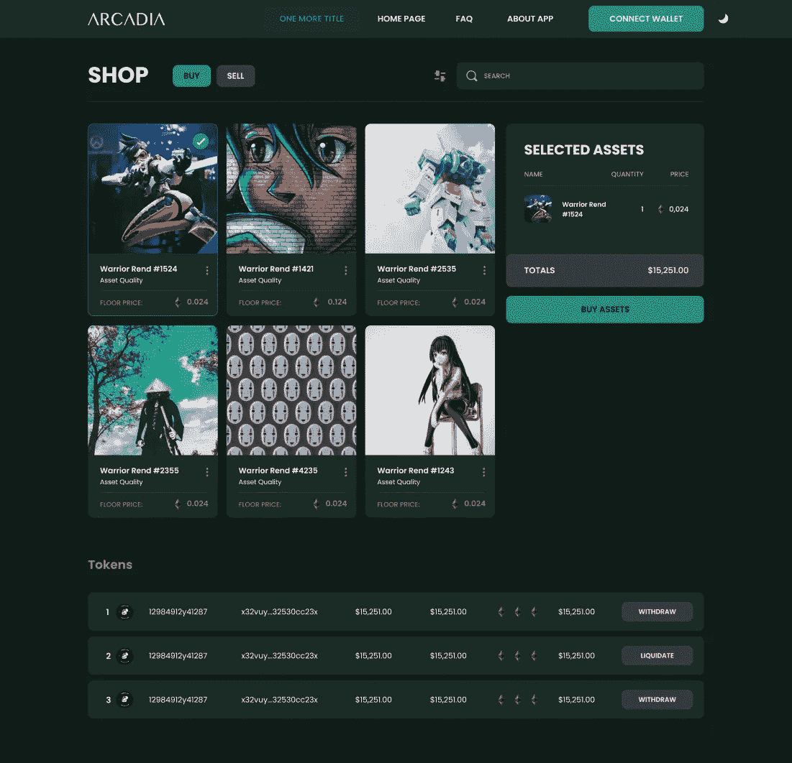
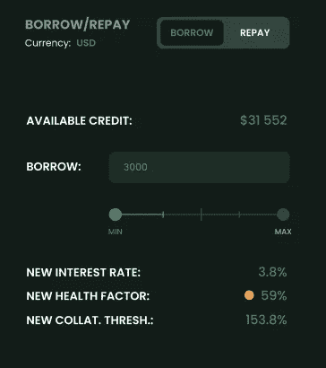

# 7 月 11 日测试网上的阿卡迪亚金融

> 原文：<https://medium.com/coinmonks/arcadia-finance-on-testnet-july-11th-1b24fd49ab2e?source=collection_archive---------4----------------------->

这是怎么回事？

TL；我们组织了一个为期一个月的论文交易比赛，来测试我们在 Rinkeby (testnet)上的核心逻辑。比赛将于 7 月 11 日欧洲中部时间 15 点开始。前 3 名保管库所有者获得(n 实际)价格。

正如你可能从我们的[以前的博客文章中所知道的，](https://arcadiafinance.medium.com/)我们阿卡迪亚金融正在建立一个贷款协议，允许用户以他们的优质资产的整个数字投资组合为抵押进行贷款(是的:加密货币、NFT、LP 头寸的任何组合……)。

我们的协议即将上线，但是我们(我们是优秀的开发者)发现首先彻底测试应用程序和用户体验是非常重要的。在本帖中，我们将描述我们的测试方法，以及您如何参与。

**交易大赛**

我们可以在测试网上发布我们的贷款协议，然后就到此为止。但老实说，我们不认为人们会在测试贷款协议中花超过 5 分钟的时间玩模拟资产。为了增加趣味，我们添加了一些特性，并在一个纸上交易游戏中改造了我们的应用程序！(因为谁不爱一些竞争呢？)

每个人都可以参与并打开一个或多个阿卡迪亚金库，每个金库的起价为 100 万美元。参与者可以买卖资产，甚至可以通过我们的借贷机制使用杠杆(本文后面会详细介绍)。

我们将使用实时的连锁价格反馈，参与者可以实时看到他们金库的价值如何演变。

比赛将持续 1 个月。目标很简单:试着在 1 个月后拥有一个价值尽可能高的金库！

**为什么作为用户参与**

*   帮助阿卡迪亚金融提供关于 UX、代码和缺失功能的反馈。
*   在网上向朋友炫耀的权利。
*   了解如何在不承担任何财务风险的情况下，使用分散式交易/借贷协议。
*   比赛结束后，为表现最佳者赢得奖励。
*   在测试网阶段结束时接收一个 POAP。

**我们想从中获得什么**

*   对我们的应用和功能的反馈。
*   检测 bug。
*   鼓励社区参与。

在接下来的段落中，我们将会介绍一些纸上交易游戏的机制:

**设置钱包**

如果你已经有一个钱包，并且知道它是如何工作的，请跳过这一部分！

我们的完整应用程序，包括价格馈送，运行在区块链网络之上(不要担心，您不需要了解所有的细节就可以参与！).由于游戏运行在 testnet(一个与以太坊完全一样的区块链，但完全免费)上，如果你做错了什么，你不会损失任何真钱。

这可能看起来很复杂，但是您只需要这样做一次！

首先，你需要创建自己的钱包(与区块链网络互动的账户和密码，以及在此基础上构建的应用程序)。如果你不能选择使用哪个钱包，我们可以推荐你去参观一下[https://metamask.io/](https://metamask.io/)。一旦您下载了您选择的钱包，请确保将您的钱包切换到 Rinkeby 测试网络。在元掩码上，可以按如下方式完成:

就像汽车需要燃料行驶一样，你的钱包需要汽油来进行交易:这些是你需要支付给矿工的费用，以便处理你的交易。对于 Rinkeby 网络，您需要 test-ethereum (rinkETH)。
我们阿卡迪亚将非常慷慨地向所有参与者发送一些测试——以太坊！加入我们的不和来和林克思:[discord.gg/PXcr8SEeTH](https://t.co/MYTv8g6xOc)。

**创建保险库**

当您将钱包连接到我们的应用程序时，首先看到的是您的保管库概览。在此页面上，您可以管理以前创建的所有保管库，也可以创建新的保管库。每个用户可以打开的金库数量没有限制，所以不要犹豫尝试多种交易策略！

打开保险库时，参与者只需做出一个决定。用户必须选择金库的记账单位(也称为“计价单位”)。这是表示保险库中资产价值的货币。我们最初将支持两种货币:美元和以太币。

如果你想使用杠杆交易策略，计价单位是非常重要的。如果你不打算使用杠杆策略，你不应该太担心选择哪个计价单位。

无论参与者选择哪种计价单位，每个金库都创建有价值 100 万美元的资产。

**保险库概述**

在“保管库概述”中，您可以找到有关其中一个保管库的更多信息。在概览页面的顶部，您会发现金库的一些指标:金库中所有资产的总价值、未偿债务、金库中资产的构成和风险等。

其次，通过概览页面，你可以去代金店，或采取/偿还债务。

**购买/出售资产**

如果用户不能交易，交易游戏就不是交易游戏了。

我们建立了一个特殊的商店，在那里用户可以直接从他们的金库买卖不同的代币！该功能稍后将被转换为用户可以主动管理其保管库中的资产的功能。现在不用担心，因为这是一个测试网上的纸上交易游戏，这些资产不会有任何实际价值。

我们有一长串各种代币或资产供您买卖。对于本次 testnet 竞赛，我们将我们限制在加密货币和 NFT 集合的精选列表中。在 mainnet Ethereum 上推出后，用户将能够存放和使用更广泛的资产，如 LP 令牌和其他 DeFi 原语。

**贷款/还款**

由于我们正在与 Arcadia Finance 建立贷款协议，当然也可以在 testnet 上获得(并偿还)贷款。

我们允许用户在交易游戏中贷款，这看起来可能有点奇怪，但正如我们在[这篇博文](https://arcadiafinance.medium.com/why-lending-protocols-matter-79eeeab30c20)中已经讨论过的，你可以使用贷款协议来建立杠杆多头或空头头寸(见下文)。

如果您不打算建立杠杆头寸，我们仍然希望您至少尝试一次贷款功能。你会帮助我们测试它，我们希望它能让你体会到 DeFi 的可能性。请注意贷款是多么快速和容易，将你的所有资产放在一个安全/分散的账本上，可以让你用你的(数字)房地产、股票和艺术品收藏获得一笔贷款。祝你在传统金融体系中尝试做到这一点好运！

阿卡迪亚金融是一个过度抵押的贷款协议，这意味着你的债务总额永远不会超过你的抵押资产的总价值。抵押门槛表明你需要多少抵押品来获得贷款。在下面的例子中，对于 10 万美元的贷款，用户需要总价值至少为 15.3 万美元的资产。

利率和抵押系数都取决于基础资产的质量。资产(不稳定、非流动资产)的风险越大，利率越高，抵押系数也越高。

**杠杆多头和空头头寸**

借贷协议允许用户建立非托管杠杆头寸，以投机定向价格变动。

**投机涨价**

让我们看一个例子来阐明这是如何工作的。对于这个例子，我们假设以太坊的当前价格等于每 ETH 1000 美元，我们的用户拥有 10 个 ETH，并且他/她想要建立杠杆多头 ETH 头寸:

*   我们的用户将他的第 10 个 ETH 存放在借出协议中。(10 ETH →净值 10 000 美元)
*   他/她获得了一笔 5 000 美元的贷款，以他/她的 ETH 头寸为抵押。(10 ETH+5000 美元—5000 美元债务→净值 10 000 美元)
*   接下来，我们的用户将其借出的 5 000 美元交换给 ETH。(15 ETH—5000 美元债务→10000 美元净值)
*   →如果 ETH 现在的价格翻倍至 2000 美元/ETH:15 ETH—5000 美元债务→25000 美元净资产，相比之下，如果他/她不使用杠杆，则为 20 000 美元。
*   →如果用户出错，ETH 降至 500 美元/ETH:15 ETH—5 000 美元债务→2500 美元净值，相比之下，如果他/她不使用杠杆，则为 5000 美元。

换句话说，你放大了你的收益，也放大了你的损失。

**推测价格下降**

以类似的方式，用户也可以对数字资产持有空头头寸(在下一个示例中为空头 ETH 头寸):

*   存入美元。(10，0 00 美元→净值 10，0 00 美元)
*   根据美元头寸在瑞士联邦储备银行贷款。(10 000 美元+ 5 ETH — 5 ETH 债务→净值 10 000 美元)
*   将 ETH 换成美元。(15 000 美元–5 ETH 债务→净值 10 000 美元)
*   →如果 ETH 的价值下降到 500 美元/ETH，您以美元计价的净资产增加:15 000 美元–5 ETH 债务→净资产 12 500 美元。
*   →相反，如果 ETH 的价值增加到 2000 美元/ETH，你的净值就会减少:15 000 美元–5 ETH 债务→净值 5 000 美元。

**清理不良金库**

如果你做到了这一步，恭喜你！！然后，你应该知道一个“隐藏”的功能，你如何可以再赚 100，00 0 美元每跳马！

如前一段所述，建立杠杆头寸并非没有风险。如果价格与交易者预期的方向相反，金库可能会变得不健康:金库的未偿债务会大于金库中所有资产的实际价值。

在实际的贷款协议中，这种不健康的金库将被清算，资产将在公开市场上拍卖。在纸上交易游戏中，模拟起来有点复杂，但是我们仍然希望用户清算不健康的金库。因此，如果用户发现不正常的存储区(这也可能是其他用户的存储区！)他/她可以清算该金库，并且该用户将在它自己选择的金库中接收 20，0 00 美元作为奖励。

用户可以在同一个金库中最多获得 5 次这样的奖励，因此每个金库总共可以获得 100，00 0 美元的额外奖励！

所有的金库都将在排行榜中可见，你可以根据健康系数对所有金库进行排序，以便轻松找到不健康的金库(或者你可以自己编写一个清算机器人，如果你精通技术，请联系我们！).

**想知道更多吗？**

如果你有兴趣了解更多关于该协议及其背后的团队，一定要加入我们的不和谐:[discord.gg/PXcr8SEeTH](https://t.co/MYTv8g6xOc)，在 Twitter 上关注我们:[https://twitter.com/ArcadiaFi](https://twitter.com/ArcadiaFi)并查看我们的网站了解更多信息:[https://www . arcadia . finance](https://www.arcadia.finance)

就是这样。最好的交易者可能会赢！

> 加入 Coinmonks [电报频道](https://t.me/coincodecap)和 [Youtube 频道](https://www.youtube.com/c/coinmonks/videos)了解加密交易和投资

# 另外，阅读

*   [阿联酋 5 大最佳加密交易所](https://coincodecap.com/best-crypto-exchanges-in-uae) | [SimpleSwap 评论](https://coincodecap.com/simpleswap-review)
*   [购买 Dogecoin 的 7 种最佳方式](https://coincodecap.com/ways-to-buy-dogecoin) | [ZebPay 评论](https://coincodecap.com/zebpay-review)
*   [最佳期货交易信号](https://coincodecap.com/futures-trading-signals) | [流动性交易所评论](https://coincodecap.com/liquid-exchange-review)
*   [火币加密交易信号](https://coincodecap.com/huobi-crypto-trading-signals) | [Swapzone 审查](/coinmonks/swapzone-review-crypto-exchange-data-aggregator-e0ad78e55ed7)
*   [最佳加密交易机器人](/coinmonks/crypto-trading-bot-c2ffce8acb2a) | [购买索拉纳](https://coincodecap.com/buy-solana) | [矩阵导出评论](https://coincodecap.com/matrixport-review)