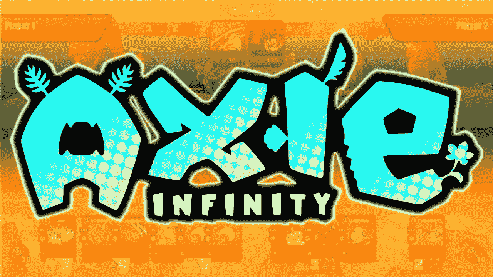

# Axie Infinity (AXS)和 Sandbox(沙子)是好的投资吗？

> 原文：<https://medium.com/coinmonks/are-axie-infinity-axs-and-sandbox-sand-a-good-investment-88bd8f4a0c68?source=collection_archive---------23----------------------->

Source photo [axie infinity logo — Bing images](https://www.bing.com/images/search?view=detailV2&ccid=KOHP2Ktx&id=C6AD894714F8205BEE5882394E5B91D33C77E920&thid=OIP.KOHP2KtxghVy-7QTvoA-aAHaEK&mediaurl=https%3a%2f%2fi.ytimg.com%2fvi%2fdcQMrT2JFw0%2fmaxresdefault.jpg&cdnurl=https%3a%2f%2fth.bing.com%2fth%2fid%2fR.28e1cfd8ab71821572fbb413be803e68%3frik%3dIOl3PNORW045gg%26pid%3dImgRaw%26r%3d0&exph=720&expw=1280&q=axie+infinity+logo&simid=607999410471399755&FORM=IRPRST&ck=E6C37C3C32C7EAB3C826C5F37E4B1731&selectedIndex=10&ajaxhist=0&ajaxserp=0)

# 无限轴(AXS)

区块链游戏 Axie Infinity 使用 Axie Infinity 碎片(AXS)作为其游戏赚取令牌的货币。独特的特征和能力可以通过在战斗中收集经验点来增强，使每个 Axie 都是独一无二的。Axies，游戏中的 NFT 人物，象征着这个区块链的贸易和战斗游戏。