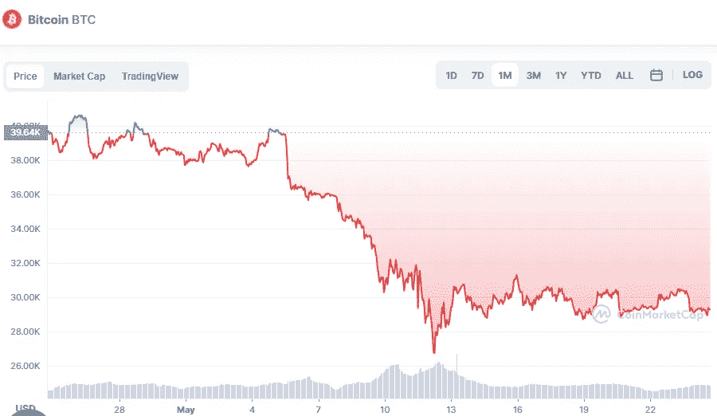

# 比特币和比特币现金是 5 月份的好投资吗？

> 原文：<https://medium.com/coinmonks/are-bitcoin-and-bitcoin-cash-a-good-investment-in-may-2a0028e904cc?source=collection_archive---------43----------------------->

# 比特币(BTC)

Source photo [Bitcoin price today, BTC to USD live, marketcap and chart | CoinMarketCap](https://coinmarketcap.com/currencies/bitcoin/)

按市值计算，该领域顶级加密货币的价格似乎稳定在每枚 29，000 美元，如上图所示。这些水平在过去一直是比特币的重要支撑，并将继续如此，因为价格已经多次反弹。