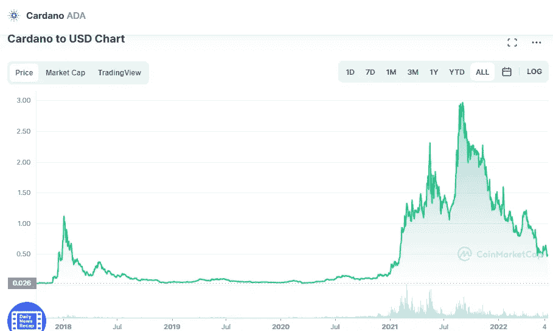

# 现在买卡尔达诺(ADA)和柴犬(SHIB)划算吗？

> 原文：<https://medium.com/coinmonks/are-cardano-ada-and-shiba-inu-shib-a-good-buy-these-days-85b680170c6b?source=collection_archive---------19----------------------->

# 卡尔达诺

Source photo [Cardano price today, ADA to USD live, marketcap and chart | CoinMarketCap](https://coinmarketcap.com/currencies/cardano/)

Cardano 是一个多功能、可持续和可扩展的区块链平台，用于实施智能合约，是第三代加密货币。智能合约和 dApps 是区块链平台的未来，旨在利用这个行业(分散应用)。