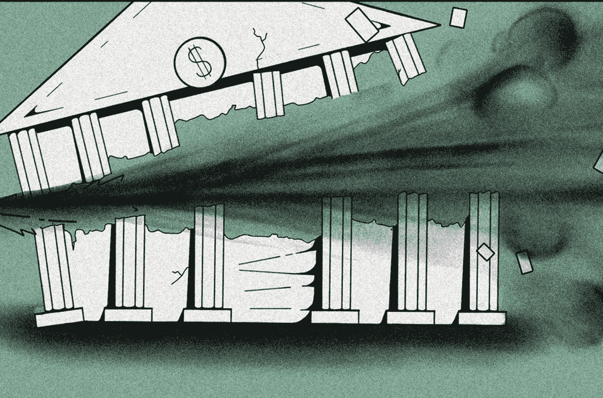
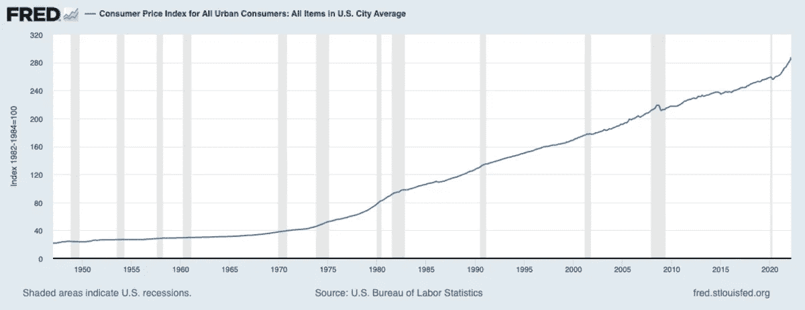
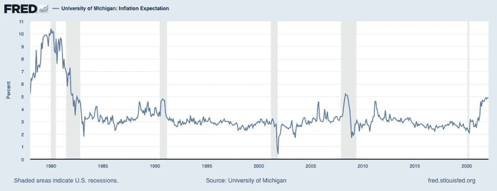
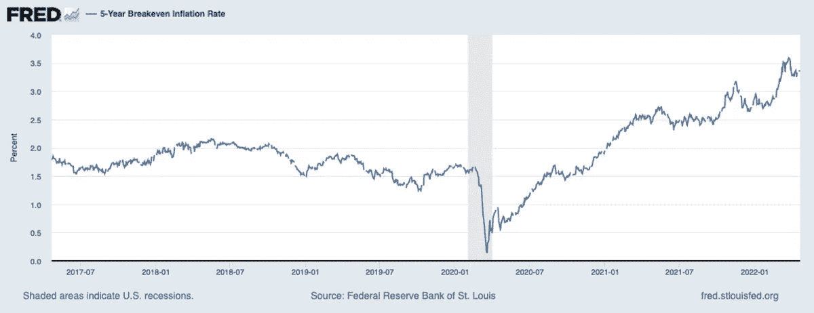
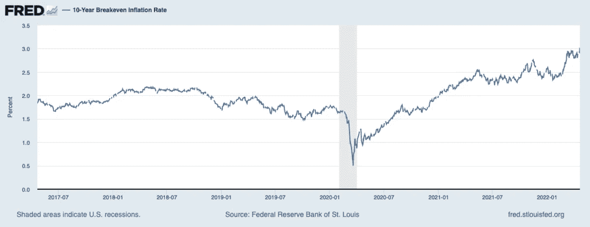
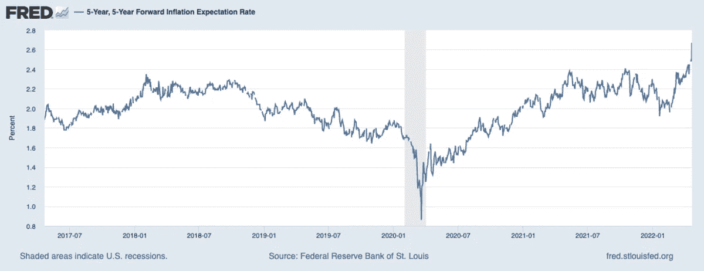
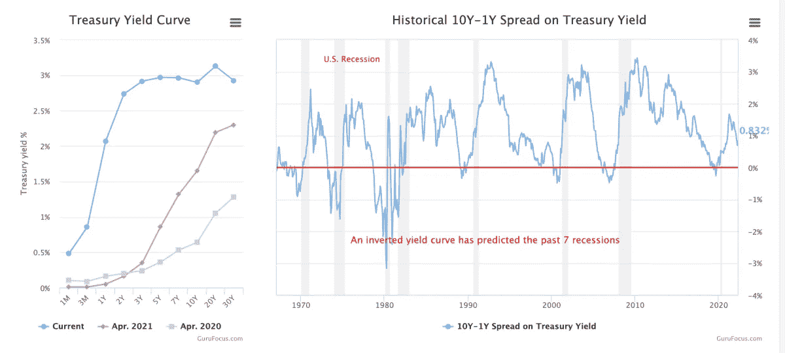

# 央行正在失去对经济的控制吗？

> 原文：<https://medium.com/coinmonks/are-central-banks-losing-control-of-the-economy-b8e3838a186b?source=collection_archive---------53----------------------->

美联储将于 5 月份在 FOMC 召开会议，许多人预计他们将在今年第二次加息。

[**在 YouTube 上看这一集**](https://www.youtube.com/watch?v=2fElE9EpMfg)

**听这一集:**

*   苹果
*   [Spotify](https://open.spotify.com/episode/05gG6Dysy6a3UpBv8Cgapj?si=9835021d307a4968)
*   [谷歌](https://podcasts.google.com/feed/aHR0cHM6Ly9mZWR3YXRjaC5saWJzeW4uY29tL3Jzcw/episode/YzQxZGU0ZWQtODQ2YS00NjY1LWFkZGEtZjFiN2I2MzVhYTNk?sa=X&ved=0CAgQuIEEahcKEwjokIiphKj3AhUAAAAAHQAAAAAQXw)
*   [Libsyn](https://fedwatch.libsyn.com/central-banks-losing-control-fed-89)
*   [隆隆声](https://rumble.com/v11ykyw-central-banks-are-losing-control-fed-89.html)
*   [阴天](https://overcast.fm/+m2adWCrCA)

在这一集的“美联储观察”播客中，我将对世界各地的央行相关新闻进行重大更新。自从我们对货币世界的材料做了一个向下和肮脏的更新已经有几个星期了，所以有很多要涵盖。听一集我的完整报道。下面，我总结了美联储相关的头条新闻和他们即将召开的联邦公开市场委员会(FOMC)会议，消费者价格指数(CPI)和通胀预期，欧洲和欧洲央行的困境，最后，中国可怕的经济问题。

“美联储观察”是一个播客，面向对央行时事以及比特币将如何整合或取代老化的金融系统的各个方面感兴趣的人。为了理解比特币将如何成为全球货币，我们必须首先了解现在发生了什么。

# 美联储日历

金融头条充斥着美联储总统和州长试图在呼吁加息方面超越彼此。最近的[来自圣路易斯联邦储备银行行长詹姆斯·布拉德，他呼吁在年底前将联邦基金利率提高 75 个基点，达到 3.75%！](https://archive.ph/rafqY)

2022 年 4 月 21 日，美联储主席杰罗姆·鲍威尔(Jerome Powell)通过预先录制的讲话在沃尔克联盟会议上发表讲话，并现场直播了与国际货币基金组织的对话。(我在播客中混淆了事件。)我希望讨论全球 CPI 形势与不同国家货币政策的关系。我们应该从鲍威尔的这些言论中了解他对当前全球经济的看法，而不是我们通常在 FOMC 新闻发布会上听到的典型的“经济正在以适度的速度增长”的普通评论。

备受期待的下一次 FOMC 会议定于 2022 年 5 月 3 日至 4 日举行。市场表示，加息 50 个基点是可能的，因此任何低于这一水平的都将是温和的惊喜。到目前为止，美联储只加息了一次，幅度为 25 个基点，但要求快速大幅加息的呼声让人们觉得，他们似乎已经做了更多。

美联储的主要政策工具是前瞻性指引。他们希望市场相信，美联储将大幅加息，他们会打破一些东西。通过这种方式，美联储的经济学家们相信他们会压低通胀预期，从而降低实际通胀率。因此，所有这些要求在年底前将联邦基金利率提高到极高水平的离谱呼吁，都是为了塑造你的预期，而不是为货币政策开出实际药方。

# CPI、通胀预期和收益率曲线

播客的下一部分是关于通胀预期的。下面是我用一些简化的评论来回顾的图表。

*(*[*Source*](https://fred.stlouisfed.org/series/CPIAUCSL#0)*)*

上图中，我们看到了 CPI 的同比涨幅。最近的数字是 8.55%，然而在 4 月份，我们进入了去年 CPI 同比加速的空间。2021 年 4 月的 CPI 从 3 月的 2.6%跃升至 4.1%。这意味着，今年 3 月至 4 月，我们需要看到类似的价格加速上涨，但我认为我们不会看到这种情况。

下面的其他通胀预期指标不同意 CPI 将继续恶化(对美国而言)。

*(*[*Source*](https://fred.stlouisfed.org/series/MICH)*)*

密歇根大学消费者物价指数预期实际上被限制在 5%以下，随着我们接近衰退，应该会迅速向下移动，安抚美联储经济学家，我想补充一点。

*(*[*Source*](https://fred.stlouisfed.org/series/T5YIE)*)*

5 年期盈亏平衡点略高于 3.3%的历史标准，但距离确认 CPI 的 8%还有很长的路要走。

*(*[*Source*](https://fred.stlouisfed.org/series/T10YIE)*)*

10 年的盈亏平衡也是如此。与历史标准相比，它甚至更低，为 2.9%，远低于 8%的 CPI。

*(*[*Source*](https://fred.stlouisfed.org/series/T5YIFR)*)*

最受关注的通胀预期指标之一是未来 5 年。它仍低于历史正常水平，为 2.48%。

所有这些指标都一致认为远低于 8%的 CPI，加上下面显示的一些反转的平坦收益率曲线，经济的不稳定性让我预计 CPI 将有序回归到 1-3%的历史正常水平。

暂时在这一点上已经成为一个迷因，但我们可以看到，这只是 CPI 读数上升的一年，已经有 CPI 见顶的迹象。短暂仅仅意味着这不是几十年的通胀趋势变化，而是高于平均水平的一个暂时时期。除了 CPI，其他所有指标都在告诉我们这一点。

*(*[*Source*](https://www.gurufocus.com/yield_curve.php)*)*

# 欧洲和欧洲中央银行

在本期播客中，我还将报道欧洲和欧元日益恶化的形势。欧洲中央银行(ECB)最近宣布，他们将在今年第三季度停止资产购买，以控制通货膨胀。欧洲的 CPI 达到了 7.5%，仍然低于美国。然而，他们的经济状况比美国差得多

欧洲同时处于许多不同的危机之中，能源危机、债务危机、去全球化危机，或许还有粮食危机和人口危机。所有这些都发生在欧洲央行放松货币政策的时候。当他们试图收紧时会发生什么？没什么好事。

由于这些原因，我预计欧元对美元和其他货币将大幅下跌。下面你会看到我在播客中提到的几个图表，供音频听众参考。

# 中国日益严重的问题

中国人民银行(PBOC)再次降低存款准备金率(RRR)，自 2022 年 4 月 25 日起生效。在这一部分中，我通读了 FXStreet 的一篇[文章，并沿途做了评论。](https://www.fxstreet.com/news/china-pboc-cut-the-rrr-by-25-bps-uob-202204191408)

中国最近的发展只是强化了我多年来一直坚持的观点，即中国是一只建立在信用基础上的纸老虎，它将以一种可怕的方式崩溃。

中国人没能减缓房地产崩溃或新冠肺炎的蔓延。他们灾难性地再次求助于上海和其他城市的封锁，这只会进一步削弱他们的经济。在这种环境下，它们无法推动贷款需求或放贷需求，因此各方试图通过降低 RRR 来刺激放贷。

PBOC 下一步最有可能采取的措施是强制发放贷款。他们不顾一切地增加信贷，防止泡沫完全破裂。这让人想起了上世纪 90 年代的日本，当时他们强制发放贷款，试图以类似的方式刺激经济。这对日本不起作用，对中国也不会起作用。中国充其量只是在重复日本失去的几十年。

*这个星期到此为止。感谢读者和听众。如果你喜欢这个内容，请订阅，并在 iTunes 上评论，并分享！*

**链接**

[布拉德最近的评论](https://archive.ph/rafqY)

[中国降低 RRR](https://www.fxstreet.com/news/china-pboc-cut-the-rrr-by-25-bps-uob-202204191408)

这是安塞尔·林德纳的客座博文。所表达的观点完全是他们自己的，不一定反映 BTC 公司或比特币杂志*的观点。*

*原载于 2022 年 4 月 23 日 https://bitcoinmagazine.com***。**

> *加入 Coinmonks [电报频道](https://t.me/coincodecap)和 [Youtube 频道](https://www.youtube.com/c/coinmonks/videos)了解加密交易和投资*

# *另外，阅读*

*   *[如何购买 Monero](https://coincodecap.com/buy-monero) | [IDEX 评论](https://coincodecap.com/idex-review) | [BitKan 交易机器人](https://coincodecap.com/bitkan-trading-bot)*
*   *[CoinDCX 评论](/coinmonks/coindcx-review-8444db3621a2) | [加密保证金交易交易所](https://coincodecap.com/crypto-margin-trading-exchanges)*
*   *[红狗赌场评论](https://coincodecap.com/red-dog-casino-review) | [Swyftx 评论](https://coincodecap.com/swyftx-review) | [CoinGate 评论](https://coincodecap.com/coingate-review)*
*   *[Bookmap 评论](https://coincodecap.com/bookmap-review-2021-best-trading-software) | [美国 5 大最佳加密交易所](https://coincodecap.com/crypto-exchange-usa)*
*   *[如何在 FTX 交易所交易期货](https://coincodecap.com/ftx-futures-trading) | [OKEx vs 币安](https://coincodecap.com/okex-vs-binance)*
*   *[CoinLoan 评论](https://coincodecap.com/coinloan-review) | [YouHodler 评论](/coinmonks/youhodler-4-easy-ways-to-make-money-98969b9689f2) | [BlockFi 评论](https://coincodecap.com/blockfi-review)*