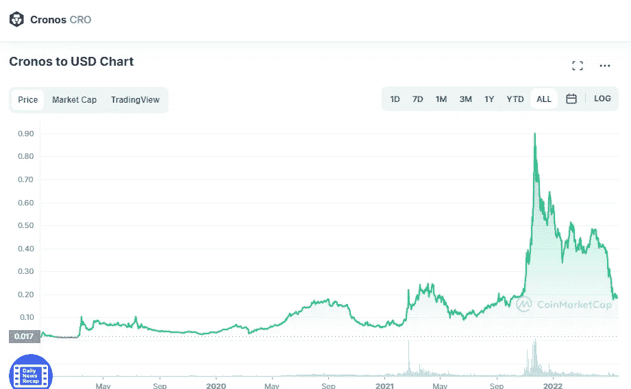

# 克罗诺斯(CRO)和恒星(XLM)是一个好的投资吗？

> 原文：<https://medium.com/coinmonks/are-cronos-cro-and-stellar-xlm-a-good-investment-17d9961a5fe6?source=collection_archive---------15----------------------->

# 克罗诺斯(CRO)

Source photo [Cronos price today, CRO to USD live, marketcap and chart | CoinMarketCap](https://coinmarketcap.com/currencies/cronos/)

全球已有超过 1000 万人下载了 Cronos (CRO 对美元)。因此，该网络希望成为快速扩张的 DeFi(分散金融)和 Web 3.0 领域的主导者。你可以使用加密货币支付任何东西，从食品杂货到信用卡支付，以及介于两者之间的任何东西。