# 加密水龙头值得吗？

> 原文：<https://medium.com/coinmonks/are-crypto-faucets-worth-it-e3f38005926?source=collection_archive---------34----------------------->

```
This post originally was published on [TapCrypto](https://tapcrypto.co/). Original source is located [here](https://tapcrypto.co/2022/02/06/are-crypto-faucets-worth-it/), please visit for more content like this and other great information to know regarding the cryptocurrency faucet space.
```

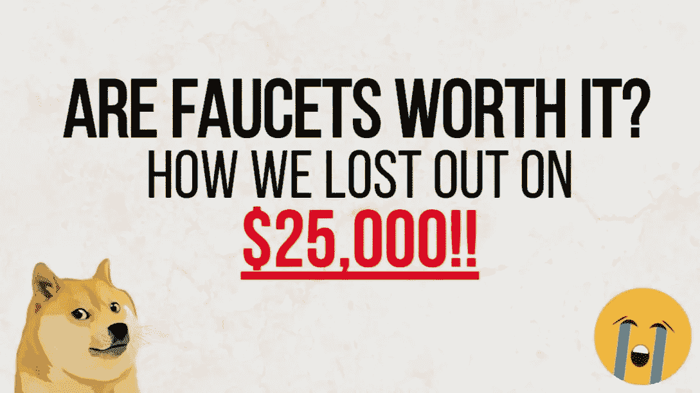

# 水龙头背后的生意，以及我们如何错过了 25，000 美元…

如果你以前读过或访问过 TapCrypto，我想你大概能猜出这个问题的答案。如果我告诉你你*可能*错了呢？不，我们并没有否定我们网站/项目/存在的全部理由。事实是，我们认为加密水龙头是一种有趣、令人兴奋、简单、无风险的赚钱方式，但更重要的是，我们相信加密货币市场的未来价值和增长。因此，我们相信今天赚的一美元明天可以变成两美元(或者更多，我们显然希望如此)。话虽如此，但像这个世界上的许多事情一样，也会有诋毁者。那些坚决反对加密水龙头的人通常没有看到更大的图景，情况，因此水龙头的价值，因人而异。下面，我们想涵盖好的，坏的，和丑陋的加密水龙头行业。请虚心阅读，礼貌评论，文明对话，我们毕竟都是人。

# 水龙头业务是如何运营的？

如果你在 [TapCrypto](https://tapcrypto.co/) 上阅读了我们对各个网站的评论，你将会发现许多网站在功能上有所不同，所以不言而喻，每个网站都有不同的商业模式。Pipeflare 和 [Free-Ethereum](https://tapcrypto.co/2020/07/23/complete-free-ethereum-io-review/) 在道德和政治方面有着同样多的共同点。也就是说，我们想把水龙头行业分解成它的基本元素。

# 收入和费用

最初的比特币龙头(以及密码史上的其他几个龙头)出于自己内心的“善良”分发了货币。加文·安德森在 2010 年创作了原作，并自己出资。人们可以辩称，这也是出于自身利益，因为让更多人获得比特币会创造一个允许比特币生存、发展和繁荣的社区，但这是吹毛求疵和毫无意义的争论。现在大部分水龙头都是作为企业或者项目来运营的，意图就是赚钱。对许多人来说，这并不是什么大不了的事情，因为至少可以让用户做出更明智的决定。不管怎样，水龙头允许许多没有资源的人购买密码，访问密码的想法仍然是相关的和重要的。加密货币的大量使用和所有权对于加密货币市场/行业来说是一件好事。

## 广告收入

水龙头赚钱的主要方式是通过广告收入。这是一个相当简单的交易/概念。水龙头将出售他们的网站页面上的空间给广告商，如横幅广告，弹出窗口，甚至那些讨厌的重定向。都是赚水龙头运营商的钱。通常情况下，网站运营商将从广告商那里获得一定比例的观看或印象，如 10，000 次。因此，网站运营者的日活跃用户越多，他们就越快达到支付门槛。为了吸引用户，运营商会通过各种加密货币向网站访客付费。这在很多方面都是互利的安排，尽管有一些不道德的经营者。

## 快捷链接

快捷链接是广告收入的一个分支。用最简单的话来说，它是一个链接，直接回到你已经在的网站，这不是一个笑话或一个错误的类型。然而，为了到达那里，你必须经历一系列的挑战。最常见的是跨多个页面的一个或多个验证码，等待时间大约为 10 秒。为什么要这么做？因为在你完成这个动作的整个过程中，你都会接触到广告。就像我们前面的部分一样，shortlink 运营商从广告商那里获得报酬，反过来向水龙头运营商支付推荐用户的费用或佣金，水龙头运营商向用户支付少量密码以执行任务。类似于广告收入，快捷链接通常以每 1000 次浏览几美元的比率为水龙头运营商赚取法定货币(美元)。下面我们将介绍 shortlink 网站向水龙头运营商支付的费用，这只是一项服务，但你会看到整个行业都有类似的费用。

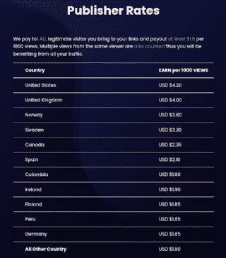

Common payout rates for shortlink visits

## 点击付费(PTC)

很多网站都有[付费点击(PTC)](https://tapcrypto.co/2021/07/27/best-paid-to-click-crypto-faucets/) 版块。如果你还不明白，这种收入来源还是围绕着广告。这种收入来源是用户创造的，而不是外部广告商。在这种情况下，水龙头用户可以利用他们已经在网站上赚到的资金，或存款和运行自己的广告活动。请在存入任何资金之前进行研究，这适用于所有网站和任何金融交易！

一个水龙头如何从这个活动中赚钱，是通过“利差”实现的。简单来说，他们对用户活动收取的费用将高于他们向观看活动的用户支付的费用。


Example PTC rate, can vary by site

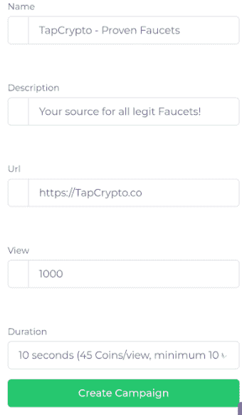

PTC Campaign Creation

在上面的场景中，我们正在创建一个成本为 0.30 美元的活动，费率为 1000 次查看，每次查看 45 个硬币。该网站的用户每次浏览只能获得 30 个硬币。因此，网站经营者赚取相当于 15 个硬币。基于每枚硬币的隐含价值，本例中的经营者每创建一次活动可获得约 0.10 美元。利润可能因网站而异，而且许多网站有不同的活动选项，如更长的浏览要求、更突出的列表等。所有这些都改变了活动的成本、支出和利润。

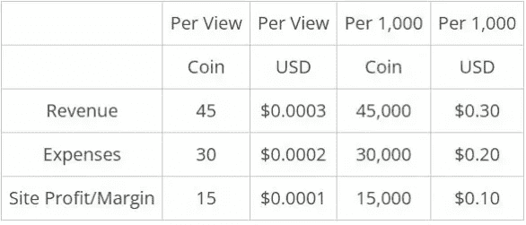

Theoretical Profits of User-Generated PTC Campaigns

## 提供墙/任务墙

要约墙，有时被称为任务墙，是水龙头和其他网站的赚钱机会。在许多网站中，这些为用户提供奖励，以换取完成各种任务或优惠。这些各不相同，有许多不同的要约墙服务提供商，如 OfferToro 或 AdGateMedia。大多数都提供类似的机会，并奖励用户参加调查、测验、观看视频或下载手机应用程序和游戏。所有用户在使用要约墙时都应该知道的一件事是，他们非常依赖数据收集。如果您购买或订阅了某项服务，您的数据将与这些广告商共享。所以和往常一样，如果你正在报名或者花钱，一定要小心。如果你参加调查和测验，要知道你是在用数据换取加密货币。这就是赚钱的方式，水龙头赚取佣金。实际上有体面和合法的报价，所以这不是一个警报，他们确实比水龙头上的任何其他活动支付更多，只要做出最适合你的决定。

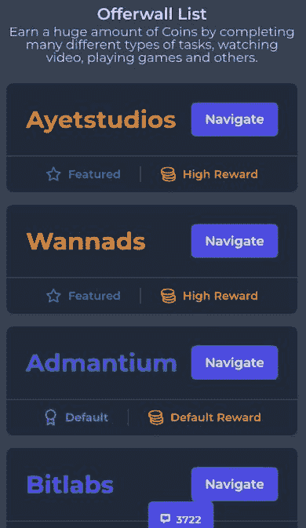

Offerwall List

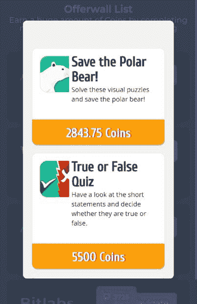

Sample Offerwall Activities

## 游戏/赌博

我不相信我听说过哪家赌场最后是输家。因此，当许多水龙头网站有一个游戏/赌博部分，他们中的大多数人都打算收回那些辛苦赚来的硬币，你从做任务。这是说，如果他们诚实行事，很可能有很多游戏也是被操纵的。大多数人声称自己是公平的，但是我们中有多少人知道如何去证实这些说法呢？这些网站绕开赌博法，主要是因为你不能赌你存入的硬币。所以所有可以下注的资金都是广告商产生的。在拉斯维加斯/澳门/所有赌场，游戏通常有所谓的“赌场边缘”。这一点，结合大数法则，确保了赌场从长远来看总是赢。因此，如果你在网站上做各种创收活动，赚了 1000 个硬币，然后赌博，输得精光。水龙头运营商刚刚赚了 1000 个硬币的价值，因为他们不再有任何与你为网站创造收入的活动相关的费用。很简单，我们自己并不反对，事实上也喜欢赌博，每个人都应该小心并理解为什么这是许多网站的特色。

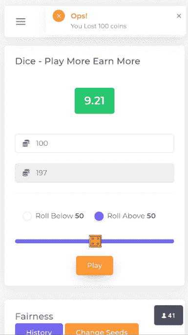

Dice, Hi-Lo, and Lotteries are the most common game on faucets

## 验证码

许多网站实际上从用户在网站上完成的每个验证码(ReCaptcha、hCaptcha、RainCaptcha、SolveMedia 等)中赚了一小笔钱。验证码的主要用途是防止机器人和垃圾邮件，一些但不是全部提供额外的收入机会。这些也可以按每 1000 次完成支付一定的金额，或一些可变的数字。它们可能不是巨大的收入来源，但它们几乎是用户完成的所有任务。

## 采矿

这是一些网站最讨厌的赚钱方式之一，如果你熟悉快捷链接和验证码的话，这就说明了很多。一些水龙头运营商将实际上有代码嵌入他们的网站，将使用网站访问者的 CPU/GPU 的权力，以挖掘加密在后台，而在网页上。这也是为什么一些龙头网站会掀起用户反病毒程序如 MalwareBytes 的原因。并非所有的网站都因为反对而这样做，但是如果有钱可赚，企业就会发现。

## 取款费

就像在[付费点击(PTC)](https://tapcrypto.co/2021/07/27/best-paid-to-click-crypto-faucets/) 活动中一样，这是由于“传播”而产生的效果。水龙头网站可能会向你收取一定数额的交易费用，但如果该数额超过他们实际支付的费用，他们获利。水龙头网站通常使用支付处理器和批量交易，以减少平均交易费用。有水龙头微钱包服务，如 [FaucetPay](https://faucetpay.io/?r=1497) 通过使用托管服务将交易费用降至零。因此，如果你因为向 [FaucetPay](https://faucetpay.io/?r=1497) 发送密码而被收取取款费，你就赚到了网站的钱。这不是一件坏事，毕竟这是一门生意，我们都对赚钱感兴趣。

# 水龙头生意如何失败

作为运营商，水龙头收入的绝大部分来自上述各种形式的广告。由于这一点，大多数收入是以非标准的时间间隔支付的，这可能会在管理收入和费用时造成一些麻烦，而这些收入和费用在过去一直是水龙头垮台的原因。你可以这样想，网站的用户每天都有收入，一旦达到一定的门槛，他们基本上可以随时退出，但网站运营商的主要广告收入可以在一个月的任何时候进来，这取决于他们与广告商的门槛。当计划和经营一个企业时，当你知道你每天都有支出，但每隔几天/几周/几个月才有收入/收益，这就很困难了。最重要的是，加密货币本身会根据市场情况改变价值，但广告收入往往是法定货币的数倍，例如美元(USD)。2021 年初，Dogecoin (DOGE)和加密市场的迅速崛起，对许多加密货币龙头进行了一次非常有趣的压力测试。这是因为一些水龙头，如心爱的硬币罐(RIP)将用户余额保存在实际硬币中。因此，如果一个用户有 100 Dogecoin 的余额，他们可能会为企业带来价值几美元的收入。然而，当 Dogecoin 的价格飙升，100 Dogecoin 价值近 72 美元时，网站面临着向用户支付欠款的挑战。根据当时的法定美元价值，价值为 1 美元并为公司带来几美元利润的支出现在变成了将近 72 美元的负债。在成千上万的网站用户中重复，你就制造了一场全面的危机。因此，如果水龙头运营商没有坐拥大量的加密货币，他们将不得不使用法币以高价购买这些硬币，这破坏了该业务的任何盈利能力。现在，网站通常是如何管理这种情况的，许多网站都有自己的“内部”硬币或货币，它们与特定的法定价值挂钩，所以在提取之前，你不会锁定加密货币的金额。这有好有坏，我们都想发横财，但水龙头网站和企业通常需要确保他们能够经受住这样的事件，在收入不稳定的情况下，这确实是唯一的解决方案。一个出不去的水龙头，对作为用户的你也没有好处！

如前所述，许多网站在方法、商业模式、收入和支出方面各不相同。我们希望涵盖加密货币龙头企业如何赚钱的基本知识，以便您可以做出更明智的决策。

# 反对水龙头的常见理由

互联网上充斥着人们对加密货币水龙头的抱怨，说它们不值得花时间。在许多方面，他们可能是对的，总体而言，水龙头行业和密码行业存在许多问题。然而，我们认为这忽略了一个事实，即一个人的兴趣和时间的价值因人而异。因此，这真的是由每个人来决定是否加密水龙头适合他们。我们在 TapCrypto 相信，出于许多原因，例如金钱机会，甚至从理论上讲，关于大规模采用加密技术，水龙头为许多人提供了有价值的服务。


# 支出很低

对水龙头最大的抱怨是支出低。收入当然可能不足以让许多人生活下去，但可以是一个很好的补充收入来源。对于世界上的某些国家/地区来说尤其如此。如果生活在高通胀或经济不稳定的国家，一周挣几美元会非常有影响力。

## 原来比特币(BTC)龙头出了 5 个比特币！

我总是嘲笑这些比较，是的，网站支付一美元几分钱……但最初的比特币水龙头也是如此。5 比特币在 2010 年还不到 175，000 美元。5 比特币价值几便士。事实上，在 2010 年 7 月，比特币成本约为 0.0008 美元(波动性很大)，每天产生 0.004 美元。我甚至不知道今天美元的通货膨胀是多少，因为！所以，如果你真的想表达观点，水龙头今天比原来支付更多。没有人真的知道比特币会变成现在这个样子。如果他们这样做了，水龙头可能不会支付的速度。最初的水龙头是用“我希望比特币成功，所以我创建了这个小服务来给你几个硬币作为开始”的消息创建的。在底部。其目的是让尽可能多的人拥有比特币，因为这是创造一场运动并刺激大规模采用的方式。它对加密货币行业和比特币增长的影响简直不可估量，就像丝绸之路或 10，000 比特币披萨的影响一样。水龙头行业肯定不像当时那样纯粹是有意为之，这符合其余的加密空间。但是，让尽可能多的人使用加密货币的部分因素仍然存在。水龙头使任何人都可以获得大量的密码，而这些人可能没有资金购买。我认为水龙头可以对加密货币的大规模采用做出贡献并带来积极的好处。

> 加入 Coinmonks [电报集团](https://t.me/joinchat/Trz8jaxd6xEsBI4p)，了解加密交易和投资

# 大多数网站都是骗局

是的，加密货币行业充满了骗局和欺诈。因此，从本质上来说，加密货币龙头业务也是如此。这就是为什么我们开始记录潜在的欺诈网站，以警告更多的人，点击[此处](https://tapcrypto.co/scam-faucets-and-sites/)查看。水龙头行业充满了令人质疑的营销、商业计划、财务支持或生存货币波动所需的资金，但一些网站已经设法保持业务多年。在 [TapCrypto](https://tapcrypto.co/) ，我们通过做以下事情来帮助水龙头用户了解信息。

*   提供众多加密货币龙头频繁更新的支付证明。
*   [回顾](https://tapcrypto.co/blog/)并详述每个网站如何运作，并提供最大化收益的技巧。
*   提供关于服务中断和其他加密行业新闻的更新 [@tapcrypto1](https://twitter.com/tapcrypto1)
*   记录并提醒用户潜在的[诈骗龙头网站](https://tapcrypto.co/scam-faucets-and-sites/)。

# 赚取利息

长期投资的魔力在于复合增长的潜力。由于整个行业的增长，现在你可以用你的 crypto 做更多的事情，而不仅仅是 hodl。下面我们将讨论几个选项，就像任何金融交易一样，在做任何事情之前，做自己的研究，了解托管服务的风险和漏洞。事情稍微规范了一些，但“不是你的钥匙，不是你的硬币”这句格言仍然适用。我们在 TapCrypto 公司喜欢把水龙头的收入用于工作，赚取利息来进一步增加我们的库存。

# 赌注证明(POS)硬币

对于那些不希望将他们的硬币交给保管服务的人来说，一个非常有吸引力的选择是投资/购买赌注证明(POS)硬币。赌注证明是区块链的一种共识机制，在该机制中，持有者委托他们的硬币来帮助保护区块链和创建新区块，作为回报，他们以新硬币的形式获得赌注奖励。这些提供了简单的方法来增加你的赌注，只要确保赌注的回报/利息百分比大于整个网络的膨胀，否则你实际上没有获得任何价值。

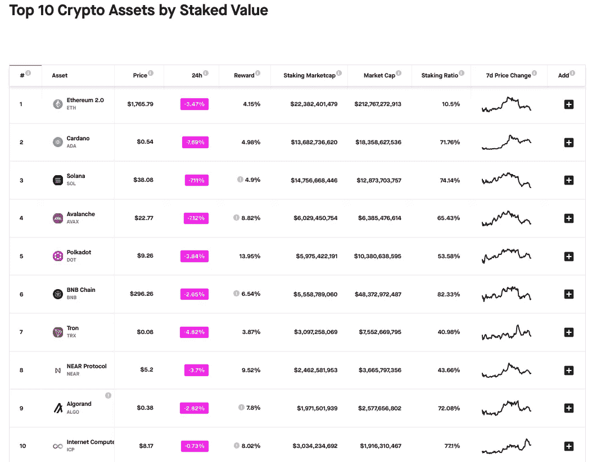

Top 10 Crypto Assets by Staked Value — [StakingRewards.com](https://www.stakingrewards.com/)

通常使用 PoS 币，您也可能有资格观看在其网络上构建的硬币空投。例如，宇宙(及其网络中的其他硬币)有近 40 个不同的正在进行或计划中的空投。许多计划都有特定要求，因此您需要确保自己符合条件。空投是一种加密分发的方法，以获得关注和网络的新用户。这些硬币通常是免费的，这为赌注者提供了非常有吸引力的激励，因为他们不费吹灰之力就获得了新硬币，其中一些可能相当有利可图。因此，经常使用水龙头是一个很好的方式来补充或创造一个隐藏的赌注证明硬币，以获得更高的回报。

# 兴趣应用

自我保管钱包和赌注不是每个人都适合的。它确实需要一定程度的技术理解，尽管它每天都变得越来越用户友好。您确实经常通过自我托管/抵押获得更高的回报率，但您也可以通过持有交易所/贷款服务获得一些回报。对一些人来说，依赖第三方可能是最安全的选择，就像人们依赖银行一样。有很多服务，所以在任何网站购买或存入资金之前，都要进行尽职调查。

这里有一些更著名和更受信任的服务，在许多情况下，您可以在其中保存您的密码并获取兴趣。其中许多都是作为交易所和贷款平台运作的，所以我们只是根据自己的观点进行分类。这些公司/服务通过做几件事(策略因业务而异)、交易/交易费用、出借资金和从这些贷款中获利，以及投入硬币并从实际回报和提供给用户的收益之间的差额中获利，从而从用户存款中获得利润。

## 交换

*   [比特币基地](https://www.coinbase.com/join/broeck_xd)——最受欢迎的交易所之一，但他们确实对平台上的一些硬币提供利率。在这里了解更多[。甚至提供免费密码货币作为他们“学习&挣钱”计划的一部分。](https://help.coinbase.com/en/coinbase/trading-and-funding/staking-rewards/yield)

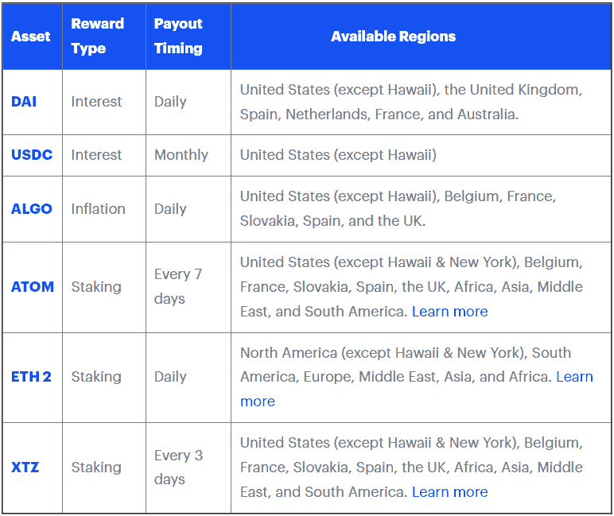

Coinbase

*   [FTX/block folio](https://link.blockfolio.com/9dzp/5c9264b1)——为在[平台](https://help.blockfolio.com/hc/en-us/articles/4407082596891-FTX-Earn)上持有的基金提供利息。

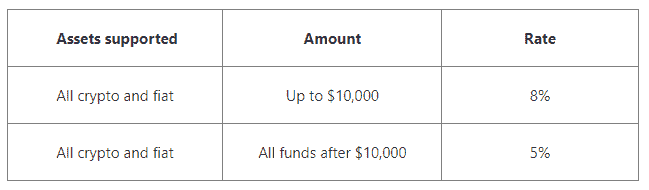

FTX

*   [币安](https://www.binance.com/en/register?ref=GACHR3YZ)——在此了解更多关于他们的 staking [。](https://www.binance.com/en/pos)

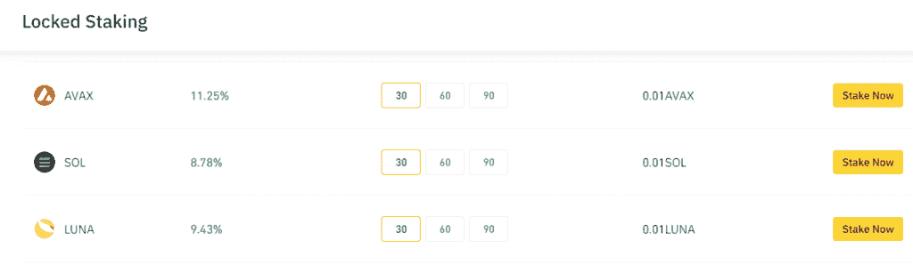

Binance

还有很多其他公司，如北海巨妖、双子座等，也提供类似的服务和价格。请研究一下，看看哪一个更适合您。

## 贷款平台

*   摄氏——在我们看来，这是我们用过的最好的服务之一。提供近 50 个硬币，包括稳定的硬币赚取利息。利率因硬币而异，但你可以在稳定的硬币上赚取 8%以上。在此检查当前汇率[。](https://celsius.network/earn)
*   **更新——我们不能再推荐 Celsius，因为他们已经** [**暂停了所有用户的提款**](https://blog.celsius.network/a-memo-to-the-celsius-community-59532a06ecc6) **，我们希望没有人会受到 Celsius 决定的不利影响。**

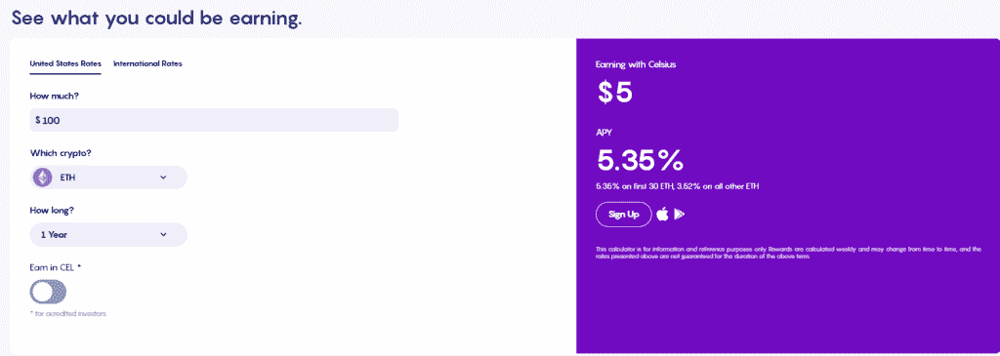

Celsius ETH Interest Example

*   [Nexo](https://nexo.io/ref/par17w1hvj?src=android-link) —我们尝试过的另一个伟大的选择。提供固定利率(必须像存款单一样持有一段时间)和浮动利率(可以随时转移资金)。点击了解更多[。](https://nexo.io/earn-crypto)

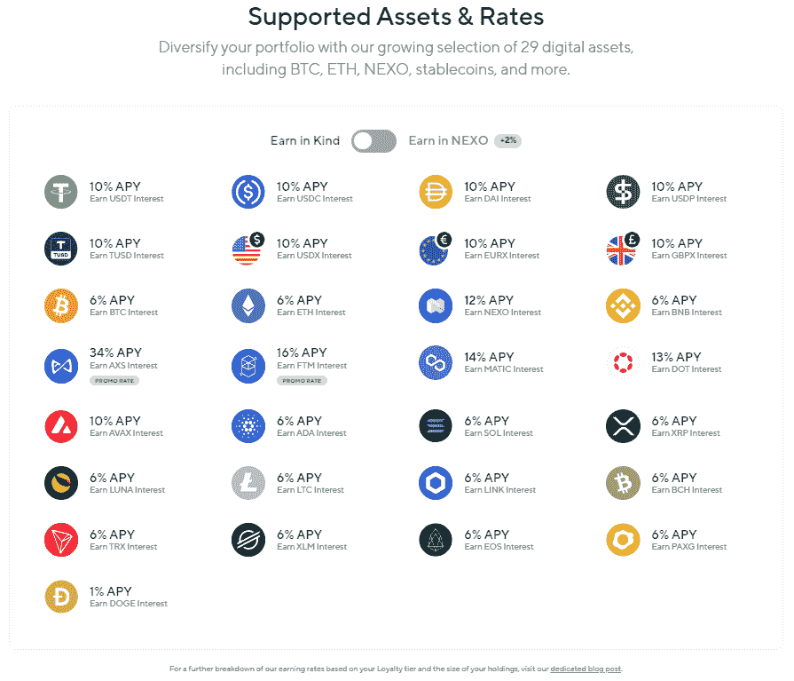

Current Nexo Rates

*   [BlockFi](https://blockfi.com/?ref=901fdce5) —另一个可靠的选择，提供有竞争力的价格和易于导航的平台。这里的[利率](https://blockfi.com/rates/)。

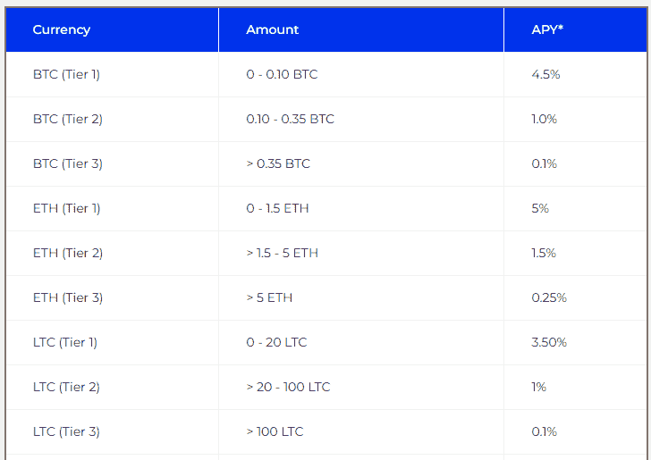

BlockFi Rates Sample

还有更多的服务，如 Voyager，请在决定投资/下注是否适合你以及是否适合你的个人情况之前，始终保持谨慎和研究。

# 加密货币的未来价值

在过去几年里，一直使用水龙头的有趣之处在于，你可以看到早期积累硬币的力量以及加密货币市场的整体价值增长。根据牛市和/或熊市的时机，这可以双向进行，但我们想展示一些有趣的真实例子，使用实际的支付凭证。

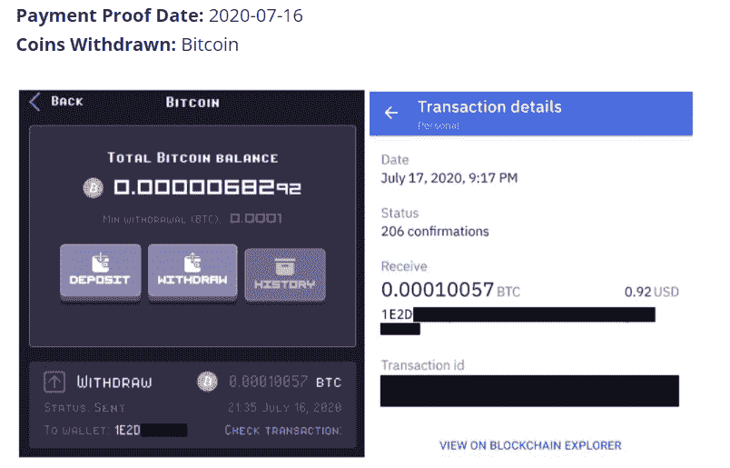

Current Value (at time of writing) = $2.97 (222.83% ROI)

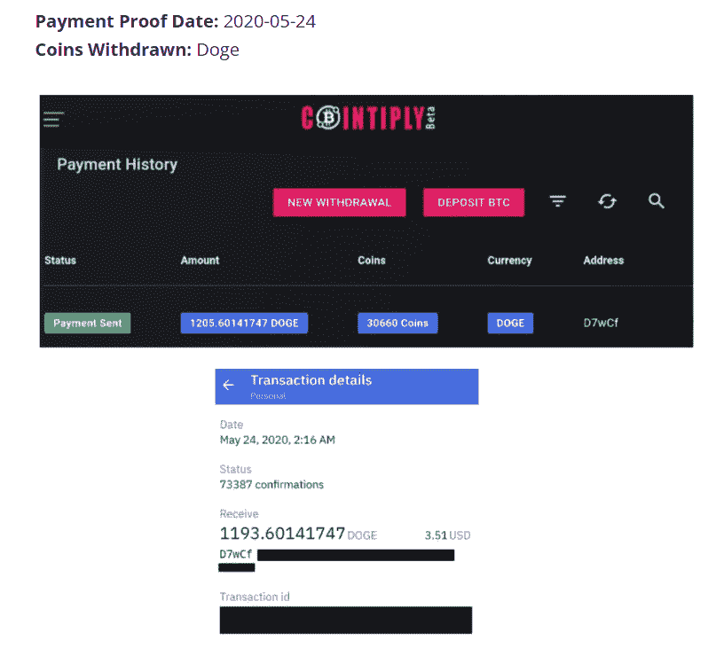

Current Value (at time of writing) = $95.57 (2,622.79 % ROI)

没有人知道未来，如果有人说他们知道，那他就是个骗子。因此，没有办法知道加密货币行业会发生什么。如果你像我们一样，相信密码行业会继续存在、发展和繁荣，那么水龙头和其他网站，如 T2、萝莉或勇敢的网络浏览器，是一种简单的“积累 sat”和 hodl 的方法。从 2010 年到现在，期望比特币有同样的价值增长是不合理的，但 2021 年 Dogecoin 发生了类似的事情。你赶上火箭飞船的几率总是很低，但也不是不可能。我们就是这样错过了一个 25000 美元的机会。从 2016/2017 年左右，我们一直是非常随意的水龙头用户。我们估计，到 2018 年年中，我们已经收集了大约 35，000 枚 Dogecoin，更不用说许多其他加密货币，我们一收到它们就卖掉了。在 2018 年约 0.005 美元的价格下，我们用约 175 美元交易了一堆其他硬币，其中一些已经不在了。在其峰值价格近 0.72 美元，这是 25，200 美元…哎哟:(。也就是说，我们继续持有多年来通过水龙头赚来的硬币，并继续对加密货币水龙头感兴趣。

如果你想亲自查看一些合法的加密货币水龙头，在 [TapCrypto](https://tapcrypto.co) 我们已经整理了经过验证的水龙头列表。

[比特币水龙头](https://tapcrypto.co/bitcoin-faucets/)、[以太坊水龙头](https://tapcrypto.co/ethereum-faucets/)、 [Dogecoin 水龙头](https://tapcrypto.co/dogecoin-faucets/)、 [Solana 水龙头](https://tapcrypto.co/solana-faucets/)、[莱特币水龙头](https://tapcrypto.co/litecoin-faucets/)、 [Zcash 水龙头](https://tapcrypto.co/zcash-faucets/)、[比特币现金水龙头](https://tapcrypto.co/bitcoin-cash-faucets/)、 [Dash 水龙头](https://tapcrypto.co/dash-faucets/)、[币安硬币水龙头](https://tapcrypto.co/binance-coin-faucets/)、 [Digibyte 水龙头](https://tapcrypto.co/digibyte-faucets/)、 [Tron 水龙头](https://tapcrypto.co/tron-faucets/)、

查看我们新的[移动网络应用](https://wiggly-soap-9680.glideapp.io/)，它可以快速、高效地申请和组织您选择使用的所有水龙头！点击了解更多信息[！](https://tapcrypto.co/2022/03/05/tapcrypto-mobile-app-and-site/)

我们在 [TapCrypto](https://tapcrypto.co/) 感谢您的关注，并在页面上走了这么远。通过订阅我们的[网站](https://tapcrypto.co/)，你可以找到我们使用的所有加密货币水龙头、[网站评论](https://tapcrypto.co/blog/)，以及支付凭证。关注我们 [@tapcrypto1](https://twitter.com/tapcrypto1) 。谢谢大家！

附属公司免责声明:以上任何内容都不应作为财务建议，每个人都应该做自己的尽职调查，并根据自己的经验和情况做出决定。这篇文章中可能有附属链接。如果你点击一个链接，并与这些公司做生意，我们可能会赚取一小笔佣金，以保持 TapCrypto 运行。