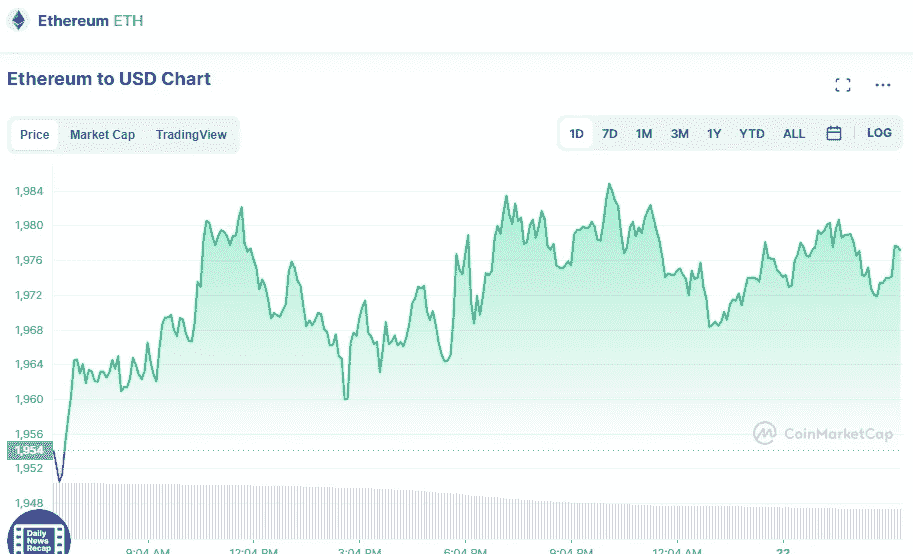

# 如今以太坊(ETH)和比特币(BTC)是好的投资吗？

> 原文：<https://medium.com/coinmonks/are-ethereum-eth-and-bitcoin-btc-a-good-investment-these-days-f948744c57b0?source=collection_archive---------21----------------------->

# 以太坊

Source photo [Ethereum price today, ETH to USD live, marketcap and chart | CoinMarketCap](https://coinmarketcap.com/currencies/ethereum/)

凭借其智能合约功能，以太坊是一个公共开源区块链，在设计时就考虑到了最终用户。分散的应用程序开发人员使用以太坊的开源区块链基础设施来托管和构建包含智能合约的 d app。由于它是世界第二大…