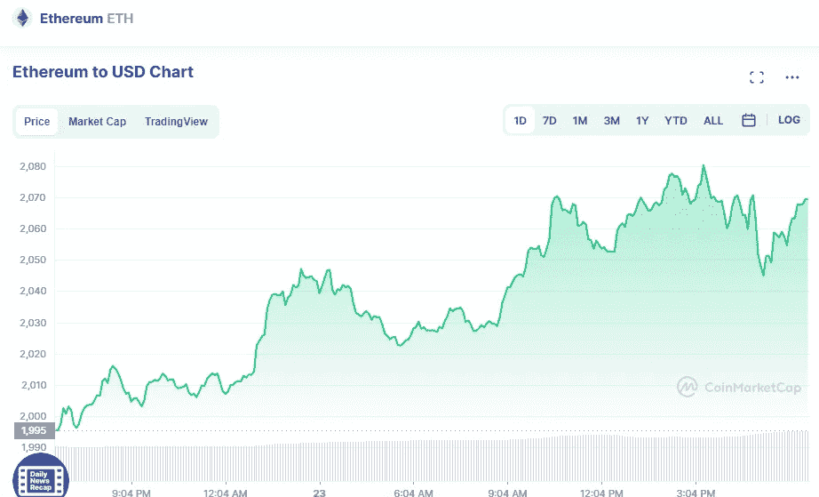

# 以太坊(ETH)和卡达诺(ADA)是不是 5 月份的好买卖？

> 原文：<https://medium.com/coinmonks/are-ethereum-eth-and-cardano-ada-a-good-buy-in-may-5c027406b062?source=collection_archive---------34----------------------->

# 以太坊

Source photo [Ethereum price today, ETH to USD live, marketcap and chart | CoinMarketCap](https://coinmarketcap.com/currencies/ethereum/)

自中本聪以来，以太坊是 Satoshi 最初的分散金融系统思想的进一步发展。包括分散金融(DeFi)和 NFTs 生态系统在内的许多子行业都由该协议的智能合约功能提供支持。现在有几个交易所可以让你购买以太坊。越来越多的…