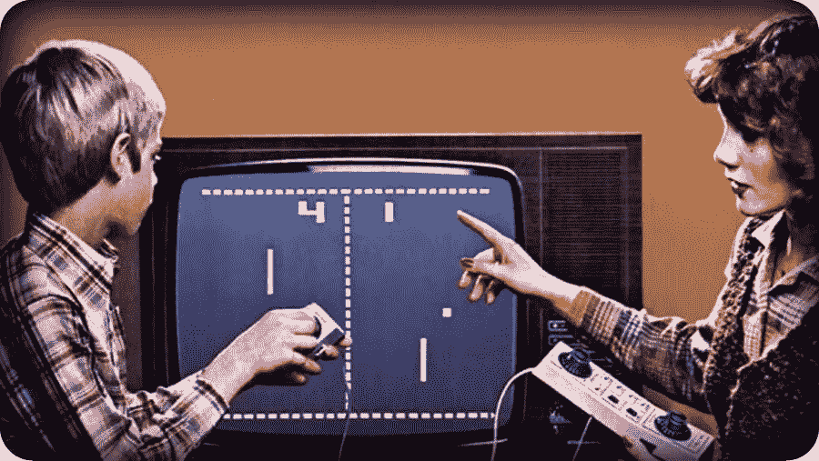

# NFTs 是骗局吗？是的，但是…

> 原文：<https://medium.com/coinmonks/are-nfts-a-scam-yes-but-6f6c22f6a581?source=collection_archive---------15----------------------->

We are in the Pets.Com era of NFTs.

密码空间里发生了很多事。

上周，一个备受期待的名为 [Hoppers](/coinmonks/how-to-buy-your-first-money-making-nft-213cc976303b?sk=16d56730edceac0a6f8c49f5acaf91af) 的项目上线了。

10，000 份 NFT 在几分钟内全部售罄。如果你很好奇，每一个最初的价格是 1.7 美元，相当于 125 美元。

考虑到潜在的上涨空间，这相当便宜。但考虑到我花了 100 多美元买了一张青蛙的照片，这太贵了。

这就引出了我的观点:

本周，我想以跳棋为例教你如何玩加密游戏。但是游戏正在维护中。就像我说的:狗屎发生在密码里。

这是一个很好的时间，让我们退后一步，列出什么是弗里克非功能性思维，以及为什么大多数人对非功能性思维是完全错误的。

# “NFT 是一个骗局”

我已经交易这些 MFers 几个月了，我仍然很难解释 NFT 是什么。

在我看来，NFT 就像区块链上独一无二的交易卡。以我的投资组合为例，我的 NFT 存在于雪崩区块链。这意味着我使用$AVAX 加密货币买卖它们。

我的大多数普通朋友都说 NFT 是扯淡。他们说，“它们唯一的价值就是增值”。

甚至无法反驳他们。除了一个事实，一半的时间，他们甚至没有增加价值 LOL

**以下是我的拍摄:**

NFTs 的当前状态就像。90 年代末和 21 世纪初的网络泡沫。

有一堆玩家进入竞技场。99%的人都撑不到 2022 年的 Q2，更别说明年了。

但是，但是…

将会有一些早期的大人物幸存下来。

亚马逊人。易趣。pets . com…开个玩笑。事实上，现在市场上的大多数 NFT 项目都将步 Pets.com 的后尘:

臃肿市场最终破裂的有趣例子。

但是就像。更重要的事情正在幕后发生。几年后，那些来来去去的 NFT 项目将不再重要。重要的是他们为之奠定基础的用例。

当然，Pets.com 已经死了。但是*网站*并没有死。

的问题是。网络泡沫是人们把网站放在了商业马的前面:

> *并不是每个网站都会自动成为一项业务……*
> 
> *但是每个企业都需要一个网站。*

同样的事情也会发生在 NFTs 上。

现在，我们对待非功能性网站就像对待“有价值的东西”一样，就像我们对待网站一样。

NFTs 将是项目的补充，而不是项目本身。它们将是达到目的的手段。

这些目的是什么？

# NFTs 作为票证

你将使用 NFT，而不是使用二维码进入音乐会或乘坐飞机。

某些事件已经在这样做了。科切拉就是一个例子。

转向 NFTs 可能有助于避开 Ticketmaster 这样的寄生公司，以及它们的狗屁费用。

您还可以使用 NFT 登机牌乘坐飞机、火车和公共汽车。

为什么使用 NFT 作为门票比二维码更好？确切地说，我还在试图弄清楚。

相信我。我正在学习。

# 赌博

现在的加密游戏利润丰厚(有时),但还很初级。你买了一个 NFT(基本上是一个 JPEG)，你“赌注”它(或存款)，并赚取回报。

然后游戏的流动资金用完了，硬币变为零，你开始下一个游戏，希望在这个过程中获得一些利润。

两年后，与当前的视频游戏相比，这个框架将像 Pong 一样过时。

“如果你输了这场比赛，提米，我会把你的屁股变成 NFT，在公开市场上卖掉你。”

下一步将会是你真正喜欢玩的高质量游戏*和*为你赚钱。近期的潜在重量级人物:

+ [帝国帝国](https://imperiumempires.com/)

+ [上升器](https://twitter.com/PlayAscenders)

+ [拉格纳克](https://twitter.com/RagnarokMeta)

+GSWAP

# 音乐+书籍+美术

吴唐帮只发行了 36 本他们的新书作为限量版。

这是创意发行的未来:

创作者将拥有他们的产品，拥有他们的作品，并通过将他们的艺术转化为 NFT 来拥有发行权。

现在，你可以说任何人都可以复制艺术家的音乐或书籍，并免费分发。

你完全正确。人们一直在这么做。

但是人们的复制能力并没有改变人们想要拥有真正的东西的愿望。

这样想一想:

人们可以复制任何艺术品。例如，一幅完美的蒙娜丽莎复制品在 2021 年卖到了 30 万美元。听起来不错吧？当你考虑到真品价值近 10 亿美元时，就不是了。

另一个例子:任何人都可以复制一张有价值的交易卡并出售，但它永远不会像原件那样有价值。

**为什么？**

因为人们想要真正的东西。这就是为什么收藏家们给他们的硬币和漫画书分级。

为什么人们会认证他们的体育纪念品。

为什么出售伪造的艺术品是犯罪行为。

为什么典当明星让那些愚蠢的专家鉴定物品的真实性。

因为拥有*真品*才有价值。

***为什么？***

NFT 领域的大多数人都忽略了这一最重要的部分。他们认为质量、稀缺性和验证是 NFT 和其他收藏品有价值的原因。

不是的。

想想吧。《蒙娜丽莎》不是世界上最好的艺术品。这是一幅坐着的人物的陈旧画像。然而，人们从世界各地赶来看它。

# 为什么？

因为这个故事:

+蒙娜丽莎被盗过多次。

没人知道蒙娜丽莎到底是谁。

+达芬奇去世的时候是在他的画室里。

+这幅画在二战中被疏散到法国乡村。

这就是真正的蒙娜丽莎画作背后的故事。

一个复制品，再完美，也没有那个故事。

这就是真品和复制品的区别。这就是 NFT 和 JPEG 的区别:

***人不买 NFT。他们买故事。***

当您将这个故事添加到我上面提到的可能用例中时，您就拥有了一个强大而有价值的资产。

那么 NFTs 是骗局吗？

目前来看，大部分都是。

但不会太久…

***

想要独家访问我的每周加密观察列表，在那里我告诉你我在未来几周投资的项目？

[注册我的时事通讯](https://sendfox.com/lp/1x9d5n)，在雪崩区块链的“玩到赚”游戏中赚取$$。

感谢阅读！

格雷格“密码小子”拉森

> 加入 Coinmonks [电报频道](https://t.me/coincodecap)和 [Youtube 频道](https://www.youtube.com/c/coinmonks/videos)了解加密交易和投资

# 另外，阅读

*   [支持卡审核](https://coincodecap.com/uphold-card-review) | [信任钱包 vs 元掩码](https://coincodecap.com/trust-wallet-vs-metamask)
*   [Exness 回顾](https://coincodecap.com/exness-review)|[moon xbt Vs bit get Vs Bingbon](https://coincodecap.com/bingbon-vs-bitget-vs-moonxbt)
*   [如何开始用加密贷款赚取被动收入](https://coincodecap.com/passive-income-crypto-lending)
*   [BigONE 交易所评论](/coinmonks/bigone-exchange-review-64705d85a1d4) | [电网交易 Bot](https://coincodecap.com/grid-trading)
*   [氹欞侊贸易评论](https://coincodecap.com/anny-trade-review) | [CoinSpot 评论](https://coincodecap.com/coinspot-review)
*   [新加坡十大最佳加密交易所](https://coincodecap.com/crypto-exchange-in-singapore) | [购买 AXS](https://coincodecap.com/buy-axs-token)