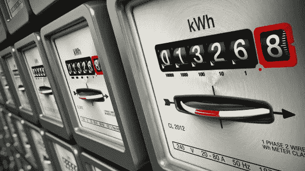

# NFT 对环境有害吗？

> 原文：<https://medium.com/coinmonks/are-nfts-harmful-to-the-environment-a3688fb70ef5?source=collection_archive---------44----------------------->

Photo by [Andrey Metelev](https://unsplash.com/@metelevan?utm_source=medium&utm_medium=referral) on [Unsplash](https://unsplash.com?utm_source=medium&utm_medium=referral)

让我把重点放在我相信气候变化是真实的，它是对地球和人类造成巨大破坏的最大威胁。

气候变化的原因有很多很多，那么为什么我们一直听到 NFT 对环境有多糟糕呢？NFT 对环境有害吗？

NFT 是类似于加密货币的代币。它们使用与加密货币相同的工具构建，运行在相同的技术上。我们在最近的新闻中明确看到，政府正在全面打击加密货币，称犯罪、金融系统风险增加以及对环境的负面影响是打击的主要原因。

# 为什么 NFT 消耗如此多的能量？

与环境有关的主要原因似乎源于 NFT(和其他加密货币)运行的基础技术——区块链——所产生的高能耗。那么，是什么让区块链消耗如此多的能源呢？像比特币和以太坊这样的区块链的特点是去中心化，这意味着交易的会计和验证发生在不受单个中央实体控制的大型计算机上。任何人都可以用自己的电脑参与这个被称为工作证明“挖掘”的过程。我们不会讨论工作证明与股权开采证明之间的区别，尽管有很大的定性差异。我们也不会讨论不同的区块链如何不同地发挥作用，这也是实质性的。我将简单地说明区块链矿业消耗了大量的资源。它消耗大量的资源，因为为了参与挖掘过程，必须解决大量的数学难题。全世界有许多计算机参与采矿作业。然而，这仍然回避了一个问题…到底消耗了多少能量？

剑桥[大学](https://ccaf.io/cbeci/index)估计，仅比特币(意指仅操作比特币的区块链)每年消耗的电力就达到 144.64 TWh。这意义重大。这相当于整个国家的能源消耗。相比之下，埃及和英国在 2020 年分别消耗了 [153 太瓦时和](https://www.dw.com/en/data-centers-energy-consumption-steady-despite-big-growth-because-of-increasing-efficiency/a-60444548)286 太瓦时。当您考虑到现有的许多区块链及其相应的网络流量时，这些数字会急剧增加。因此，当有人说 NFT 对环境有害时，这是有道理的。我发现这一立场的不真诚之处在于，它往往被说成是出于无知的俏皮话。那是什么意思？不知道什么？

# 只是 NFT 的吗？

你玩 xbox 吗？Playstation？你用脸书还是 Instagram？你用谷歌还是看网飞？所有这些服务都有类似的碳足迹和能源消耗情况。

网飞说，为了便于说明，我们只看一个例子。仅仅一个小时的流媒体消耗的电量([. 08 千瓦时](https://www.iea.org/commentaries/the-carbon-footprint-of-streaming-video-fact-checking-the-headlines))相当于一辆特斯拉行驶 30 多公里或让一个 LED 灯泡日夜工作一个多月所消耗的电量。那只是你…一个人看网飞一个小时。网飞有大约 2 . 21 亿“付费”用户。我说“付费”是因为目前关于密码共享的争议。粗略的计算表明，每年的能源消耗约为 75 至 90 千瓦时。即一天一小时的流媒体播放量。随着密码共享和疯狂观看，这个数字急剧上升。我们没有听到人们叫嚣网飞的环境有多糟糕。正如我前面所说，这不仅仅是网飞的问题，所有其他流媒体服务也是如此。关于银行消耗了多少处理能力，我也可以很容易地提出同样的观点。我的观点是，没有人因为网飞或银行对环境造成的危害而要求抵制它们。

所以，在你说你不愿意购买 NFT 的产品是因为它们对环境有害之前，你应该问问自己以下问题:

*   我是否准备停止使用流媒体平台？
*   我愿意扔掉我的游戏机吗？
*   我会取消我的社交媒体账户吗？
*   我会停止吃肉吗？
*   我准备好处理掉我的车了吗？
*   我会停止购买瓶装水吗？
*   我会关闭我的银行账户吗？
*   我准备好放弃手机了吗？

不要误解我，我一开始说我相信气候变化是真实的。我认为我们应该尽力减少我们自己的碳足迹。我唯一的不满是虚伪无知的评论，这些评论从根本上来说是虚伪的。不要告诉我你不喜欢 NFT，因为他们对环境造成的危害，而你却在吃着里贝耶，看着用银行借记卡支付的网飞。

保持消息灵通。

关注我这里的 [uNBees](/@unbees) 和推特上的 [@unbees](https://twitter.com/uNBees)

> 加入 Coinmonks [电报频道](https://t.me/coincodecap)和 [Youtube 频道](https://www.youtube.com/c/coinmonks/videos)了解加密交易和投资

# 另外，阅读

*   [SmithBot 评论](https://coincodecap.com/smithbot-review) | [4 款最佳免费开源交易机器人](https://coincodecap.com/free-open-source-trading-bots)
*   [杠杆代币](/coinmonks/leveraged-token-3f5257808b22) | [最佳密码交易所](/coinmonks/crypto-exchange-dd2f9d6f3769) | [Paxful 点评](/coinmonks/paxful-review-4daf2354ab70)
*   [加密套利](/coinmonks/crypto-arbitrage-guide-how-to-make-money-as-a-beginner-62bfe5c868f6)指南| [如何做空比特币](/coinmonks/how-to-short-bitcoin-568a2d0b4ae5)
*   [币安期货交易](https://coincodecap.com/binance-futures-trading)|[3 comas vs Mudrex vs eToro](https://coincodecap.com/mudrex-3commas-etoro)
*   [如何购买 Monero](https://coincodecap.com/buy-monero) | [IDEX 评论](https://coincodecap.com/idex-review) | [BitKan 交易机器人](https://coincodecap.com/bitkan-trading-bot)