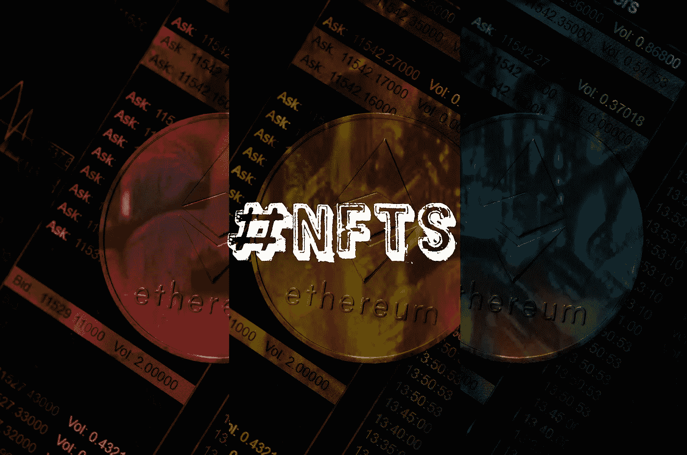

# NFT 是合法的还是一时兴起？

> 原文：<https://medium.com/coinmonks/are-nfts-legitimate-or-a-fad-d319ec8e6168?source=collection_archive---------20----------------------->

[Image by Nick Yandell from Pixabay](https://pixabay.com/images/id-6795915/)

NFT 正慢慢成为我们日常生活的一部分。

NFT(不可替代的令牌)基本上是数字资产，从 jpegs 到视频都可以交易。它们在区块链上运行，这是一个分散的分类账，记录交易、所有权和每个 NFT 的有效性。

NFTs 迎合了人类对所有权和真实性的需求。为什么许多项目都在寻求将他们的产品与 it 相集成的一个原因。

非功能性测试已经存在，而且远非时尚。

NFT 是巨大的商机，是人们赚钱的新途径。它吸引了艺术家、名人和顶尖运动员。

与加密货币不同，NFT 是独特的，它们不可互换。

NFT 在区块链经济中早已为人所知，但最近随着许多世界领先的名人和品牌进入该行业，它们引起了公众的注意。

一些值得注意的案例包括:

1.由著名的有 225 年历史的拍卖行佳士得售出的第一件纯数字艺术品。

2.迈克·温克尔曼(又名毕普)的 NFT 作品《每一天:前 5000 天》(Everydays:The First 5000 Days)拍出了令人咋舌的 6930 万美元。这个价格使皮普尔成为拍卖史上第三位最有价值的在世艺术家，仅次于杰弗·昆斯和大卫·霍克尼。

3.另一个有趣的案例是波兰 Instagrammer Marta Rentel，当世界上第一个公用事业 NFT 平台 Fanadise 将模特的“爱”作为一种象征出售并以 25 万美元的价格出售她的情感象征化版本时，她成为了国际头条新闻。

4.推特创始人杰克·多西以 NFT 的身份发布了他的第一条推特，售价超过 290 万美元。买家 Bridge Oracle 首席执行官 Sina Estavi 也出价购买了 NFT 版的 Elon Musk tweet。当被问及为什么选择出价这么高时，Estavi 简单地回答道，“通过竞标杰克·多西历史上的第一条推文和埃隆·马斯克的 NFT，我想强调 NFTs 对加密和技术领域未来的重要性。”

我认为，非加密货币之所以会存在，不是因为有很多买家，而是因为它们是第一种脱离数字资产，与其他加密货币的价格无关。

此外，国家森林公园越来越多的使用案例将确保它们成为区块链生态系统不可或缺的一部分。

感谢您的阅读！

> 加入 Coinmonks [电报频道](https://t.me/coincodecap)和 [Youtube 频道](https://www.youtube.com/c/coinmonks/videos)了解加密交易和投资

## 也阅读

 [## 杠杆代币[多头代币]终极指南

### 杠杆化令牌是具有杠杆化风险敞口的 ERC20 令牌，不考虑保证金、要求、管理…

medium.com](/coinmonks/leveraged-token-3f5257808b22)  [## 最佳加密交易所| 2022 年十大加密货币交易所| CoinCodeCap

### 哪一个是最好的加密交换？在本文中，我们将根据多种加密货币列出 10 大加密货币交易所

coincodecap.com](https://coincodecap.com/crypto-exchange)