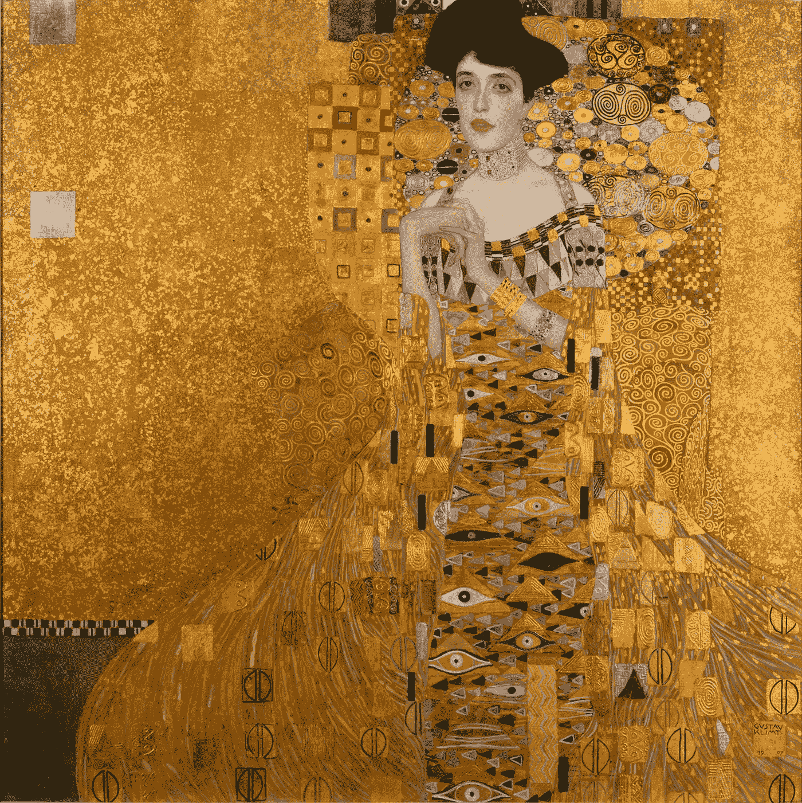

# 不可替代令牌(NFT)是新艺术吗？

> 原文：<https://medium.com/coinmonks/are-non-fungible-tokens-nfts-the-new-art-d64e0691f986?source=collection_archive---------33----------------------->

## 也许名人买家是对的

最近有一些 NFT 系列引起了巨大的轰动:想想阿姆和吉米·法伦花了几十万美元买下了 Bored Ape 游艇俱乐部(BAYC)的 NFTs。当我第一次看到它们时，它们看起来像卡通。有些有点幽默或可爱，但总的来说，对我来说没什么意思。但是这些和其他像 CryptoPunks 这样的 NFT 收藏已经成为一种主要现象。这让我想知道这有多少是关于艺术的，有多少是关于金融的。有很多密码和其他财富在寻找储存价值的方法。

有人说 NFT 是商业垃圾。有些人说它们是艺术，即使它们是由计算机生成的。当我第一次看到 CryptoPunks 和 BAYC 这样的 NFT 时，我不明白的是，许多买家也在寻求一个他们可以加入的社区。这是社交。NFT 的所有权是拥有相同兴趣的真实的人的社区的入口——至少在相同的 NFT 集合中。

我认为不可替代的艺术代币是加密货币流行文化的一面。但是所有的艺术都是如此，情人眼里出西施。

如今不同的是，有艺术家、程序员和团队铸造了 5000 或 10000 系列计算机生成的 NFT。他们使用的元素可以是手绘的，也可以是数字绘制的，但是计算机会为每次迭代掷骰子。想象一下土豆头先生——艺术家想出了这个角色可能拥有的所有元素、特征和物品——然后计算机把它们全部抖起来，输出一张数码照片。添加智能合同和加密气体，你就有了 NFT。一些人认为这是电脑制作的艺术，不值得。其他人说，这可能是另一种艺术形式，甚至可能有一个额外的维度。

NFT 带来的最大突破是允许在区块链上注册艺术品——通常是以太坊。这使得便携式数字艺术通常具有一定的许可或所有权性质。所有的交易都被记录在万维网天空中一个巨大的账簿(或区块链)上。这非常简单:你可以输入钱包地址，搜索区块链以太坊的所有交易。与[多边形](https://polygonscan.com/)相同。因此，你可以去 [Opensea](https://opensea.io/) 或另一家 NFT 交易所，通过输入所有者的钱包号码并交叉引用购买交易，来检查你喜欢的 NFT 的所有权。你也可以随时查看自己的钱包，找到自己在区块链上的所有交易。

在过去，甚至在今天，因为很难追踪所有权链——所谓的“出处”,物理艺术仍有巨大的争议像盗窃或所有权问题这样的问题会使一件艺术品卖不出去。例如，所有权链中的所有者可能从无权出售的画廊所有者或家庭成员那里购买。由于未公开的贷款，一件艺术品可能有留置权。其他艺术品可能由不止一个人拥有所有权。

区块链通过识别身份来解决出处问题——给艺术品贴上标签，识别所有者，或者买家通过智能合同同意的所有权类型。在社交酷的底层，在被其他人认为酷之前拥有一个艺术或音乐的 NFT 可以提供可识别的街头信誉。在金融的最高层面上，NFT 可以证明一件艺术品的所有权

有很多艺术家讨厌 NFTs，因为很容易窃取他们的艺术剪辑，用于拼贴，成为 NFT 的一部分。原创作品可能是已经卖给其他人的独一无二的作品，可以理解的是，看到自己的作品继续为那些甚至没有购买它的人赚钱，艺术家们会感到愤怒。其他人不喜欢艺术的商业化来丰富风险资本家和比特币兄弟。[许多艺术家不相信非功能性交易是一条出路](https://www.businessofbusiness.com/articles/nfts-turning-artists-into-millionaires-overnight-these-10-creators-are-against-the-hype/)。

也有很多游戏玩家讨厌 NFTs 的想法。在许多数字游戏中，用户创建一个化身，他们用它来进行任务，赢得战斗，并获得战利品。游戏中没有钱易手——都是大富翁的钱。游戏中的钱是记录进度和记录分数的一种方式。但是没有必要用真钱来提高游戏技能。一些游戏玩家担心，将化身变成昂贵的 NFT 并需要真实世界的钱来资助游戏中的生活将是昂贵的，并剥夺了游戏的乐趣。另一方面，有些玩家希望在游戏结束时卖掉他们所有的游戏财产，但是在一个没有钱的游戏中，没有真正的钱。这些游戏玩家希望将他们在游戏中花费的时间转换成真实的金钱。

但是让我们回到艺术上来。最近引起我兴趣的一个非常流行的 NFT 收藏是 [Monas](https://opensea.io/collection/monas) 。快速声明，我有几个，但我不卖。Monas 看起来像拼贴画，参考了流行音乐的疯狂混合，严重依赖于加密的流行音乐图像——包括一些已经起飞的 NFT 系列，以及来自游戏和元宇宙的剪辑，以及来自埃隆·马斯克和维塔利克·布特林等流行音乐和加密图标的剪辑。它们都是由电脑将分散的艺术作品或屏幕截图混合而成的。但是我发现这些图片的组合方式有一些吸引人的地方。

我最近开始关注[吉姆·迪](/@jimdee)，他是一名程序员、商人、艺术家和媒体作家。他的[无尾猫](https://opensea.io/collection/nftuxedocats)绝对漂亮。他们身上的某些东西让我想起了古斯塔夫·克里姆特。

Portrait of Adele Bloch-Bauer I. by Gustav Klimt (1907) on Open Art Images

这让我想知道克里姆特是否会成为 NFT 创作大型计算机生成集的名人。你几乎可以看到戴着不同的头、不同的项链、不同的手、不同的背景的阿黛尔·布洛赫·鲍尔——即使计算机对元素做了最后的“选择”,它仍然是一幅美丽的图像。克里姆特 1901 年的贝多芬中楣也是如此——我的意思是里面甚至还有一只猿猴！

我认为这些大型的生成集 NFT 作为一个想法很有趣。我也发现其中一些引人注目，深思熟虑，美丽。我认为这使它们成为艺术，即使是计算机帮助把它们组合在一起。

> 加入 Coinmonks [电报频道](https://t.me/coincodecap)和 [Youtube 频道](https://www.youtube.com/c/coinmonks/videos)了解加密交易和投资

# 另外，阅读

*   [本地比特币评论](/coinmonks/localbitcoins-review-6cc001c6ed56) | [加密货币储蓄账户](https://coincodecap.com/cryptocurrency-savings-accounts)
*   [什么是保证金交易](https://coincodecap.com/margin-trading) | [美元成本平均法](https://coincodecap.com/dca)
*   [支持卡审核](https://coincodecap.com/uphold-card-review) | [信任钱包 vs MetaMask](https://coincodecap.com/trust-wallet-vs-metamask)
*   [Exness 回顾](https://coincodecap.com/exness-review)|[moon xbt Vs bit get Vs Bingbon](https://coincodecap.com/bingbon-vs-bitget-vs-moonxbt)
*   [如何开始用加密贷款赚取被动收入](https://coincodecap.com/passive-income-crypto-lending)