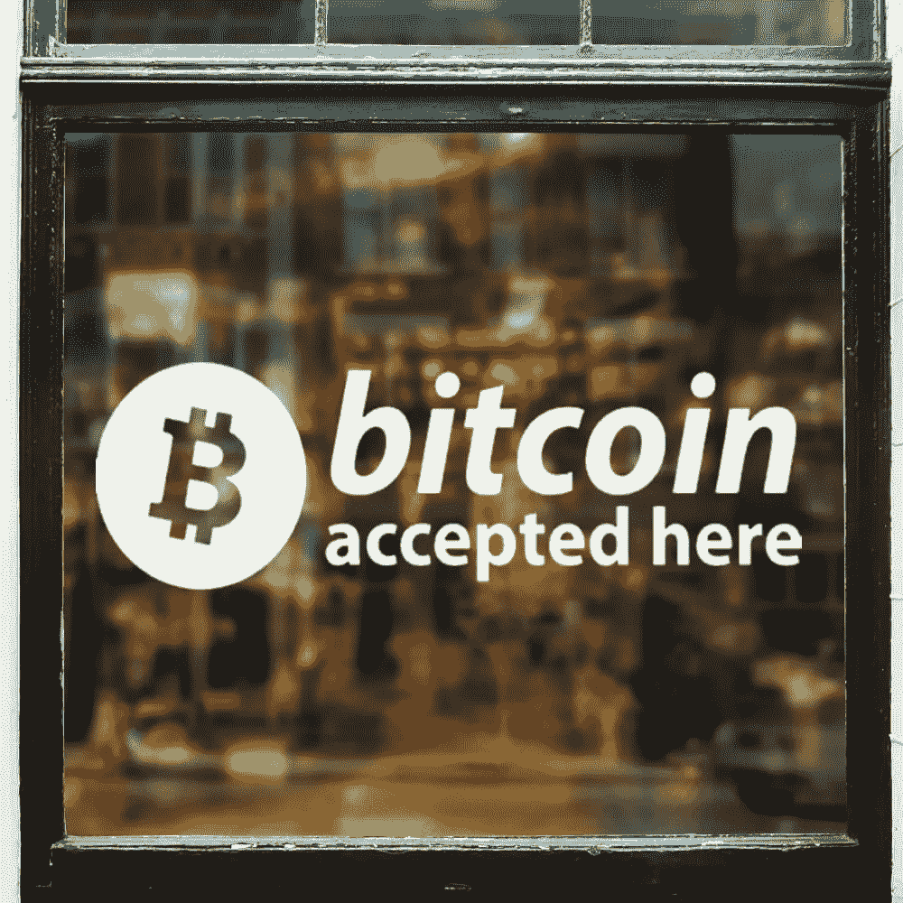
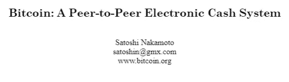
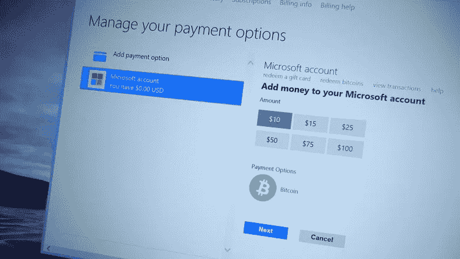
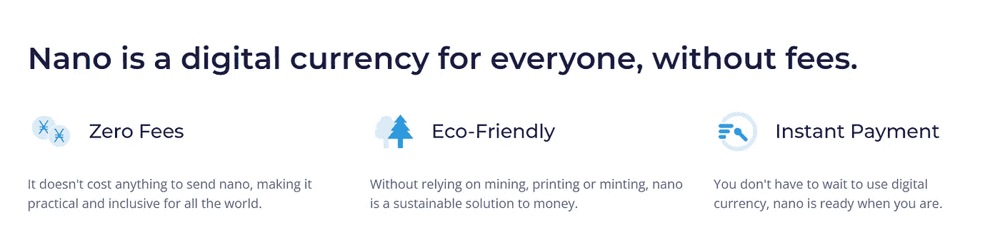

# 支付加密货币还值得投资吗？

> 原文：<https://medium.com/coinmonks/are-payment-cryptocurrencies-still-worth-the-investment-dc9a46306d2?source=collection_archive---------10----------------------->

支付曾被视为加密货币的主要用途。然而，在 crypto 出现的 12 年里，这种情况发生了显著变化，许多人将智能合同、 [DeFi](https://en.bitpush.news/articles/tag/defi) 和其他不可信的活动视为投资的主要原因。面向支付的加密货币还有腾飞的可能吗？

在 2008 年成立之初，[比特币](https://en.bitpush.news/articles/tag/bitcoin)被设想为一个“点对点电子现金系统”它成立于 2008 年大衰退期间，当时经济极度不确定，公众对银行和其他金融机构的信任度处于低位。比特币为个人提供了一种无需依赖政府货币或中间人的交易方式，同时仍具有数字货币的优势，包括细分、低费用和快速交易。

在其存在的最初几年，比特币实现了它的目标，并被用于在互联网上买卖新奇的物品。虽然它从未真正起飞，因为人们没有在知名零售商那里使用比特币，但它为自己开辟了一个利基市场。一些曾经接受比特币的最著名的公司包括视频游戏市场 Steam、微软和家具店 Overstock。比特币更多地被视为一个有趣的概念，而不是一个投资机会，因此价格波动不会困扰最初的持有者，因为他们知道这样一个项目所涉及的风险。

然而，随着时间的推移，比特币越来越被接受，它也开始失去作为支付方式的用途。价格的持续波动，以及 BTC 价格将继续上涨的情绪，使得人们不愿意花掉他们宝贵的比特币，而是囤积起来。此外，比特币交易的费用大幅增加，在极度拥挤的时候，费用高达 50 美元。当购买一杯咖啡时，没有人愿意支付咖啡价格的 20 倍，并等待一个小时，等待他们的支付方法通过。Steam 和微软都取消了比特币的支付选项。关于比特币价值的争论从数字现金转向了数字黄金——一种不依赖于任何政府的价值储存手段，代表着互联网的金融标准。

> 加入 Coinmonks [电报频道](https://t.me/coincodecap)和 [Youtube 频道](https://www.youtube.com/c/coinmonks/videos)了解加密交易和投资

为了解决这个问题并创造更有用的加密货币，许多不同的项目应运而生。最著名的支付加密货币包括 Dash、Nano、 [Litecoin](https://en.bitpush.news/articles/tag/litecoin) (现在也可以说是一种价值储存手段，类似于数字白银)和 Stellar。所有这些加密货币的主要用途是作为一种交易媒介，在采用和认可方面与美元相媲美。他们看到了一个未来，他们将在超市的支付终端被直接接受，并在世界各地作为人人拥有的全球支付系统使用。

不幸的是，这种未来并没有像预期的那样实现。交易媒介加密货币的最大问题之一是它们的价格波动及其造成的悖论。为了让加密货币被广泛采用并起飞，它需要有人来支持它并促进它的发展。然而，除非人们在经济上受到激励，否则这种情况不会发生。投资者会购买加密货币，预计价格会上涨，并告诉其他人也这样做，并宣扬其作为支付工具的价值。这在一段时间内行得通，但最终，所有项目都会意识到，没有人想把钱存在这样一种不稳定的资产中，公司也不想接受一种今天可能值 100 美元，明天可能值 80 美元的货币。截至今天，前 50 名中没有显著的项目将自己主要标榜为支付加密货币。

在中短期内，最有可能被广泛采用的支付加密货币是一种稳定的货币，比如戴或。这些加密货币与美元 1:1 挂钩，并且仍然保留了区块链货币的所有好处，比如快速、廉价的交易，没有中间人。对投资者来说，不幸的是，他们与美元挂钩意味着除了投资他们所基于的区块链平台，比如以太坊，他们没有其他投资方式。

以支付为导向的加密货币的想法虽然很有吸引力，但却是一只可能永远不会出现的独角兽。也许在遥远的未来，几十年后，比特币等加密货币的价格将足够稳定，让人们能够接受它，并且速度足够快，使这种交换成为可能。然而，与此同时，我们似乎将继续在日常交易中使用政府支持的货币。

林肯·穆尔