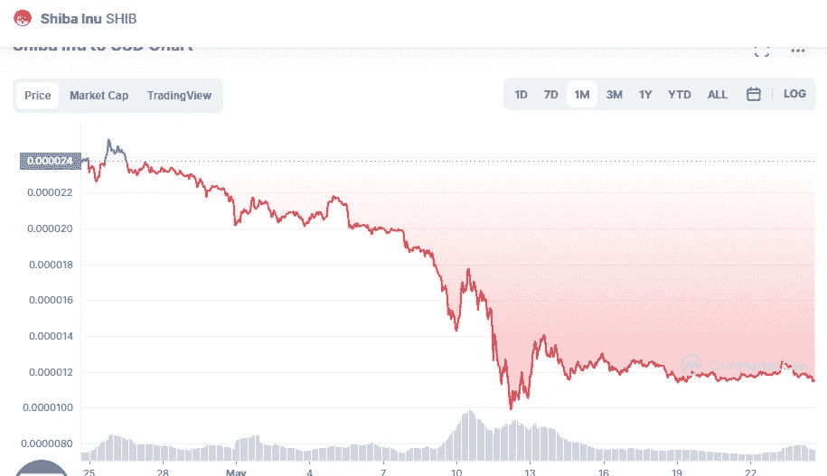

# 柴犬和 DogeCoin 是 5 月份的好投资吗？

> 原文：<https://medium.com/coinmonks/are-shiba-inu-and-dogecoin-a-good-investment-in-may-873dc9cb14fc?source=collection_archive---------41----------------------->

# 柴犬

Source photo [Shiba Inu price today, SHIB to USD live, marketcap and chart | CoinMarketCap](https://coinmarketcap.com/currencies/shiba-inu/)

现在市场上有价值 137 亿美元的柴犬笑话币，使其成为第二受欢迎和第二昂贵的笑话币。由于柴犬有 550 万亿硬币在流通，它似乎永远不会与美元平价，不像这里讨论的大多数其他替代硬币。