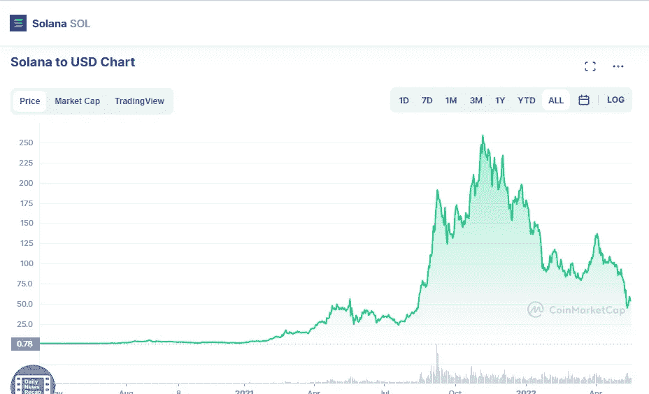

# 索拉纳(SOL)和宇宙(ATOM)是好的投资吗？

> 原文：<https://medium.com/coinmonks/are-solana-sol-and-cosmos-atom-a-good-investment-df0e3cecd97c?source=collection_archive---------20----------------------->

# 茄属植物

Source photo [Solana price today, SOL to USD live, marketcap and chart | CoinMarketCap](https://coinmarketcap.com/currencies/solana/)

2022 年 5 月 16 日，SOL 的交易价格为 53.63 美元。

正是在 2021 年 11 月 6 日，索拉纳(SOL)的价值达到了 259.96 美元的历史高点。它的价值增加了 384 %,即 206.33 美元，这可能要归功于此。

4 月 2 日，索拉纳(SOL)在价格方面达到了 141.86 美元的最大值。