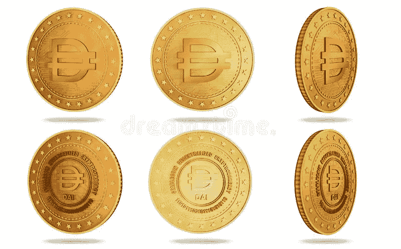

# stablecoins 死了吗？

> 原文：<https://medium.com/coinmonks/are-stablecoins-dead-c3386d160457?source=collection_archive---------55----------------------->

Dreamstime

消息并不好，但是所有的投资都不可靠。在损失了 450 亿美元的卢娜和 UST 稳定币后，他们确实感到震惊。排名第一的泰斯(USDT)下跌了约 10 亿美元，市值刚刚超过 730 亿美元。

**快速教育**

作为一名研究所有事物加密的学生，我没有对 stablecoins 做过深入研究。事实上，我的投资组合确实…